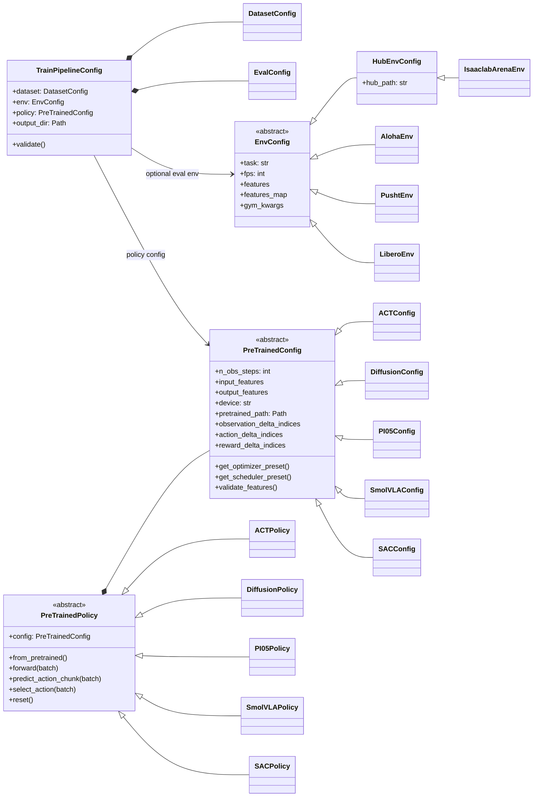
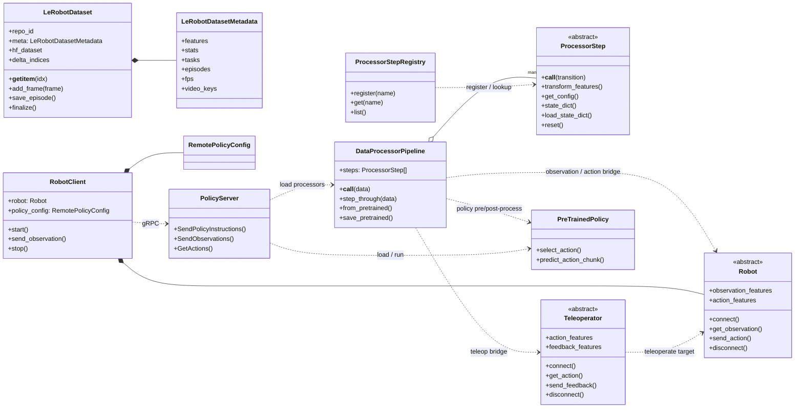
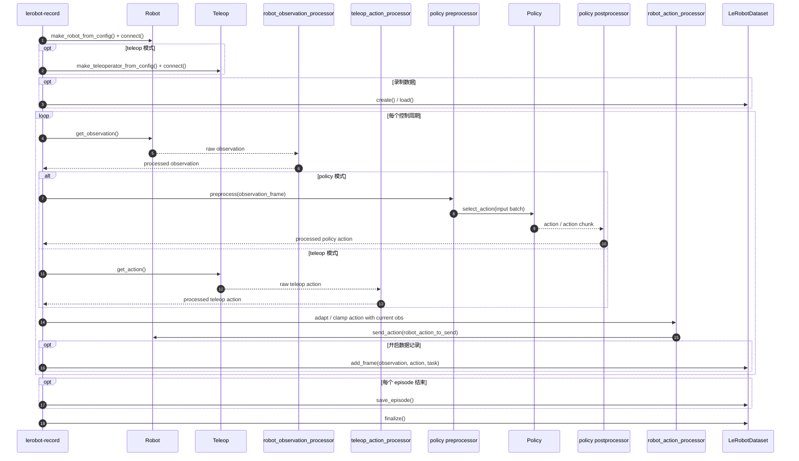
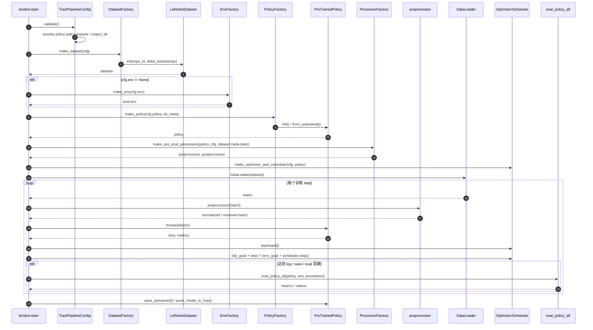
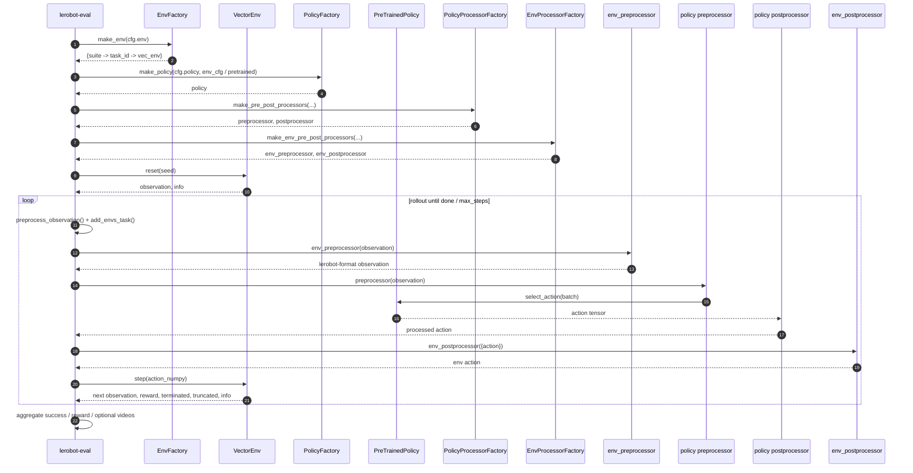
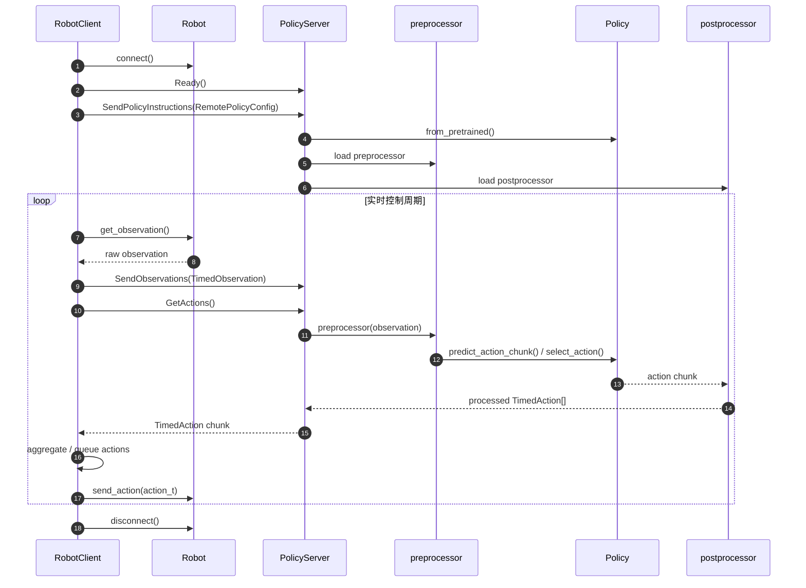

# Detailed analysis of lerobot functionalities
_Exported on 3/13/2026 at 14:48:21 GMT+8 from Cursor (2.6.19)_

---

**User**

参考lerobot的官方文档网站 https://huggingface.co/docs/lerobot/index   上对lerobot的介绍, 结合官网提及的其它文章,论文,开源框架,也结合网上搜索到的与lerobot有关的文章,论文等, 更重要的是要基于对当前lerobot项目代码的深入分析,详细解释一下lerobot有什么功能,可以用在什么场景,它的设计思想,它的代码架构,它的这种实现有什么优点和缺点.解释的方式最好能形成知识体系.

---

**Cursor**

我会先分两条线并行梳理：一条从当前仓库代码里抽取 `lerobot` 的核心模块与执行链路，另一条补充官方文档、论文和相关框架背景，然后再把这些内容整理成一套有层次的知识体系。

我已经拿到一轮全局梳理，接下来会补读几处“骨架文件”来确认关键抽象：数据集格式、训练入口、策略接口、处理器流水线，以及机器人/环境抽象，这样最后的解释会更像源码导读而不是泛泛综述。

我现在主要在核对两件事：一是 `LeRobot` 的统一抽象到底落在哪些接口上，二是这些抽象是不是贯穿了采集、训练、评估、部署全流程。目前看答案是肯定的，而且 `processor` 这一层比一般训练框架更核心。

外部资料这边也已经有了比较清晰的脉络：官方把 `LeRobot` 定位成真实机器人学习的“统一基础设施”，而不是单个模型；代码里对应的确也是“硬件接口 + 数据格式 + 训练评估 + Hub 分发 + 多类策略”的全栈组织。

基于当前仓库 `0.5.1` 源码、官方文档/论文/博客，以及相关模型资料，`LeRobot` 最准确的理解方式是：`四个对象、三条闭环、六层架构、两类边界`。它不是一个单独的“机器人大模型”，而是 Hugging Face 面向真实机器人学习做的一套开源基础设施层：把硬件接入、遥操作、数据格式、训练评测、Hub 分发、真机推理和部分在线 RL 放进同一个 PyTorch 工作流里。[官方文档](https://huggingface.co/docs/lerobot/index)、[课程介绍](https://huggingface.co/learn/robotics-course/en/unit1/2)、[LeRobot 论文](https://arxiv.org/abs/2602.22818)、[v0.5.0 发布说明](https://huggingface.co/blog/lerobot-release-v050)

## 一张总图
可以把 `LeRobot` 先理解成四个核心对象：

- `Robot`：真机、相机、电机、遥操作设备的统一接口。
- `LeRobotDataset`：多模态时序数据的统一资产格式。
- `Policy`：学习到的策略，既可以是 imitation learning，也可以是 RL 或 VLA。
- `Env`：仿真环境和 benchmark 的统一入口。

围绕这四个对象，它形成三条闭环：

- 数据闭环：`teleop/policy -> robot -> dataset`
- 训练闭环：`dataset -> processor -> policy -> eval`
- 部署/在线闭环：`robot/env -> policy -> action`，再向外扩展到 `async_inference` 和 `rl`

所以，`LeRobot` 在生态里的位置，不像 `OpenPI`、`SmolVLA` 这种更偏“单条模型线”，也不像 `RLDS` 这种更偏“数据交换层”，而更像把硬件、数据、模型、实验、协作统一起来的工作台。它吸收了 ACT、Diffusion Policy、Pi0/OpenPI、SmolVLA、Open X-Embodiment 这些路线的成果，但核心价值是“整合”和“标准化”，不只是“提出一个新模型”。[ACT / ALOHA](https://tonyzhaozh.github.io/aloha/)、[Diffusion Policy](https://diffusion-policy.cs.columbia.edu/)、[Pi0 文档](https://huggingface.co/docs/lerobot/en/pi0)、[SmolVLA 文档](https://huggingface.co/docs/lerobot/en/smolvla)、[Open X-Embodiment](https://arxiv.org/abs/2310.08864)

## 功能、场景与设计思想
### 它能做什么
- 接真机和遥操作设备。当前代码里已经不仅有低成本机械臂，也有 `Unitree G1` 这类 humanoid 相关实现，方向与官方发布说明一致。[v0.5.0 发布说明](https://huggingface.co/blog/lerobot-release-v050)
- 录制、编辑、可视化和发布机器人数据集。`LeRobotDataset v3` 是它最强的基础设施之一，支持 `Parquet + MP4`、metadata、streaming、image transforms、episode 编辑和 Hub 发布。[Dataset v3 文档](https://huggingface.co/docs/lerobot/en/lerobot-dataset-v3)、[Dataset v3 博客](https://huggingface.co/blog/lerobot-datasets-v3)
- 训练和微调多类策略。仓库中实际支持的不只是 `ACT`、`Diffusion`、`VQ-BeT`，还有 `Pi0`、`Pi0.5`、`Pi0-FAST`、`SmolVLA`、`GROOT`、`XVLA`、`Wall-X`、`TDMPC`、`SAC`、`SARM` 等。
- 在仿真 benchmark 上统一评估。官方重点支持 `LIBERO`、`Meta-World`，以及通过 `EnvHub` / `IsaacLab Arena` 接入更多环境。[EnvHub 文档](https://huggingface.co/docs/lerobot/en/envhub)
- 真机部署与远程推理。`async_inference` 允许把机器人端和 GPU 推理端拆开。
- 在线 RL / HIL-Serl。`rl` 子系统说明它不只做离线 imitation learning。

### 它适合什么场景
- 低成本机械臂或真实机器人上的示教采集、行为克隆训练、真机部署。
- 想在统一工程栈里切换不同 policy，而不是为每个论文仓库重搭一次训练脚本。
- 需要把数据集、模型、环境都放到 Hugging Face Hub 做协作和复现。
- 需要把大模型/VLA 适配到自己机器人上做 finetune。这里 `SmolVLA` 和 `Pi0` 是典型例子，但两者都不是“拿来即通用”，尤其 `SmolVLA` 官方明确建议基于自己的 `LeRobotDataset` 微调。[SmolVLA 文档](https://huggingface.co/docs/lerobot/en/smolvla)
- 机器人端算力弱、GPU 在工作站或服务器上的分离部署。

### 它的设计思想
- `vertical integration`。官方课程把它称为 vertically integrated，这和源码完全一致：硬件、数据、训练、评估、部署不是几套割裂工具，而是一套对象模型。[课程介绍](https://huggingface.co/learn/robotics-course/en/unit1/2)
- `real-world first`。它不是先从纯仿真出发，而是一直把真机采集、真机控制、低成本硬件接入放在主线上。
- `data-first`。LeRobot 论文和 Dataset v3 文档都强调，机器人学习的瓶颈很大一部分在数据资产，而不是只在模型结构。[LeRobot 论文](https://arxiv.org/abs/2602.22818)、[Dataset v3 文档](https://huggingface.co/docs/lerobot/en/lerobot-dataset-v3)
- `processor-centric`。很多库只保存模型权重；`LeRobot` 把预处理和后处理也当作一等公民。这个想法非常重要，因为机器人模型真正难复现的地方，常常就藏在归一化、tokenization、特征重命名、时序堆叠、动作反归一化这些“胶水逻辑”里。
- `typed feature schema`。代码里用 `FeatureType` / `PolicyFeature` 显式建模 `STATE`、`VISUAL`、`ENV`、`ACTION`、`REWARD`、`LANGUAGE`，这让 dataset、env、policy 之间可以靠“特征语义”而不是手写 shape 对接。
- `Hub-native`。数据集、模型、processor、环境都被设计成可以围绕 Hugging Face Hub 流转。
- `sim-real unified`。同一套 policy / processor / feature schema 既服务离线训练，也服务仿真评估和真机执行。

## 代码架构
从当前仓库看，最清晰的理解方式是六层：

1. 编排层：`src/lerobot/scripts`
`lerobot_record.py`、`lerobot_train.py`、`lerobot_eval.py`、`lerobot_replay.py`、`lerobot_teleoperate.py` 是真正把全流程串起来的入口。

2. 配置与扩展层：`src/lerobot/configs`、`src/lerobot/utils/import_utils.py`
这里用 `draccus` 和 `ChoiceRegistry` 做声明式配置。外部扩展则通过 `register_third_party_plugins()` 自动发现 `lerobot_policy_*`、`lerobot_robot_*` 之类插件包。

3. 数据层：`src/lerobot/datasets`
这里是整个项目最像“平台资产”的部分。`LeRobotDataset`、`StreamingLeRobotDataset`、统计量、聚合、编辑、转换都在这里。

4. 处理层：`src/lerobot/processor`
这层是全库最关键的 glue。它负责把机器人/环境观测转成 policy 输入，把 policy 输出转回机器人/环境动作，并负责 normalization、device move、rename、tokenization、packing 等步骤。

5. 策略层：`src/lerobot/policies`
这里既有统一抽象，也有各模型自己的 `configuration_*`、`modeling_*`、`processor_*`。可以把它理解成“统一壳子 + 多个算法后端”。

6. 运行层：`src/lerobot/robots`、`src/lerobot/teleoperators`、`src/lerobot/cameras`、`src/lerobot/motors`、`src/lerobot/envs`、`src/lerobot/async_inference`、`src/lerobot/rl`
这层负责真实世界 I/O、仿真环境、远程推理和在线 RL 服务。

数据层在源码里不是普通 `torch Dataset` 薄封装，而是完整资产格式，和官方 `v3` 文档是对齐的：

```607:623:src/lerobot/datasets/lerobot_dataset.py
        In terms of files, LeRobotDataset encapsulates 3 main things:
            - metadata:
                - info contains various information about the dataset like shapes, keys, fps etc.
                - stats stores the dataset statistics of the different modalities for normalization
                - tasks contains the prompts for each task of the dataset, which can be used for
                  task-conditioned training.
            - hf_dataset (from datasets.Dataset), which will read any values from parquet files.
            - videos (optional) from which frames are loaded to be synchronous with data from parquet files.

        A typical LeRobotDataset looks like this from its root path:
        .
        ├── data
        │   ├── chunk-000
        │   │   ├── file-000.parquet
```

训练脚本本身也说明了它的角色不是“某个算法的 train loop”，而是全系统 orchestrator：

```python 
#239:291:src/lerobot/scripts/lerobot_train.py
    if is_main_process:
        logging.info("Creating policy")
    policy = make_policy(
        cfg=cfg.policy,
        ds_meta=dataset.meta,
        rename_map=cfg.rename_map,
    )

    # Create processors - only provide dataset_stats if not resuming from saved processors
    processor_kwargs = {}
    postprocessor_kwargs = {}
    if (cfg.policy.pretrained_path and not cfg.resume) or not cfg.policy.pretrained_path:
        processor_kwargs["dataset_stats"] = dataset.meta.stats

    # For SARM, always provide dataset_meta for progress normalization
    if cfg.policy.type == "sarm":
        processor_kwargs["dataset_meta"] = dataset.meta

    if cfg.policy.pretrained_path is not None:
        processor_kwargs["preprocessor_overrides"] = {
            "device_processor": {"device": device.type},
            "normalizer_processor": {
                "stats": dataset.meta.stats,
                "features": {**policy.config.input_features, **policy.config.output_features},
                "norm_map": policy.config.normalization_mapping,
            },
        }

    preprocessor, postprocessor = make_pre_post_processors(
        policy_cfg=cfg.policy,
        pretrained_path=cfg.policy.pretrained_path,
        **processor_kwargs,
        **postprocessor_kwargs,
    )
```

`processor` 不是附属工具，而是 LeRobot 的核心协议层：

```python
# 253:295:src/lerobot/processor/pipeline.py
@dataclass
class DataProcessorPipeline[TInput, TOutput](HubMixin):
    steps: Sequence[ProcessorStep] = field(default_factory=list)
    name: str = "DataProcessorPipeline"
    ...
    def __call__(self, data: TInput) -> TOutput:
        transition = self.to_transition(data)
        transformed_transition = self._forward(transition)
        return self.to_output(transformed_transition)
```

而 policy 的输入输出也不是手工硬编码，而是从 dataset 或 env 的特征语义推断出来：

```python
#453:472:src/lerobot/policies/factory.py
    policy_cls = get_policy_class(cfg.type)

    kwargs = {}
    if ds_meta is not None:
        features = dataset_to_policy_features(ds_meta.features)
    else:
        ...
        features = env_to_policy_features(env_cfg)

    cfg.output_features = {key: ft for key, ft in features.items() if ft.type is FeatureType.ACTION}
    if not cfg.input_features:
        cfg.input_features = {key: ft for key, ft in features.items() if key not in cfg.output_features}
    kwargs["config"] = cfg
```

这意味着 `LeRobot` 最深的架构思想其实不是“统一模型接口”，而是“统一特征语义 + 统一 processor 协议 + 统一 artifact 流转”。

还有两个很重要的代码观察：

- `lerobot_record.py` 的真机主循环基本就是 `robot.get_observation()` -> observation processor -> teleop/policy -> action processor -> `robot.send_action()` -> `dataset.add_frame()`。这说明采集、执行和部署其实是同构的。
- `LeRobotDataset.__getitem__()` 不是简单取一帧；它会根据 `delta_indices` 扩成时间窗、处理 episode 边界 padding，再按时间戳从视频里对齐解码。这让“历史观测”“动作 chunk”“多相机视频同步”成为数据层原生能力，而不是模型里的临时 hack。#@#???

## 优点、缺点与边界
### 优点
- 全链路闭环完整。`record -> dataset -> train -> eval -> replay/async` 是真的打通了。
- 数据基础设施很强。`LeRobotDataset v3` 把机器人学习里最麻烦的多模态时序资产管理做成了平台级能力。[Dataset v3 文档](https://huggingface.co/docs/lerobot/en/lerobot-dataset-v3)
- `processor` 设计非常有价值。它把机器人学习里最难复现的预处理/后处理显式化了。
- 对真实机器人友好。它不是只会跑 benchmark，也能直接接低成本硬件和真机采集。
- 适合作为“统一适配层”。从测试目录里大量 `*original_vs_lerobot.py` 可以看出，它经常把原始论文/仓库模型适配进统一接口，而不是让用户反复切换不同代码风格。
- Hub-native 协作体验好。模型、数据集、环境、processor 都能围绕 Hub 流动。
- 扩展性不错。第三方 policy/hardware 插件机制已经进入主流程。

### 缺点
- 抽象层多，学习成本不低。新手需要同时理解 `config`、`dataset`、`processor`、`policy`、`env`、`robot`。
- 框架里仍有明显的手工工厂和静态枚举痕迹。比如 `src/lerobot/__init__.py` 里的 `available_policies` 已经落后于 `src/lerobot/policies/factory.py` 的真实支持范围。
- 多数据集训练能力和产品入口还没有完全对齐。`src/lerobot/datasets/factory.py` 里对 `MultiLeRobotDataset` 仍直接 `NotImplementedError`。
- 某些策略的 processor/override 逻辑开始出现特判，说明统一抽象正在承受越来越多模型差异。
- 在线推理和服务化更偏“研究工程实用主义”而不是“强标准协议”。`async_inference` 里直接用 `pickle` over gRPC，跨语言互操作和安全边界都不是它的强项。
- `EnvHub` 很强，但本质上是在执行远程代码，官方也明确要求 `trust_remote_code=True` 并建议 pin revision。这是能力，也是风险。[EnvHub 文档](https://huggingface.co/docs/lerobot/en/envhub)
- 离线 imitation learning 这条线更成熟；在线 RL 虽然有，但从 `src/lerobot/rl/learner.py` 的实现看，工程折中和性能妥协更多。

### 适用边界
- 最适合：研究原型、真实机器人示教学习、VLA finetune、统一 benchmark、社区协作、数据驱动机器人开发。
- 不要把它理解成：开箱即用的通用机器人智能，或者强安全、强实时、强标准化的工业级控制平台。
- 尤其对 VLA，要避免过度神化。`Pi0` 在 LeRobot 中本质是对 `OpenPI` 的适配接入，[Pi0 文档](https://huggingface.co/docs/lerobot/en/pi0) 也明确强调其大规模数据背景；`SmolVLA` 文档则直接说 base model 需要结合自己的数据微调。[SmolVLA 文档](https://huggingface.co/docs/lerobot/en/smolvla)

如果把这整套知识再压缩成一句话：`LeRobot` 不是“某个最强策略”，而是一个以 `LeRobotDataset + Processor + Hub artifact` 为核心，把真实机器人学习工程系统化、标准化、社区化的开源平台。

如果你愿意，我下一步可以继续给你两种深化版本之一：`LeRobot vs robomimic / RLDS / OpenPI` 的对比表，或者 `从 lerobot-train 到 SmolVLA / Pi0.5` 的源码调用图。

---

**User**

请画出该lerobot项目的关键的类图与时序图.

---

**Cursor**

我先补查几处关键抽象的定义关系，然后把它们整理成可直接渲染的 `Mermaid` 类图和时序图，覆盖采集、训练、评估/推理这几条主链路。

我再确认一下评估链路的关键调用点，避免把 `eval` 图画成泛化版；确认后我直接给你可渲染的 Mermaid 图。

以下是基于当前仓库源码整理的一版“关键类图 + 关键时序图”。我刻意做了抽象化处理，省略了大量具体机器人、相机、电机和策略子类，只保留最能解释 `LeRobot` 主架构的核心关系。主要依据的源码是 `src/lerobot/configs/train.py`、`src/lerobot/configs/policies.py`、`src/lerobot/policies/pretrained.py`、`src/lerobot/datasets/lerobot_dataset.py`、`src/lerobot/processor/pipeline.py`、`src/lerobot/robots/robot.py`、`src/lerobot/teleoperators/teleoperator.py`、`src/lerobot/envs/configs.py`、`src/lerobot/scripts/lerobot_record.py`、`src/lerobot/scripts/lerobot_train.py`、`src/lerobot/scripts/lerobot_eval.py`、`src/lerobot/async_inference/policy_server.py`、`src/lerobot/async_inference/robot_client.py`。

这些图可以直接粘贴到支持 `Mermaid` 的 Markdown 环境中渲染。

## 训练/评估,核心类图
这是“训练/评估主链路”的核心类关系图。



这张图反映的是：`TrainPipelineConfig` 是编排入口；`PreTrainedConfig` 决定 policy 的输入输出语义、时间窗口和训练 preset；`PreTrainedPolicy` 是统一模型接口；`EnvConfig` 则把仿真环境统一成可被训练/评估脚本消费的配置对象。

## 数据/处理器/机器人运行态,核心类图
这是“数据/处理器/机器人运行态”的关键类关系图。



这里最重要的一点是：`processor` 在 `LeRobot` 里不是小工具，而是核心协议层。源码中的 `PolicyProcessorPipeline` 和 `RobotProcessorPipeline` 本质上都是 `DataProcessorPipeline` 的类型别名，只是分别用于 policy I/O 和 robot I/O。

## lerobot-record 时序图
这是 `lerobot-record` 的核心采集链路，也是理解真机闭环最重要的一张图。



这张图体现了一个关键事实：`record`、`replay`、`real-time inference` 在结构上是同构的，都是“观测 -> processor -> 动作 -> 执行”，区别只在动作来源是 `teleop` 还是 `policy`。

## lerobot-train 时序图
这是 `lerobot-train` 的离线训练主链路。



这张图最值得注意的是两点：

- `dataset` 的时间窗口不是手写在模型里，而是由 `policy config` 的 `delta_indices` 反推到 `LeRobotDataset` @#???
- `preprocessor/postprocessor` 与模型一起构成可部署 artifact，而不是临时脚本逻辑  @#???

## lerobot-eval 时序图
这是 `lerobot-eval` 的 rollout 链路，也最能体现 `env processor + policy processor` 的双层处理结构。



这里反映出 `LeRobot` 的一个重要设计：环境自己的原始 observation 先被拉平到 `LeRobot` 统一语义，再进入 policy 专属预处理；所以它能在 `LIBERO`、`MetaWorld`、`IsaacLab Arena` 和真机数据之间尽量共享统一的 policy 接口。

## async_inference 时序图
这是 `async_inference` 的异步推理链路，它是 `LeRobot` 和很多只会本地推理的机器人库相比，一个很有辨识度的模块。



这个链路说明 `LeRobot` 已经不只是“训练脚本集合”，而是把机器人侧控制循环和远端 GPU 推理解耦了。代价也很明显：当前实现是研究工程导向，协议层主要靠 `gRPC + pickle`，对跨语言互操作和安全边界并不是最强方案。

如果你愿意，我可以继续把这些图做成两种更实用的版本之一：

1. 精简版：压缩成 `1 张总类图 + 1 张总时序图`
2. 工程版：直接写入仓库一个 `docs/lerobot-architecture.md`，并补上每张图对应的源码文件说明

---

**User**

请把上面的***所有***内容,整理成一份完整的结构化的 docs/lerobot.md 文档, 并补上每张图对应的源码文件说明

---

**Cursor**

我会把前面关于 `LeRobot` 的知识体系、架构解析、优缺点，以及类图/时序图整合成一份正式文档，落到 `docs/lerobot.md`，并在每张图后补对应源码入口和阅读顺序说明。

我已经把结构想清楚了，下面会一次性写成完整文档：先给出 `LeRobot` 的整体心智模型，再分层解释代码架构、工作流、优缺点，最后补上类图与时序图，并逐张标注源码入口。

文档已经写入，我先快速复读一遍 `docs/lerobot.md`，确认结构、图和源码文件映射是否完整，没有遗漏你要求的“所有内容”。

已整理为完整文档 `docs/lerobot.md`。

这份文档包含了你前面要求的全部核心内容：

- `LeRobot` 的定位、功能、适用场景与设计思想
- 基于当前仓库源码的代码架构分层解析
- 典型工作流：采集、训练、评估、异步推理
- 与 `ACT`、`Diffusion Policy`、`Pi0/OpenPI`、`SmolVLA`、`Open X-Embodiment` 等外部论文/框架的关系
- 优点、缺点、适用边界
- 2 张关键类图
- 4 张关键时序图
- 每张图对应的源码文件说明和推荐阅读顺序

我没有改动文档导航；如果你希望这份文档也进入站点文档导航，我可以继续帮你把它迁到 `docs/source/` 并更新 `docs/source/_toctree.yml`。

