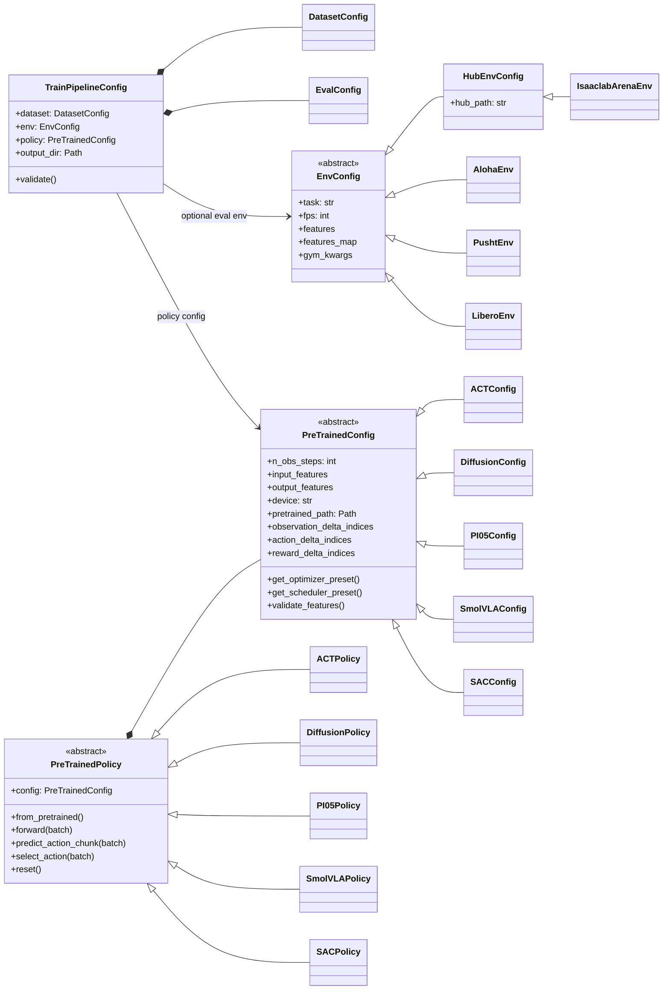
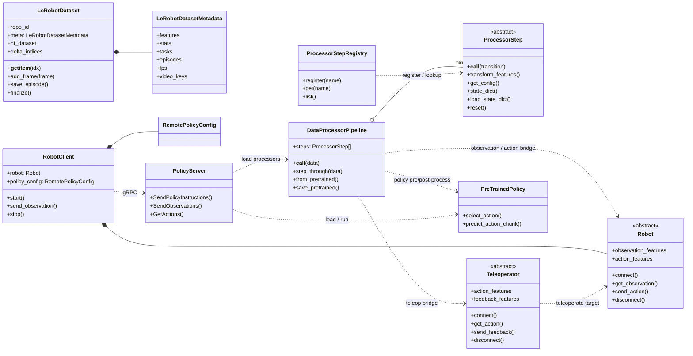
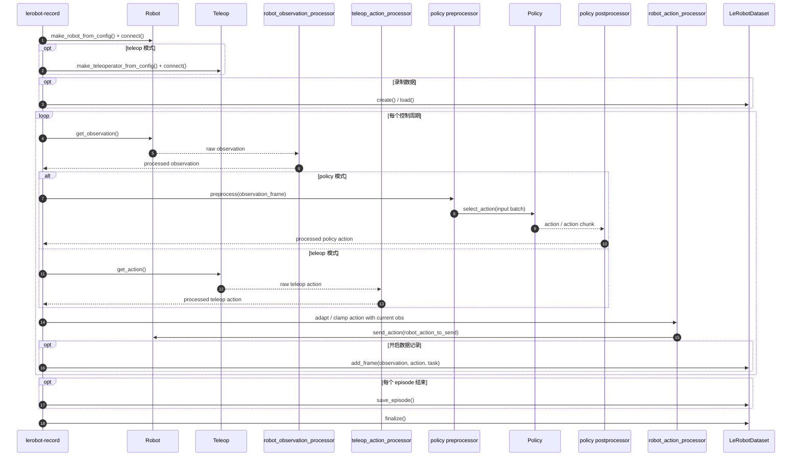
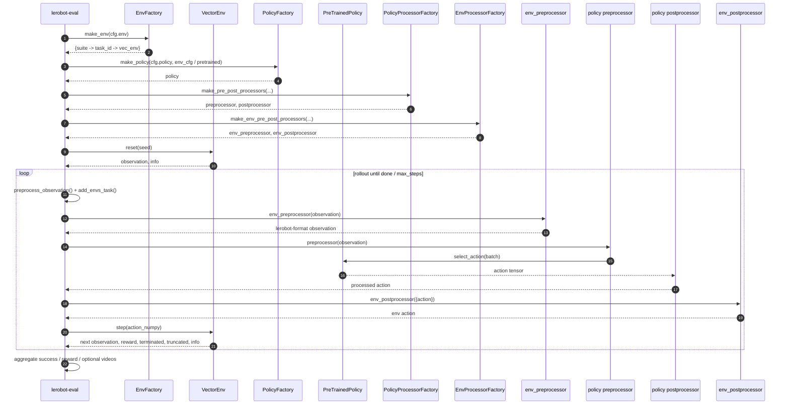
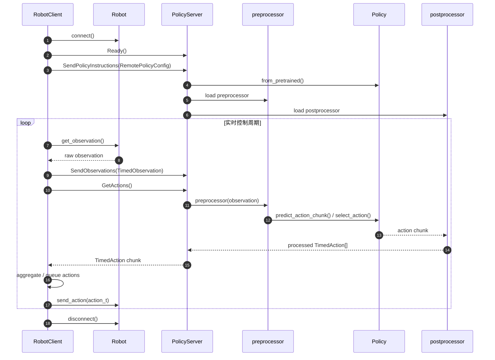

# LeRobot 项目导读

## 1. 文档目的

本文档基于当前仓库源码、官方文档、官方博客、相关论文与生态资料，对 `LeRobot` 做一份完整、结构化的项目导读。目标不是重复官网介绍，而是建立一套便于阅读源码、理解设计和判断适用边界的知识体系。

本文尤其强调三点：

- `LeRobot` 在做什么，它解决的是哪一类问题。
- `LeRobot` 的核心设计思想与代码架构是什么。
- 当前仓库里的实现有哪些优点、局限和工程取舍。

本文同时补充了关键类图与时序图，并在每张图后给出对应源码文件和阅读建议。

## 2. 一句话结论

`LeRobot` 不是单个机器人模型，也不是单纯的数据集工具，而是一套面向真实机器人学习的开源基础设施：它试图把硬件接入、遥操作、数据集格式、训练评估、Hub 分发、仿真环境、真机推理、异步推理和部分在线 RL 用统一抽象串起来。

如果再压缩成一句更工程化的话：

> `LeRobot` 是 Hugging Face 面向真实机器人学习构建的全链路工作台，其核心价值不只是“实现几个 SoTA 模型”，而是把 `Robot / Dataset / Policy / Env` 四类对象标准化，并通过 `Processor` 和 `Hub` 把它们连接成一条可复用的工程链路。

## 3. LeRobot 的心智模型

理解 `LeRobot` 最有效的方法是记住四个对象、三条闭环、六层架构、两类边界。

### 3.1 四个核心对象

- `Robot`：真实机器人、相机、电机、遥操作设备的统一控制接口。
- `LeRobotDataset`：多模态时序机器人数据的统一资产格式。
- `Policy`：策略模型，可以是 imitation learning、RL 或 VLA。
- `Env`：仿真环境和 benchmark 的统一入口。

### 3.2 三条闭环

- 数据闭环：`teleop / policy -> robot -> dataset`
- 训练闭环：`dataset -> processor -> policy -> eval`
- 部署闭环：`robot / env -> preprocessor -> policy -> postprocessor -> action`

### 3.3 六层架构

- 编排层：`scripts`
- 配置层：`configs`
- 数据层：`datasets`
- 处理层：`processor`
- 策略层：`policies`
- 运行层：`robots / teleoperators / envs / async_inference / rl`

### 3.4 两类边界

- 能力边界：它非常擅长统一真实机器人学习工作流，但不等于“开箱即用的通用机器人智能”。
- 工程边界：它更像研究与开源生态友好的基础设施，而不是强安全、强实时、强协议稳定性的工业控制平台。

## 4. LeRobot 是什么

官方文档对 `LeRobot` 的定位非常明确：它希望提供面向真实机器人学习的 `models + datasets + tools`，降低机器人学习门槛，并促进社区共享数据集和预训练模型。

- 官方文档：[LeRobot](https://huggingface.co/docs/lerobot/index)
- 官方论文：[LeRobot: An Open-Source Library for End-to-End Robot Learning](https://arxiv.org/abs/2602.22818)
- 官方课程导读：[LeRobot: An End-to-End Robot Learning Library](https://huggingface.co/learn/robotics-course/en/unit1/2)

从当前仓库代码来看，这种定位并不是宣传口号，而是直接体现在架构设计中：

- 有统一的机器人抽象 `Robot`
- 有统一的数据资产格式 `LeRobotDataset`
- 有统一的策略抽象 `PreTrainedPolicy`
- 有统一的环境抽象 `EnvConfig` / `make_env`
- 有统一的处理流水线 `DataProcessorPipeline`
- 有统一的脚本入口 `lerobot-record / train / eval / replay / teleoperate`

所以，`LeRobot` 在生态中的位置更像“机器人学习基础设施层”，而不是“某个单独的大模型仓库”。

## 5. LeRobot 有什么功能

### 5.1 真实机器人与遥操作

`LeRobot` 提供统一的 `Robot` 与 `Teleoperator` 接口，用于对接多种机器人平台和遥操作设备。它强调 hardware-agnostic，但这不是抽象口号，而是代码里明确落成了基类、配置、工厂和插件发现机制。

这意味着：

- 你可以用统一方式连接不同机器人。
- 你可以把自己的机器人实现接入 `LeRobot`。
- 采集、回放、训练、部署这些脚本可以尽量复用。

### 5.2 数据集录制、编辑、可视化与发布

`LeRobotDataset v3` 是当前项目最核心的基础设施之一。它把机器人数据组织成：

- `Parquet`：状态、动作、时间戳等表格数据
- `MP4` 或图片：多相机视觉数据
- `meta/`：任务、统计量、特征 schema、episode 元数据

它支持：

- 录制真机数据
- episode 级编辑与切分
- 数据集聚合与转换
- 流式加载
- image transforms
- Hub 分发

相关资料：

- 官方文档：[LeRobotDataset v3.0](https://huggingface.co/docs/lerobot/en/lerobot-dataset-v3)
- 官方博客：[LeRobotDataset:v3.0: Bringing large-scale datasets to lerobot](https://huggingface.co/blog/lerobot-datasets-v3)

### 5.3 训练多类策略

当前代码库中实际支持的策略范围很广，包含但不限于：

- imitation learning：`ACT`、`Diffusion`、`VQ-BeT`
- VLA / foundation-style：`Pi0`、`Pi0.5`、`Pi0-FAST`、`SmolVLA`、`GROOT`、`XVLA`、`Wall-X`
- RL / model-based / online：`TDMPC`、`SAC`
- 奖励或辅助模型：`SARM`、`reward_classifier`

这说明 `LeRobot` 的 ambition 不是围绕一个模型家族，而是作为“统一训练与部署壳子”承载多类策略。

### 5.4 仿真评估

`LeRobot` 不是只管真机，也内建了面向 benchmark 的评估入口，重点包括：

- `LIBERO`
- `Meta-World`
- 通过 `EnvHub` 接入的 Hub 环境
- `IsaacLab Arena` 这类较复杂的外部仿真生态

相关资料：

- [EnvHub 文档](https://huggingface.co/docs/lerobot/en/envhub)
- [LeRobot v0.5.0 发布说明](https://huggingface.co/blog/lerobot-release-v050)

### 5.5 异步推理与在线 RL

`async_inference` 允许把机器人端和策略推理端拆开；`rl` 则提供了 actor-learner 风格的在线 RL / HIL-Serl 路线。这是 `LeRobot` 区别于很多“离线训练脚本集合”的重要特征。

## 6. 可以用在什么场景

`LeRobot` 最适合以下类型的工作：

- 真实机器人上的示教采集与行为克隆
- 低成本机械臂或研究平台的端到端训练与部署
- 想在一套统一工程栈里切换不同策略模型
- 想把数据集、模型、环境统一放到 Hugging Face Hub 做协作与复现
- 想微调 `SmolVLA`、`Pi0`、`Pi0.5` 等 VLA 模型到自己的机器人与任务
- 需要 GPU 服务器推理而机器人端算力有限的异步部署

不应过度夸大到以下方向：

- 它不是已经解决“通用机器人智能”的系统
- 它不是工业级实时控制中间件
- 它不是事实上的行业统一标准

## 7. 设计思想

### 7.1 Vertical Integration

官方课程把 `LeRobot` 描述为 vertically integrated。源码层面，这体现在：

- 硬件控制与数据采集不脱节
- 数据格式与训练脚本不脱节
- 训练与评估不脱节
- 模型与 processor 一起作为 artifact 保存和复用

### 7.2 Real-World First

`LeRobot` 的重心一直是真实机器人，而不是“先做纯仿真、再勉强连接真机”。这从 `robots/`、`teleoperators/`、`cameras/`、`motors/`、`record.py` 的优先级就能看出来。

### 7.3 Data-First

`LeRobot` 强调机器人学习的关键瓶颈之一是数据，而不只是模型。`LeRobotDataset v3` 和社区数据集/Hub 整合说明它把数据资产放在平台中心位置。

### 7.4 Processor-Centric

这是当前仓库最值得重视的设计。

很多项目只保存模型权重，而 `LeRobot` 把预处理与后处理也作为一等对象保存：

- 归一化
- 特征重命名
- tokenization
- VLA 的 prompt 构造
- action 反归一化
- robot / env 与 policy 之间的桥接

这使得：

- 训练和部署之间更一致
- checkpoint 语义更完整
- 不同 policy 的差异可以落在 processor，而不是污染公共训练脚本

### 7.5 Feature-Schema Driven

`FeatureType` / `PolicyFeature` 把输入输出特征的语义显式化。`dataset`、`env`、`policy` 不再只是靠“shape 差不多”拼起来，而是靠特征类型映射。

### 7.6 Hub-Native

`LeRobotDataset`、`PreTrainedConfig`、`PreTrainedPolicy`、`DataProcessorPipeline` 都围绕 Hugging Face Hub 组织。这使得：

- 模型分发更统一
- 数据集访问更自然
- processor 可以随模型一并传播
- 环境也可以通过 `EnvHub` 分发

### 7.7 Extensible, but Explicit

一方面，`LeRobot` 支持第三方插件自动发现；另一方面，主干代码里仍然保留大量显式工厂与 `if/elif` 分派。这是一种典型的工程折中：

- 优点：清晰、可读、易调试
- 缺点：随着模型和硬件增多，维护成本上升

## 8. 代码架构总览

### 8.1 关键目录

```text
lerobot/
├── README.md
├── pyproject.toml
├── docs/
├── examples/
├── tests/
└── src/lerobot/
    ├── scripts/            # train/eval/record/replay/teleoperate 等 CLI 编排层
    ├── configs/            # 训练、评估、策略、解析器配置
    ├── datasets/           # LeRobotDataset、streaming、统计、聚合、编辑工具
    ├── processor/          # 统一的数据处理流水线
    ├── policies/           # 各类策略模型、配置与 processor
    ├── envs/               # 仿真环境配置、工厂与环境处理器
    ├── robots/             # 真机抽象与具体实现
    ├── teleoperators/      # 遥操作抽象与具体实现
    ├── cameras/            # 相机抽象与实现
    ├── motors/             # 电机总线与驱动
    ├── async_inference/    # 远程推理 client/server
    ├── rl/                 # actor-learner 风格在线 RL
    ├── transport/          # gRPC protobuf 与传输辅助
    ├── optim/              # optimizer/scheduler factory
    └── utils/              # logging、hub、随机数、训练辅助、插件发现等
```

### 8.2 编排层：`scripts`

这一层把其他模块拼接起来，典型入口包括：

- `src/lerobot/scripts/lerobot_record.py`
- `src/lerobot/scripts/lerobot_train.py`
- `src/lerobot/scripts/lerobot_eval.py`
- `src/lerobot/scripts/lerobot_replay.py`
- `src/lerobot/scripts/lerobot_teleoperate.py`

### 8.3 配置层：`configs`

核心配置类型包括：

- `TrainPipelineConfig`
- `DatasetConfig`
- `EvalConfig`
- `PreTrainedConfig`
- `EnvConfig`
- `RobotConfig`
- `TeleoperatorConfig`

这些配置对象通过 `draccus` 解析 CLI 参数，再驱动工厂函数与训练脚本。

### 8.4 数据层：`datasets`

这里是最强的平台资产层，核心包括：

- `LeRobotDatasetMetadata`
- `LeRobotDataset`
- `StreamingLeRobotDataset`
- `compute_stats`
- `aggregate`
- `edit_dataset`

`LeRobotDataset.__getitem__()` 不只是取一帧，还会：

- 根据 `delta_indices` 构造时间窗口
- 处理 episode 边界 padding
- 按 timestamp 对齐视频帧
- 加入 task / subtask 文本

### 8.5 处理层：`processor`

`DataProcessorPipeline` 是本项目的核心 glue。

它负责：

- robot / env 观测格式转换
- policy 输入输出整理
- normalization / unnormalization
- rename / tokenize / device move
- robot 与 policy 的 action 桥接

`PolicyProcessorPipeline` 和 `RobotProcessorPipeline` 本质上是类型化的别名，底层都是 `DataProcessorPipeline`。

### 8.6 策略层：`policies`

这一层由三个核心概念组成：

- `PreTrainedConfig`
- `PreTrainedPolicy`
- `make_policy()` / `make_pre_post_processors()`

每个具体 policy 家族通常都包含：

- `configuration_xxx.py`
- `modeling_xxx.py`
- `processor_xxx.py`

### 8.7 运行层：`robots` / `teleoperators` / `envs`

这几层把现实世界和仿真世界接进统一工作流。

- `Robot`：真实机器人接口
- `Teleoperator`：遥操作接口
- `EnvConfig` + `make_env()`：仿真环境入口

### 8.8 异步与在线：`async_inference` / `rl`

- `async_inference`：机器人侧 client + 服务器侧 policy server
- `rl`：在线 RL 与 HIL-Serl actor-learner 流程

## 9. 核心抽象详解

### 9.1 `TrainPipelineConfig`

`TrainPipelineConfig` 是离线训练最重要的 orchestrator 配置。它负责：

- 解析 policy path 与 resume 逻辑
- 生成输出目录
- 决定是否使用 policy 自带 optimizer/scheduler preset
- 注入 dataset / env / wandb / peft / rabc 等设置

关键文件：

- `src/lerobot/configs/train.py`

### 9.2 `PreTrainedConfig`

`PreTrainedConfig` 不只是“超参数集合”，它还承担了统一特征语义和训练行为声明的职责：

- `input_features`
- `output_features`
- `observation_delta_indices`
- `action_delta_indices`
- `reward_delta_indices`
- `normalization_mapping`
- `get_optimizer_preset()`
- `get_scheduler_preset()`

关键文件：

- `src/lerobot/configs/policies.py`
- `src/lerobot/configs/types.py`

### 9.3 `PreTrainedPolicy`

`PreTrainedPolicy` 是统一的策略模型接口。它定义了：

- `forward(batch)`：训练时的 loss 计算
- `select_action(batch)`：执行时选动作
- `predict_action_chunk(batch)`：chunk-based policy 的动作块输出
- `reset()`：清理缓存
- `from_pretrained()` / `save_pretrained()`

关键文件：

- `src/lerobot/policies/pretrained.py`

### 9.4 `LeRobotDataset`

`LeRobotDataset` 是统一机器人数据格式的核心实现。它同时承担了：

- 数据读取
- 窗口化
- 视频对齐解码
- episode 录制与写盘
- 元数据维护

关键文件：

- `src/lerobot/datasets/lerobot_dataset.py`
- `src/lerobot/datasets/factory.py`
- `src/lerobot/datasets/streaming_dataset.py`

### 9.5 `DataProcessorPipeline`

它把若干 `ProcessorStep` 串成一条可以保存、加载、调试、迁移的 pipeline，是整个项目最关键的工程抽象之一。

关键文件：

- `src/lerobot/processor/pipeline.py`
- `src/lerobot/processor/__init__.py`
- `src/lerobot/processor/factory.py`

### 9.6 `Robot` 与 `Teleoperator`

这两个抽象分别规范：

- 机器人如何暴露观测和接收动作
- 遥操作设备如何产生动作和接收反馈

关键文件：

- `src/lerobot/robots/robot.py`
- `src/lerobot/teleoperators/teleoperator.py`

### 9.7 `EnvConfig` 与 `make_env`

环境部分的设计重点不是自己实现物理引擎，而是把不同来源的环境统一进可评估接口，并支持 Hub 远程环境。

关键文件：

- `src/lerobot/envs/configs.py`
- `src/lerobot/envs/factory.py`
- `src/lerobot/envs/utils.py`

### 9.8 `async_inference`

异步推理模块说明 `LeRobot` 的目标不止是本地脚本，而是实际运行态：

- `RobotClient`：在机器人侧采样观测、接收动作
- `PolicyServer`：在服务器侧载入模型、运行推理

关键文件：

- `src/lerobot/async_inference/robot_client.py`
- `src/lerobot/async_inference/policy_server.py`

## 10. 典型工作流

### 10.1 数据采集

真机采集的典型路径是：

1. 根据配置创建 `Robot`
2. 根据配置创建 `Teleoperator` 或 `Policy`
3. 创建默认 `RobotProcessorPipeline`
4. 从机器人读取 observation
5. 从 teleop 或 policy 得到 action
6. action 经 processor 整理后发送到 robot
7. observation 与 action 写入 `LeRobotDataset`

主入口：

- `src/lerobot/scripts/lerobot_record.py`

### 10.2 离线训练

离线训练主链路是：

1. `TrainPipelineConfig.validate()`
2. `make_dataset(cfg)`
3. 如果需要，`make_env(cfg.env)`
4. `make_policy(cfg.policy, ds_meta)`
5. `make_pre_post_processors(...)`
6. `make_optimizer_and_scheduler(...)`
7. DataLoader 迭代
8. `preprocessor(batch) -> policy.forward(batch) -> backward/step`
9. 周期性 checkpoint 与 eval

主入口：

- `src/lerobot/scripts/lerobot_train.py`

### 10.3 仿真评估

评估主链路是：

1. `make_env(cfg.env)`
2. `make_policy(...)`
3. `make_pre_post_processors(...)`
4. `make_env_pre_post_processors(...)`
5. `rollout()` 循环
6. 聚合 reward、success、video

主入口：

- `src/lerobot/scripts/lerobot_eval.py`

### 10.4 远程异步推理

异步推理主链路是：

1. `RobotClient` 连接 robot
2. client 与 `PolicyServer` 握手
3. 发送 `RemotePolicyConfig`
4. server 加载 policy 与 processors
5. client 周期性发送 observation
6. server 产生 action chunk
7. client 聚合/排队动作并发送给 robot

主入口：

- `src/lerobot/async_inference/robot_client.py`
- `src/lerobot/async_inference/policy_server.py`

## 11. 生态定位与外部关系

下表概括了 `LeRobot` 与若干常被一起提到的论文、框架、项目的关系。

| 名称 | 与 LeRobot 的关系 | 说明 |
| --- | --- | --- |
| [ACT / ALOHA](https://tonyzhaozh.github.io/aloha/) | 原生集成的重要 imitation learning 路线 | `LeRobot` 直接实现了 `ACT`，并延续 action chunking 思路 |
| [Diffusion Policy](https://diffusion-policy.cs.columbia.edu/) | 原生集成的重要 imitation learning 路线 | `LeRobot` 提供 diffusion policy 训练与评估 |
| [Pi0 / OpenPI](https://huggingface.co/docs/lerobot/en/pi0) | 适配接入 | `LeRobot` 中的 `Pi0` 实现明确是 adapted from `OpenPI` |
| [SmolVLA](https://huggingface.co/docs/lerobot/en/smolvla) | Hugging Face 原生模型线 | 更轻量、更适合在 `LeRobotDataset` 上 fine-tune |
| [Open X-Embodiment](https://arxiv.org/abs/2310.08864) | 数据与时代背景 | `LeRobot` 明显站在开放、多机体、大规模机器人数据这条趋势上 |
| `robomimic` | 不是直接依赖它的主框架，但吸收了其生态与组件思路 | 仓库中可见部分组件迁移与兼容痕迹 |
| `RLDS` | 不是主格式，而是可迁移来源 | `LeRobotDataset` 是主推格式，`RLDS` 等外部格式可被转换进入 |
| `EnvHub` | LeRobot 自己推动的新环境分发方式 | 把环境也纳入 Hub-native 工作流 |

## 12. 优点、缺点与适用边界

### 12.1 优点

- 全链路闭环完整：从采集到训练、评估、回放、远程推理都能在一套抽象里完成。
- 数据层很强：`LeRobotDataset v3` 不是临时格式，而是面向大规模机器人数据的资产格式。
- `processor` 设计优秀：把训练与部署中最容易失真的“胶水逻辑”显式化。
- 真机友好：真实机器人、低成本平台、遥操作并不是附属功能，而是主线能力。
- Hub 集成自然：模型、数据集、processor、环境都可围绕 Hub 流转。
- 扩展性不错：支持第三方插件发现。
- 测试覆盖较广：`tests/` 覆盖 datasets、processor、policies、robots、rl、async inference。

### 12.2 局限

- 抽象层较多，学习成本不低。
- 工厂函数中仍有大量 `if/elif`，扩展到很多内置类型后维护成本会上升。
- `src/lerobot/__init__.py` 中的静态 `available_*` 列表可能落后于真实实现。
- `MultiLeRobotDataset` 已存在，但主训练入口中仍被禁用。
- 某些 policy 的 processor 有特判与 override，说明统一抽象正在承受越来越大的异质性。
- `async_inference` 当前用 `pickle` over gRPC，更偏研究工程实用主义，而非强类型、跨语言、强安全协议。
- `EnvHub` 很强，但远程执行代码带来安全边界问题，需要 `trust_remote_code=True` 并最好 pin revision。

### 12.3 不应被过度宣传的点

- 不要把 `LeRobot` 说成“机器人领域事实标准”。
- 不要把 `LeRobot` 说成“一个通用机器人大模型”。
- 不要把 `Pi0`、`GROOT`、`SmolVLA` 这些具体模型与 `LeRobot` 框架本身混为一谈。
- 不要把 `EnvHub` 的便捷性忽略成“无风险远程环境加载”。

## 13. 关键类图与时序图

以下各图都是基于当前代码抽象出的“关键结构图”，不是 1:1 穷举所有类和所有实现分支。省略了许多具体机器人、相机、电机和具体 policy 子类，只保留主链路。

### 13.1 核心类图：训练与评估主链路



#### 对应源码文件

- `src/lerobot/configs/train.py`
- `src/lerobot/configs/default.py`
- `src/lerobot/configs/policies.py`
- `src/lerobot/configs/types.py`
- `src/lerobot/policies/pretrained.py`
- `src/lerobot/policies/factory.py`
- `src/lerobot/envs/configs.py`
- `src/lerobot/envs/factory.py`

#### 源码说明

- `TrainPipelineConfig` 决定训练编排层如何读取 `dataset/env/policy`。
- `PreTrainedConfig` 不只是超参数对象，还定义输入输出特征、时间窗口与训练 preset。
- `PreTrainedPolicy` 是统一模型接口，训练和推理都围绕它展开。
- `EnvConfig` 既支持本地环境，也支持 `HubEnvConfig` 这类远程环境。

#### 阅读顺序建议

1. `src/lerobot/configs/train.py`
2. `src/lerobot/configs/policies.py`
3. `src/lerobot/policies/pretrained.py`
4. `src/lerobot/policies/factory.py`
5. `src/lerobot/envs/configs.py`
6. `src/lerobot/envs/factory.py`

### 13.2 核心类图：数据、处理器与运行态



#### 对应源码文件

- `src/lerobot/datasets/lerobot_dataset.py`
- `src/lerobot/processor/pipeline.py`
- `src/lerobot/processor/__init__.py`
- `src/lerobot/processor/factory.py`
- `src/lerobot/robots/robot.py`
- `src/lerobot/teleoperators/teleoperator.py`
- `src/lerobot/async_inference/robot_client.py`
- `src/lerobot/async_inference/policy_server.py`

#### 源码说明

- `LeRobotDataset` 是数据资产对象；`LeRobotDatasetMetadata` 是它的 schema、stats 和 episode 索引层。
- `DataProcessorPipeline` 是最关键的 glue，`PolicyProcessorPipeline` 与 `RobotProcessorPipeline` 都来自它。
- `Robot` 和 `Teleoperator` 把硬件输入输出纳入统一运行时。
- `RobotClient` / `PolicyServer` 说明 `LeRobot` 已经覆盖远程推理运行态。

#### 阅读顺序建议

1. `src/lerobot/processor/pipeline.py`
2. `src/lerobot/datasets/lerobot_dataset.py`
3. `src/lerobot/robots/robot.py`
4. `src/lerobot/teleoperators/teleoperator.py`
5. `src/lerobot/async_inference/robot_client.py`
6. `src/lerobot/async_inference/policy_server.py`

### 13.3 时序图：数据采集与录制



#### 对应源码文件

- `src/lerobot/scripts/lerobot_record.py`
- `src/lerobot/processor/factory.py`
- `src/lerobot/processor/policy_robot_bridge.py`
- `src/lerobot/robots/robot.py`
- `src/lerobot/teleoperators/teleoperator.py`
- `src/lerobot/datasets/lerobot_dataset.py`

#### 源码说明

- `record_loop()` 是这张图最核心的验证点。
- 机器人 observation 先过 observation processor。
- 动作来源可能是 teleop，也可能是 policy。
- 最终送给 robot 的动作还会经过 robot action processor。
- `dataset.add_frame()` / `save_episode()` / `finalize()` 完成录制与落盘。

#### 阅读顺序建议

1. `src/lerobot/scripts/lerobot_record.py`
2. `src/lerobot/processor/factory.py`
3. `src/lerobot/processor/policy_robot_bridge.py`
4. `src/lerobot/datasets/lerobot_dataset.py`

### 13.4 时序图：离线训练

```mermaid
sequenceDiagram
autonumber
participant CLI as lerobot-train
participant Cfg as TrainPipelineConfig
participant DSF as DatasetFactory
participant DS as LeRobotDataset
participant EF as EnvFactory
participant PF as PolicyFactory
participant P as PreTrainedPolicy
participant ProcF as ProcessorFactory
participant Pre as preprocessor
participant DL as DataLoader
participant Opt as OptimizerScheduler
participant Eval as eval_policy_all

CLI->>Cfg: validate()
Cfg->>Cfg: resolve policy path / presets / output_dir
CLI->>DSF: make_dataset(cfg)
DSF->>DS: init(repo_id, delta_timestamps)
DS-->>CLI: dataset

opt cfg.env != None
  CLI->>EF: make_env(cfg.env)
  EF-->>CLI: eval env
end

CLI->>PF: make_policy(cfg.policy, ds_meta)
PF->>P: init() / from_pretrained()
P-->>CLI: policy

CLI->>ProcF: make_pre_post_processors(policy_cfg, dataset.meta.stats)
ProcF-->>CLI: preprocessor, postprocessor
CLI->>Opt: make_optimizer_and_scheduler(cfg, policy)
CLI->>DL: DataLoader(dataset)

loop 每个训练 step
  DL-->>CLI: batch
  CLI->>Pre: preprocessor(batch)
  Pre-->>CLI: normalized / renamed batch

  CLI->>P: forward(batch)
  P-->>CLI: loss, metrics

  CLI->>Opt: backward()
  CLI->>Opt: clip_grad + step + zero_grad + scheduler.step()

  opt 达到 log / save / eval 周期
    CLI->>Eval: eval_policy_all(policy, env, processors)
    Eval-->>CLI: metrics / videos
  end
end

CLI->>P: save_pretrained() / push_model_to_hub()
```

#### 对应源码文件

- `src/lerobot/scripts/lerobot_train.py`
- `src/lerobot/configs/train.py`
- `src/lerobot/datasets/factory.py`
- `src/lerobot/policies/factory.py`
- `src/lerobot/policies/pretrained.py`
- `src/lerobot/optim/factory.py`
- `src/lerobot/scripts/lerobot_eval.py`

#### 源码说明

- `TrainPipelineConfig.validate()` 决定训练运行时的很多默认行为。
- `make_dataset()` 根据 policy 的 `delta_indices` 派生时间窗口。
- `make_policy()` 根据 dataset 或 env 推断 feature schema。
- `make_pre_post_processors()` 会把 `dataset.meta.stats` 注入 normalization。
- `update_policy()` 是训练单步更新的核心。

#### 阅读顺序建议

1. `src/lerobot/scripts/lerobot_train.py`
2. `src/lerobot/configs/train.py`
3. `src/lerobot/datasets/factory.py`
4. `src/lerobot/policies/factory.py`
5. `src/lerobot/optim/factory.py`

### 13.5 时序图：仿真评估 rollout



#### 对应源码文件

- `src/lerobot/scripts/lerobot_eval.py`
- `src/lerobot/envs/factory.py`
- `src/lerobot/envs/utils.py`
- `src/lerobot/processor/env_processor.py`
- `src/lerobot/policies/factory.py`

#### 源码说明

- `rollout()` 是这张图的主验证点。
- 环境原始 observation 会先转成 `LeRobot` 语义，再进入 policy 专属 preprocessor。
- `env_preprocessor` 负责环境特化，`preprocessor` 负责 policy 特化。
- 这种双层 processor 设计是 `LeRobot` 统一仿真和真实数据的重要机制。

#### 阅读顺序建议

1. `src/lerobot/scripts/lerobot_eval.py`
2. `src/lerobot/envs/factory.py`
3. `src/lerobot/envs/utils.py`
4. `src/lerobot/processor/env_processor.py`

### 13.6 时序图：远程异步推理



#### 对应源码文件

- `src/lerobot/async_inference/robot_client.py`
- `src/lerobot/async_inference/policy_server.py`
- `src/lerobot/async_inference/configs.py`
- `src/lerobot/transport/`
- `src/lerobot/policies/factory.py`

#### 源码说明

- `RobotClient.start()` 负责与 server 握手。
- `PolicyServer.SendPolicyInstructions()` 会载入 policy 与 processors。
- `RobotClient.send_observation()` 与 `PolicyServer.GetActions()` 是实时主链路。
- 当前实现使用 `gRPC + pickle`，更偏研究工程实用主义。

#### 阅读顺序建议

1. `src/lerobot/async_inference/robot_client.py`
2. `src/lerobot/async_inference/policy_server.py`
3. `src/lerobot/transport/utils.py`

## 14. 推荐源码阅读顺序

如果目标是快速建立全局心智模型，推荐按下面顺序读：

1. `src/lerobot/scripts/lerobot_train.py`
2. `src/lerobot/configs/train.py`
3. `src/lerobot/policies/factory.py`
4. `src/lerobot/policies/pretrained.py`
5. `src/lerobot/datasets/factory.py`
6. `src/lerobot/datasets/lerobot_dataset.py`
7. `src/lerobot/processor/pipeline.py`
8. `src/lerobot/scripts/lerobot_eval.py`
9. `src/lerobot/envs/factory.py`
10. `src/lerobot/scripts/lerobot_record.py`
11. `src/lerobot/robots/robot.py`
12. `src/lerobot/teleoperators/teleoperator.py`
13. `src/lerobot/async_inference/robot_client.py`
14. `src/lerobot/async_inference/policy_server.py`

如果目标是只理解数据层，推荐顺序是：

1. `src/lerobot/datasets/lerobot_dataset.py`
2. `src/lerobot/datasets/factory.py`
3. `src/lerobot/datasets/streaming_dataset.py`
4. `src/lerobot/datasets/utils.py`
5. `src/lerobot/datasets/compute_stats.py`

如果目标是只理解 processor 设计，推荐顺序是：

1. `src/lerobot/processor/pipeline.py`
2. `src/lerobot/processor/__init__.py`
3. `src/lerobot/processor/factory.py`
4. `src/lerobot/processor/normalize_processor.py`
5. 各 policy 的 `processor_xxx.py`

## 15. 参考资料

### 15.1 官方文档与博客

- 官方文档：[LeRobot](https://huggingface.co/docs/lerobot/index)
- 数据集文档：[LeRobotDataset v3.0](https://huggingface.co/docs/lerobot/en/lerobot-dataset-v3)
- 环境文档：[EnvHub](https://huggingface.co/docs/lerobot/en/envhub)
- `Pi0` 文档：[π₀ (Pi0)](https://huggingface.co/docs/lerobot/en/pi0)
- `SmolVLA` 文档：[SmolVLA](https://huggingface.co/docs/lerobot/en/smolvla)
- 课程导读：[LeRobot: An End-to-End Robot Learning Library](https://huggingface.co/learn/robotics-course/en/unit1/2)
- 发布说明：[LeRobot v0.5.0: Scaling Every Dimension](https://huggingface.co/blog/lerobot-release-v050)
- 数据集博客：[LeRobotDataset:v3.0: Bringing large-scale datasets to lerobot](https://huggingface.co/blog/lerobot-datasets-v3)

### 15.2 论文与相关项目

- 官方论文：[LeRobot: An Open-Source Library for End-to-End Robot Learning](https://arxiv.org/abs/2602.22818)
- ACT / ALOHA：[Learning Fine-Grained Bimanual Manipulation with Low-Cost Hardware](https://tonyzhaozh.github.io/aloha/)
- Diffusion Policy：[Diffusion Policy](https://diffusion-policy.cs.columbia.edu/)
- Open X-Embodiment：[Open X-Embodiment](https://arxiv.org/abs/2310.08864)

## 16. 总结

从当前代码仓库看，`LeRobot` 的真正核心不是某个模型，而是三件事：

- 用 `LeRobotDataset` 统一机器人数据资产
- 用 `ProcessorPipeline` 统一训练与部署中的 I/O 语义
- 用 `Robot / Policy / Env` 三类对象把真实世界、模型世界和仿真世界连接起来

它的最大优点是全链路闭环和强工程复用；它的主要代价是抽象层较多、部分模块仍有显式工厂和特判、在线推理协议更偏研究工程取向。

如果只记住一句话，请记住：

> `LeRobot` 最值得学习的不是“某个策略细节”，而是它如何把机器人学习里最分散的环节收敛为一套可以扩展、可以复现、可以分享的统一系统。
