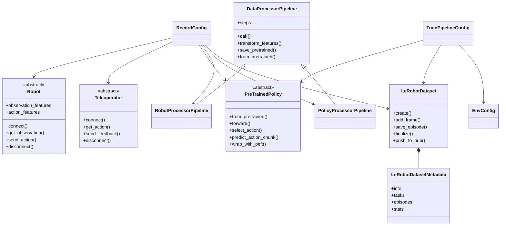
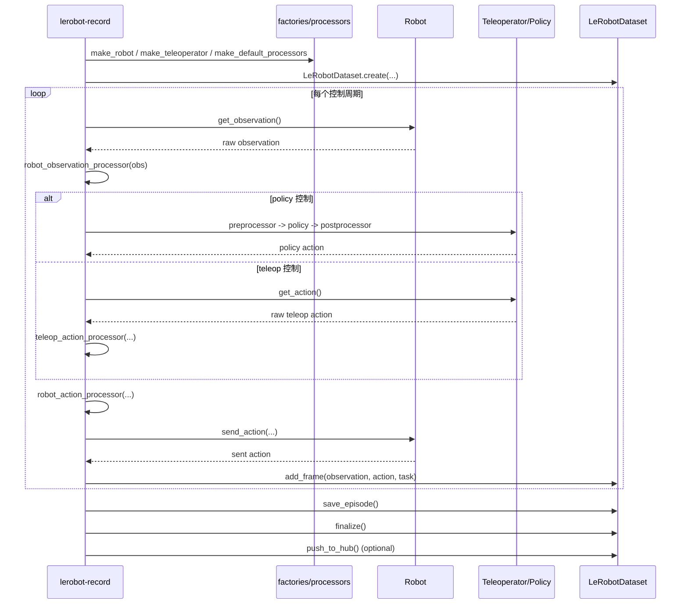
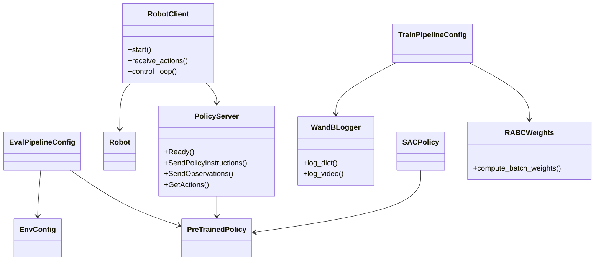
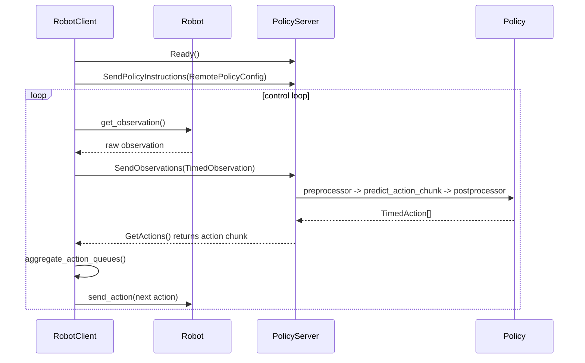

# Analysis of lerobot project implementation
_Exported on 3/13/2026 at 17:34:56 GMT+8 from Cursor (2.6.19)_

---

**User**

参考lerobot的官方文档网站 https://huggingface.co/docs/lerobot/index   上对lerobot的介绍, 结合上面提及的其它文章,论文,开源框架,也结合网上搜索到的与lerobot有关的文章,论文等, 更重要的是要基于对当前lerobot项目代码的深入分析, 根据 docs/具身智能vla系统pipeline的各阶段及其需求表.md 中提到的每一行需求, 详细解释一下lerobot是否在实现上考虑并满足了该项需求? 如果是则说明它是如何设计与实现以满足该项需求的, 并画出相关的关键类图与时序图, 列出关键的代码文件及其调用关系.

---

**Cursor**

我先读取你提到的需求表，并并行梳理 `lerobot` 仓库里和整条 VLA pipeline 直接相关的核心目录，再去补充官方文档与网上资料，这样后面可以逐行对照、不是泛泛而谈。

我已经拿到需求表，也确认这版 `lerobot` 的主干确实是 `record -> dataset -> train -> eval -> replay/async inference`。下一步我会把分析拆成 5 个阶段分别核对代码和官方资料，逐行判断“已满足 / 部分满足 / 未覆盖”。

我正在把官方文档、仓内 `docs/source`、以及代码实现互相校对，避免只根据 README 下结论。接下来会补齐几份和数据集、训练、评估、PEFT 直接相关的官方页面，再把外部论文/框架只作为“对照标尺”而不是替代代码证据。

现在我在从“说法”回到“实现细节”，把关键入口的类和函数逐个落到具体代码上。重点会抓 `record/train/eval/async` 四条链以及 `LeRobotDataset`、`ProcessorPipeline`、`Robot` 抽象这几层胶水。

我已经把主要骨架串起来了，现在在补“证据密度”比较高但容易被忽略的部分：数据校验、在线 RL buffer、奖励/成功信号、以及安全限幅。这样最终逐行对照时，不会把“仓库里有这个概念”和“主链里真正打通了”混为一谈。

## 总判断
我对这份需求表的逐行结论是：

`LeRobot` 当前最强的不是“全栈统一 VLA 平台”，而是一个围绕真实机器人数据、标准化数据集、IL/VLA 训练、基础评估和真实机器人推理部署的“脚本式主干框架”。它通过 `pyproject.toml` 里注册的 `lerobot-record`、`lerobot-train`、`lerobot-eval`、`lerobot-replay`、`lerobot-teleoperate` 等入口，共享 `Robot`、`Teleoperator`、`PreTrainedPolicy`、`DataProcessorPipeline`、`LeRobotDataset`、`EnvConfig` 这些抽象层，把 pipeline 串起来。

参考基线主要来自 [LeRobot 官方文档](https://huggingface.co/docs/lerobot/index) 以及仓内 `docs/source/lerobot-dataset-v3.mdx`、`introduction_processors.mdx`、`multi_gpu_training.mdx`、`peft_training.mdx`、`async.mdx`、`rtc.mdx`、`hilserl.mdx`、`libero.mdx`、`metaworld.mdx`。外部论文/框架我主要拿来做“标尺”，例如 DROID、LIBERO、Meta-World、HIL-SERL、RTC、`π0/π0.5`、SmolVLA，以及 Isaac Lab / ManiSkill / RLBench / openpi 这类生态；但下面的判断一律以当前仓库代码是否真正打通为准。

我采用的判定标准是：
- `已满足`: 仓内主线 CLI 或核心模块已打通，能直接承担该需求主场景。
- `部分满足`: 有能力、有支线、或有 example，但主链未完全打通，或覆盖范围明显有限。
- `未满足`: 当前仓内基本没有对应实现。

阶段性概览可以先压成一句话：
- 第一阶段数据收集与管理：强，但 PCG、精确时钟同步、PB 级数据湖能力不足。
- 第二阶段预处理与增强：中强，偏“视觉增强 + processor 组合”，不偏“高级数据治理”。
- 第三阶段训练与实验管理：IL/VLA 很强，RL 只有 HIL-SERL/SAC 一条相对成熟支线。
- 第四阶段评估：有完整骨架，但 benchmark 覆盖和严格可复现性都还不够满。
- 第五阶段部署与微调：真实机器人原型能力很强，生产级优化链条偏弱。

## 逐项对照
### 第一阶段：数据收集与管理
1. `多源数据采集`: `部分满足`。  
`src/lerobot/scripts/lerobot_record.py` 的 `record()` / `record_loop()` 能把 `teleop`、`policy`、`robot`、`processor`、`dataset` 串起来，真实机器人示教采集是主线；`src/lerobot/rl/actor.py`、`src/lerobot/rl/learner.py`、`docs/source/hilserl.mdx` 则提供了 RL/HIL-SERL 的在线交互数据链。但“专家 / 次优 / 失败”质量标签并不是 `lerobot-record` 的一等字段，更多是通过 `HIL-SERL` 事件逻辑或 `examples/port_datasets/port_droid.py` 这类移植脚本导入，所以只能算部分满足。

2. `数据合成 (PCG)`: `未满足`。  
当前仓库没有成体系的程序化场景生成、domain randomization、合成数据管线，也没有独立的 synthetic dataset generator。和 Isaac Lab、ManiSkill 这类仿真优先框架相比，`LeRobot` 的重点明显不在 PCG，而在真实数据格式、录制和模型训练。

3. `多模态数据同步记录`: `部分满足`。  
`Robot` 抽象把相机图像和本体状态统一进 `observation_features` / `get_observation()`，`build_dataset_frame()` 会把观测和动作拼成统一 frame，`LeRobotDataset.add_frame()` 自动补 `timestamp`、`frame_index`、`episode_index`、`task_index`。但主线 `lerobot-record` 记录的是 `observation + action + task`，并不通用记录 `reward / done / truncated`；时间同步更多依赖控制循环的 `fps` 与软件时间戳，而不是多传感器硬件时间同步。

4. `标准化数据格式与管理`: `已满足`。  
这是 `LeRobot` 当前最成熟的能力之一。`src/lerobot/datasets/lerobot_dataset.py` 的 `LeRobotDatasetMetadata` / `LeRobotDataset`、`docs/source/lerobot-dataset-v3.mdx`、`docs/source/porting_datasets_v3.mdx` 明确给出了 v3 的 Parquet + MP4 + metadata 方案；`src/lerobot/scripts/lerobot_edit_dataset.py`、`src/lerobot/datasets/dataset_tools.py` 提供了删 episode、改 features、改 tasks、图片转视频、v2.1 转 v3 等管理工具。

5. `可扩展性`: `部分满足`。  
v3 的 file-based dataset 设计、`StreamingLeRobotDataset`、DROID/SLURM 文档、分 shard 和 metadata 索引，说明它已经认真考虑了 TB 级规模和“数百万 episode”的组织方式。问题是它仍然是“本地文件 + HF Hub”的工程模式，不是 PB 级水平扩展的数据湖/仓库服务；而且 `src/lerobot/datasets/factory.py` 明确写着 `MultiLeRobotDataset` 暂未支持。

6. `高吞吐`: `部分满足`。  
`DatasetRecordConfig` 里有 `num_image_writer_processes`、`num_image_writer_threads_per_camera`、`video_encoding_batch_size`、`streaming_encoding`、`encoder_threads` 等选项，`src/lerobot/datasets/image_writer.py` 的 `AsyncImageWriter` 负责异步落盘，说明采集吞吐是被专门优化过的。问题是这更多是“单机高频录制优化”，不是大规模并行仿真 ingest 平台；`docs/source/streaming_video_encoding.mdx` 还明确提到队列积压时可能丢帧。

7. `易用性`: `已满足`。  
CLI 入口清晰，官方文档覆盖录制、训练、评估、硬件接入、PEFT、async/RTC；`lerobot-dataset-viz`、`lerobot-edit-dataset`、`lerobot-imgtransform-viz` 也降低了研究使用门槛。它不算 GUI 友好，但对研究工程师来说已经是“可直接用”的框架。

8. `数据质量与一致性`: `部分满足`。  
`src/lerobot/datasets/utils.py` 里的 `validate_frame()`、`validate_feature_dtype_and_shape()`、`validate_episode_buffer()`、`check_delta_timestamps()`，再加上 `LeRobotDataset.finalize()`，说明数据一致性和格式完整性是被系统性考虑过的。弱点在于 `add_frame()` 默认用 `frame_index / fps` 生成时间戳，`record_loop()` 也会在频率不足时报警；另外 `record_loop()` 自己留了 TODO，说明机器人实际被安全裁剪后的动作与写入 dataset 的动作可能不完全一致。

### 第二阶段：数据预处理与增强
1. `数据清洗与转换`: `部分满足`。  
`lerobot-edit-dataset` 和 `dataset_tools.py` 支持删 episode、改特征、改任务、image->video 转换、旧格式迁移；`src/lerobot/processor/normalize_processor.py` 提供 `MEAN_STD`、`MIN_MAX`、`QUANTILES`、`QUANTILE10` 等归一化模式。它缺的是自动质量检测、异常样本发现和大规模“低质量轨迹自动清洗”能力。

2. `数据切片与序列化`: `部分满足`。  
序列化方面是强项，`LeRobotDataset.save_episode()` 会写 chunked Parquet / MP4；切片方面 `LeRobotDataset.__getitem__()`、`delta_timestamps`、`StreamingLeRobotDataset` 的 lookback/lookahead、`EpisodeAwareSampler` 的 `drop_n_last_frames` 都支持时序窗口化。可它更偏“读取时动态窗口”，不是那种通用的“离线切成固定长度子序列并导出新数据集”的标准流水线。

3. `数据增强`: `部分满足`。  
`src/lerobot/datasets/transforms.py` 的 `ImageTransformsConfig` / `ImageTransforms` 支持 `ColorJitter`、`SharpnessJitter`、`RandomAffine`，官方文档和示例还展示了 `GaussianBlur` 等 torchvision augment。短板是增强几乎都集中在视觉，缺时序噪声、插值、轨迹增强、生成式增强和高级语义增强。

4. `模块化处理流程`: `已满足`。  
这是仓库第二个非常强的点。`src/lerobot/processor/pipeline.py` 里的 `ProcessorStepRegistry`、`ProcessorStep`、`DataProcessorPipeline`，再加上 `save_pretrained()` / `from_pretrained()` 和 `transform_features()`，让 processor 可以组合、序列化、迁移和热插拔；`docs/source/introduction_processors.mdx` 基本就是这套设计的正式说明。

5. `计算效率`: `部分满足`。  
`StreamingLeRobotDataset`、video decoder cache、在线 transform、统计计算里的 downsample、异步图片写入，说明仓库有不少效率优化。可 `src/lerobot/datasets/streaming_dataset.py` 直接写了 “Implement multi-threaded prefetching” 的 TODO，这表明大规模在线预处理还没做到最优。

6. `可复现性`: `部分满足`。  
训练侧有 `seed`、`cudnn_deterministic`、RNG state 保存恢复；processor 还能把 config/state 单独存盘。问题是录制阶段和 streaming/online augmentation 阶段并没有一个“给定原始数据 + 配置就产出完全固定物化结果”的强约束产物层。

7. `可配置性`: `已满足`。  
数据集、transform、processor、policy、PEFT、eval、W&B 都是 dataclass + CLI override 风格，配置粒度很细；processor 还可以从预训练目录按 JSON 配置恢复并局部 override。这方面已经达到研究框架里很舒服的程度。

### 第三阶段：模型训练与实验管理
1. `支持“IL预训练 + RL微调”范式`: `部分满足`。  
`src/lerobot/scripts/lerobot_train.py` 是成熟的离线 IL/VLA 主线，`src/lerobot/rl/learner.py` + `src/lerobot/rl/actor.py` + `docs/source/hilserl.mdx` 则是 SAC/HIL-SERL 支线，支持 demo + online buffer + intervention。问题是两者没有打成一个统一范式，`ACT` / `Diffusion` / `Pi0` / `Pi0.5` / `SmolVLA` 这些主线策略并不能直接接到 RL fine-tune learner 上。

2. `支持主流算法`: `未满足`。  
就“VLA/IL 模型 zoo”而言，`LeRobot` 非常强，`ACT`、`Diffusion`、`VQBeT`、`Pi0`、`Pi0Fast`、`Pi0.5`、`SmolVLA`、`GROOT`、`XVLA`、`WallX` 都有。可如果严格按需求表里写的 `IQL / CQL / TD3+BC / PPO / SAC`，当前仓内 RL 主线基本只有 `SAC`，`TDMPC` 也更像实验性 world-model 支线，不足以算“主流算法全面支持”。

3. `关键技术挑战解决方案`: `部分满足`。  
仓内确实有一些针对性设计：`src/lerobot/utils/rabc.py` 的 `RABCWeights` 和 `SARM` 解决样本质量加权；`SAC` 用双 critic / target network / min-Q；`RewardClassifierProcessorStep` 解决真实机器人 sparse reward 问题；`PEFT` 降低适配成本。问题是这些是“点状方案”，不是一个统一的“分布偏移、遗忘、过估计、次优数据利用”的通用框架。

4. `分布式训练与实验管理`: `部分满足`。  
离线主线用 `Accelerator` 支持单机多 GPU，`docs/source/multi_gpu_training.mdx` 和 `tests/training/test_multi_gpu.py` 也验证了这点；RL 支线有独立的 actor-learner gRPC 架构；W&B 集成较完整。缺口是没有仓内 TensorBoard/MLflow/Hydra sweep，也没有显式多节点 orchestration。

5. `训练效率与资源利用率`: `部分满足`。  
`accelerator.autocast()`、TF32、pin memory、streaming dataset、多个 policy 的 `torch.compile`、SAC 的 encoder feature cache、actor-learner 并发都说明性能是被认真考虑过的。可与需求表里提到的 Isaac Gym / RLinf / M2Flow 这类高吞吐 sim-first 体系相比，`LeRobot` 还不是那种极致追求仿真吞吐的训练平台，`src/lerobot/rl/actor.py` 甚至明确只处理单环境。

6. `灵活性与易用性`: `部分满足`。  
`make_policy()`、`get_policy_class()`、`make_pre_post_processors()`、`rename_map`、`PEFT`、processor 序列化，这些都让模型和数据桥接很灵活。可多数据集训练没打通、`GROOT` 的完整训练仍部分委托给 Isaac-GR00T、`TDMPC` 代码也直接声明“还没验证能复现实验论文结果”，所以还不能算彻底满足。

7. `容错与恢复`: `已满足`。  
`src/lerobot/utils/train_utils.py` 的 `save_checkpoint()` / `load_training_state()` / `update_last_checkpoint()` 会保存 model、optimizer、scheduler、processor、RNG、step；RL 支线还额外保存 `interaction_step` 和 replay buffer 导出的 dataset。实现上已经具备完整断点续训能力，虽然 RL 那边保存 replay buffer 的方式还带有“temporary save”味道。

### 第四阶段：模型评估
1. `标准化评估基准`: `部分满足`。  
`LeRobot` 当前内置的重点 benchmark 是 `LIBERO` 和 `Meta-World`，此外还有 `Aloha`、`Pusht`、`IsaaclabArenaEnv`、Hub env；`docs/source/libero.mdx` 和 `metaworld.mdx` 也明确把这部分当官方评估路径。问题是需求表里点名的 `CALVIN`、`ManiSkill2`、`RLBench` 当前仓内都没有直接实现，且 `LiberoEnv` / `MetaworldEnv` 的 state-only obs 仍有 `NotImplementedError`。

2. `定性与定量评估`: `部分满足`。  
`src/lerobot/scripts/lerobot_eval.py` 的 `eval_policy()` / `eval_policy_all()` 会产出 `avg_sum_reward`、`avg_max_reward`、`pc_success`、`eval_s`、`eval_ep_s`，并写评估视频和 `eval_info.json`；训练过程里 W&B 还能同步视频。它缺的是开箱即用的图表/HTML 报告层，输出更偏 JSON + mp4。

3. `自动化评估流程`: `已满足`。  
`TrainPipelineConfig.eval_freq` + `lerobot_train.py` 主循环里的 `eval_policy_all()` 调用，已经形成标准的“训练中定期评估”能力。也就是说，这项需求在离线主线里是闭环的。

4. `可复现性`: `部分满足`。  
优点是 seed、RNG state、LIBERO 固定 init states、per-episode seed 记录都具备。缺点是 `eval_main()` 里仍然打开了 `torch.backends.cudnn.benchmark = True`，而且代码里还写着 “works with SyncVectorEnv but not AsyncVectorEnv” 的 TODO，所以它不是最严格意义上的 deterministic eval。

5. `可扩展性`: `部分满足`。  
`make_env()` 支持 Sync/Async vector env，`eval.batch_size` 和 `max_parallel_tasks` 可以并发多个任务，`eval_policy_all()` 还会用 `ThreadPoolExecutor` 跑 task 级并行。问题是它把同一个 `policy` / `preprocessor` / `postprocessor` 交给多个线程共享，带缓存或内部状态的策略可能会出现线程安全风险。

### 第五阶段：模型部署与微调
1. `模型优化与转换`: `未满足`。  
如果按需求里说的 PTQ / QAT / 剪枝 / 蒸馏，这些在通用策略部署链上基本都没有。仓内确实有 `Unitree G1` 的 locomotion 子模块在用 `onnxruntime`，但那不是 `LeRobot` 通用 policy 的压缩/导出/部署方案。

2. `推理引擎编译优化`: `部分满足`。  
`Pi0`、`Pi0.5`、`SmolVLA`、`Diffusion`、`SAC` 都有 `torch.compile` 或类似编译开关，说明仓库有“模型级编译优化”意识；`RTC` 和 async 也在做推理路径层面的时延优化。可需求里指向的 `TensorRT`、精度校准、算子融合、engine build 这条线，当前仓内没有打通。

3. `硬件无关的部署接口`: `部分满足`。  
内部抽象其实设计得很好：`src/lerobot/robots/robot.py` 提供统一 `Robot` 接口，`src/lerobot/processor/policy_robot_bridge.py` 负责 `Tensor <-> RobotAction` 桥接，`teleoperate`、`replay`、`record`、`async_inference` 都复用这层。缺口是它没有 ROS/ROS2 bridge，也没有面向工业系统的标准通信层，所以“写一次到处跑”目前成立于 LeRobot 自己的适配器体系内，不是 ROS 生态级别的通用部署接口。

4. `高效在线微调`: `部分满足`。  
`docs/source/peft_training.mdx`、`src/lerobot/configs/default.py` 的 `PeftConfig`、`PreTrainedPolicy.wrap_with_peft()`、以及 `Pi0/Pi0.5/SmolVLA` 的默认 target modules，证明 LoRA 类 PEFT 已经是官方支持路径。问题是它是训练态 PEFT，不是部署时“在线热更新”；同时仓内没有 `QLoRA` / `bitsandbytes`，也没有针对灾难遗忘的专门连续学习机制。

5. `低延迟`: `部分满足`。  
这项在设计理念上考虑得很多。`docs/source/async.mdx` 和 `rtc.mdx` 对应的 `PolicyServer` / `RobotClient`、`ActionQueue`、`LatencyTracker`、`RTCConfig`，就是在解决“模型比控制频率慢”的现实问题；客户端只保留最新 observation，服务器侧 observation queue 也只有 1 格，明显是为了减迟滞。可这更像软实时方案，是否稳定达到 `5-20Hz` 取决于具体 policy、设备和机器人，不是统一保证。

6. `鲁棒性与可靠性`: `部分满足`。  
仓内有不少正面信号：`tests/training/test_multi_gpu.py`、`tests/async_inference/test_e2e.py`、`tests/policies/rtc/*`、`tests/processor/test_policy_robot_bridge.py` 都覆盖了关键链路；`UnitreeG1.disconnect()` 会发送零力矩并 join 线程。问题是广义异常捕获很多，`UnitreeG1.calibrate()` 还是 TODO，异步/网络侧也缺认证和更强故障隔离。

7. `安全性`: `部分满足`。  
物理安全上，`src/lerobot/robots/utils.py` 的 `ensure_safe_goal_position()`、`SOFollower.send_action()` 的 `max_relative_target`、gripper torque/current 限制、`HIL-SERL` 的 end-effector bounds 和 human intervention，说明它有明确的安全保护意识。可仓内没有统一碰撞检测/安全监督器；同时系统安全层面 `async_inference` 和 `rl/learner_service.py` 默认用 `pickle` + 明文 gRPC，且 learner service 还写着 `TODO: authorize the request`，这离生产安全还差很远。

## 关键图
### 类图 1：采集-训练主干


### 时序图 1：`lerobot-record` 录制链


### 类图 2：评估-部署主干


### 时序图 2：`lerobot-train` + 周期性评估
```mermaid
sequenceDiagram
    participant CLI as lerobot-train
    participant CFG as TrainPipelineConfig
    participant Data as make_dataset
    participant Env as make_env
    participant Policy as make_policy
    participant Proc as make_pre_post_processors
    participant Opt as optimizer/scheduler
    participant Eval as eval_policy_all
    participant CKPT as save_checkpoint

    CLI->>CFG: validate()
    CLI->>Data: make_dataset(cfg)
    CLI->>Env: make_env(cfg.env) (optional)
    CLI->>Policy: make_policy(cfg.policy, ds_meta/env_cfg)
    CLI->>Proc: make_pre_post_processors(...)
    CLI->>Opt: make_optimizer_and_scheduler(...)

    loop 每个训练 step
        CLI->>Data: next batch
        CLI->>Proc: preprocessor(batch)
        CLI->>Policy: forward(batch)
        Policy-->>CLI: loss + metrics
        CLI->>Opt: backward + optimizer.step + scheduler.step

        alt checkpoint step
            CLI->>CKPT: save_checkpoint(...)
        end

        alt eval step
            CLI->>Eval: eval_policy_all(...)
            Eval-->>CLI: success/reward/video_paths
        end
    end
```

### 时序图 3：异步推理部署链


### 时序图 4：HIL-SERL actor-learner
```mermaid
sequenceDiagram
    participant Actor as rl.actor
    participant Env as gym_manipulator / real robot
    participant Learner as rl.learner
    participant Buffer as ReplayBuffer
    participant SAC as SACPolicy

    Actor->>Learner: gRPC connect / receive weights

    loop online RL
        Actor->>Env: select_action / step
        Env-->>Actor: transition + intervention info
        Actor->>Learner: send transitions / interaction messages

        Learner->>Buffer: append online data
        alt 配置了离线 demo
            Learner->>Buffer: sample offline buffer too
        end

        Learner->>SAC: critic / actor / temperature updates
        Learner-->>Actor: push updated parameters
    end
```

## 关键文件与外部对照
### 关键调用关系
- `采集主链`: `pyproject.toml` -> `src/lerobot/scripts/lerobot_record.py` -> `make_robot_from_config()` / `make_teleoperator_from_config()` -> `make_default_processors()` -> `aggregate_pipeline_dataset_features()` -> `LeRobotDataset.create()` -> `record_loop()` -> `robot.get_observation()` -> `predict_action()` 或 `teleop.get_action()` -> `robot.send_action()` -> `dataset.add_frame()` -> `dataset.save_episode()` -> `dataset.finalize()`.
- `数据集主链`: `src/lerobot/datasets/lerobot_dataset.py` -> `LeRobotDatasetMetadata` 加载 `info/tasks/episodes/stats` -> `LeRobotDataset.__getitem__()` 做 delta 窗口查询和视频解码 -> `image_transforms` 在线增强 -> batch 进入训练；管理侧由 `src/lerobot/scripts/lerobot_edit_dataset.py` 和 `src/lerobot/datasets/dataset_tools.py` 完成。
- `训练主链`: `pyproject.toml` -> `src/lerobot/scripts/lerobot_train.py` -> `TrainPipelineConfig.validate()` -> `make_dataset()` -> `make_env()` -> `make_policy()` -> `make_pre_post_processors()` -> `make_optimizer_and_scheduler()` -> `update_policy()` -> `save_checkpoint()` -> `eval_policy_all()`.
- `评估主链`: `pyproject.toml` -> `src/lerobot/scripts/lerobot_eval.py` -> `make_env()` -> `make_policy()` -> `make_env_pre_post_processors()` + `make_pre_post_processors()` -> `eval_policy_all()` -> `eval_policy()` -> `rollout()` -> `write_video()` / `eval_info.json`.
- `遥操作 / 回放`: `src/lerobot/scripts/lerobot_teleoperate.py` 走 `teleop_loop()`，`src/lerobot/scripts/lerobot_replay.py` 走 dataset action 回放，两者都复用 `Robot` 抽象和默认 processors。
- `异步部署主链`: `src/lerobot/async_inference/robot_client.py` -> `Ready()` / `SendPolicyInstructions()` -> `SendObservations()` -> `src/lerobot/async_inference/policy_server.py::_predict_action_chunk()` -> `receive_actions()` -> `_aggregate_action_queues()` -> `robot.send_action()`.
- `RL 主链`: `src/lerobot/rl/learner.py` -> `add_actor_information_and_train()` -> `initialize_replay_buffer()` / `initialize_offline_replay_buffer()` -> `SACPolicy.forward(model="critic"/"actor"/"temperature")`；actor 侧则是 `src/lerobot/rl/actor.py` -> `make_robot_env()` -> rollout -> gRPC 回传 transition。

### 与论文 / 开源框架的关系
- `LeRobot` 的官方定位非常清楚：它是“真实机器人机器学习工具链”，重点是 datasets、models、tools，官方文档首页就强调 focus 在 imitation learning 和 reinforcement learning，而不是纯仿真平台。
- 与 `DROID`、`LeRobotDataset v3`、`HF Hub` 结合后，它在“真实数据标准化 + 共享 + streaming”这件事上，比很多只做算法训练的仓库更完整。
- 与 `LIBERO`、`Meta-World` 相比，`LeRobot` 的评估模块已经能把 benchmark 接进统一训练/评估流程；但与 `RLBench`、`CALVIN`、`ManiSkill2` 这类更广覆盖的 benchmark 生态相比，当前实现面还不够大。
- 与 `HIL-SERL` 论文一致，`LeRobot` 真正成熟的 RL 支线就是“小量示教 + reward classifier + actor-learner + human intervention + SAC”这条链。也就是说，它的 RL 不是泛化算法库，而是很强的“真实机器人 sample-efficient RL recipe”。
- 与 `openpi`、`π0/π0.5`、`SmolVLA` 这些 VLA 工作的关系，更像“统一托管与复现框架”：把不同论文模型纳入统一的 `PreTrainedPolicy + processor + dataset + eval + PEFT` 接口，而不是完全复制每篇论文原始仓库的所有工程能力。
- 与 `Isaac Lab` / `ManiSkill` 这类 sim-first 框架相比，`LeRobot` 最明显的短板就是 PCG、domain randomization、超大规模并行仿真和生产级部署优化链；但它在真实机器人录制、Hub 集成、跨 policy 数据格式统一这几件事上反而更像“机器人版 Hugging Face”。

这次结论是静态代码与文档分析，没有实际跑训练、评估或真机控制命令，所以吞吐、时延、稳定性相关条目我主要依据实现结构、官方文档、测试覆盖和代码里的 TODO/注释来判断。若你愿意，我下一步可以把这份分析整理成一份新的中文 Markdown 报告，直接写入 `docs/` 目录，方便你长期维护。

