# LeRobot v0.5.1 技术架构深度解析

**基于源码的软件工程视角**

> **版本**: LeRobot v0.5.1 | **论文**: ICLR 2026 (arXiv:2602.22818) | **分析日期**: 2026-04-15
>
> **代码库路径**: `src/lerobot/` | **配置框架**: draccus v0.10.0 | **运行时**: PyTorch 2.2–2.11

---

## 目录

- [0. 阅读指南](#0-阅读指南)
- [1. 项目定位与产业背景](#1-项目定位与产业背景)
- [2. 总体架构概览](#2-总体架构概览)
- [3. 配置与扩展子系统](#3-配置与扩展子系统)
- [4. 数据资产子系统](#4-数据资产子系统)
- [5. 处理器子系统](#5-处理器子系统)
- [6. 策略子系统](#6-策略子系统)
- [7. 硬件抽象子系统](#7-硬件抽象子系统)
- [8. 环境与仿真子系统](#8-环境与仿真子系统)
- [9. 异步推理与 RL 子系统](#9-异步推理与-rl-子系统)
- [10. 设计模式精解](#10-设计模式精解)
- [11. 核心数据流全解析](#11-核心数据流全解析)
- [12. 扩展机制指南](#12-扩展机制指南)
- [13. 与替代方案的架构对比](#13-与替代方案的架构对比)
- [14. 优化器与训练子系统](#14-优化器与训练子系统)
- [15. 实践指南与架构决策记录](#15-实践指南与架构决策记录)
- [16. 代码质量与工程实践](#16-代码质量与工程实践)
- [17. 总结与展望](#17-总结与展望)
- [附录 A: 源码文件索引](#附录-a-源码文件索引)
- [附录 B: 图索引](#附录-b-图索引)
- [附录 C: 术语表](#附录-c-术语表)

---

## 0. 阅读指南

### 0.1 本文定位

本文基于对 LeRobot v0.5.1 源码的逐文件深度分析，结合 ICLR 2026 论文和 HuggingFace 官方文档，从**软件工程**和**机器人行业**双重视角对 LeRobot 的设计与架构进行系统性解析。

与现有文档的差异:

| 维度 | 现有文档 | 本文 |
|------|---------|------|
| 图表数量 | ~6 个 | **28+ 个 mermaid 图** |
| 图表类型 | classDiagram, sequenceDiagram | + erDiagram, stateDiagram, flowchart, journey, quadrant 等 |
| 架构层数 | 6 层 | **7 层** (新增 Transport 层) |
| 设计模式 | 隐式提及 | **7 个模式显式命名与分析** |
| 扩展指南 | 无 | **完整 step-by-step 扩展指南** |
| 架构决策 | 无 | **5 个 ADR (Architecture Decision Record)** |
| 行业对比 | 简略 | **结构化对比表 (5 个替代方案)** |

### 0.2 读者导航

- **机器人工程师 (评估 LeRobot 适用性)**: 读 [1](#1-项目定位与产业背景) → [7](#7-硬件抽象子系统) → [9](#9-异步推理与-rl-子系统) → [15](#15-实践指南与架构决策记录)
- **ML 研究员 (添加新策略)**: 读 [6](#6-策略子系统) → [5](#5-处理器子系统) → [12](#12-扩展机制指南) → [14](#14-优化器与训练子系统)
- **软件架构师 (研究设计模式)**: 读 [2](#2-总体架构概览) → [10](#10-设计模式精解) → [3](#3-配置与扩展子系统) → [15](#15-实践指南与架构决策记录)

### 0.3 文档结构总览

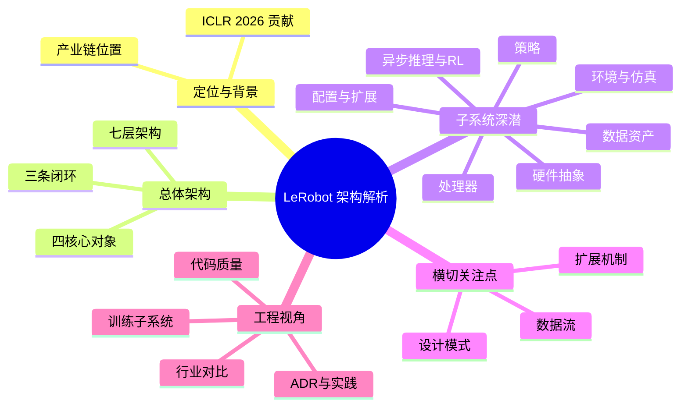
```mermaid
mindmap
  root((LeRobot 架构解析))
    定位与背景
      产业链位置
      ICLR 2026 贡献
    总体架构
      四核心对象
      三条闭环
      七层架构
    子系统深潜
      配置与扩展
      数据资产
      处理器
      策略
      硬件抽象
      环境与仿真
      异步推理与RL
    横切关注点
      设计模式
      数据流
      扩展机制
    工程视角
      行业对比
      训练子系统
      ADR与实践
      代码质量
```

---

## 1. 项目定位与产业背景

### 1.1 机器人学习的工程瓶颈

机器人学习生态面临三重碎片化问题 (ICLR 2026 论文 Section 2.3):

1. **中间件碎片化**: 不同机器人平台各有专属 SDK，适配成本高
2. **数据格式碎片化**: TensorFlow Datasets、ROS bags、自定义 JSON 各行其道
3. **算法框架碎片化**: 每个论文一套训练/评估脚本，可复现性差

LeRobot 的核心命题是: **通过垂直整合 (vertical integration) 消除这些碎片化**。

### 1.2 LeRobot 在产业链中的位置


```mermaid
graph LR
    subgraph 硬件层["硬件层 (Accessible Hardware)"]
        SO["SO-10X<br/>~225"]
        Koch["Koch v1.1<br/>~670"]
        ALOHA["ALOHA-2<br/>~21K"]
        HopeJR["HopeJR<br/>~500"]
        LeKiwi["LeKiwi<br/>~230"]
        G1["Unitree G1"]
        Reachy["Reachy-2"]
    end

    subgraph 数据层["数据层 (LeRobotDataset v3)"]
        Record["遥操作采集"]
        Format["Parquet + MP4"]
        Hub["HuggingFace Hub<br/>16K+ 数据集"]
        Stream["流式读取"]
    end

    subgraph 学习层["学习层 (SOTA Policies)"]
        ACT["ACT<br/>52M params"]
        Diff["Diffusion<br/>263M"]
        Pi0["Pi0<br/>3.5B"]
        SmolVLA["SmolVLA<br/>450M"]
        SAC["SAC/HIL-SERL"]
    end

    subgraph 部署层["部署层 (Optimized Inference)"]
        Sync["同步推理"]
        Async["异步 gRPC<br/>物理+逻辑解耦"]
        RT["实时控制"]
    end

    硬件层 --> 数据层
    数据层 --> 学习层
    学习层 --> 部署层
    部署层 --> 硬件层

    style 硬件层 fill:#e8f5e9
    style 数据层 fill:#e3f2fd
    style 学习层 fill:#fff3e0
    style 部署层 fill:#fce4ec
```

### 1.3 系统上下文

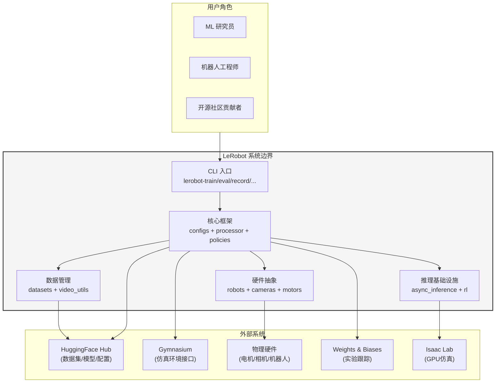
```mermaid
graph TB
    subgraph External["外部系统"]
        HFHub["HuggingFace Hub<br/>(数据集/模型/配置)"]
        Gym["Gymnasium<br/>(仿真环境接口)"]
        HW["物理硬件<br/>(电机/相机/机器人)"]
        WandB["Weights & Biases<br/>(实验跟踪)"]
        Isaac["Isaac Lab<br/>(GPU仿真)"]
    end

    subgraph Users["用户角色"]
        Researcher["ML 研究员"]
        Engineer["机器人工程师"]
        Community["开源社区贡献者"]
    end

    subgraph LeRobot["LeRobot 系统边界"]
        direction TB
        CLI["CLI 入口<br/>lerobot-train/eval/record/..."]
        Core["核心框架<br/>configs + processor + policies"]
        HAL["硬件抽象<br/>robots + cameras + motors"]
        Data["数据管理<br/>datasets + video_utils"]
        Infra["推理基础设施<br/>async_inference + rl"]
    end

    Users --> CLI
    CLI --> Core
    Core --> HAL
    Core --> Data
    Core --> Infra
    HAL --> HW
    Data --> HFHub
    Core --> HFHub
    Core --> Gym
    Core --> WandB
    Infra --> Isaac

    style LeRobot fill:#f5f5f5,stroke:#333,stroke-width:2px
```

### 1.4 ICLR 2026 论文核心贡献

论文确立了 LeRobot 的四大支柱:

| 支柱 | 源码对应 | 产业意义 |
|------|---------|---------|
| **统一硬件集成** | `robots/`, `motors/`, `cameras/`, `teleoperators/` | 降低从 SDK 到 ML 的跨栈对接成本 |
| **标准化数据集** | `datasets/lerobot_dataset.py` | 让数据成为可共享资产而非一次性脚本产物 |
| **优化推理栈** | `async_inference/` | 解耦推理与控制，支持远程 GPU 部署 |
| **高效可复用算法** | `policies/` (15+ 策略) | 统一接口下的多范式算法快速切换 |

---

## 2. 总体架构概览

### 2.1 四核心对象模型

LeRobot 的整体设计可以用四个核心对象来理解:

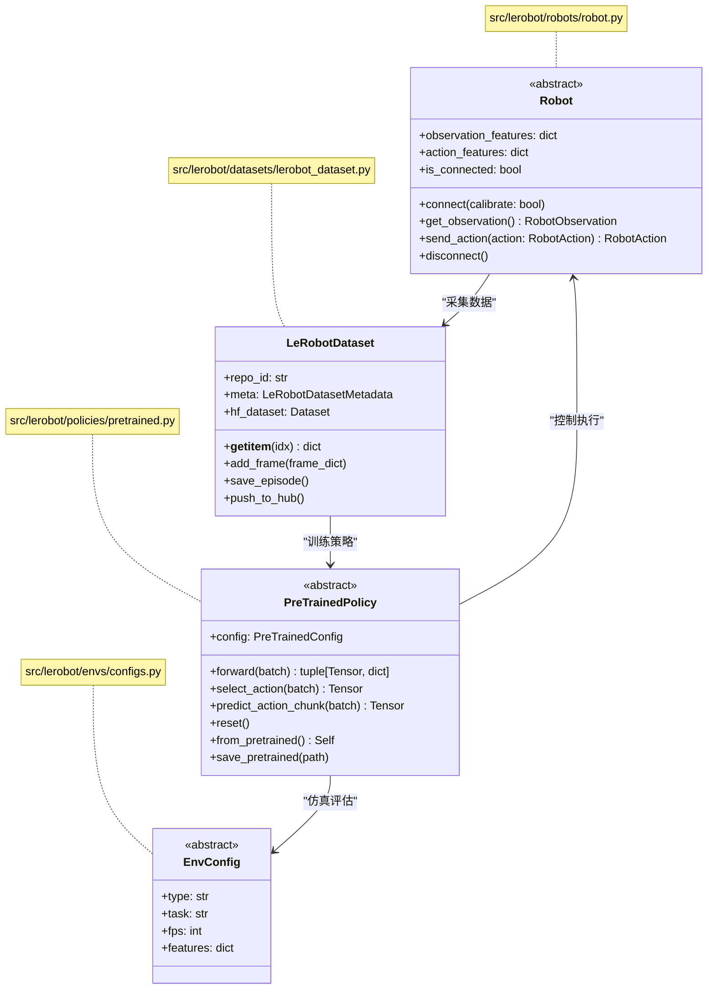
```mermaid
classDiagram
    class Robot {
        <<abstract>>
        +observation_features: dict
        +action_features: dict
        +is_connected: bool
        +connect(calibrate: bool)
        +get_observation() RobotObservation
        +send_action(action: RobotAction) RobotAction
        +disconnect()
    }

    class LeRobotDataset {
        +repo_id: str
        +meta: LeRobotDatasetMetadata
        +hf_dataset: Dataset
        +__getitem__(idx) dict
        +add_frame(frame_dict)
        +save_episode()
        +push_to_hub()
    }

    class PreTrainedPolicy {
        <<abstract>>
        +config: PreTrainedConfig
        +forward(batch) tuple[Tensor, dict]
        +select_action(batch) Tensor
        +predict_action_chunk(batch) Tensor
        +reset()
        +from_pretrained() Self
        +save_pretrained(path)
    }

    class EnvConfig {
        <<abstract>>
        +type: str
        +task: str
        +fps: int
        +features: dict
    }

    Robot --> LeRobotDataset : "采集数据"
    LeRobotDataset --> PreTrainedPolicy : "训练策略"
    PreTrainedPolicy --> Robot : "控制执行"
    PreTrainedPolicy --> EnvConfig : "仿真评估"

    note for Robot "src/lerobot/robots/robot.py"
    note for LeRobotDataset "src/lerobot/datasets/lerobot_dataset.py"
    note for PreTrainedPolicy "src/lerobot/policies/pretrained.py"
    note for EnvConfig "src/lerobot/envs/configs.py"
```

### 2.2 三条运行闭环

围绕四个核心对象，LeRobot 形成三条闭环:

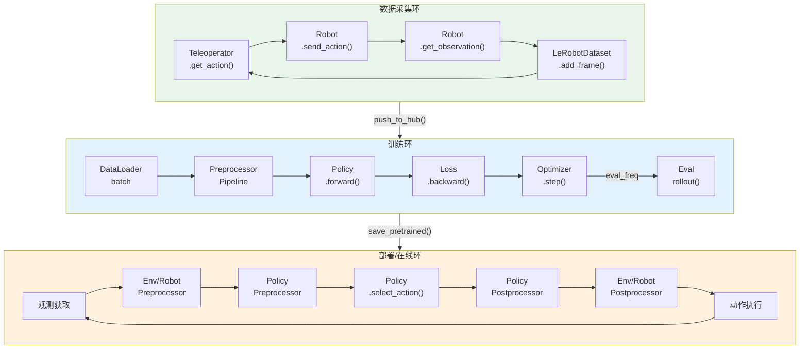
```mermaid
graph TB
    subgraph DataLoop["数据采集环"]
        direction LR
        T["Teleoperator<br/>.get_action()"] --> R1["Robot<br/>.send_action()"]
        R1 --> O["Robot<br/>.get_observation()"]
        O --> D["LeRobotDataset<br/>.add_frame()"]
        D --> T
    end

    subgraph TrainLoop["训练环"]
        direction LR
        DL["DataLoader<br/>batch"] --> Pre["Preprocessor<br/>Pipeline"]
        Pre --> P["Policy<br/>.forward()"]
        P --> Loss["Loss<br/>.backward()"]
        Loss --> Opt["Optimizer<br/>.step()"]
        Opt -->|"eval_freq"| Eval["Eval<br/>rollout()"]
    end

    subgraph DeployLoop["部署/在线环"]
        direction LR
        Obs["观测获取"] --> EPre["Env/Robot<br/>Preprocessor"]
        EPre --> PPre["Policy<br/>Preprocessor"]
        PPre --> Act["Policy<br/>.select_action()"]
        Act --> PPost["Policy<br/>Postprocessor"]
        PPost --> EPost["Env/Robot<br/>Postprocessor"]
        EPost --> Exec["动作执行"]
        Exec --> Obs
    end

    DataLoop -->|"push_to_hub()"| TrainLoop
    TrainLoop -->|"save_pretrained()"| DeployLoop

    style DataLoop fill:#e8f5e9
    style TrainLoop fill:#e3f2fd
    style DeployLoop fill:#fff3e0
```

### 2.3 七层架构模型

这是理解 LeRobot 代码组织的主架构图。在现有六层基础上增加了 **Transport 层**，因为 `transport/` 模块承载了分布式通信的关键基础设施:

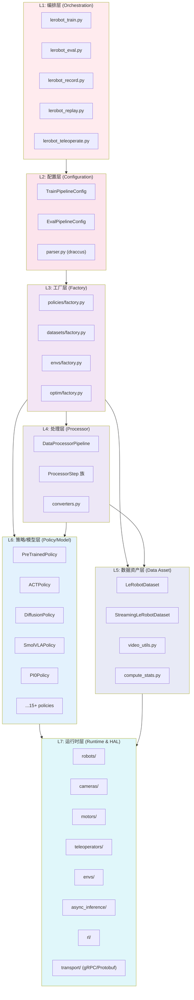
```mermaid
graph TB
    subgraph L1["L1: 编排层 (Orchestration)"]
        train["lerobot_train.py"]
        eval["lerobot_eval.py"]
        record["lerobot_record.py"]
        replay["lerobot_replay.py"]
        teleop["lerobot_teleoperate.py"]
    end

    subgraph L2["L2: 配置层 (Configuration)"]
        trainCfg["TrainPipelineConfig"]
        evalCfg["EvalPipelineConfig"]
        parser["parser.py (draccus)"]
    end

    subgraph L3["L3: 工厂层 (Factory)"]
        pf["policies/factory.py"]
        df["datasets/factory.py"]
        ef["envs/factory.py"]
        of["optim/factory.py"]
    end

    subgraph L4["L4: 处理层 (Processor)"]
        pipeline["DataProcessorPipeline"]
        steps["ProcessorStep 族"]
        converter["converters.py"]
    end

    subgraph L5["L5: 数据资产层 (Data Asset)"]
        dataset["LeRobotDataset"]
        streaming["StreamingLeRobotDataset"]
        video["video_utils.py"]
        stats["compute_stats.py"]
    end

    subgraph L6["L6: 策略/模型层 (Policy/Model)"]
        pretrained["PreTrainedPolicy"]
        act["ACTPolicy"]
        diff["DiffusionPolicy"]
        smolvla["SmolVLAPolicy"]
        pi0["PI0Policy"]
        more["...15+ policies"]
    end

    subgraph L7["L7: 运行时层 (Runtime & HAL)"]
        robots["robots/"]
        cameras["cameras/"]
        motors["motors/"]
        teleops["teleoperators/"]
        envs["envs/"]
        async["async_inference/"]
        rl["rl/"]
        transport["transport/ (gRPC/Protobuf)"]
    end

    L1 --> L2
    L2 --> L3
    L3 --> L4
    L3 --> L5
    L3 --> L6
    L4 --> L5
    L4 --> L6
    L6 --> L7
    L5 --> L7

    style L1 fill:#ffebee
    style L2 fill:#fce4ec
    style L3 fill:#f3e5f5
    style L4 fill:#ede7f6
    style L5 fill:#e8eaf6
    style L6 fill:#e3f2fd
    style L7 fill:#e0f7fa
```

### 2.4 横切关注点

贯穿所有层的三个横切关注点:

| 横切关注点 | 机制 | 涉及的类/模块 |
|-----------|------|-------------|
| **Hub 集成** | `HubMixin` (save/load/push) | PreTrainedPolicy, DataProcessorPipeline, LeRobotDataset, TrainPipelineConfig |
| **类型系统** | `FeatureType` + `PolicyFeature` | configs/types.py → 贯穿 dataset, env, policy |
| **插件机制** | `register_third_party_plugins()` | utils/import_utils.py → 自动发现 `lerobot_*` 包 |

---

## 3. 配置与扩展子系统

### 3.1 draccus + ChoiceRegistry: 声明式配置即工厂

LeRobot 的配置系统建立在 **draccus** 库之上。draccus 提供的 `ChoiceRegistry` 模式将**配置声明**与**多态对象创建**统一在同一机制中:

```python
# src/lerobot/configs/policies.py
class PreTrainedConfig(draccus.ChoiceRegistry, HubMixin, abc.ABC):
    """所有策略配置的基类，同时也是策略工厂的注册表"""
    ...

# src/lerobot/policies/act/configuration_act.py
@PreTrainedConfig.register_subclass("act")
@dataclass
class ACTConfig(PreTrainedConfig):
    chunk_size: int = 100
    n_action_steps: int = 100
    ...
```

当用户在 CLI 指定 `--policy.type=act` 时，draccus 自动查找注册表并实例化 `ACTConfig`。

### 3.2 配置层级

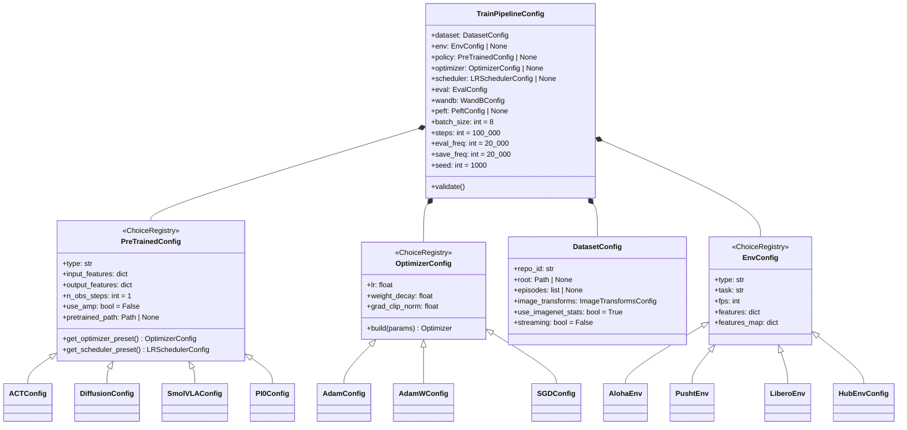
```mermaid
classDiagram
    class TrainPipelineConfig {
        +dataset: DatasetConfig
        +env: EnvConfig | None
        +policy: PreTrainedConfig | None
        +optimizer: OptimizerConfig | None
        +scheduler: LRSchedulerConfig | None
        +eval: EvalConfig
        +wandb: WandBConfig
        +peft: PeftConfig | None
        +batch_size: int = 8
        +steps: int = 100_000
        +eval_freq: int = 20_000
        +save_freq: int = 20_000
        +seed: int = 1000
        +validate()
    }

    class PreTrainedConfig {
        <<ChoiceRegistry>>
        +type: str
        +input_features: dict
        +output_features: dict
        +n_obs_steps: int = 1
        +use_amp: bool = False
        +pretrained_path: Path | None
        +get_optimizer_preset() OptimizerConfig
        +get_scheduler_preset() LRSchedulerConfig
    }

    class OptimizerConfig {
        <<ChoiceRegistry>>
        +lr: float
        +weight_decay: float
        +grad_clip_norm: float
        +build(params) Optimizer
    }

    class DatasetConfig {
        +repo_id: str
        +root: Path | None
        +episodes: list | None
        +image_transforms: ImageTransformsConfig
        +use_imagenet_stats: bool = True
        +streaming: bool = False
    }

    class EnvConfig {
        <<ChoiceRegistry>>
        +type: str
        +task: str
        +fps: int
        +features: dict
        +features_map: dict
    }

    TrainPipelineConfig *-- DatasetConfig
    TrainPipelineConfig *-- PreTrainedConfig
    TrainPipelineConfig *-- OptimizerConfig
    TrainPipelineConfig *-- EnvConfig

    PreTrainedConfig <|-- ACTConfig
    PreTrainedConfig <|-- DiffusionConfig
    PreTrainedConfig <|-- SmolVLAConfig
    PreTrainedConfig <|-- PI0Config

    OptimizerConfig <|-- AdamConfig
    OptimizerConfig <|-- AdamWConfig
    OptimizerConfig <|-- SGDConfig

    EnvConfig <|-- AlohaEnv
    EnvConfig <|-- PushtEnv
    EnvConfig <|-- LiberoEnv
    EnvConfig <|-- HubEnvConfig
```

### 3.3 配置生命周期

配置从 CLI 到运行的完整生命周期:

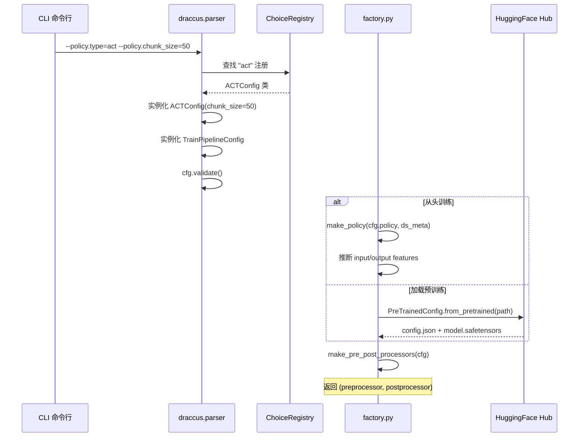
```mermaid
sequenceDiagram
    participant CLI as CLI 命令行
    participant Parser as draccus.parser
    participant Registry as ChoiceRegistry
    participant Factory as factory.py
    participant Hub as HuggingFace Hub

    CLI->>Parser: --policy.type=act --policy.chunk_size=50
    Parser->>Registry: 查找 "act" 注册
    Registry-->>Parser: ACTConfig 类
    Parser->>Parser: 实例化 ACTConfig(chunk_size=50)
    Parser->>Parser: 实例化 TrainPipelineConfig
    Parser->>Parser: cfg.validate()

    alt 从头训练
        Factory->>Factory: make_policy(cfg.policy, ds_meta)
        Factory->>Factory: 推断 input/output features
    else 加载预训练
        Factory->>Hub: PreTrainedConfig.from_pretrained(path)
        Hub-->>Factory: config.json + model.safetensors
    end

    Factory->>Factory: make_pre_post_processors(cfg)
    Note over Factory: 返回 (preprocessor, postprocessor)
```

### 3.4 插件发现机制

LeRobot 支持通过 Python 包命名约定自动发现第三方扩展 (`src/lerobot/utils/import_utils.py`):

```python
def register_third_party_plugins() -> None:
    prefixes = (
        "lerobot_robot_",
        "lerobot_camera_",
        "lerobot_teleoperator_",
        "lerobot_policy_"
    )
    for dist in importlib.metadata.distributions():
        name = dist.metadata["Name"]
        if name and name.startswith(prefixes):
            importlib.import_module(name.replace("-", "_"))
```

只要一个 pip 包名以上述前缀开头，安装后即自动被框架发现并注册到对应的 `ChoiceRegistry` 中。

---

## 4. 数据资产子系统

### 4.1 LeRobotDataset 核心设计

`LeRobotDataset` 不是普通的 `torch.utils.data.Dataset` 薄封装，而是一套完整的**数据资产格式**。它解决的核心问题是: 如何让机器人学习数据成为可共享、可复现的标准化中间资产。

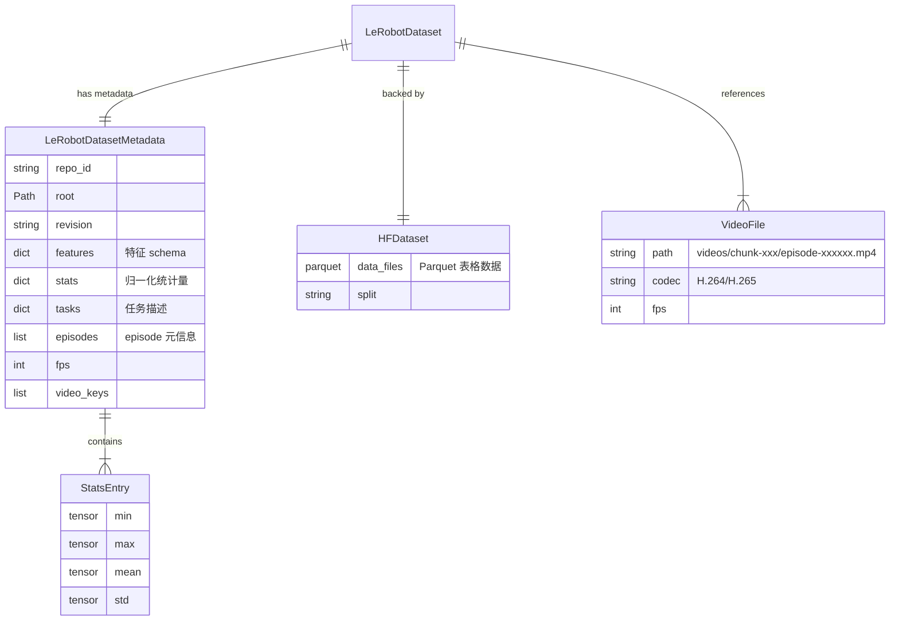
```mermaid
erDiagram
    LeRobotDataset ||--|| LeRobotDatasetMetadata : "has metadata"
    LeRobotDataset ||--|| HFDataset : "backed by"
    LeRobotDataset ||--|{ VideoFile : "references"

    LeRobotDatasetMetadata {
        string repo_id
        Path root
        string revision
        dict features "特征 schema"
        dict stats "归一化统计量"
        dict tasks "任务描述"
        list episodes "episode 元信息"
        int fps
        list video_keys
    }

    HFDataset {
        parquet data_files "Parquet 表格数据"
        string split
    }

    VideoFile {
        string path "videos/chunk-xxx/episode-xxxxxx.mp4"
        string codec "H.264/H.265"
        int fps
    }

    LeRobotDatasetMetadata ||--|{ StatsEntry : "contains"
    StatsEntry {
        tensor min
        tensor max
        tensor mean
        tensor std
    }
```

### 4.2 磁盘结构 (v3.0)

```
repo_id/
├── meta/
│   ├── info.json              # 数据集元信息 (fps, shapes, codebase_version)
│   ├── stats.json             # 每个特征的 min/max/mean/std
│   ├── tasks.json             # 任务文本描述
│   └── episodes.parquet       # Episode 元信息 (chunk_index, file_index, length)
├── data/
│   └── chunk-000/
│       ├── episode_000000.parquet   # 观测/动作表格数据
│       ├── episode_000001.parquet
│       └── ...
└── videos/
    └── chunk-000/
        ├── observation.images.top/
        │   ├── episode_000000.mp4   # 视频流
        │   └── ...
        └── observation.images.wrist/
            └── ...
```

### 4.3 FeatureType 类型系统

`src/lerobot/configs/types.py` 定义了六种语义化特征类型:

| FeatureType | 含义 | 典型 key | 数据形态 |
|------------|------|---------|---------|
| `STATE` | 本体感觉状态 | `observation.state` | 1D 向量 (关节角度等) |
| `VISUAL` | 视觉观测 | `observation.images.top` | 3D/4D 张量 (C,H,W) |
| `ENV` | 环境特定状态 | `observation.environment_state` | 1D 向量 |
| `ACTION` | 动作指令 | `action` | 1D 向量 |
| `REWARD` | 奖励信号 | `next.reward` | 标量 |
| `LANGUAGE` | 语言指令 | `task` | 字符串/token |

通过 `PolicyFeature(type=FeatureType.STATE, shape=(6,))` 将**语义类型**与**维度形状**绑定，使 dataset-policy-env 之间靠特征语义而非手写 shape 对接。

### 4.4 数据集生命周期

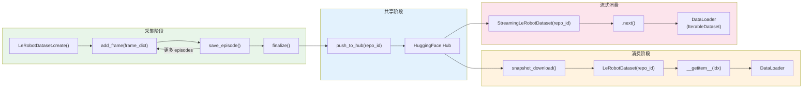
```mermaid
graph LR
    subgraph 采集阶段
        Create["LeRobotDataset.create()"] --> AddFrame["add_frame(frame_dict)"]
        AddFrame --> SaveEp["save_episode()"]
        SaveEp -->|"更多 episodes"| AddFrame
        SaveEp --> Finalize["finalize()"]
    end

    subgraph 共享阶段
        Finalize --> Push["push_to_hub(repo_id)"]
        Push --> HFHub["HuggingFace Hub"]
    end

    subgraph 消费阶段
        HFHub --> Download["snapshot_download()"]
        Download --> Load["LeRobotDataset(repo_id)"]
        Load --> GetItem["__getitem__(idx)"]
        GetItem --> DL["DataLoader"]
    end

    subgraph 流式消费
        HFHub --> StreamLoad["StreamingLeRobotDataset(repo_id)"]
        StreamLoad --> Next[".next()"]
        Next --> DL2["DataLoader<br/>(IterableDataset)"]
    end

    style 采集阶段 fill:#e8f5e9
    style 共享阶段 fill:#e3f2fd
    style 消费阶段 fill:#fff3e0
    style 流式消费 fill:#fce4ec
```

### 4.5 Delta Timestamps: 时间窗口对齐

LeRobot 的独特设计之一是 `delta_timestamps` 机制，它允许 policy 在一次 `__getitem__` 中获取**多个时间步**的观测和动作:

```python
delta_timestamps = {
    "observation.images.wrist_camera": [-0.2, -0.1, 0.0],  # 3帧历史
    "observation.state": [-0.1, 0.0],                        # 2帧历史
    "action": [-0.1, 0.0, 0.1, 0.2, ..., 1.4],              # 过去+未来动作
}
```

dataset 内部将这些相对时间戳转换为 `delta_indices`，在 `__getitem__` 时自动对齐并处理 episode 边界的 padding。

### 4.6 统计量与归一化

`src/lerobot/datasets/compute_stats.py` 提供两级统计量计算:

1. **Episode 级**: `compute_episode_stats()` — 每个 episode 独立计算 min/max/mean/std
2. **数据集级**: `aggregate_stats()` — 跨 episode 聚合

统计量以 JSON 格式存储在 `meta/stats.json`，被 `NormalizerProcessorStep` 用于训练时的输入归一化和推理时的动作反归一化。

---

## 5. 处理器子系统

### 5.1 设计动机

Processor 子系统是 LeRobot 最具辨识度的架构贡献。很多机器人学习框架只保存模型权重，但真正导致**不可复现**的往往是归一化、tokenization、特征重命名、时序堆叠等"胶水逻辑"。LeRobot 将这些逻辑提升为**一等公民** — `DataProcessorPipeline` 与模型权重一起保存和加载。

### 5.2 核心抽象

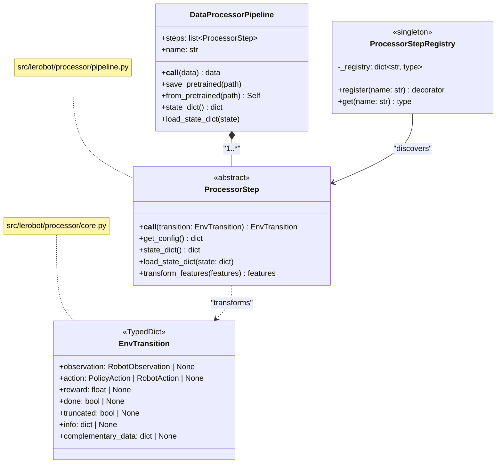
```mermaid
classDiagram
    class ProcessorStep {
        <<abstract>>
        +__call__(transition: EnvTransition) EnvTransition
        +get_config() dict
        +state_dict() dict
        +load_state_dict(state: dict)
        +transform_features(features) features
    }

    class ProcessorStepRegistry {
        <<singleton>>
        -_registry: dict~str, type~
        +register(name: str) decorator
        +get(name: str) type
    }

    class DataProcessorPipeline {
        +steps: list~ProcessorStep~
        +name: str
        +__call__(data) data
        +save_pretrained(path)
        +from_pretrained(path) Self
        +state_dict() dict
        +load_state_dict(state)
    }

    class EnvTransition {
        <<TypedDict>>
        +observation: RobotObservation | None
        +action: PolicyAction | RobotAction | None
        +reward: float | None
        +done: bool | None
        +truncated: bool | None
        +info: dict | None
        +complementary_data: dict | None
    }

    DataProcessorPipeline *-- ProcessorStep : "1..*"
    ProcessorStep ..> EnvTransition : "transforms"
    ProcessorStepRegistry --> ProcessorStep : "discovers"

    note for ProcessorStep "src/lerobot/processor/pipeline.py"
    note for EnvTransition "src/lerobot/processor/core.py"
```

### 5.3 ProcessorStep 实现清单

| Step 类名 | 源文件 | 功能 |
|----------|-------|------|
| `NormalizerProcessorStep` | `normalize_processor.py` | 按 dataset stats 归一化 (MIN_MAX / MEAN_STD) |
| `UnnormalizerProcessorStep` | `normalize_processor.py` | 归一化逆变换 (用于动作输出) |
| `DeviceProcessorStep` | `device_processor.py` | 张量搬移到目标设备 (CPU/GPU) |
| `RenameObservationsProcessorStep` | `rename_processor.py` | 观测键重命名 (dataset key → policy key) |
| `TokenizerProcessorStep` | `tokenizer_processor.py` | 语言指令 tokenization |
| `VanillaObservationProcessorStep` | `observation_processor.py` | 基础观测处理 (直通) |
| `ImageCropResizeProcessorStep` | `observation_processor.py` | 图像裁剪/缩放 |
| `MapDeltaActionToRobotActionStep` | `delta_action_processor.py` | delta 动作→绝对动作 |
| `AddBatchDimensionProcessorStep` | `batch_processor.py` | 添加 batch 维度 |
| `Torch2NumpyActionProcessorStep` | `gym_action_processor.py` | Tensor → ndarray (for Gym) |
| `InterventionActionProcessorStep` | `hil_processor.py` | HIL 人类干预处理 |
| `GripperPenaltyProcessorStep` | `hil_processor.py` | 夹爪惩罚信号 |

### 5.4 三类 Pipeline 桥接不同领域

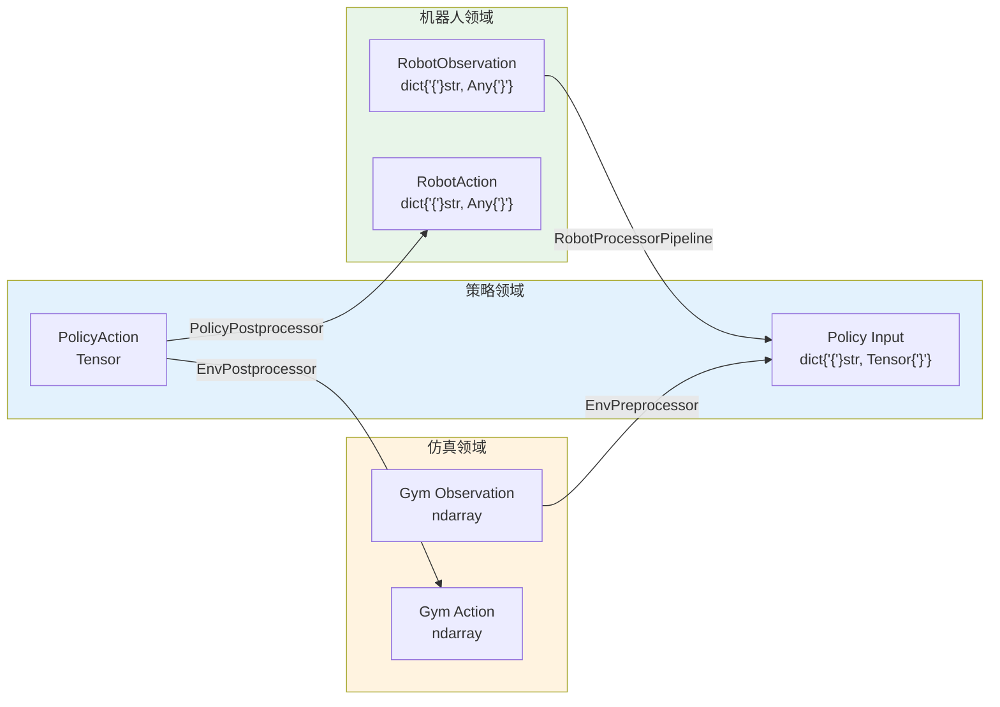
```mermaid
graph LR
    subgraph RobotDomain["机器人领域"]
        RobotObs["RobotObservation<br/>dict{'{'}str, Any{'}'}"]
        RobotAct["RobotAction<br/>dict{'{'}str, Any{'}'}"]
    end

    subgraph PolicyDomain["策略领域"]
        PolicyIn["Policy Input<br/>dict{'{'}str, Tensor{'}'}"]
        PolicyOut["PolicyAction<br/>Tensor"]
    end

    subgraph EnvDomain["仿真领域"]
        EnvObs["Gym Observation<br/>ndarray"]
        EnvAct["Gym Action<br/>ndarray"]
    end

    RobotObs -->|"RobotProcessorPipeline"| PolicyIn
    PolicyOut -->|"PolicyPostprocessor"| RobotAct
    EnvObs -->|"EnvPreprocessor"| PolicyIn
    PolicyOut -->|"EnvPostprocessor"| EnvAct

    style RobotDomain fill:#e8f5e9
    style PolicyDomain fill:#e3f2fd
    style EnvDomain fill:#fff3e0
```

**关键洞察**: LeRobot 的 Processor 将**同一个 policy** 与不同的 I/O 域 (真机 vs 仿真) 连接起来，使策略无需关心数据来源。

### 5.5 Pipeline 执行流

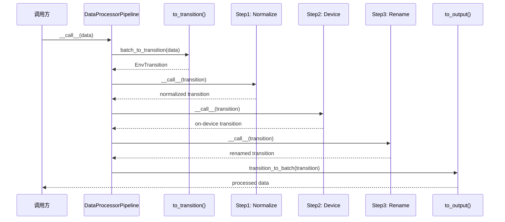
```mermaid
sequenceDiagram
    participant Caller as 调用方
    participant Pipeline as DataProcessorPipeline
    participant Conv as to_transition()
    participant S1 as Step1: Normalize
    participant S2 as Step2: Device
    participant S3 as Step3: Rename
    participant Out as to_output()

    Caller->>Pipeline: __call__(data)
    Pipeline->>Conv: batch_to_transition(data)
    Conv-->>Pipeline: EnvTransition

    Pipeline->>S1: __call__(transition)
    S1-->>Pipeline: normalized transition
    Pipeline->>S2: __call__(transition)
    S2-->>Pipeline: on-device transition
    Pipeline->>S3: __call__(transition)
    S3-->>Pipeline: renamed transition

    Pipeline->>Out: transition_to_batch(transition)
    Out-->>Caller: processed data
```

---

## 6. 策略子系统

### 6.1 PreTrainedPolicy: 统一策略接口

`src/lerobot/policies/pretrained.py` 定义了所有策略的基类。核心抽象方法:

| 方法 | 用途 | 调用时机 |
|------|------|---------|
| `forward(batch)` → `(loss, dict)` | 训练前向传播 | 训练循环 |
| `predict_action_chunk(batch)` → `Tensor` | 预测动作块 | `select_action()` 内部 |
| `select_action(batch)` → `Tensor` | 推理时选择单步动作 | 评估/部署循环 |
| `reset()` | 重置内部缓存 | 每个 episode 开始 |
| `get_optim_params()` → `dict` | 返回优化器参数组 | 构建 optimizer |

### 6.2 策略族谱


```mermaid
classDiagram
    class PreTrainedPolicy {
        <<abstract>>
        +config_class: type
        +name: str
    }

    class ACTPolicy {
        name = "act"
        52M params
        VAE + Transformer
    }
    class DiffusionPolicy {
        name = "diffusion"
        263M params
        UNet + DDPM
    }
    class VQBeTPolicy {
        name = "vqbet"
        VQ-VAE + GPT
    }
    class TDMPCPolicy {
        name = "tdmpc"
        Model Predictive Control
    }
    class PI0Policy {
        name = "pi0"
        3.5B params
        PaliGemma + Flow Matching
    }
    class PI05Policy {
        name = "pi05"
        PaliGemma + ActionExpert
    }
    class SmolVLAPolicy {
        name = "smolvla"
        450M params
        SmolVLM + Flow Matching
    }
    class SACPolicy {
        name = "sac"
        Off-policy RL
    }
    class GrootPolicy {
        name = "groot"
        Eagle2 5VL + Flow
    }
    class XVLAPolicy {
        name = "xvla"
        Florence2 + ActionHub
    }
    class WallXPolicy {
        name = "wall_x"
        Qwen2.5-VL
    }

    PreTrainedPolicy <|-- ACTPolicy
    PreTrainedPolicy <|-- DiffusionPolicy
    PreTrainedPolicy <|-- VQBeTPolicy
    PreTrainedPolicy <|-- TDMPCPolicy
    PreTrainedPolicy <|-- PI0Policy
    PreTrainedPolicy <|-- PI05Policy
    PreTrainedPolicy <|-- SmolVLAPolicy
    PreTrainedPolicy <|-- SACPolicy
    PreTrainedPolicy <|-- GrootPolicy
    PreTrainedPolicy <|-- XVLAPolicy
    PreTrainedPolicy <|-- WallXPolicy
```

### 6.3 策略分类

按**模型规模**与**学习范式**两个维度对策略进行分类:

| 范式 | 单任务 | 多任务/泛化 |
|------|-------|-----------|
| **Imitation Learning (BC)** | ACT (52M), Diffusion (263M), VQ-BeT | SmolVLA (450M), Pi0 (3.5B), Pi0.5 |
| **Vision-Language-Action** | — | SmolVLA, Pi0, XVLA, WallX, GR00T |
| **Reinforcement Learning** | SAC, TDMPC | HIL-SERL (SAC + human intervention) |
| **Reward Model** | SARM | — |

### 6.4 三文件策略范式

每个策略遵循统一的三文件结构，镜像 HuggingFace Transformers 的约定:

```
policies/act/
├── configuration_act.py    # ACTConfig(PreTrainedConfig) — 声明超参数
├── modeling_act.py         # ACTPolicy(PreTrainedPolicy) — 实现模型
└── processor_act.py        # make_act_pre_post_processors() — 定义数据处理
```

### 6.5 Action Chunking 设计

Action Chunking 是现代机器人策略的关键模式。策略一次预测多步动作 (`predict_action_chunk`)，然后逐步执行 (`select_action`):

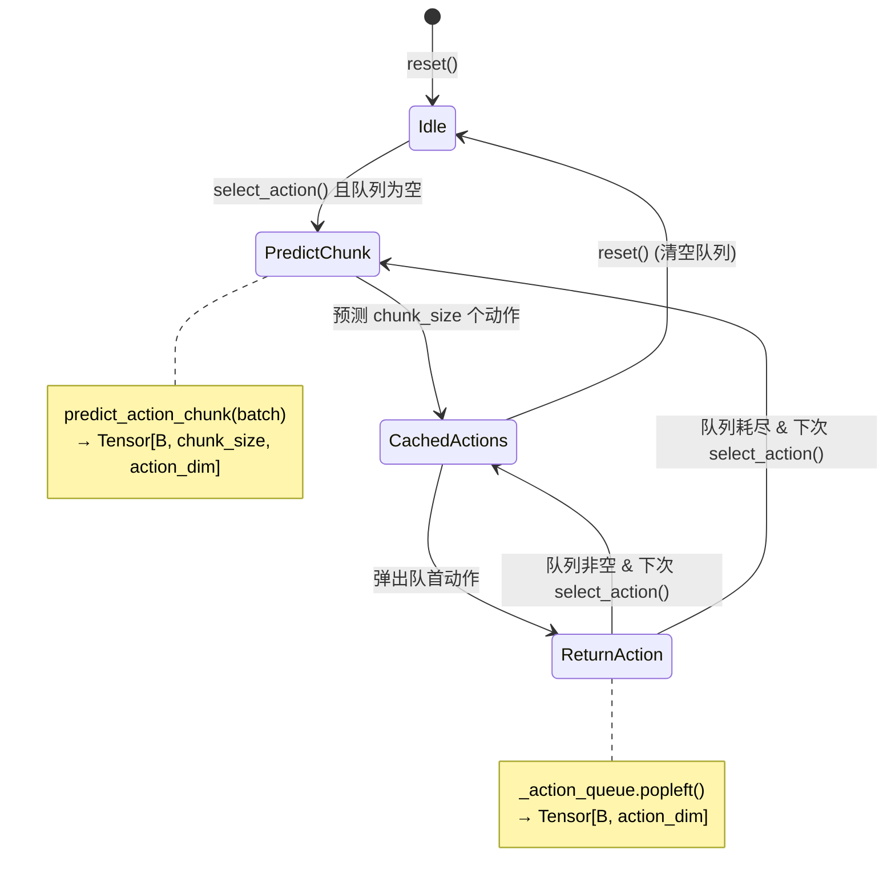
```mermaid
stateDiagram-v2
    [*] --> Idle: reset()

    Idle --> PredictChunk: select_action() 且队列为空
    PredictChunk --> CachedActions: 预测 chunk_size 个动作
    CachedActions --> ReturnAction: 弹出队首动作
    ReturnAction --> CachedActions: 队列非空 & 下次 select_action()
    ReturnAction --> PredictChunk: 队列耗尽 & 下次 select_action()

    CachedActions --> Idle: reset() (清空队列)

    note right of PredictChunk
        predict_action_chunk(batch)
        → Tensor[B, chunk_size, action_dim]
    end note

    note right of ReturnAction
        _action_queue.popleft()
        → Tensor[B, action_dim]
    end note
```

**配置参数** (`PreTrainedConfig`):
- `chunk_size`: 每次预测的动作数量 (例: ACT 默认 100)
- `n_action_steps`: 实际执行的动作步数 (≤ chunk_size)
- `temporal_ensemble_coeff`: 可选的时序集成系数 (重叠 chunk 加权平均)

---

## 7. 硬件抽象子系统

### 7.1 四大硬件抽象接口

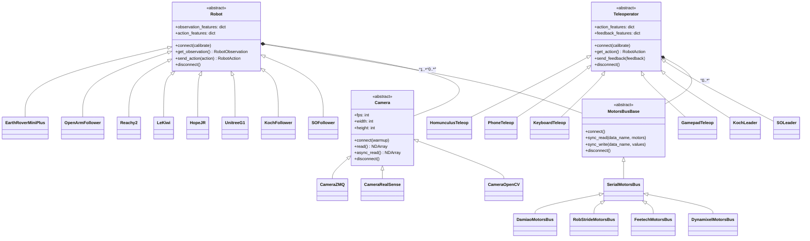
```mermaid
classDiagram
    class Robot {
        <<abstract>>
        +observation_features: dict
        +action_features: dict
        +connect(calibrate)
        +get_observation() RobotObservation
        +send_action(action) RobotAction
        +disconnect()
    }

    class Teleoperator {
        <<abstract>>
        +action_features: dict
        +feedback_features: dict
        +connect(calibrate)
        +get_action() RobotAction
        +send_feedback(feedback)
        +disconnect()
    }

    class Camera {
        <<abstract>>
        +fps: int
        +width: int
        +height: int
        +connect(warmup)
        +read() NDArray
        +async_read() NDArray
        +disconnect()
    }

    class MotorsBusBase {
        <<abstract>>
        +connect()
        +sync_read(data_name, motors)
        +sync_write(data_name, values)
        +disconnect()
    }

    Robot *-- Camera : "0..*"
    Robot *-- MotorsBusBase : "1..*"
    Teleoperator *-- MotorsBusBase : "0..*"

    Robot <|-- SOFollower
    Robot <|-- KochFollower
    Robot <|-- UnitreeG1
    Robot <|-- HopeJR
    Robot <|-- LeKiwi
    Robot <|-- Reachy2
    Robot <|-- OpenArmFollower
    Robot <|-- EarthRoverMiniPlus

    Teleoperator <|-- SOLeader
    Teleoperator <|-- KochLeader
    Teleoperator <|-- GamepadTeleop
    Teleoperator <|-- KeyboardTeleop
    Teleoperator <|-- PhoneTeleop
    Teleoperator <|-- HomunculusTeleop

    Camera <|-- CameraOpenCV
    Camera <|-- CameraRealSense
    Camera <|-- CameraZMQ

    MotorsBusBase <|-- SerialMotorsBus
    SerialMotorsBus <|-- DynamixelMotorsBus
    SerialMotorsBus <|-- FeetechMotorsBus
    SerialMotorsBus <|-- RobStrideMotorsBus
    SerialMotorsBus <|-- DamiaoMotorsBus
```

### 7.2 典型机器人组成

以 SO-100 为例，展示 Robot 如何组合底层硬件:

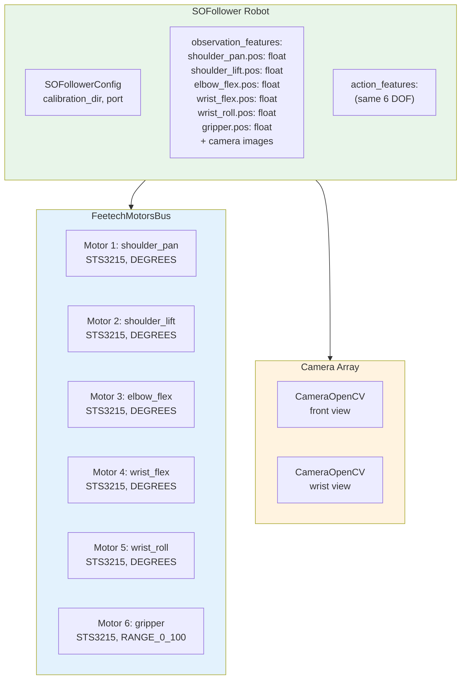
```mermaid
graph TB
    subgraph SOFollower["SOFollower Robot"]
        direction TB
        Config["SOFollowerConfig<br/>calibration_dir, port"]
        ObsFeats["observation_features:<br/>shoulder_pan.pos: float<br/>shoulder_lift.pos: float<br/>elbow_flex.pos: float<br/>wrist_flex.pos: float<br/>wrist_roll.pos: float<br/>gripper.pos: float<br/>+ camera images"]
        ActFeats["action_features:<br/>(same 6 DOF)"]
    end

    subgraph Motors["FeetechMotorsBus"]
        M1["Motor 1: shoulder_pan<br/>STS3215, DEGREES"]
        M2["Motor 2: shoulder_lift<br/>STS3215, DEGREES"]
        M3["Motor 3: elbow_flex<br/>STS3215, DEGREES"]
        M4["Motor 4: wrist_flex<br/>STS3215, DEGREES"]
        M5["Motor 5: wrist_roll<br/>STS3215, DEGREES"]
        M6["Motor 6: gripper<br/>STS3215, RANGE_0_100"]
    end

    subgraph Cameras["Camera Array"]
        Cam1["CameraOpenCV<br/>front view"]
        Cam2["CameraOpenCV<br/>wrist view"]
    end

    SOFollower --> Motors
    SOFollower --> Cameras

    style SOFollower fill:#e8f5e9
    style Motors fill:#e3f2fd
    style Cameras fill:#fff3e0
```

### 7.3 电机归一化流水线

电机子系统 (`SerialMotorsBus`) 的值归一化流程:

```
原始寄存器值 ←→ 有界值 (应用校准偏移和驱动模式) ←→ 归一化值 (DEGREES / RANGE_M100_100 / RANGE_0_100)
```

这保证了不同电机型号 (Dynamixel/Feetech) 和不同分辨率 (0-4095 vs 0-1023) 的电机能以统一的量纲对外呈现。

### 7.4 资源管理: Context Manager 模式

所有硬件接口均实现 `__enter__` / `__exit__` / `__del__`:

```python
# src/lerobot/robots/robot.py
class Robot(abc.ABC):
    def __enter__(self):
        self.connect()
        return self

    def __exit__(self, exc_type, exc_value, traceback):
        self.disconnect()

    def __del__(self):
        try:
            if self.is_connected:
                self.disconnect()
        except Exception:
            pass
```

---

## 8. 环境与仿真子系统

### 8.1 环境配置层级

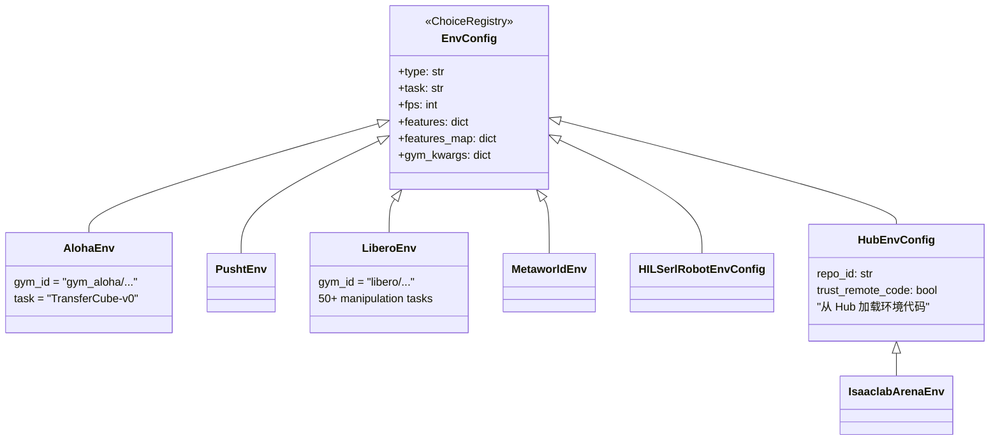
```mermaid
classDiagram
    class EnvConfig {
        <<ChoiceRegistry>>
        +type: str
        +task: str
        +fps: int
        +features: dict
        +features_map: dict
        +gym_kwargs: dict
    }

    EnvConfig <|-- AlohaEnv
    EnvConfig <|-- PushtEnv
    EnvConfig <|-- LiberoEnv
    EnvConfig <|-- MetaworldEnv
    EnvConfig <|-- HILSerlRobotEnvConfig
    EnvConfig <|-- HubEnvConfig

    HubEnvConfig <|-- IsaaclabArenaEnv

    class AlohaEnv {
        gym_id = "gym_aloha/..."
        task = "TransferCube-v0"
    }
    class LiberoEnv {
        gym_id = "libero/..."
        50+ manipulation tasks
    }
    class HubEnvConfig {
        repo_id: str
        trust_remote_code: bool
        "从 Hub 加载环境代码"
    }
```

### 8.2 LeRobot 对仿真的定位

ICLR 论文 Section 4 明确了 LeRobot 的态度: **仿真主要用于系统性评估，而非训练**。原因是 LeRobot 目标的接触丰富 (contact-rich) 任务在仿真中难以精确建模。因此:

- `make_env()` 基于 `gymnasium.make()` 创建向量化环境
- 支持 `gym.vector.SyncVectorEnv` 和 `AsyncVectorEnv`
- 内置 LIBERO (10×4 task suites) 和 MetaWorld (50 tasks) 集成
- 通过 `HubEnvConfig` + `trust_remote_code` 支持 Hub 上的远程环境

---

## 9. 异步推理与 RL 子系统

### 9.1 异步推理架构: 物理 + 逻辑解耦

LeRobot 的推理栈实现了两级解耦:

- **物理解耦**: 推理运行在远程 GPU 机器，控制运行在机器人端
- **逻辑解耦**: 动作预测与动作执行异步并行 (producer-consumer)

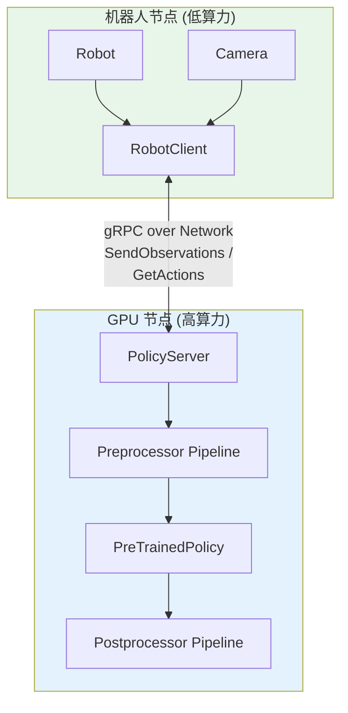
```mermaid
graph TB
    subgraph RobotNode["机器人节点 (低算力)"]
        Robot2["Robot"]
        Camera2["Camera"]
        Client["RobotClient"]

        Robot2 --> Client
        Camera2 --> Client
    end

    subgraph GPUNode["GPU 节点 (高算力)"]
        Server["PolicyServer"]
        Policy2["PreTrainedPolicy"]
        PreProc["Preprocessor Pipeline"]
        PostProc["Postprocessor Pipeline"]

        Server --> PreProc
        PreProc --> Policy2
        Policy2 --> PostProc
    end

    Client <-->|"gRPC over Network<br/>SendObservations /<br/>GetActions"| Server

    style RobotNode fill:#e8f5e9
    style GPUNode fill:#e3f2fd
```

### 9.2 异步推理序列

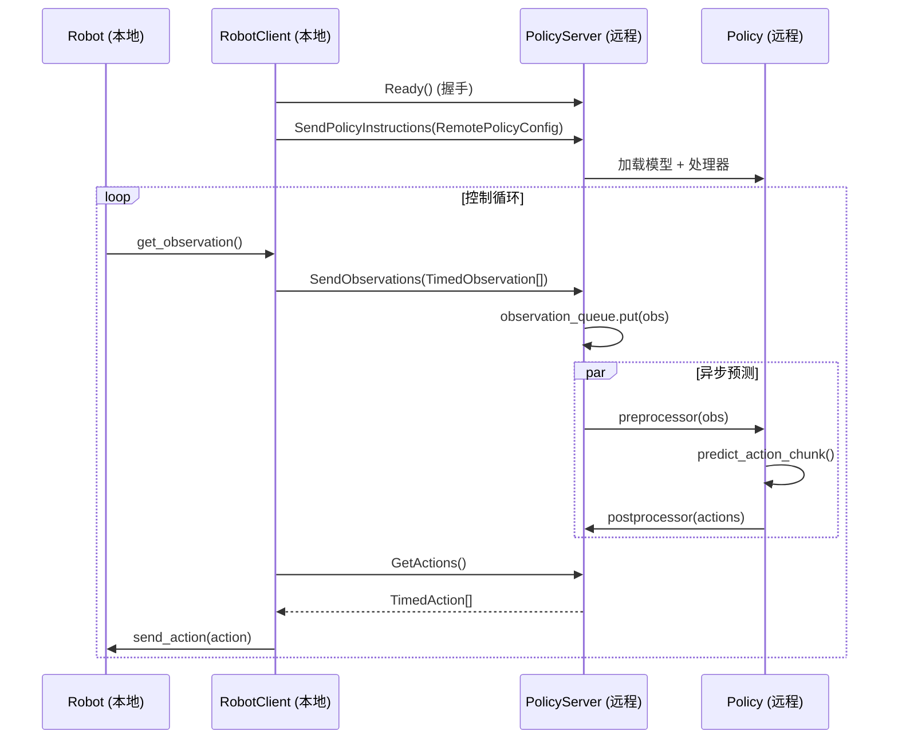
```mermaid
sequenceDiagram
    participant Robot as Robot (本地)
    participant Client as RobotClient (本地)
    participant Server as PolicyServer (远程)
    participant Policy as Policy (远程)

    Client->>Server: Ready() (握手)
    Client->>Server: SendPolicyInstructions(RemotePolicyConfig)
    Server->>Policy: 加载模型 + 处理器

    loop 控制循环
        Robot->>Client: get_observation()
        Client->>Server: SendObservations(TimedObservation[])
        Server->>Server: observation_queue.put(obs)

        par 异步预测
            Server->>Policy: preprocessor(obs)
            Policy->>Policy: predict_action_chunk()
            Policy->>Server: postprocessor(actions)
        end

        Client->>Server: GetActions()
        Server-->>Client: TimedAction[]
        Client->>Robot: send_action(action)
    end
```

### 9.3 在线 RL 子系统

`src/lerobot/rl/` 实现了 Actor-Learner 分离的在线 RL 架构:

| 组件 | 源文件 | 职责 |
|------|-------|------|
| `ActorServer` | `rl/actor.py` | 在机器人端收集经验 (obs → action → reward) |
| `LearnerServer` | `rl/learner.py` | 在 GPU 端更新策略 (buffer → sample → backward) |
| `ReplayBuffer` | `rl/buffer.py` | 存储和采样经验 |
| `GymManipulator` | `rl/gym_manipulator.py` | 将 Robot 包装为 Gym 环境 |

支持 **Human-in-the-Loop (HIL)**: 人类可以通过 gamepad 在训练过程中随时接管控制，提供安全干预。

---

## 10. 设计模式精解

LeRobot 代码库中可以提取出 7 个核心设计模式:

### 模式 1: ChoiceRegistry (配置即工厂)

**意图**: 将配置声明与多态对象创建统一在同一注册表中。

**实现**: `draccus.ChoiceRegistry` 被 `PreTrainedConfig`、`EnvConfig`、`OptimizerConfig`、`RobotConfig`、`CameraConfig` 等使用。

**效果**: CLI 参数 `--policy.type=act` 直接决定实例化哪个配置类，进而决定创建哪个策略对象。

```mermaid
classDiagram
    class ChoiceRegistry {
        <<draccus>>
        +register_subclass(name) decorator
        +get_choice_class(name) type
        +get_known_choices() list
    }

    class PreTrainedConfig {
        <<abstract>>
        +type: str
    }

    ChoiceRegistry <|-- PreTrainedConfig

    PreTrainedConfig <|-- ACTConfig : "@register_subclass('act')"
    PreTrainedConfig <|-- DiffusionConfig : "@register_subclass('diffusion')"
    PreTrainedConfig <|-- SmolVLAConfig : "@register_subclass('smolvla')"
    PreTrainedConfig <|-- PI0Config : "@register_subclass('pi0')"
```

### 模式 2: Pipeline (链式处理)

**意图**: 将数据变换组织为可序列化、可保存的步骤序列。

**实现**: `DataProcessorPipeline` 链接多个 `ProcessorStep`，每一步独立转换 `EnvTransition`。

**效果**: 预处理/后处理逻辑成为可版本化的 artifact，与模型权重一起保存到 Hub。

### 模式 3: Feature Contract (语义化特征契约)

**意图**: 用类型化的特征描述替代硬编码 shape 匹配。

**实现**: `FeatureType` 枚举 + `PolicyFeature` 数据类。

**效果**: `dataset_to_policy_features()` 和 `env_to_policy_features()` 自动将 dataset/env 的特征映射到 policy 期望的输入/输出。

### 模式 4: Hub-Native Artifact (仓库化制品)

**意图**: 让所有核心对象都能原生地保存/加载/推送到 HuggingFace Hub。

**实现**: `HubMixin` 提供 `save_pretrained()` / `from_pretrained()` / `push_to_hub()`。

**效果**: Policy、Processor、Config、Dataset 都是可共享的 Hub artifact。

### 模式 5: 三文件策略范式 (Template Method)

**意图**: 为每个策略提供统一的文件组织结构。

**实现**: `configuration_*.py` + `modeling_*.py` + `processor_*.py`。

**效果**: 降低添加新策略的认知负担，与 HuggingFace Transformers 生态保持一致。

### 模式 6: 同构控制环 (Unified Control Loop)

**意图**: record、replay、deploy 共享相同的 `get_observation → process → decide → process → send_action` 循环结构。

**实现**: `lerobot_record.py` 中的控制循环既支持遥操作模式也支持 policy 模式。

**效果**: 从采集到部署，用户的心智模型保持一致。

### 模式 7: Buffered Producer-Consumer (Action Chunking)

**意图**: `predict_action_chunk()` 一次性生产多步动作，`select_action()` 逐步消费。

**实现**: `deque` 或自定义 `ActionQueue` 缓存预测结果。

**效果**: 减少推理频率，提高控制连续性，支持异步推理的逻辑解耦。

---

## 11. 核心数据流全解析

### 11.1 数据采集流

```mermaid
sequenceDiagram
    participant User as 操作员
    participant Teleop as Teleoperator
    participant Robot as Robot
    participant RobProc as RobotProcessor
    participant Dataset as LeRobotDataset

    Note over User,Dataset: lerobot_record.py 控制循环

    loop 每个时间步 (fps Hz)
        Robot->>Robot: get_observation()
        Robot-->>RobProc: RobotObservation

        alt 遥操作模式
            User->>Teleop: 操控 leader 臂
            Teleop->>Teleop: get_action()
            Teleop-->>RobProc: RobotAction
        else 策略模式
            RobProc->>RobProc: preprocessor(obs)
            RobProc->>RobProc: policy.select_action()
            RobProc->>RobProc: postprocessor(action)
        end

        RobProc->>Robot: send_action(action)
        RobProc->>Dataset: add_frame(obs + action)
    end

    Dataset->>Dataset: save_episode()
    Dataset->>Dataset: push_to_hub()
```

### 11.2 离线训练流

```mermaid
sequenceDiagram
    participant Script as lerobot_train.py
    participant DL as DataLoader
    participant Pre as Preprocessor
    participant Policy as Policy
    participant Opt as Optimizer
    participant Eval as eval_policy_all

    Script->>Script: make_dataset(cfg)
    Script->>Script: make_policy(cfg, ds_meta)
    Script->>Script: make_pre_post_processors(cfg)
    Script->>Script: make_optimizer_and_scheduler(cfg, policy)

    loop steps = 1..100_000
        DL->>Pre: next batch
        Pre->>Policy: preprocessed batch

        Policy->>Policy: forward(batch)
        Policy-->>Opt: (loss, output_dict)

        Opt->>Opt: accelerator.backward(loss)
        Opt->>Opt: clip_grad_norm_()
        Opt->>Opt: optimizer.step()
        Opt->>Opt: lr_scheduler.step()

        alt step % eval_freq == 0
            Script->>Eval: 在仿真环境中评估
            Eval-->>Script: success_rate, metrics
        end

        alt step % save_freq == 0
            Script->>Script: save checkpoint
        end
    end
```

### 11.3 仿真评估流

```mermaid
sequenceDiagram
    participant Env as VectorEnv
    participant EPre as EnvPreprocessor
    participant PPre as PolicyPreprocessor
    participant Policy as Policy
    participant PPost as PolicyPostprocessor
    participant EPost as EnvPostprocessor

    Env->>Env: reset(seed)

    loop 直到所有 episodes 完成
        Env-->>EPre: observation (ndarray)
        EPre->>PPre: EnvTransition
        PPre->>Policy: normalized batch

        Policy->>Policy: select_action(batch)
        Policy-->>PPost: PolicyAction (Tensor)

        PPost->>EPost: denormalized action
        EPost->>Env: step(action_ndarray)
        Env-->>Env: reward, done, info
    end

    Note over Env,EPost: 双层处理器设计:<br/>Env⇔LeRobot格式 (EPre/EPost)<br/>LeRobot格式⇔Policy格式 (PPre/PPost)
```

### 11.4 系统全局数据流

```mermaid
graph TB
    subgraph Input["数据输入"]
        HW["物理硬件<br/>Robot + Camera"]
        SimEnv["仿真环境<br/>LIBERO / MetaWorld"]
        HubDS["Hub 数据集<br/>lerobot/pusht"]
    end

    subgraph Core["核心处理"]
        DS["LeRobotDataset"]
        PreProc["Preprocessor<br/>Pipeline"]
        Policy["PreTrainedPolicy"]
        PostProc["Postprocessor<br/>Pipeline"]
    end

    subgraph Output["输出"]
        MotorCmd["电机指令"]
        SimAction["仿真动作"]
        Metrics["评估指标"]
        HubModel["Hub 模型"]
    end

    HW -->|"get_observation()"| DS
    SimEnv -->|"env.reset()/step()"| PreProc
    HubDS -->|"DataLoader"| PreProc

    DS -->|"__getitem__"| PreProc
    PreProc --> Policy
    Policy --> PostProc

    PostProc -->|"send_action()"| MotorCmd
    PostProc -->|"env.step()"| SimAction
    Policy -->|"loss metrics"| Metrics
    Policy -->|"save_pretrained()"| HubModel

    style Core fill:#f5f5f5,stroke:#333,stroke-width:2px
```

---

## 12. 扩展机制指南

### 12.1 扩展决策树

```mermaid
graph TD
    Start["需要扩展 LeRobot?"] --> Q1{"要添加什么?"}

    Q1 -->|"新策略"| P["三文件范式"]
    Q1 -->|"新机器人"| R["Robot ABC 实现"]
    Q1 -->|"新处理器"| S["ProcessorStep 注册"]
    Q1 -->|"新环境"| E["EnvConfig 注册"]
    Q1 -->|"外部包"| Plugin["Plugin 机制"]

    P --> P1["1. configuration_mypolicy.py<br/>@PreTrainedConfig.register_subclass()"]
    P --> P2["2. modeling_mypolicy.py<br/>class MyPolicy(PreTrainedPolicy)"]
    P --> P3["3. processor_mypolicy.py<br/>make_mypolicy_pre_post_processors()"]
    P --> P4["4. factory.py 中添加导入"]

    R --> R1["1. config_myrobot.py<br/>@RobotConfig.register_subclass()"]
    R --> R2["2. myrobot.py<br/>class MyRobot(Robot)"]
    R --> R3["3. 实现 observation/action_features"]

    S --> S1["@ProcessorStepRegistry.register()"]
    S --> S2["实现 __call__(transition)"]

    E --> E1["@EnvConfig.register_subclass()"]

    Plugin --> PL1["包名: lerobot_policy_xxx"]
    Plugin --> PL2["pip install 后自动发现"]

    style Start fill:#ffebee
    style P fill:#e3f2fd
    style R fill:#e8f5e9
    style S fill:#fff3e0
    style E fill:#f3e5f5
    style Plugin fill:#fce4ec
```

### 12.2 添加新策略: 完整流程

**Step 1: 配置声明**

```python
# src/lerobot/policies/mypolicy/configuration_mypolicy.py
@PreTrainedConfig.register_subclass("mypolicy")
@dataclass
class MyPolicyConfig(PreTrainedConfig):
    hidden_dim: int = 256
    num_layers: int = 4

    def get_optimizer_preset(self) -> OptimizerConfig:
        return AdamWConfig(lr=1e-4, weight_decay=1e-4)

    def get_scheduler_preset(self) -> LRSchedulerConfig | None:
        return DiffuserSchedulerConfig(name="cosine", num_warmup_steps=500)
```

**Step 2: 模型实现**

```python
# src/lerobot/policies/mypolicy/modeling_mypolicy.py
class MyPolicy(PreTrainedPolicy):
    config_class = MyPolicyConfig
    name = "mypolicy"

    def forward(self, batch):
        # 训练前向，返回 (loss, info_dict)
        ...

    def predict_action_chunk(self, batch):
        # 推理预测动作块
        ...

    def select_action(self, batch):
        if len(self._action_queue) == 0:
            actions = self.predict_action_chunk(batch)
            self._action_queue.extend(actions.transpose(0, 1))
        return self._action_queue.popleft()
```

**Step 3: 在工厂中注册**

```python
# src/lerobot/policies/factory.py 的 get_policy_class() 中添加:
elif name == "mypolicy":
    from lerobot.policies.mypolicy.modeling_mypolicy import MyPolicy
    return MyPolicy
```

### 12.3 添加新机器人: 完整流程

1. 在 `src/lerobot/robots/myrobot/` 下创建 `config.py` 和 `myrobot.py`
2. 继承 `RobotConfig` 并 `@RobotConfig.register_subclass("myrobot")`
3. 继承 `Robot` 并实现所有抽象方法
4. 核心是定义 `observation_features` 和 `action_features` — 这是 Robot 与 Dataset/Policy 之间的**软件契约**

### 12.4 第三方插件开发

只需创建一个名为 `lerobot_policy_myext` 的 pip 包:

```python
# lerobot_policy_myext/__init__.py
from lerobot.configs.policies import PreTrainedConfig

@PreTrainedConfig.register_subclass("myext")
@dataclass
class MyExtConfig(PreTrainedConfig):
    ...
```

安装后，`register_third_party_plugins()` 自动发现并注册。

---

## 13. 与替代方案的架构对比

| 维度 | **LeRobot** | **robomimic** | **RLDS/Open X** | **OpenPI** | **ROS2** |
|------|------------|--------------|----------------|-----------|---------|
| **核心抽象** | 工作流 (全栈) | 训练框架 | 数据格式 | 模型 (Pi0) | 中间件 |
| **数据格式** | LeRobotDataset v3 (Parquet+MP4) | HDF5 | TFDS (TFRecord) | 自定义 | rosbag |
| **策略接口** | PreTrainedPolicy (ABC) | 无统一接口 | 无 | Pi0 实现 | 无 |
| **硬件支持** | 内置 8+ 机器人 | 无 | 无 | 无 | 全面 |
| **推理部署** | gRPC 异步推理 | 无 | 无 | JAX serving | DDS 通信 |
| **Hub 生态** | HuggingFace Hub 原生 | 无 | Google Cloud | 无 | 无 |
| **配置系统** | draccus ChoiceRegistry | JSON/YAML | 无 | 命令行 | launch XML |
| **可扩展性** | 插件自动发现 | Fork 修改 | 自定义 builder | Fork 修改 | 节点/包 |
| **学习范式** | BC + RL + VLA | BC 为主 | 无训练功能 | BC (Flow Matching) | 无 |
| **产业定位** | 研究→低成本部署 | 纯研究 | 数据共享 | 纯研究 | 工业部署 |

**关键差异**: LeRobot 是唯一同时覆盖**硬件接入 + 数据管理 + 多范式训练 + 优化推理 + Hub 共享**的垂直整合框架。其他方案各自覆盖上述环节中的 1-2 个。

---

## 14. 优化器与训练子系统

### 14.1 优化器配置

```python
# src/lerobot/optim/optimizers.py
class OptimizerConfig(draccus.ChoiceRegistry, abc.ABC):
    lr: float
    weight_decay: float
    grad_clip_norm: float

    @abstractmethod
    def build(self, params) -> Optimizer: ...

# 内置选项:
# AdamConfig(lr=1e-3, betas=(0.9, 0.999), eps=1e-8)
# AdamWConfig(lr=1e-3, weight_decay=0.01)
# SGDConfig(lr=1e-2, momentum=0.9)
```

### 14.2 策略 Preset 机制

每个策略配置可声明自己推荐的优化器和调度器:

```python
class ACTConfig(PreTrainedConfig):
    def get_optimizer_preset(self):
        return AdamWConfig(lr=1e-5, weight_decay=1e-4, grad_clip_norm=10)

    def get_scheduler_preset(self):
        return None  # ACT 不需要 LR scheduler
```

当 `use_policy_training_preset=True` (默认) 时，训练脚本自动使用策略推荐的超参数。

### 14.3 混合精度与多 GPU

- **AMP**: 通过 `PreTrainedConfig.use_amp` 启用，`Accelerator.autocast()` 包裹前向传播
- **DDP**: 通过 HuggingFace `Accelerate` 实现，`find_unused_parameters=True` 支持条件计算路径
- **PEFT**: 通过 `policy.wrap_with_peft(peft_config)` 启用 LoRA/MISS 等参数高效微调

### 14.4 RA-BC: Reward-Aligned Behavior Cloning

训练脚本支持 RA-BC，通过预计算的 SARM 进度分数对 batch 中的样本加权:

```python
# src/lerobot/scripts/lerobot_train.py
if rabc_batch_weights is not None:
    per_sample_loss, _ = policy.forward(batch, reduction="none")
    loss = (per_sample_loss * rabc_batch_weights).sum() / (rabc_batch_weights.sum() + eps)
```

---

## 15. 实践指南与架构决策记录

### 15.1 ADR-1: 为什么选择 draccus 而非 Hydra/OmegaConf

| 考量 | draccus | Hydra |
|------|---------|-------|
| 类型安全 | 原生 dataclass，静态类型 | YAML 动态，运行时检查 |
| 多态 | ChoiceRegistry 内置 | structured config 插件 |
| 序列化 | JSON 原生 | YAML |
| 与 Hub 集成 | HubMixin 兼容 | 需额外适配 |
| 学习成本 | 中等 | 较高 (composition, override 语法) |

**结论**: draccus 的 ChoiceRegistry 天然适配 LeRobot "配置即工厂" 的设计，且 JSON 序列化与 HuggingFace Hub 的 config.json 约定一致。

### 15.2 ADR-2: 为什么 Processor 是一等 Artifact

**问题**: 许多框架将归一化参数嵌入模型或训练脚本，导致推理时需要手动重建相同的预处理逻辑。

**决策**: 将 `DataProcessorPipeline` 设计为可独立 `save_pretrained()` / `from_pretrained()` 的 artifact。

**后果**:
- 正面: 模型部署时只需 `policy.from_pretrained() + preprocessor.from_pretrained() + postprocessor.from_pretrained()`，完全自包含
- 正面: 同一 policy 可搭配不同 processor (真机 vs 仿真)
- 负面: 增加了概念复杂度，用户需要理解 "模型 + 处理器" 的二元结构

### 15.3 ADR-3: 为什么 Parquet + MP4 而非 HDF5

| 考量 | Parquet + MP4 | HDF5 |
|------|-------------|------|
| 流式读取 | 原生支持 (Arrow) | 不支持 |
| 视频压缩 | H.264/H.265 高压缩比 | 原始帧或自定义压缩 |
| Hub 兼容 | HuggingFace Datasets 原生 | 需适配层 |
| 列式查询 | 按列读取 (不加载全部列) | 需手动选择 |
| 生态 | Arrow, Pandas, Polars | 专用 API |

**结论**: Parquet + MP4 在大规模数据集的**流式消费**和**选择性加载**上显著优于 HDF5。

### 15.4 ADR-4: 为什么 gRPC + pickle 用于异步推理

**权衡**: pickle 序列化灵活但不安全、不可跨语言。gRPC + Protobuf 类型安全但 schema 管理成本高。

**决策**: 观测/动作 payload 用 pickle (灵活性优先)，RPC 框架用 gRPC (连接管理/流式传输)。

**适用前提**: PolicyServer 和 RobotClient 均为可信的同一组织内部部署。

### 15.5 ADR-5: 为什么用 FeatureType 语义类型而非 shape 匹配

**问题**: 不同策略期望不同的输入键名和归一化方式，但数据的**语义**是相同的 (如 "关节角度" vs "observation.state")。

**决策**: 用 `FeatureType.STATE` / `VISUAL` / `ACTION` 等语义枚举标注特征类型，让工厂函数 `dataset_to_policy_features()` 自动做键名映射和归一化方式推断。

**效果**: 新策略只需声明 "我需要 STATE 和 VISUAL 类型的输入"，无需硬编码 dataset 的具体键名。

### 15.6 从零开始的部署路线图

```mermaid
journey
    title 从零到部署: LeRobot 用户旅程
    section 硬件准备
      购买机器人套件 (SO-101, ~225 EUR): 5: 工程师
      3D 打印结构件: 3: 工程师
      组装并接线: 4: 工程师
    section 软件准备
      pip install lerobot: 5: 研究员
      lerobot-calibrate: 4: 工程师
      lerobot-find-cameras: 5: 工程师
    section 数据采集
      lerobot-teleoperate (测试): 4: 工程师
      lerobot-record (50 episodes): 3: 操作员
      检查数据集质量: 4: 研究员
    section 模型训练
      lerobot-train --policy.type=act: 5: 研究员
      WandB 监控训练曲线: 4: 研究员
      仿真评估 (可选): 3: 研究员
    section 部署
      加载 checkpoint 真机测试: 4: 工程师
      微调 (可选): 3: 研究员
      异步推理部署 (可选): 3: 工程师
```

---

## 16. 代码质量与工程实践

### 16.1 测试策略

LeRobot 采用多级测试策略:

| 测试级别 | 位置 | 内容 |
|---------|------|------|
| 单元测试 | `tests/` | Processor step、config 序列化、特征推断 |
| 集成测试 | `tests/` | Dataset 加载、policy 前向传播 |
| 端到端测试 | `Makefile` | `test-act-ete-train` 等，完整训练+评估 |
| 设备测试 | `DEVICE` 环境变量 | CPU/CUDA 切换 |

```bash
# 端到端测试示例 (Makefile)
make test-act-ete-train DEVICE=cpu
# 等价于: lerobot-train --policy.type=act --batch_size=2 --steps=4 ...
```

### 16.2 类型安全

- `TypedDict` 用于 `EnvTransition`，提供结构化字典的类型检查
- `Generic[TInput, TOutput]` 用于 `PolicyProcessorPipeline`
- `abc.ABC` + `@abstractmethod` 强制接口实现
- MyPy 逐步启用 (`envs`, `configs`, `optim`, `model`, `cameras`, `motors`, `transport`)

### 16.3 已知技术债

| 技术债 | 位置 | 影响 |
|-------|------|------|
| `MultiLeRobotDataset` 被禁用 | `datasets/lerobot_dataset.py` | 无法混合多数据集训练 |
| `factory.py` 静态 if-elif 分发 | `policies/factory.py` | 添加新策略需修改核心文件 |
| `__init__.py` 中 `available_policies` 硬编码 | `__init__.py` | 与实际注册的策略可能不同步 |

---

## 17. 总结与展望

### 17.1 架构优势总结

1. **垂直整合**: 唯一覆盖从电机控制到 Hub 分发全栈的机器人学习框架
2. **Processor 一等公民**: 解决了机器人学习可复现性的关键瓶颈
3. **声明式配置**: ChoiceRegistry 让策略/机器人/环境的切换成为一行 CLI 参数
4. **Hub-Native**: 数据集和模型作为标准化资产流转，社区已贡献 16K+ 数据集
5. **物理+逻辑推理解耦**: 适应从嵌入式到云端的多种部署拓扑

### 17.2 架构局限

1. **抽象复杂度**: Processor Pipeline + ChoiceRegistry + Factory + FeatureType 的多层抽象增加了学习曲线
2. **硬件覆盖有限**: 8 类机器人 vs 工业界数百种平台
3. **缺少低级优化**: 量化、图编译、TensorRT 等推理优化尚未集成
4. **仿真薄弱**: 仿真定位为 "评估工具" 而非 "训练环境"，限制了 sim-to-real 流程
5. **工厂静态分发**: `get_policy_class()` 使用 if-elif 而非注册表查找

### 17.3 LeRobot 对机器人学习基础设施的贡献

从软件工程视角看，LeRobot 的最大贡献不在于任何单一算法，而在于**证明了机器人学习可以像 NLP/CV 那样拥有统一的工程基础设施**。它用 `LeRobotDataset` 统一了数据资产，用 `PreTrainedPolicy` 统一了策略接口，用 `ProcessorPipeline` 统一了数据变换语义，用 Hub 统一了分发和协作。这套基础设施正在被越来越多的研究者和工程师采用 — 从论文复现到真实产品原型。

### 17.4 演进方向预测

- 更多硬件平台集成 (人形机器人、灵巧手)
- 推理优化集成 (量化、编译)
- MultiLeRobotDataset 重新启用 (大规模混合训练)
- 更强的仿真集成 (MuJoCo/Isaac Lab 深度适配)
- 社区驱动的策略插件生态

---

## 附录 A: 源码文件索引

| 模块 | 关键文件 | 行数 | 核心类/函数 |
|------|---------|------|-----------|
| **configs** | `configs/train.py` | ~100 | `TrainPipelineConfig` |
| | `configs/policies.py` | ~430 | `PreTrainedConfig` |
| | `configs/types.py` | ~53 | `FeatureType`, `PolicyFeature`, `NormalizationMode` |
| | `configs/default.py` | ~200 | `DatasetConfig`, `EvalConfig`, `WandBConfig` |
| | `configs/parser.py` | ~100 | CLI 解析封装 |
| **policies** | `policies/pretrained.py` | ~430 | `PreTrainedPolicy` |
| | `policies/factory.py` | ~500 | `get_policy_class()`, `make_policy()`, `make_pre_post_processors()` |
| | `policies/act/` | ~3 files | `ACTConfig`, `ACTPolicy` |
| | `policies/diffusion/` | ~3 files | `DiffusionConfig`, `DiffusionPolicy` |
| | `policies/smolvla/` | ~4 files | `SmolVLAConfig`, `SmolVLAPolicy` |
| | `policies/pi0/` | ~3 files | `PI0Config`, `PI0Policy` |
| **datasets** | `datasets/lerobot_dataset.py` | ~1900 | `LeRobotDataset`, `LeRobotDatasetMetadata` |
| | `datasets/streaming_dataset.py` | ~300 | `StreamingLeRobotDataset` |
| | `datasets/factory.py` | ~134 | `make_dataset()` |
| | `datasets/compute_stats.py` | ~200 | `compute_episode_stats()`, `aggregate_stats()` |
| | `datasets/video_utils.py` | ~400 | `StreamingVideoEncoder`, `decode_video_frames()` |
| **processor** | `processor/pipeline.py` | ~1716 | `ProcessorStep`, `DataProcessorPipeline` |
| | `processor/core.py` | ~57 | `EnvTransition`, `TransitionKey` |
| | `processor/normalize_processor.py` | ~200 | `NormalizerProcessorStep` |
| **robots** | `robots/robot.py` | ~212 | `Robot` (ABC) |
| | `robots/config.py` | ~50 | `RobotConfig` |
| **teleoperators** | `teleoperators/teleoperator.py` | ~150 | `Teleoperator` (ABC) |
| **cameras** | `cameras/camera.py` | ~100 | `Camera` (ABC) |
| **motors** | `motors/motors_bus.py` | ~1281 | `SerialMotorsBus` |
| **envs** | `envs/configs.py` | ~100 | `EnvConfig` |
| | `envs/factory.py` | ~100 | `make_env()` |
| **async_inference** | `async_inference/policy_server.py` | ~300 | `PolicyServer` |
| | `async_inference/robot_client.py` | ~200 | `RobotClient` |
| **rl** | `rl/actor.py` | ~200 | `ActorServer` |
| | `rl/learner.py` | ~300 | `LearnerServer` |
| **optim** | `optim/optimizers.py` | ~400 | `OptimizerConfig`, `AdamConfig` |
| | `optim/schedulers.py` | ~200 | `LRSchedulerConfig` |
| **scripts** | `scripts/lerobot_train.py` | ~600 | `train()`, `update_policy()` |
| | `scripts/lerobot_eval.py` | ~1000 | `eval()`, `rollout()` |
| | `scripts/lerobot_record.py` | ~500 | `record()` |

---

## 附录 B: 图索引

| 编号 | 章节 | 类型 | 描述 |
|------|------|------|------|
| 图 0.1 | 0.3 | mindmap | 文档结构总览 |
| 图 1.1 | 1.2 | flowchart | LeRobot 在产业链中的位置 |
| 图 1.2 | 1.3 | flowchart | 系统上下文 (C4 风格) |
| 图 2.1 | 2.1 | classDiagram | 四核心对象模型 |
| 图 2.2 | 2.2 | flowchart | 三条运行闭环 |
| 图 2.3 | 2.3 | flowchart | 七层架构模型 (主图) |
| 图 3.1 | 3.2 | classDiagram | 配置层级 |
| 图 3.2 | 3.3 | sequenceDiagram | 配置生命周期 |
| 图 4.1 | 4.1 | erDiagram | LeRobotDataset 结构 |
| 图 4.2 | 4.4 | flowchart | 数据集生命周期 |
| 图 5.1 | 5.2 | classDiagram | 处理器核心抽象 |
| 图 5.2 | 5.4 | flowchart | 三类 Pipeline 桥接 |
| 图 5.3 | 5.5 | sequenceDiagram | Pipeline 执行流 |
| 图 6.1 | 6.2 | classDiagram | 策略族谱 |
| 图 6.2 | 6.5 | stateDiagram | Action Chunking 状态机 |
| 图 7.1 | 7.1 | classDiagram | 硬件抽象层级 |
| 图 7.2 | 7.2 | flowchart | 典型机器人组成 |
| 图 8.1 | 8.1 | classDiagram | 环境配置层级 |
| 图 9.1 | 9.1 | flowchart | 异步推理部署拓扑 |
| 图 9.2 | 9.2 | sequenceDiagram | 异步推理序列 |
| 图 10.1 | 10 | classDiagram | ChoiceRegistry 模式结构 |
| 图 11.1 | 11.1 | sequenceDiagram | 数据采集流 |
| 图 11.2 | 11.2 | sequenceDiagram | 离线训练流 |
| 图 11.3 | 11.3 | sequenceDiagram | 仿真评估流 |
| 图 11.4 | 11.4 | flowchart | 系统全局数据流 |
| 图 12.1 | 12.1 | flowchart | 扩展决策树 |
| 图 15.1 | 15.6 | journey | 用户旅程图 |

共计 **27 个 mermaid 图**，覆盖 classDiagram、sequenceDiagram、flowchart、erDiagram、stateDiagram、mindmap、journey 等 7 种图表类型。

---

## 附录 C: 术语表

| 术语 | 定义 |
|------|------|
| **Action Chunking** | 策略一次预测多步动作序列，逐步执行。减少推理频率，提高控制连续性 |
| **ChoiceRegistry** | draccus 提供的注册表模式，将 dataclass 配置与多态实例化绑定 |
| **Delta Timestamps** | LeRobotDataset 中的时间窗口机制，允许在一次 `__getitem__` 中获取多时间步的数据 |
| **EnvTransition** | TypedDict，统一表示一个环境/机器人交互步的所有信息 (obs, action, reward, done, ...) |
| **FeatureType** | 枚举类型 (STATE, VISUAL, ENV, ACTION, REWARD, LANGUAGE)，标注特征的语义类别 |
| **HubMixin** | HuggingFace 的 mixin 类，提供 `save_pretrained` / `from_pretrained` / `push_to_hub` 方法 |
| **PolicyFeature** | dataclass，绑定 `FeatureType` 和 `shape`，描述策略的输入/输出特征规格 |
| **ProcessorPipeline** | 由多个 `ProcessorStep` 组成的序列化变换链，可保存/加载/推送到 Hub |
| **ProcessorStep** | 单个数据变换步骤的抽象基类，操作 `EnvTransition` 并可携带可学习状态 |
| **PreTrainedPolicy** | 所有策略的抽象基类 (`nn.Module` + `HubMixin` + `ABC`) |
| **PreTrainedConfig** | 所有策略配置的抽象基类 (`ChoiceRegistry` + `HubMixin` + `ABC`) |
| **RA-BC** | Reward-Aligned Behavior Cloning，使用 SARM 进度分数对样本加权的训练方法 |
| **RobotObservation** | `dict[str, Any]`，机器人观测的统一类型别名 |
| **RobotAction** | `dict[str, Any]`，机器人动作的统一类型别名 |
| **SerialMotorsBus** | 串行电机总线的通用实现，支持 Dynamixel、Feetech 等多种协议 |
| **StreamingLeRobotDataset** | 基于 `IterableDataset` 的流式数据集，按需从 Hub 加载帧 |
| **Vertical Integration** | LeRobot 的核心设计理念：从硬件控制到 Hub 分发的全栈统一 |

---

> **文档版本**: 1.0 | **基于 LeRobot**: v0.5.1 | **分析方法**: 源码逐文件分析 + ICLR 2026 论文 + HuggingFace 官方文档
>
> **源码基线**: `src/lerobot/` (~50+ 模块, ~20K+ 行核心代码)
