# LeRobot v0.5.1 完整技术架构参考手册

**基于源码、ICLR 2026 论文与产业实践的多视角深度解析**

> **版本**: LeRobot v0.5.1 | **论文**: ICLR 2026 (arXiv:2602.22818) | **分析日期**: 2026-04-15
>
> **代码库路径**: `src/lerobot/` | **配置框架**: draccus v0.10.0 | **运行时**: PyTorch 2.2–2.11

---

## 目录

- [Part I: 定位与全局架构](#part-i-定位与全局架构)
  - [0. 阅读指南](#0-阅读指南)
  - [1. 产业背景与项目定位](#1-产业背景与项目定位)
  - [2. 总体架构概览](#2-总体架构概览)
- [Part II: 子系统深潜](#part-ii-子系统深潜)
  - [3. 配置与扩展子系统](#3-配置与扩展子系统)
  - [4. 数据资产子系统](#4-数据资产子系统)
  - [5. 处理器子系统](#5-处理器子系统)
  - [6. 策略子系统](#6-策略子系统)
  - [7. 硬件抽象子系统](#7-硬件抽象子系统)
  - [8. 环境与仿真子系统](#8-环境与仿真子系统)
    - [8.3 Sim-2-Real 设计哲学](#83-sim-2-real-设计哲学-为何评估优先)
    - [8.4 观测桥接: features_map](#84-观测桥接-features_map-的-sim-real-统一)
    - [8.5 双层处理器管线: 域适配架构](#85-双层处理器管线-域适配架构)
    - [8.6 GymManipulator: 真机即仿真环境](#86-gymmanipulator-真机即仿真环境)
    - [8.7 图像增强: 弱域随机化](#87-图像增强-弱域随机化)
    - [8.8 Sim-2-Real 能力缺口与扩展路径](#88-sim-2-real-能力缺口与扩展路径)
  - [9. 异步推理与 RL 子系统](#9-异步推理与-rl-子系统)
  - [10. 训练与优化子系统](#10-训练与优化子系统)
  - [11. CLI 与编排层](#11-cli-与编排层)
- [Part III: 横切架构关注点](#part-iii-横切架构关注点)
  - [12. 设计模式目录](#12-设计模式目录)
  - [13. 核心数据流全解析](#13-核心数据流全解析)
  - [14. 扩展机制指南](#14-扩展机制指南)
  - [15. 依赖架构](#15-依赖架构)
  - [16. 安全架构分析](#16-安全架构分析)
  - [17. 性能架构](#17-性能架构)
  - [18. 错误处理与容错架构](#18-错误处理与容错架构)
- [Part IV: 运维架构](#part-iv-运维架构)
  - [19. 部署拓扑](#19-部署拓扑)
  - [20. 测试架构](#20-测试架构)
  - [21. 可观测性架构](#21-可观测性架构)
  - [22. 与 ROS2 的架构对比](#22-与-ros2-的架构对比)
- [Part V: 架构决策与演进](#part-v-架构决策与演进)
  - [23. 架构决策记录 (ADR)](#23-架构决策记录-adr)
  - [24. 实践指南与用户旅程](#24-实践指南与用户旅程)
  - [25. 代码质量与技术债](#25-代码质量与技术债)
  - [26. 总结与展望](#26-总结与展望)
- [附录](#附录)

---

# Part I: 定位与全局架构

## 0. 阅读指南

### 0.1 本文定位

本文基于对 LeRobot v0.5.1 源码 (~200+ Python 文件, ~97K 行核心代码) 的逐模块深度分析，结合 ICLR 2026 论文和 HuggingFace 官方文档，从**软件工程**、**机器人行业**和**系统架构**三重视角对 LeRobot 进行全面解析。

与现有文档 (`lrb_arch_cc.md`) 的对比:

| 维度 | 现有文档 | 本文 |
|------|---------|------|
| 图表数量 | 27 个 | **54 个 mermaid 图** |
| 图表类型 | 7 种 | **11 种** (新增 deployment, component, C4, comparison) |
| 设计模式 | 7 个 | **12 个** (新增 5 个) |
| ADR | 5 个 | **8 个** (新增 3 个) |
| 策略分析 | 11 个策略 | **18 个注册策略全覆盖** |
| 新增章节 | — | **安全分析、性能架构、错误处理、部署拓扑、测试架构、可观测性、ROS2 对比、依赖分析、VLA 深潜、PEFT 架构、RTC 架构、校准子系统、视频编解码管线、Sim-2-Real 架构分析** |

### 0.2 多角色阅读路径

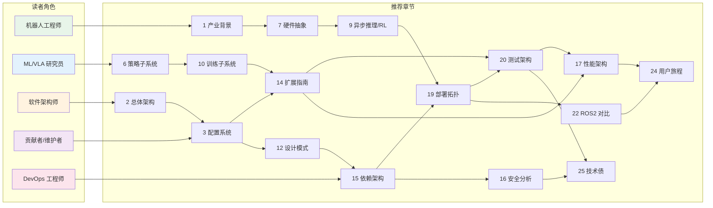

### 0.3 文档结构总览

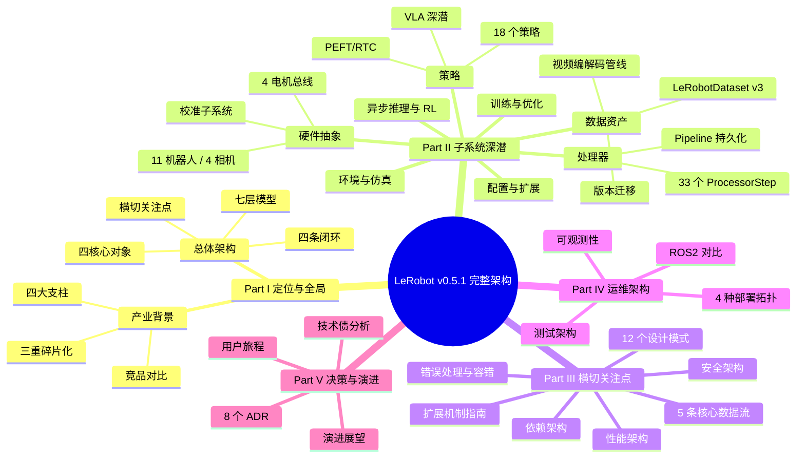

---

## 1. 产业背景与项目定位

### 1.1 机器人学习的三重碎片化

ICLR 2026 论文 Section 2.3 明确了机器人学习生态的三大痛点:

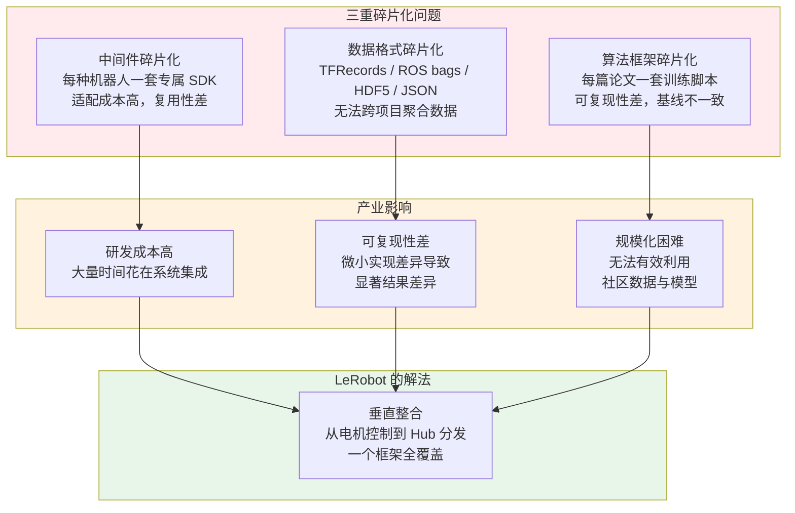

### 1.2 LeRobot 在产业链中的位置

```mermaid
graph LR
    subgraph HW["硬件层 (Accessible Hardware)"]
        SO["SO-10X<br/>~€225"]
        Koch["Koch v1.1<br/>~€670"]
        ALOHA["ALOHA-2<br/>~€21K"]
        HopeJR["HopeJR<br/>~€500"]
        LeKiwi["LeKiwi<br/>~€230"]
        G1["Unitree G1"]
        Reachy["Reachy-2"]
        OpenArm["OpenArm"]
    end

    subgraph Data["数据层 (LeRobotDataset v3)"]
        Record["遥操作采集"]
        Format["Parquet + MP4"]
        Hub["HuggingFace Hub<br/>16K+ 数据集<br/>2.2K+ 贡献者"]
        Stream["流式读取"]
    end

    subgraph Learn["学习层 (18 Policies)"]
        ACT["ACT 52M"]
        Diff["Diffusion 263M"]
        SmolVLA["SmolVLA 450M"]
        Pi0["Pi0 3.5B"]
        SAC["SAC (RL)"]
        VLA["+ 13 更多策略"]
    end

    subgraph Deploy["部署层 (Optimized Inference)"]
        Sync["同步推理"]
        Async["异步 gRPC<br/>物理+逻辑解耦"]
        RTC["Real-Time Chunking"]
        HIL["Human-in-the-Loop RL"]
    end

    HW --> Data
    Data --> Learn
    Learn --> Deploy
    Deploy --> HW

    style HW fill:#e8f5e9
    style Data fill:#e3f2fd
    style Learn fill:#fff3e0
    style Deploy fill:#fce4ec
```

### 1.3 ICLR 2026 论文: 四大支柱与量化基线

| 支柱 | 源码对应 | 产业意义 | 关键量化指标 |
|------|---------|---------|-----------|
| **统一硬件集成** | `robots/`, `motors/`, `cameras/`, `teleoperators/` | 降低从 SDK 到 ML 的跨栈对接成本 | 11 种机器人, 4 种电机总线 |
| **标准化数据集** | `datasets/lerobot_dataset.py` | 数据成为可共享资产 | 16K+ 数据集, 2.2K+ 贡献者 |
| **优化推理栈** | `async_inference/`, `policies/rtc/` | 解耦推理与控制，支持远程 GPU | 异步 vs 同步: 周期时间减少 29.5% |
| **高效可复用算法** | `policies/` (18 策略) | 统一接口下多范式快速切换 | ACT 5ms, SmolVLA 99ms, Pi0 209ms (RTX 4090) |

**推理延迟基线 (ICLR 2026 Table 3, fp32 精度)**:

| 策略 | 参数量 | CPU (ms) | MPS (ms) | RTX 4090 (ms) | A100 (ms) |
|------|-------|---------|---------|-------------|----------|
| ACT | 52M | 182 ± 41 | 43 ± 10 | **5.0 ± 0.1** | 13.8 ± 0.4 |
| Diffusion | 263M | 超时 | 3454 ± 39 | 370 ± 0.2 | 614 ± 10 |
| Pi0 | 3.5B | 超时 | 超时 | **209 ± 2.8** | 569 ± 2.9 |
| SmolVLA | 450M | 2028 ± 303 | 722 ± 58 | **99 ± 1.2** | 279 ± 1.9 |

### 1.4 系统上下文 (C4 Level 0)

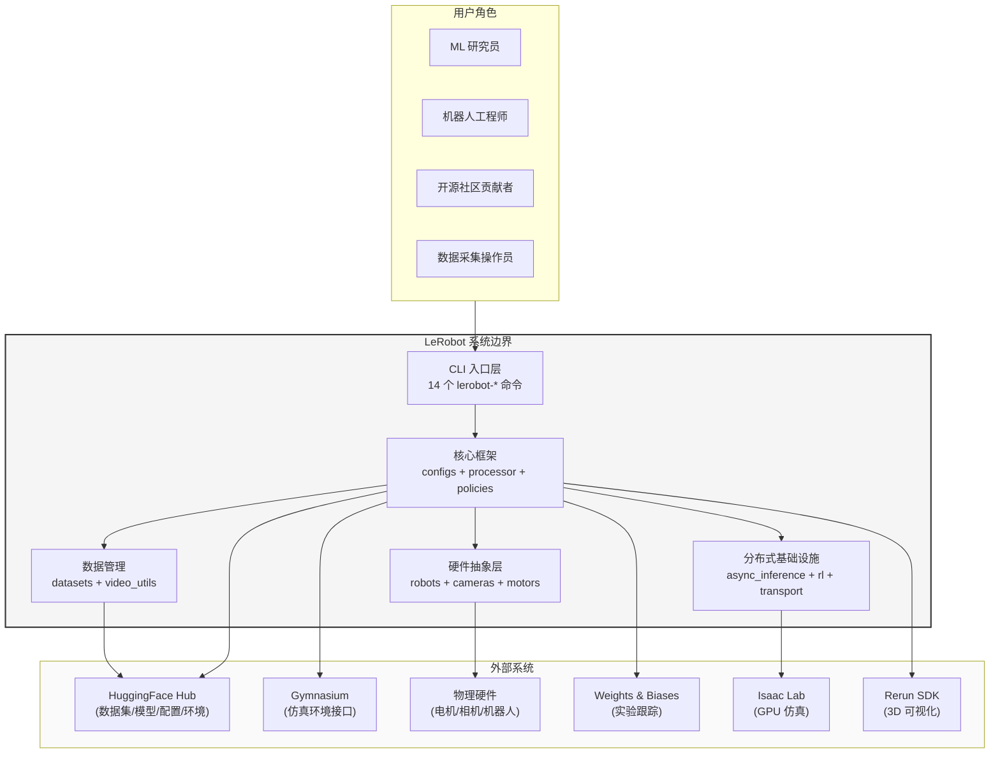

### 1.5 竞品架构深度对比

| 维度 | **LeRobot** | **robomimic** | **RLDS/Open X** | **OpenPI** | **ROS2** | **Octo** |
|------|------------|--------------|----------------|-----------|---------|---------|
| **核心定位** | 端到端全栈 | 训练框架 | 数据格式标准 | Pi0 模型服务 | 通信中间件 | 跨体态基础模型 |
| **数据格式** | Parquet+MP4 (v3) | HDF5 | TFRecords | 自定义 | rosbag2/MCAP | RLDS |
| **策略接口** | PreTrainedPolicy ABC | 无统一接口 | 无 | JAX serving | 无 | Octo 专用 |
| **硬件支持** | 11 种机器人内置 | 无 | 无 | 无 | 全面 (但需自行集成) | 无 |
| **推理部署** | gRPC 异步 + RTC | 无 | 无 | JAX serving | DDS 通信 | 无 |
| **Hub 生态** | HF Hub 原生 | 无 | Google Cloud | 无 | 无 | HF Hub |
| **配置系统** | draccus ChoiceRegistry | JSON/YAML | 无 | CLI | launch XML/Python | gin-config |
| **学习范式** | BC + RL + VLA | BC 为主 | 无训练 | BC (Flow) | 无 | BC |
| **插件机制** | 自动发现 (`lerobot_*`) | Fork | 自定义 builder | Fork | 节点/包 | 无 |
| **分布式训练** | Accelerate + SLURM | 无 | 无 | JAX pjit | 无 | 无 |
| **Processor 持久化** | 一等 artifact | 无 | 无 | 无 | 无 | 无 |

**关键差异**: LeRobot 是唯一同时覆盖 **硬件接入 + 数据管理 + 多范式训练 (BC/RL/VLA) + 优化推理 + Hub 共享 + Processor 持久化** 的垂直整合框架。

---

## 2. 总体架构概览

### 2.1 四核心对象模型

LeRobot 的设计围绕四个核心对象展开，它们定义了系统的基本语义:

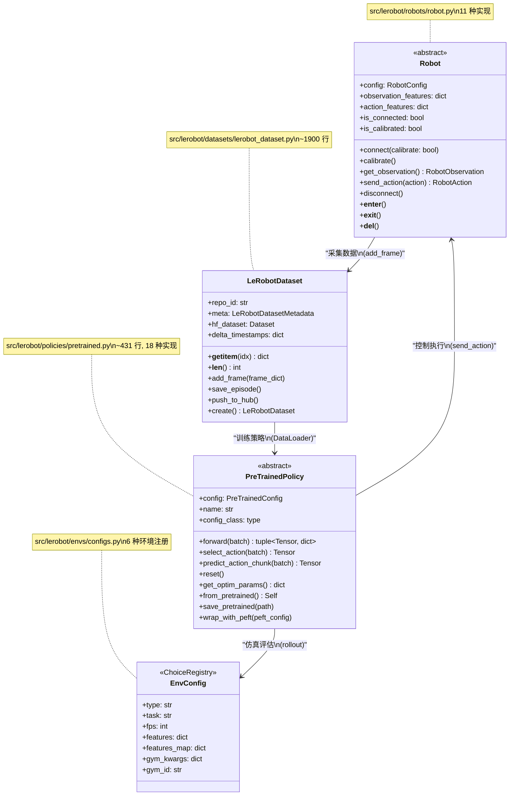

### 2.2 四条运行闭环

与现有文档的三条闭环相比，本文增加了第四条 **在线 RL 闭环**:

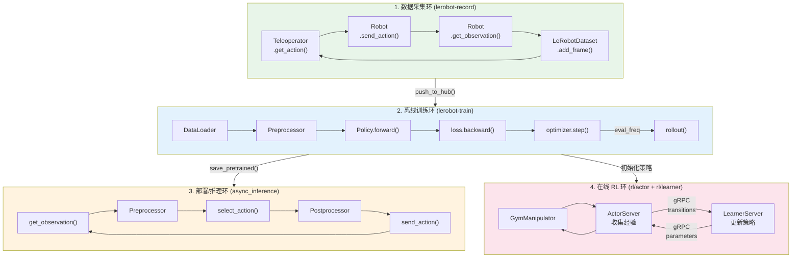

### 2.3 七层架构模型

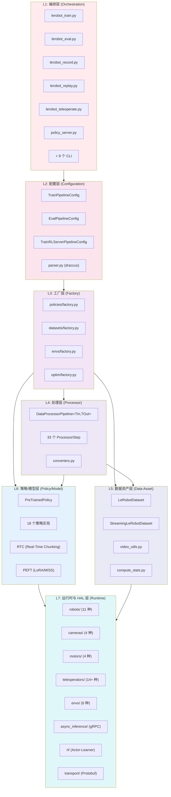

### 2.4 横切关注点矩阵

贯穿所有层的横切关注点:

| 横切关注点 | 机制 | 涉及模块 | 风险/注意事项 |
|-----------|------|---------|-------------|
| **Hub 集成** | `HubMixin` (save/load/push) | Policy, Processor, Dataset, Config | 网络依赖，离线模式需降级 |
| **类型系统** | `FeatureType` + `PolicyFeature` | configs/types.py → dataset, env, policy | 新增 FeatureType 需全栈适配 |
| **插件机制** | `register_third_party_plugins()` | utils/import_utils.py → 自动发现 `lerobot_*` 包 | 命名冲突风险 |
| **可观测性** | WandB + logging + MetricsTracker | scripts/, rl/, async_inference/ | WandB 离线降级 |
| **安全性** | pickle 序列化, trust_remote_code | transport/utils.py, envs/configs.py | 详见 [Ch 16](#16-安全架构分析) |
| **错误处理** | DeviceError + CompatibilityError | utils/errors.py → robots, datasets | 详见 [Ch 18](#18-错误处理与容错架构) |
| **资源管理** | Context Manager + Defensive Destructor | Robot, Camera, MotorsBus, Dataset | __del__ 中的 try/except 安全网 |

### 2.5 代码库量化画像

| 维度 | 数据 |
|------|------|
| Python 文件数 | ~200+ |
| 核心代码行数 | ~97K 行 |
| 策略实现 | 16 个目录, 18 个注册类型 |
| 机器人类型 | 11 个 RobotConfig 子类 |
| 相机后端 | 4 种 (OpenCV, RealSense, ZMQ, Reachy2) |
| 电机总线 | 4 种 (Dynamixel, Feetech, DaMiao, RobStride) |
| 遥操作器 | 14+ 种 (leader 臂, gamepad, keyboard, phone, VR) |
| ProcessorStep | 33 个注册步骤 |
| CLI 入口点 | 14 个 `lerobot-*` 命令 |
| 最大文件 | lerobot_dataset.py (~1900 行), pipeline.py (~1716 行), motors_bus.py (~1280 行) |

---

# Part II: 子系统深潜

## 3. 配置与扩展子系统

### 3.1 draccus + ChoiceRegistry: 声明式配置即工厂

LeRobot 的配置系统建立在 **draccus** (钉死 v0.10.0) 之上。`ChoiceRegistry` 模式将**配置声明**与**多态对象创建**统一:

```python
# src/lerobot/configs/policies.py
class PreTrainedConfig(draccus.ChoiceRegistry, HubMixin, abc.ABC):
    """所有策略配置的基类，同时是策略工厂的注册表"""

# src/lerobot/policies/act/configuration_act.py
@PreTrainedConfig.register_subclass("act")
@dataclass
class ACTConfig(PreTrainedConfig):
    chunk_size: int = 100
    n_action_steps: int = 100
    ...
```

CLI 参数 `--policy.type=act` → draccus 查找注册表 → 实例化 `ACTConfig`。

### 3.2 完整注册表树

系统中存在 **7 个 ChoiceRegistry 基类**:

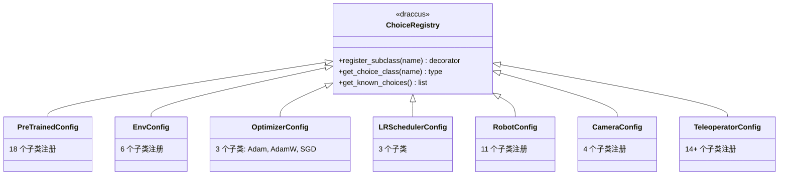

### 3.3 配置组合根: TrainPipelineConfig

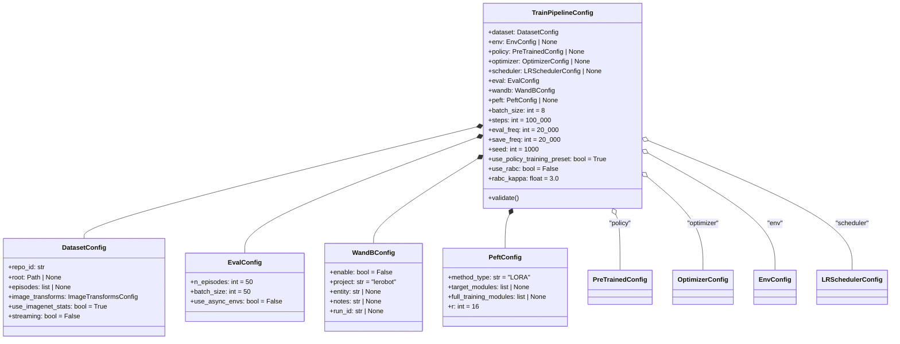

### 3.4 配置生命周期

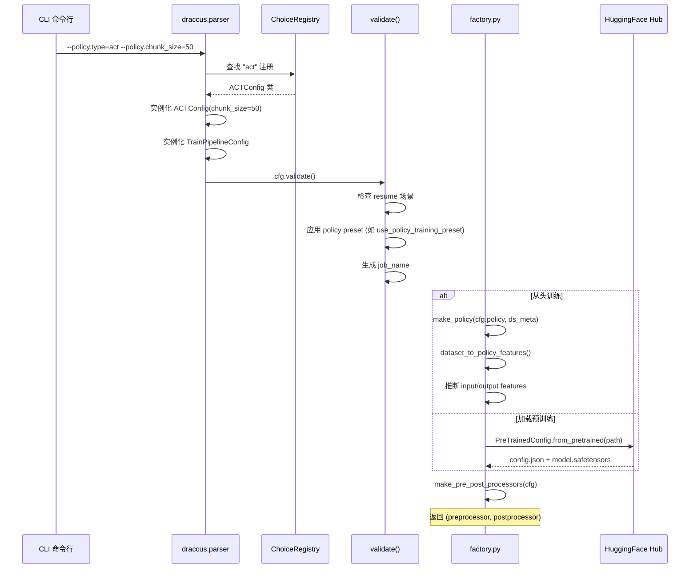

### 3.5 插件发现机制

```python
# src/lerobot/utils/import_utils.py
def register_third_party_plugins() -> None:
    """通过 setuptools entry_points 发现第三方插件"""
    for entry_point in importlib.metadata.entry_points(group="lerobot.plugins"):
        entry_point.load()  # 触发注册
```

只要第三方包在 `pyproject.toml` 中声明 `[project.entry-points."lerobot.plugins"]`，安装后即自动发现。

此外，`factory.py` 中的 `_get_policy_cls_from_policy_name()` 提供了后备路径: 当 if-elif 链未匹配时，尝试通过 `PreTrainedConfig` 的 ChoiceRegistry 动态查找。

---

## 4. 数据资产子系统

### 4.1 LeRobotDataset 核心设计

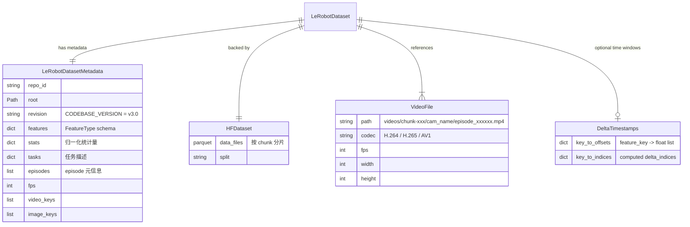

### 4.2 磁盘结构 (v3.0)

```
repo_id/
├── meta/
│   ├── info.json              # 数据集元信息 (fps, shapes, codebase_version)
│   ├── stats.json             # 每特征 min/max/mean/std/q01/q99
│   ├── tasks.json             # 任务文本描述
│   └── episodes.parquet       # Episode 元信息 (chunk_index, file_index, length)
├── data/
│   └── chunk-000/
│       ├── episode_000000.parquet   # 观测/动作表格数据
│       ├── episode_000001.parquet
│       └── ...
└── videos/
    └── chunk-000/
        ├── observation.images.top/
        │   ├── episode_000000.mp4   # H.264/H.265/AV1 视频流
        │   └── ...
        └── observation.images.wrist/
            └── ...
```

### 4.3 FeatureType 类型系统

`src/lerobot/configs/types.py` 定义了语义化特征类型:

| FeatureType | 含义 | 典型 key | NormalizationMode |
|------------|------|---------|------------------|
| `STATE` | 本体感觉状态 | `observation.state` | MEAN_STD |
| `VISUAL` | 视觉观测 | `observation.images.top` | IDENTITY (VLA 自处理) |
| `ENV` | 环境特定状态 | `observation.environment_state` | MEAN_STD |
| `ACTION` | 动作指令 | `action` | MEAN_STD 或 MIN_MAX |
| `REWARD` | 奖励信号 | `next.reward` | IDENTITY |
| `LANGUAGE` | 语言指令 | `task` | N/A (tokenization) |

`PolicyFeature(type=FeatureType.STATE, shape=(6,))` 将**语义类型**与**维度形状**绑定, 让 dataset-policy-env 之间靠特征语义而非硬编码 shape 对接。

### 4.4 数据集生命周期

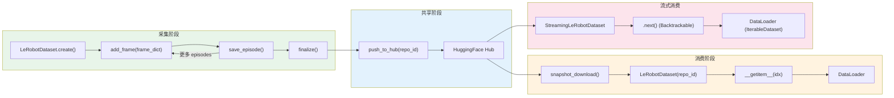

### 4.5 Delta Timestamps 与时间窗口对齐

```python
delta_timestamps = {
    "observation.images.wrist_camera": [-0.2, -0.1, 0.0],  # 3 帧历史
    "observation.state": [-0.1, 0.0],                        # 2 帧历史
    "action": [-0.1, 0.0, 0.1, 0.2, ..., 1.4],              # 过去+未来动作
}
```

内部转换为 `delta_indices`，`__getitem__` 时自动对齐并处理 episode 边界 padding。`StreamingLeRobotDataset` 通过 `Backtrackable` 迭代器维护有界缓冲区以支持 lookback。

### 4.6 统计量与归一化

`src/lerobot/datasets/compute_stats.py` 使用 `RunningQuantileStats` 实现在线统计:

- **Episode 级**: `compute_episode_stats()` — 在线算法 (streaming mean, variance, min, max, histograms)
- **数据集级**: `aggregate_stats()` — 跨 episode 聚合
- **五种归一化模式**: MIN_MAX, MEAN_STD, IDENTITY, QUANTILES, QUANTILE10
- 统计量以 JSON 格式存于 `meta/stats.json`

### 4.7 数据集版本迁移架构

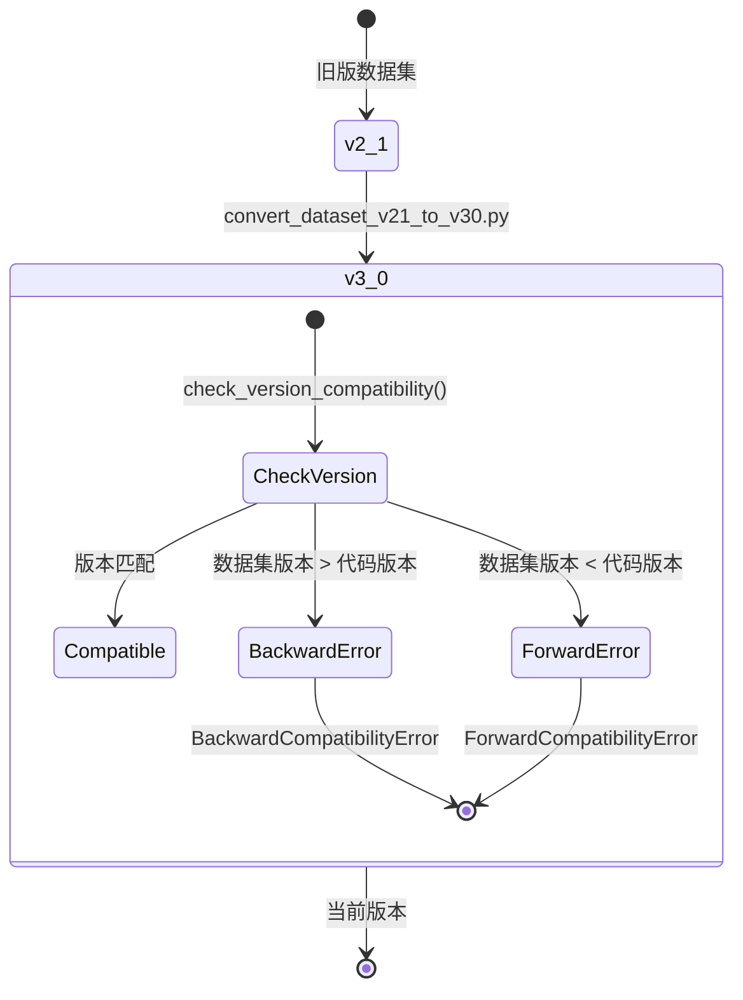

`CODEBASE_VERSION = "v3.0"` 硬编码在 `datasets/lerobot_dataset.py` 中。Hub 上的 16K+ 数据集需要通过 tag 管理确保版本一致性。

### 4.8 视频编解码管线

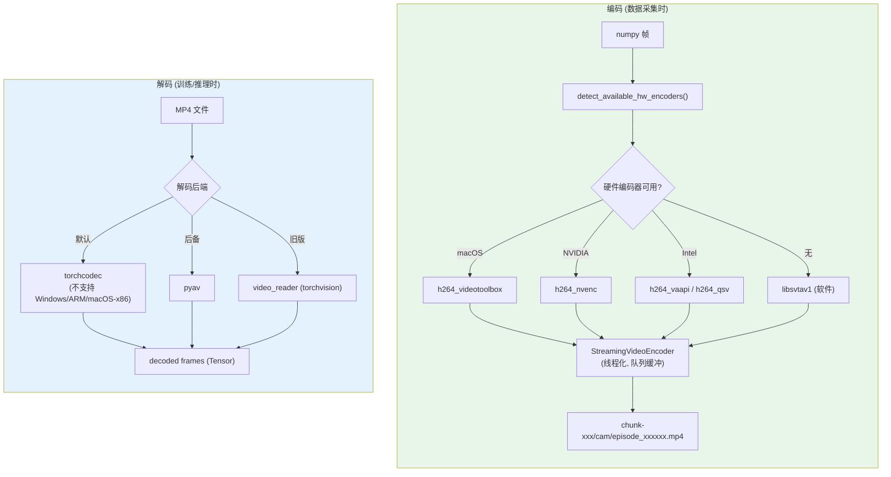

**关键参数**: GOP 大小 `g=2` (keyframe 间隔), CRF 质量控制, 像素格式 `yuv444p` (无色度子采样)。

---

## 5. 处理器子系统

### 5.1 设计动机

Processor 子系统是 LeRobot 最具辨识度的架构贡献。很多框架只保存模型权重，但导致**不可复现**的往往是归一化、tokenization、特征重命名等 "胶水逻辑"。LeRobot 将这些提升为**一等公民** — `DataProcessorPipeline` 与模型权重一起保存/加载/推送到 Hub。

### 5.2 核心抽象

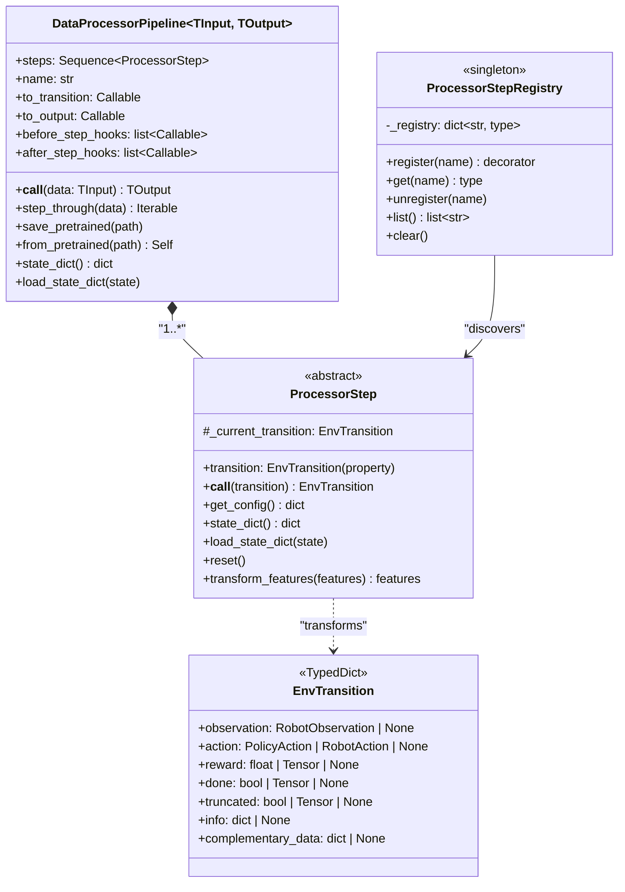

### 5.3 完整 ProcessorStep 注册清单

| 类别 | Step 类名 | 功能 |
|------|----------|------|
| **归一化** | `NormalizerProcessorStep` | 按 dataset stats 归一化 (MIN_MAX/MEAN_STD/QUANTILE10) |
| | `UnnormalizerProcessorStep` | 归一化逆变换 (用于动作输出) |
| **设备** | `DeviceProcessorStep` | 张量搬移到目标设备 (CPU/GPU) |
| **重命名** | `RenameObservationsProcessorStep` | 观测键重命名 (dataset key → policy key) |
| **语言** | `TokenizerProcessorStep` | 语言指令 tokenization |
| | `ActionTokenizerProcessorStep` | 动作 tokenization (Pi0Fast, WallX) |
| **观测** | `VanillaObservationProcessorStep` | 基础观测处理 (直通) |
| | `ImageCropResizeProcessorStep` | 图像裁剪/缩放 |
| **动作** | `MapDeltaActionToRobotActionStep` | delta 动作→绝对动作 |
| | `MapTensorToDeltaActionDictStep` | Tensor→delta 动作 dict |
| | `Numpy2TorchActionProcessorStep` | ndarray→Tensor |
| | `Torch2NumpyActionProcessorStep` | Tensor→ndarray (for Gym) |
| **批次** | `AddBatchDimensionProcessorStep` | 添加 batch 维度 |
| **HIL/RL** | `InterventionActionProcessorStep` | HIL 人类干预处理 |
| | `GripperPenaltyProcessorStep` | 夹爪惩罚信号 |
| | `GymHILAdapterProcessorStep` | Gym-HIL 适配器 |
| | `RewardClassifierProcessorStep` | 奖励分类器推理 |
| | `TimeLimitProcessorStep` | 时间限制截断 |
| **遥操** | `AddTeleopActionAsComplimentaryDataStep` | 记录遥操作动作 |
| **转换** | `batch_to_transition` | batch dict → EnvTransition |
| | `transition_to_batch` | EnvTransition → batch dict |
| | `create_transition` | 创建空 EnvTransition |
| **策略专用** | `SmolVLANewLineProcessor` | SmolVLA 任务格式化 |
| | `Pi0NewLineProcessor` | Pi0 任务格式化 |

### 5.4 三类 Pipeline 桥接不同领域

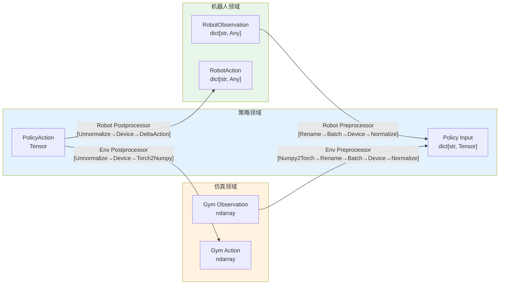

**关键洞察**: `DataProcessorPipeline[TInput, TOutput]` 的泛型参数使同一个 policy 可搭配不同的 I/O 域 (真机 vs 仿真)。

### 5.5 Pipeline 持久化

Processor pipeline 可独立 `save_pretrained()` / `from_pretrained()`:
- **保存**: `config.json` (步骤配置) + `processor_state.safetensors` (每步状态, 如归一化参数)
- **加载**: 通过 `ProcessorStepRegistry` 重建步骤 → 恢复状态
- **Hub**: 与模型权重一起推送，实现完全自包含部署

---

## 6. 策略子系统

### 6.1 PreTrainedPolicy: 统一策略接口

`src/lerobot/policies/pretrained.py` 定义所有策略的基类:

| 方法 | 签名 | 用途 | 调用时机 |
|------|------|------|---------|
| `forward` | `(batch) → (loss, dict)` | 训练前向传播 | 训练循环 |
| `predict_action_chunk` | `(batch) → Tensor` | 预测动作块 | `select_action()` 内部 |
| `select_action` | `(batch, **kwargs) → Tensor` | 推理时选择单步动作 | 评估/部署循环 |
| `reset` | `() → None` | 重置内部缓存 (动作队列) | 每个 episode 开始 |
| `get_optim_params` | `() → dict` | 返回优化器参数组 | 构建 optimizer |
| `wrap_with_peft` | `(peft_config) → None` | 应用 LoRA/MISS 微调 | 训练初始化 |

**强制子类契约** (通过 `__init_subclass__`):
- 必须定义 `config_class` 属性 (指向对应的 PreTrainedConfig 子类)
- 必须定义 `name` 属性 (策略注册名)

### 6.2 完整策略族谱 (18 个注册类型)

```mermaid
classDiagram
    class PreTrainedPolicy {
        <<abstract>>
        +config_class: type
        +name: str
    }

    class ACTPolicy {
        name = "act"
        ~52M params
        ResNet18 + Transformer + VAE
    }
    class DiffusionPolicy {
        name = "diffusion"
        ~263M params
        ResNet18 + U-Net + DDPM
    }
    class VQBeTPolicy {
        name = "vqbet"
        ResNet18 + RVQ + minGPT
    }
    class TDMPCPolicy {
        name = "tdmpc"
        World Model + CEM/MPPI
    }
    class PI0Policy {
        name = "pi0"
        ~3.5B params
        PaliGemma + Flow Matching
    }
    class PI05Policy {
        name = "pi05"
        PaliGemma + ActionExpert
    }
    class PI0FastPolicy {
        name = "pi0_fast"
        PaliGemma + AR Tokenizer
    }
    class SmolVLAPolicy {
        name = "smolvla"
        ~450M params
        SmolVLM2 + Flow Matching
    }
    class SACPolicy {
        name = "sac"
        Actor-Critic (Off-policy RL)
    }
    class GrootPolicy {
        name = "groot"
        GR00T-N1.5-3B (NVIDIA)
    }
    class Groot2Policy {
        name = "groot2"
        GR00T v2 (Bug-fix)
    }
    class StrGrootPolicy {
        name = "str_groot"
        Structured GR00T
    }
    class XVLAPolicy {
        name = "xvla"
        Florence2 + SoftTransformer
    }
    class WallXPolicy {
        name = "wall_x"
        Qwen2.5-VL + Flow/Fast
    }
    class SARMPolicy {
        name = "sarm"
        Subtask Reward Model
    }
    class RewardClassifierPolicy {
        name = "reward_classifier"
        Binary Reward Classifier
    }

    PreTrainedPolicy <|-- ACTPolicy
    PreTrainedPolicy <|-- DiffusionPolicy
    PreTrainedPolicy <|-- VQBeTPolicy
    PreTrainedPolicy <|-- TDMPCPolicy
    PreTrainedPolicy <|-- PI0Policy
    PreTrainedPolicy <|-- PI05Policy
    PreTrainedPolicy <|-- PI0FastPolicy
    PreTrainedPolicy <|-- SmolVLAPolicy
    PreTrainedPolicy <|-- SACPolicy
    PreTrainedPolicy <|-- GrootPolicy
    PreTrainedPolicy <|-- Groot2Policy
    PreTrainedPolicy <|-- StrGrootPolicy
    PreTrainedPolicy <|-- XVLAPolicy
    PreTrainedPolicy <|-- WallXPolicy
    PreTrainedPolicy <|-- SARMPolicy
    PreTrainedPolicy <|-- RewardClassifierPolicy
```

### 6.3 策略分类矩阵

| 学习范式 | 单任务 / 小规模 | 多任务 / 泛化 (VLA) |
|---------|-------------|-----------------|
| **行为克隆 (BC)** | ACT (52M), Diffusion (263M), VQ-BeT | SmolVLA (450M), Pi0 (3.5B), Pi0.5, Pi0Fast |
| **视觉-语言-动作 (VLA)** | — | SmolVLA, Pi0, XVLA, WallX, GR00T, GR00T2, StrGR00T |
| **强化学习 (RL)** | SAC, TDMPC | HIL-SERL (SAC + 人类干预) |
| **奖励模型** | SARM, RewardClassifier | — |

### 6.4 三文件策略范式 (Template Method)

每个策略遵循统一的三文件结构:

```
policies/act/
├── configuration_act.py    # ACTConfig(PreTrainedConfig) — 超参数声明
├── modeling_act.py         # ACTPolicy(PreTrainedPolicy) — 模型实现
└── processor_act.py        # make_act_pre_post_processors() — 数据处理
```

**扩展文件** (部分策略):
- XVLA: `action_hub.py`, `soft_transformer.py`, `configuration_florence2.py`, `modeling_florence2.py`
- Groot: `eagle2_hg_model/`, `action_head/`, `groot_n1.py`
- WallX: `qwen_model/`, `constant.py`
- SAC: `reward_model/` (嵌套策略)

### 6.5 Action Chunking 状态机

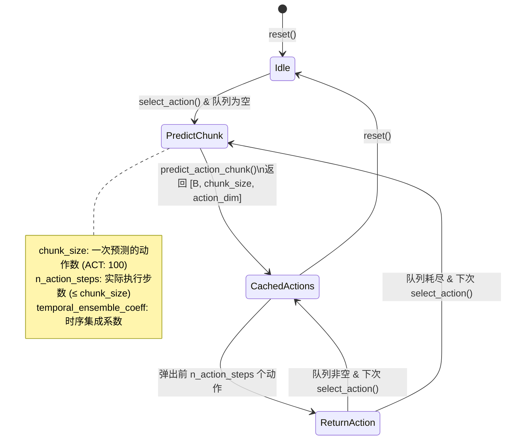

### 6.6 VLA 策略架构深潜

VLA (Vision-Language-Action) 策略共享一个通用架构模式:

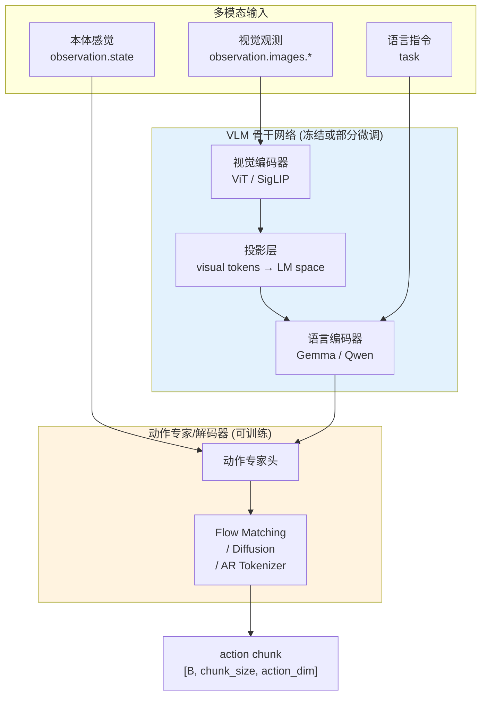

**各 VLA 策略的骨干对比**:

| 策略 | VLM 骨干 | VLM 参数量 | 动作解码方式 | 语言条件 |
|------|---------|----------|-----------|---------|
| **Pi0** | PaliGemma-2B | 2B | Flow Matching (10 steps) | 是 |
| **Pi0.5** | PaliGemma-300M | 300M | ActionExpert Transformer | 是 |
| **Pi0Fast** | PaliGemma | ~2B | Autoregressive Token | 是 |
| **SmolVLA** | SmolVLM2-500M | 500M | Flow Matching Expert | 是 |
| **GR00T** | Eagle2-5VL | 3B | Flow Matching ActionHead | 是 |
| **XVLA** | Florence2 | ~230M | SoftTransformer + Diffusion | 是 (soft prompts) |
| **WallX** | Qwen2.5-VL | ~3B | Flow / Fast Tokenizer | 是 |

### 6.7 PEFT/微调架构

```mermaid
sequenceDiagram
    participant User as 用户
    participant Config as PeftConfig
    participant Policy as PreTrainedPolicy
    participant PEFT as peft 库
    participant Hub as HuggingFace Hub

    User->>Config: --peft.method_type=LORA --peft.r=16
    Config->>Policy: wrap_with_peft(peft_config)
    Policy->>Policy: _get_default_peft_targets()
    Note over Policy: 策略专属默认目标模块<br/>如 SmolVLA: language_model layers
    Policy->>Policy: _validate_peft_config()
    Policy->>PEFT: get_peft_model(model, lora_config)
    PEFT-->>Policy: PeftModel (adapter 权重)

    Note over Policy: 训练只更新 adapter 权重<br/>+ full_training_modules 中的模块

    Policy->>Hub: save_pretrained(path)
    Note over Hub: adapter_model.safetensors<br/>+ adapter_config.json<br/>+ config.json
```

**支持的 PEFT 方法**: LoRA (默认 r=16), MISS

### 6.8 RTC (Real-Time Chunking) 架构

RTC 优化实时推理场景中的 action chunking:

```mermaid
flowchart TB
    subgraph RTC["RTC 架构"]
        direction TB
        Config["RTCConfig<br/>prefix_attention_schedule: LINEAR<br/>max_guidance_weight: 10.0<br/>execution_horizon: 10"]
        LT["LatencyTracker<br/>滑动窗口 (maxlen=100)<br/>实时监测推理延迟"]
        AQ["ActionQueue<br/>管理重叠的 chunk"]
        Proc["RTCProcessor<br/>1. 计算前缀注意力掩码<br/>2. 处理 chunk 重叠<br/>3. 应用引导权重"]
    end

    subgraph Flow["执行流程"]
        Obs["观测"] --> Proc
        Proc --> Predict["predict_action_chunk()"]
        Predict --> Merge["f(旧chunk, 新chunk)<br/>加权平均聚合"]
        Merge --> AQ
        AQ --> Execute["逐步执行动作"]
    end

    Config --> Proc
    LT --> Proc

    style RTC fill:#e3f2fd
```

**前缀注意力调度**:
- `ZEROS`: 不注意前缀 (纯预测)
- `ONES`: 完全注意前缀 (inpainting)
- `LINEAR`: 线性增长注意力
- `EXP`: 指数增长注意力

### 6.9 SARM 与 RA-BC

```mermaid
flowchart LR
    DS["训练数据集"] --> SARM["SARMPolicy<br/>奖励模型"]
    SARM --> Scores["进度分数<br/>(per sample)"]
    Scores --> RABC["RA-BC 权重计算<br/>compute_rabc_weights.py"]
    RABC --> Weights["per-batch 权重"]
    Weights --> Train["训练循环<br/>weighted loss"]

    Note["rabc_kappa: 硬阈值<br/>rabc_epsilon: 数值稳定"] -.-> RABC

    style SARM fill:#fff3e0
    style Train fill:#e8f5e9
```

RA-BC 通过 SARM 预计算的进度分数对样本加权，让策略优先从高质量示范中学习。

---

## 7. 硬件抽象子系统

### 7.1 四大硬件抽象接口

```mermaid
classDiagram
    class Robot {
        <<abstract>>
        +observation_features: dict
        +action_features: dict
        +connect(calibrate)
        +get_observation() RobotObservation
        +send_action(action) RobotAction
        +disconnect()
    }

    class Teleoperator {
        <<abstract>>
        +action_features: dict
        +feedback_features: dict
        +connect(calibrate)
        +get_action() RobotAction
        +send_feedback(feedback)
        +disconnect()
    }

    class Camera {
        <<abstract>>
        +fps, width, height
        +connect(warmup)
        +read() NDArray
        +async_read(timeout_ms) NDArray
        +read_latest(max_age_ms) NDArray
        +disconnect()
    }

    class MotorsBusBase {
        <<abstract>>
        +connect(handshake)
        +sync_read(data_name, motors)
        +sync_write(data_name, values)
        +enable_torque() / disable_torque()
        +read_calibration() / write_calibration()
        +disconnect()
    }

    Robot *-- Camera : "0..*"
    Robot *-- MotorsBusBase : "1..*"
    Teleoperator *-- MotorsBusBase : "0..*"

    Robot <|-- SOFollower
    Robot <|-- KochFollower
    Robot <|-- UnitreeG1
    Robot <|-- HopeJR
    Robot <|-- LeKiwi
    Robot <|-- Reachy2
    Robot <|-- OpenArmFollower
    Robot <|-- BiSOFollower
    Robot <|-- BiOpenArmFollower
    Robot <|-- OMXFollower
    Robot <|-- EarthRoverMiniPlus

    Teleoperator <|-- SOLeader
    Teleoperator <|-- KochLeader
    Teleoperator <|-- GamepadTeleop
    Teleoperator <|-- KeyboardTeleop
    Teleoperator <|-- PhoneTeleop
    Teleoperator <|-- HomunculusTeleop

    Camera <|-- CameraOpenCV
    Camera <|-- CameraRealSense
    Camera <|-- CameraZMQ
    Camera <|-- Reachy2Camera

    MotorsBusBase <|-- SerialMotorsBus
    SerialMotorsBus <|-- DynamixelMotorsBus
    SerialMotorsBus <|-- FeetechMotorsBus
    MotorsBusBase <|-- RobStrideMotorsBus
    MotorsBusBase <|-- DamiaoMotorsBus
```

### 7.2 电机归一化管线

```mermaid
flowchart LR
    Raw["原始寄存器值<br/>(0-4095)"] --> Cal["应用校准<br/>homing_offset<br/>drive_mode"]
    Cal --> Bounded["有界值"]
    Bounded --> Norm{"归一化模式"}
    Norm -->|DEGREES| Deg["角度值<br/>(-180° ~ +180°)"]
    Norm -->|RANGE_M100_100| R100["范围值<br/>(-100 ~ +100)"]
    Norm -->|RANGE_0_100| R0100["范围值<br/>(0 ~ 100)"]

    Deg --> ObsAct["observation / action"]
    R100 --> ObsAct
    R0100 --> ObsAct

    style Raw fill:#ffebee
    style ObsAct fill:#e8f5e9
```

### 7.3 校准子系统

```mermaid
sequenceDiagram
    participant User as 操作员
    participant CLI as lerobot-calibrate
    participant GUI as CalibrationGUI (Pygame)
    participant Motor as MotorsBus
    participant File as 校准文件

    CLI->>Motor: connect(handshake=True)
    CLI->>GUI: 启动 GUI (RangeSlider per motor)

    loop 每个电机
        User->>GUI: 移动电机到极限位置
        GUI->>Motor: sync_read("Present_Position")
        Motor-->>GUI: raw position
        GUI->>GUI: 更新 RangeValues(min_v, pos_v, max_v)
    end

    User->>GUI: 确认校准
    GUI->>File: 保存 MotorCalibration dict
    Note over File: {motor_name: {id, drive_mode,\nhoming_offset, range_min, range_max}}
    File-->>Motor: 下次连接自动加载
```

**校准文件位置**: `~/.cache/huggingface/lerobot/robots/{type}/{id}.json`

### 7.4 资源管理: Context Manager + Defensive Destructor

所有硬件接口均实现三层保护:

```python
# src/lerobot/robots/robot.py
class Robot(abc.ABC):
    def __enter__(self):          # 层1: Context Manager
        self.connect()
        return self

    def __exit__(self, *args):    # 层2: 异常时清理
        self.disconnect()

    def __del__(self):            # 层3: 安全网 (GC 时)
        try:
            if self.is_connected:
                self.disconnect()
        except Exception:
            pass  # 静默失败，避免 GC 异常
```

---

## 8. 环境与仿真子系统

### 8.1 环境配置层级

```mermaid
classDiagram
    class EnvConfig {
        <<ChoiceRegistry>>
        +task: str
        +fps: int = 30
        +features: dict~str, PolicyFeature~
        +features_map: dict~str, str~
        +gym_kwargs: dict
        +gym_id: str
    }

    EnvConfig <|-- AlohaEnv : "type=aloha, fps=50"
    EnvConfig <|-- PushtEnv : "type=pusht"
    EnvConfig <|-- LiberoEnv : "type=libero"
    EnvConfig <|-- MetaworldEnv : "type=metaworld"
    EnvConfig <|-- GymManipulatorEnv : "type=gym_manipulator"
    EnvConfig <|-- HubEnvConfig : "type=hub"

    HubEnvConfig <|-- IsaaclabArenaEnv : "type=isaaclab_arena"

    note for HubEnvConfig "从 Hub 下载环境代码\ntrust_remote_code=True"
```

### 8.2 仿真的定位

ICLR 论文 Section 4 明确: 仿真**主要用于系统性评估，而非训练**。接触丰富 (contact-rich) 的操作任务在仿真中难以精确建模。因此:
- `make_env()` 基于 `gymnasium.make()` + `VectorEnv`
- 内置 LIBERO (4×10 task suites) 和 MetaWorld (50 tasks)
- `HubEnvConfig` + `trust_remote_code` 支持远程环境 (如 Isaac Lab)

### 8.3 Sim-2-Real 设计哲学: 为何评估优先

LeRobot 对 Sim-2-Real 持**务实而非回避**的态度。ICLR 2026 论文 Section 4 明确阐述了设计立场:

> "In practice, simulation proves challenging for the kind of contact-rich, complex tasks lerobot targets. This justifies the library's choice to **train as much as possible on real-world data**, relying on simulation **primarily for the systematic evaluation** of robot learning algorithms."

**核心论点**: 抓取、装配等接触丰富任务的仿真精度不足以训练出可直接迁移的策略。与其投资 sim-to-real gap 弥合，不如降低真实数据采集成本 (SO-101 ~€225，遥操作即可)。

**代码层面的体现** — `lerobot_train.py` 中的两条路径:

```python
# src/lerobot/scripts/lerobot_train.py
if cfg.eval_freq > 0 and cfg.env is not None:
    # 路径 A: 配置了仿真环境 → 训练期间进行仿真评估
    eval_env = make_env(cfg.env, n_envs=cfg.eval.batch_size)
else:
    # 路径 B: cfg.env 为 None → 纯真机数据训练，无仿真评估
    eval_env = None  # 评估在外部脚本中完成
```

**设计后果**: 不存在 `--pretrain-in-sim --finetune-on-real` 这样的内置工作流。但 LeRobot 的架构中蕴含了**多个间接支持 sim-to-real 的机制**。以下章节逐一解析。

### 8.4 观测桥接: features_map 的 Sim-Real 统一

`features_map` 是 LeRobot 实现域无关策略推理的核心机制。每个 `EnvConfig` 子类定义一个字典，将环境特定的观测键映射到策略期望的标准键:

```python
# AlohaEnv (envs/configs.py:102-108)
features_map = {
    "pixels/top": "observation.images.top",   # 仿真相机 → 标准图像键
    "agent_pos": "observation.state",          # 仿真关节 → 标准状态键
}

# LiberoEnv (envs/configs.py:279-291)
features_map = {
    "eef_pos":            "observation.state.eef_pos",     # LIBERO 特有键
    "agentview_image":    "observation.images.image",       # LIBERO 相机名
    "eye_in_hand_image":  "observation.images.image2",
}
```

**关键洞察**: 策略代码从不直接引用 `"agentview_image"` 或 `"pixels/top"` — 它只看到 `"observation.images.image"` 或 `"observation.images.top"`。这意味着**同一个策略权重可以在不同的仿真器和真机之间复用**，只要 features_map 正确映射。

三条数据路径最终汇聚到同一个 `dict[str, PolicyFeature]`:

```mermaid
flowchart TB
    subgraph Sources["三种数据源"]
        Sim["仿真环境<br/>AlohaEnv / LiberoEnv / IsaacLab<br/>features_map 定义键映射"]
        DS["LeRobotDataset<br/>Parquet + MP4<br/>meta.features 定义类型"]
        Robot["真实机器人<br/>Robot.observation_features<br/>observation_features 定义类型"]
    end

    subgraph Mapping["特征映射层"]
        E2P["env_to_policy_features()<br/>envs/utils.py:113"]
        D2P["dataset_to_policy_features()<br/>policies/factory.py"]
        R2P["RenameObservationsProcessorStep<br/>robot key → policy key"]
    end

    subgraph Unified["统一策略输入"]
        PF["dict[str, PolicyFeature]<br/>例: observation.state → (6,)<br/>observation.images.top → (3,480,640)<br/>action → (7,)"]
    end

    Sim --> E2P --> PF
    DS --> D2P --> PF
    Robot --> R2P --> PF

    PF --> Policy["PreTrainedPolicy<br/>同一份权重<br/>同一份代码"]

    style Sources fill:#fff3e0
    style Mapping fill:#e3f2fd
    style Unified fill:#e8f5e9
```

`FeatureType` 枚举 (`STATE`, `VISUAL`, `ENV`, `ACTION`, `REWARD`, `LANGUAGE`) 提供语义抽象 — 策略按语义类型而非具体键名消费特征。`env_to_policy_features()` 还自动处理图像从 HWC (Gymnasium 默认) 到 CHW (PyTorch 默认) 的通道顺序转换。

### 8.5 双层处理器管线: 域适配架构

`rollout()` (lerobot_eval.py:95) 中存在**四个处理器**，分为两层:

| 层级 | 预处理器 | 后处理器 | 职责 |
|------|---------|---------|------|
| **环境层** | `env_preprocessor` | `env_postprocessor` | 吸收仿真器/机器人的域差异 |
| **策略层** | `preprocessor` | `postprocessor` | 归一化、设备迁移、tokenization |

**关键洞察**: 从 sim 切换到 real，只需替换环境层处理器，策略层保持不变。

```mermaid
sequenceDiagram
    participant Sim as 仿真环境 (LIBERO)
    participant Real as 真实机器人
    participant EPre as env_preprocessor
    participant PPre as preprocessor (策略层)
    participant Pol as Policy.select_action()
    participant PPost as postprocessor (策略层)
    participant EPost as env_postprocessor

    Note over Sim,EPost: === 仿真路径 ===
    Sim->>EPre: {robot_state: {eef: [0.3,0.1,0.5],<br/>gripper: [0.8]},<br/>agentview_image: ndarray(360,360,3)}
    EPre->>EPre: LiberoProcessorStep:<br/>1. 图像旋转 180°<br/>2. robot_state → 扁平化 tensor(8,)<br/>3. 四元数 → 轴角
    EPre->>PPre: {observation.state: tensor(8,),<br/>observation.images.image: tensor(3,360,360)}

    Note over Sim,EPost: === 真实机器人路径 ===
    Real->>PPre: {observation.state: tensor(6,),<br/>observation.images.top: tensor(3,480,640)}
    Note right of EPre: env_preprocessor = Identity<br/>(真机数据已是标准格式)

    Note over PPre,PPost: === 共享策略层 (两条路径汇聚) ===
    PPre->>Pol: 归一化 + 设备迁移 + batch 维度
    Pol->>PPost: PolicyAction tensor
    PPost->>EPost: 反归一化 + 设备回迁

    EPost->>Sim: action ndarray
    EPost->>Real: RobotAction dict
```

**环境特定处理器的构建** (`envs/factory.py:42-99`):

```python
def make_env_pre_post_processors(env_cfg, policy_cfg):
    preprocessor_steps = []
    if isinstance(env_cfg, LiberoEnv):
        preprocessor_steps.append(LiberoProcessorStep())
        # 处理: 180° 图像旋转, robot_state 扁平化, 四元数→轴角
    elif isinstance(env_cfg, IsaaclabArenaEnv):
        preprocessor_steps.append(IsaaclabArenaProcessorStep(
            state_keys=..., camera_keys=...))
        # 处理: state_keys 拼接, (B,H,W,C)→(B,C,H,W), uint8→float32
    # 其他环境: 返回 Identity (无操作)
    return PolicyProcessorPipeline(steps=preprocessor_steps), ...
```

**`LiberoProcessorStep`** (`processor/env_processor.py`) 的域适配细节:
- **图像处理**: 翻转高度和宽度维度 (等效 180° 旋转), 匹配 HuggingFace VLA 约定
- **状态处理**: 从嵌套 `robot_state` dict 提取 `eef_pos(3) + axis_angle(3) + gripper(2)` → 扁平 tensor(8,)
- **坐标变换**: `quaternion_to_axis_angle()` 四元数→轴角表示

**`IsaaclabArenaProcessorStep`** 的域适配:
- **图像**: `(B,H,W,C) uint8` → `(B,C,H,W) float32 [0,1]`
- **状态**: 从可配置的 `state_keys` (如 `"robot_joint_pos,left_eef_pos"`) 按顺序拼接

### 8.6 GymManipulator: 真机即仿真环境

`src/lerobot/rl/gym_manipulator.py` 中的 `RobotEnv` 类将**真实机器人硬件**包装为标准 `gymnasium.Env`，实现了 sim 和 real 在接口层面的**完全统一**:

```mermaid
flowchart TB
    subgraph Config["HILSerlRobotEnvConfig"]
        CfgName["cfg.name"]
    end

    Config --> Decision{"cfg.name == 'gym_hil'?"}

    Decision -->|"是"| SimPath["gym.make('gym_hil/{task}')<br/>仿真 Gymnasium 环境"]
    Decision -->|"否"| RealPath["make_robot_from_config(cfg.robot)<br/>实例化 Robot + Camera + Motors"]
    RealPath --> Wrap["RobotEnv(robot, teleop, ...)<br/>包装为 gymnasium.Env"]

    SimPath --> Unified["统一 gym.Env 接口<br/>reset() / step(action) / render()"]
    Wrap --> Unified

    Unified --> Processors["make_processors()<br/>构建 obs/action 处理管线"]
    Processors --> Loop["control_loop()<br/>单一控制循环<br/>step_env_and_process_transition()"]
    Loop -->|"sim 或 real<br/>代码完全相同"| Unified

    style SimPath fill:#e3f2fd
    style RealPath fill:#e8f5e9
    style Unified fill:#fff3e0
```

`RobotEnv` 实现的 Gymnasium 接口:
- `reset(seed)`: 初始化机器人到 home 位置，返回初始观测
- `step(action)`: 发送动作到电机, 获取新观测, 计算奖励/done
- `render()`: 从相机获取 RGB 帧
- `close()`: 释放硬件资源

`control_loop()` 是统一的控制循环 — 无论底层是 MuJoCo 仿真还是真实 SO-100 机器人, 上层代码**完全相同**。这使得:
1. 在仿真中开发和调试 RL 算法
2. 无缝切换到真实硬件执行
3. HIL-SERL 训练时, 人类通过 gamepad 干预真实机器人, 同一个 Actor-Learner 架构处理

### 8.7 图像增强: 弱域随机化

`ImageTransformsConfig` (`datasets/transforms.py`) 提供了 LeRobot 中最接近域随机化的机制:

| 增强类型 | 参数范围 | Sim-2-Real 作用 |
|---------|---------|---------------|
| **ColorJitter/Brightness** | 0.8 - 1.2 | 补偿 sim/real 光照差异 |
| **ColorJitter/Contrast** | 0.8 - 1.2 | 补偿渲染器对比度差异 |
| **ColorJitter/Saturation** | 0.5 - 1.5 | 补偿色彩还原差异 |
| **ColorJitter/Hue** | ±0.05 | 补偿色温差异 |
| **SharpnessJitter** | 0.5 - 1.5 | 补偿渲染 vs 真实相机的清晰度 |
| **RandomAffine** | ±5°, ±5% 平移 | 补偿相机安装位置误差 |

**使用方式**: 训练时启用 (`--dataset.image_transforms.enable=true`)，随机从 6 种增强中抽取最多 3 种应用。**仅在数据加载阶段** (DataLoader workers 中) 应用, 推理/部署时不生效。

**局限性**: 这是**弱域随机化** — 仅覆盖视觉域, 不包括:
- 物理参数随机化 (摩擦系数、质量、关节阻尼)
- 几何随机化 (物体形状、场景布局)
- 动力学随机化 (执行器延迟、传感器噪声)
- 程序化内容生成 (PCG)

### 8.8 Sim-2-Real 能力缺口与扩展路径

#### 8.8.1 与专业 Sim-2-Real 框架的对比

| 能力维度 | **LeRobot** | **Isaac Lab** | **ManiSkill** | **ROS2/Gazebo** |
|---------|------------|-------------|-------------|----------------|
| **仿真定位** | 评估工具 | 训练核心 | 训练核心 | 通信+仿真 |
| **域随机化** | 弱 (仅视觉增强) | **全面** (视觉+物理+几何) | **全面** | 中等 (SDF 参数化) |
| **GPU 并行仿真** | 无 | **是** (1000+ envs) | **是** | 无 |
| **PCG** | 无 | **是** | **是** | 有限 |
| **Reality Gap 度量** | 无 | 无 | 无 | 无 |
| **Sim 预训练管线** | 无内置 | **是** | **是** | 需自行构建 |
| **Real 微调支持** | **PEFT/LoRA** (Ch 6.7) | 有限 | 无 | 无 |
| **真机数据采集** | **一等公民** | 需外部工具 | 需外部工具 | 通过 rosbag |
| **Hub 数据共享** | **16K+ 数据集** | 无 | 无 | 无 |

#### 8.8.2 LeRobot 已有的 Sim-2-Real 原语

```mermaid
flowchart LR
    subgraph Have["LeRobot 已具备"]
        FM["features_map<br/>观测键映射<br/>(8.4)"]
        DP["双层处理器<br/>域适配<br/>(8.5)"]
        GM["GymManipulator<br/>接口统一<br/>(8.6)"]
        IA["图像增强<br/>弱视觉 DR<br/>(8.7)"]
        PEFT2["PEFT/LoRA<br/>参数高效微调<br/>(6.7)"]
        Hub2["Hub 生态<br/>模型共享<br/>(2.4)"]
    end

    subgraph Missing["尚未实现"]
        DR2["物理域随机化<br/>摩擦/质量/阻尼"]
        SP["Sim 预训练管线<br/>--pretrain-in-sim"]
        RGM["Reality Gap 度量<br/>sim-real 偏差量化"]
        PCG["程序化内容生成<br/>场景/物体随机"]
        TempDR["时序域随机化<br/>延迟/噪声注入"]
    end

    Have -.->|"可扩展为"| Missing

    style Have fill:#e8f5e9
    style Missing fill:#ffebee
```

#### 8.8.3 基于现有原语的 Sim-2-Real 扩展路径

尽管 LeRobot 不内置 sim-to-real 工作流，开发者可组合现有原语实现:

**步骤 1: 仿真预训练**
```bash
# 在仿真数据集上训练基础策略
lerobot-train --policy.type=smolvla \
    --dataset.repo_id=sim_dataset \
    --env.type=libero \
    --steps=200000
```

**步骤 2: 视觉域随机化** — 启用激进的图像增强
```bash
--dataset.image_transforms.enable=true
--dataset.image_transforms.max_num_transforms=5
```

**步骤 3: 真机微调** — 用 PEFT/LoRA 在少量真机数据上微调 (参见 Ch 6.7)
```bash
lerobot-train --policy.type=smolvla \
    --policy.pretrained_path=sim_checkpoint \
    --peft.method_type=LORA --peft.r=16 \
    --dataset.repo_id=real_dataset \
    --steps=10000
```

**步骤 4: 自定义域适配处理器** — 注册环境特定的 ProcessorStep
```python
@ProcessorStepRegistry.register("my_sim2real_bridge")
class MySimToRealProcessorStep(ProcessorStep):
    """自定义 sim-to-real 视觉域适配"""
    def __call__(self, transition):
        # 颜色空间对齐、纹理迁移等
        return transition
```

**步骤 5: 部署** — 通过 GymManipulator 或 PolicyServer 在真机上运行

**总结**: LeRobot 的 Sim-2-Real 策略是**"不做仿真训练，做真实数据"** — 这是一个有意识的架构决策而非能力缺陷。其设计理念是: 与其投资 sim-to-real gap 弥合技术, 不如通过**低成本硬件 + 遥操作 + Hub 数据共享**让真实数据足够廉价和丰富。当确实需要 sim-to-real 时, 架构中的 features_map、双层处理器、GymManipulator 和 PEFT 提供了足够的扩展基础。

---

## 9. 异步推理与 RL 子系统

### 9.1 异步推理: 物理 + 逻辑双重解耦

```mermaid
graph TB
    subgraph RobotNode["机器人节点 (低算力, 如 Jetson/RPi)"]
        Robot2["Robot"]
        Camera2["Camera"]
        Client["RobotClient<br/>gRPC 客户端"]
        Robot2 --> Client
        Camera2 --> Client
    end

    subgraph GPUNode["GPU 节点 (高算力, 如 RTX 4090)"]
        Server["PolicyServer<br/>gRPC 服务端"]
        Policy2["PreTrainedPolicy"]
        PreProc["Preprocessor"]
        PostProc["Postprocessor"]
        FPS["FPSTracker"]
        Server --> PreProc --> Policy2 --> PostProc
        Server --> FPS
    end

    Client <-->|"gRPC over Network\nSendObservations /\nGetActions /\nReady"| Server

    style RobotNode fill:#e8f5e9
    style GPUNode fill:#e3f2fd
```

**物理解耦**: 推理在远程 GPU，控制在机器人端
**逻辑解耦**: 动作预测 (producer) 与动作执行 (consumer) 异步并行

### 9.2 gRPC 协议设计

```mermaid
flowchart TB
    subgraph Proto["transport/services.proto"]
        direction TB
        AI["AsyncInference 服务<br/>- Ready()<br/>- SendPolicyInstructions()<br/>- SendObservations()<br/>- GetActions()"]
        LS["LearnerService 服务<br/>- SendTransitions()<br/>- ReceiveParameters()<br/>- SendInteraction()"]
        Msg["消息类型<br/>- Observation (timestep, data_bytes)<br/>- Actions (timesteps, data_bytes)<br/>- Transition (data_bytes, transfer_state)<br/>- Parameters (data_bytes, transfer_state)<br/>- InteractionMessage (type, data_bytes)"]
    end

    subgraph Transfer["分块传输协议"]
        TS["TransferState 枚举:<br/>TRANSFER_BEGIN<br/>TRANSFER_MIDDLE<br/>TRANSFER_END"]
        Note["CHUNK_SIZE = 2MB<br/>MAX_MESSAGE_SIZE = 4MB"]
    end

    Proto --> Transfer

    style Proto fill:#e3f2fd
    style Transfer fill:#fff3e0
```

### 9.3 异步推理序列

```mermaid
sequenceDiagram
    participant Robot as Robot (本地)
    participant Client as RobotClient (本地)
    participant Server as PolicyServer (远程)
    participant Policy as Policy (远程)

    Client->>Server: Ready() (握手)
    Client->>Server: SendPolicyInstructions(RemotePolicyConfig)
    Server->>Policy: 加载模型 + 处理器
    Server-->>Client: PolicyConfig (确认)

    loop 控制循环 (fps Hz)
        Robot->>Client: get_observation()
        Client->>Server: SendObservations(TimedObservation[])
        Server->>Server: observation_queue.put(obs)<br/>(maxsize=1, 丢弃旧帧)

        par 异步预测 (GPU 端)
            Server->>Policy: preprocessor(obs)
            Policy->>Policy: predict_action_chunk()
            Policy->>Server: postprocessor(actions)
            Server->>Server: 更新 _predicted_timesteps
        end

        Client->>Server: GetActions()
        Server-->>Client: TimedAction[] (带时间戳)
        Client->>Client: aggregate_fn(旧actions, 新actions)
        Client->>Robot: send_action(action)
    end
```

**聚合函数** (`aggregate_fn_name`):
- `weighted_average`: 加权平均重叠 chunk
- `latest_only`: 只用最新 chunk
- `average`: 简单平均
- `conservative`: 保守策略

### 9.4 Actor-Learner RL 架构

```mermaid
graph TB
    subgraph ActorSide["Actor 侧 (机器人 + 环境)"]
        GymM["GymManipulator<br/>(Robot → Gym 环境)"]
        ActorS["ActorServer"]
        Teleop2["Teleoperator<br/>(HIL 干预)"]
        GymM --> ActorS
        Teleop2 -->|"人类干预"| ActorS
    end

    subgraph LearnerSide["Learner 侧 (GPU)"]
        LearnerS["LearnerServer"]
        Buffer["ReplayBuffer"]
        SACPol["SACPolicy"]
        LearnerS --> Buffer --> SACPol
        SACPol --> LearnerS
    end

    ActorS -->|"gRPC: SendTransitions()\n经验数据"| LearnerS
    LearnerS -->|"gRPC: ReceiveParameters()\n更新策略权重"| ActorS
    ActorS -->|"gRPC: SendInteraction()\n人类干预信号"| LearnerS

    style ActorSide fill:#e8f5e9
    style LearnerSide fill:#e3f2fd
```

**HIL-SERL 特色**: 人类通过 gamepad 可在 RL 训练过程中随时接管，提供安全干预和高质量示范。

---

## 10. 训练与优化子系统

### 10.1 训练管线架构

```mermaid
sequenceDiagram
    participant Script as lerobot_train.py
    participant DS as make_dataset()
    participant Pol as make_policy()
    participant Proc as make_pre_post_processors()
    participant Optz as make_optimizer_and_scheduler()
    participant Acc as Accelerator
    participant Loopp as 训练循环

    Script->>DS: DatasetConfig → LeRobotDataset
    Script->>Pol: PreTrainedConfig + ds_meta → Policy
    Script->>Proc: Config + stats → (pre, post)
    Script->>Optz: Config + Policy → (optimizer, scheduler)
    Script->>Acc: Accelerator(mixed_precision=use_amp)
    Acc->>Acc: prepare(policy, optimizer, dataloader)

    loop step = 1..steps
        Loopp->>Loopp: batch = next(cycle(dataloader))
        Loopp->>Loopp: batch = preprocessor(batch)

        alt RA-BC 启用
            Loopp->>Loopp: per_sample_loss = forward(batch, reduction="none")
            Loopp->>Loopp: loss = weighted_sum(per_sample_loss, rabc_weights)
        else 标准训练
            Loopp->>Loopp: loss, info = forward(batch)
        end

        Loopp->>Acc: accelerator.backward(loss)
        Loopp->>Loopp: clip_grad_norm_(grad_clip_norm)
        Loopp->>Optz: optimizer.step()
        Loopp->>Optz: lr_scheduler.step()

        alt step % eval_freq == 0
            Loopp->>Loopp: eval_policy_all(env, policy, pre, post)
        end
        alt step % save_freq == 0
            Loopp->>Loopp: save_checkpoint()
        end
    end
```

### 10.2 优化器配置

```mermaid
classDiagram
    class OptimizerConfig {
        <<ChoiceRegistry>>
        +lr: float
        +weight_decay: float
        +grad_clip_norm: float
        +build(params) Optimizer
    }

    class AdamConfig {
        +betas: tuple = (0.9, 0.999)
        +eps: float = 1e-8
    }
    class AdamWConfig {
        +betas: tuple = (0.9, 0.999)
    }
    class SGDConfig {
        +momentum: float = 0.9
    }

    OptimizerConfig <|-- AdamConfig
    OptimizerConfig <|-- AdamWConfig
    OptimizerConfig <|-- SGDConfig

    class LRSchedulerConfig {
        <<ChoiceRegistry>>
        +build(optimizer, total_steps) LRScheduler
    }
    LRSchedulerConfig <|-- DiffuserSchedulerConfig
    LRSchedulerConfig <|-- CosineDecayWithWarmupConfig
    LRSchedulerConfig <|-- VQBeTSchedulerConfig
```

**Policy Preset 机制**: 当 `use_policy_training_preset=True` (默认) 时，策略通过 `get_optimizer_preset()` 和 `get_scheduler_preset()` 推荐自己最佳的超参数。

### 10.3 分布式训练

- **HuggingFace Accelerate**: `accelerator.backward(loss)`, `accelerator.autocast()`
- **混合精度**: `use_amp` flag → autocast 上下文
- **多 GPU**: `find_unused_parameters=True` 支持条件计算路径
- **SLURM 集成**: `inside_slurm()` 检测 → 自动配置分布式

### 10.4 检查点管理

```python
# 保存
save_checkpoint(checkpoint_dir, policy, optimizer, scheduler, step, accelerator)
# 恢复
load_training_state(checkpoint_dir, policy, optimizer, scheduler, accelerator)
# 目录管理
get_step_checkpoint_dir(output_dir, step)   # "checkpoints/step_{step:09d}"
update_last_checkpoint(checkpoint_dir)       # "last" 符号链接
```

---

## 11. CLI 与编排层

### 11.1 完整 CLI 入口点

| CLI 命令 | 对应脚本 | 功能 |
|---------|---------|------|
| `lerobot-train` | `lerobot_train.py` | 离线训练 |
| `lerobot-eval` | `lerobot_eval.py` | 仿真评估 |
| `lerobot-record` | `lerobot_record.py` | 数据采集 (遥操作/策略) |
| `lerobot-replay` | `lerobot_replay.py` | 回放已记录数据 |
| `lerobot-teleoperate` | `lerobot_teleoperate.py` | 遥操作测试 |
| `lerobot-calibrate` | `lerobot_calibrate.py` | 电机校准 |
| `lerobot-find-cameras` | `lerobot_find_cameras.py` | 发现可用相机 |
| `lerobot-find-port` | `lerobot_find_port.py` | 发现串口设备 |
| `lerobot-find-joint-limits` | `lerobot_find_joint_limits.py` | 探测关节极限 |
| `lerobot-setup-motors` | `lerobot_setup_motors.py` | 电机初始化设置 |
| `lerobot-dataset-viz` | `lerobot_dataset_viz.py` | 数据集可视化 |
| `lerobot-info` | `lerobot_info.py` | 显示数据集/模型信息 |
| `lerobot-edit-dataset` | `lerobot_edit_dataset.py` | 编辑数据集 |
| `lerobot-imgtransform-viz` | `lerobot_imgtransform_viz.py` | 图像增强预览 |

---

# Part III: 横切架构关注点

## 12. 设计模式目录

LeRobot 代码库中可提取出 **12 个核心设计模式**:

### 模式 1: ChoiceRegistry (配置即工厂)
**意图**: 将配置声明与多态对象创建统一在同一注册表中。
**实现**: `draccus.ChoiceRegistry` → 7 个基类, 60+ 子类注册。
**效果**: `--policy.type=act` 直接决定实例化哪个配置类。

### 模式 2: Pipeline (链式处理)
**意图**: 将数据变换组织为可序列化、可保存的步骤序列。
**实现**: `DataProcessorPipeline[TInput, TOutput]` 链接 `ProcessorStep`。
**效果**: 预处理逻辑成为可版本化的 artifact。

### 模式 3: Feature Contract (语义化特征契约)
**意图**: 用类型化的特征描述替代硬编码 shape 匹配。
**实现**: `FeatureType` 枚举 + `PolicyFeature` 数据类。
**效果**: `dataset_to_policy_features()` 自动映射。

### 模式 4: Hub-Native Artifact (仓库化制品)
**意图**: 所有核心对象原生支持 HuggingFace Hub。
**实现**: `HubMixin` → `save_pretrained()` / `from_pretrained()` / `push_to_hub()`。
**效果**: Policy + Processor + Config + Dataset 都是可共享 artifact。

### 模式 5: Three-File Template (模板方法)
**意图**: 统一策略文件组织。
**实现**: `configuration_*.py` + `modeling_*.py` + `processor_*.py`。
**效果**: 与 HuggingFace Transformers 生态一致。

### 模式 6: Unified Control Loop (同构控制环)
**意图**: record/replay/deploy 共享相同的控制循环结构。
**实现**: `get_observation → process → decide → process → send_action`。
**效果**: 从采集到部署，心智模型一致。

### 模式 7: Buffered Producer-Consumer (Action Chunking)
**意图**: 一次生产多步动作，逐步消费。
**实现**: `deque` 缓存 `predict_action_chunk()` 结果。
**效果**: 减少推理频率，支持异步解耦。

### 模式 8: Context Manager + Defensive Destructor (资源获取)
**意图**: 确保硬件资源在任何退出路径下都被释放。
**实现**: `__enter__/__exit__/__del__` 三层保护。
**效果**: 防止电机/相机在异常退出时处于不安全状态。

### 模式 9: Decorator-Based State Guards (装饰器状态守卫)
**意图**: 在方法调用前强制检查设备连接状态。
**实现**: `@check_if_already_connected`, `@check_if_not_connected`。
**效果**: 防止重复连接或未连接时操作。

### 模式 10: Chunked Stream Transfer (分块流传输)
**意图**: 支持超过 gRPC 消息大小限制的数据传输。
**实现**: `TransferState` 状态机 (BEGIN/MIDDLE/END), CHUNK_SIZE=2MB。
**效果**: 策略参数 (如 3.5B Pi0) 可通过 gRPC 完整传输。

### 模式 11: Actor-Learner Separation (分布式 RL)
**意图**: 将策略执行 (Actor) 与策略更新 (Learner) 分离。
**实现**: gRPC 双向流式通信 (transitions↔parameters)。
**效果**: Actor 可在机器人端，Learner 在 GPU 端。

### 模式 12: Generic Typed Pipeline (参数化多态)
**意图**: 用泛型类型参数使 pipeline 适配不同输入输出域。
**实现**: `DataProcessorPipeline[TInput, TOutput]`, `to_transition`, `to_output`。
**效果**: 同一 pipeline 框架服务于 Robot、Env、Training 三种场景。

---

## 13. 核心数据流全解析

### 13.1 数据采集流

```mermaid
sequenceDiagram
    participant User as 操作员
    participant Teleop as Teleoperator
    participant Robot as Robot
    participant Proc as Processor
    participant DS as LeRobotDataset
    participant Vid as StreamingVideoEncoder

    Note over User,Vid: lerobot-record 控制循环

    loop 每个时间步 (fps Hz)
        Robot->>Robot: get_observation()

        alt 遥操作模式
            User->>Teleop: 操控 leader 臂
            Teleop->>Teleop: get_action()
            Teleop-->>Robot: RobotAction
        else 策略模式
            Proc->>Proc: preprocessor(obs)
            Proc->>Proc: policy.select_action()
            Proc->>Proc: postprocessor(action)
        end

        Robot->>Robot: send_action(action)
        Robot-->>DS: add_frame(obs + action)
        DS-->>Vid: 图像帧 → 视频编码器 (异步)
    end

    DS->>DS: save_episode()
    Vid->>Vid: flush_encoder()
    DS->>DS: push_to_hub()
```

### 13.2 离线训练流

```mermaid
sequenceDiagram
    participant DL as DataLoader
    participant Pre as Preprocessor
    participant Pol as Policy
    participant Optz as Optimizer
    participant Eval as eval_policy_all

    loop steps = 1..100_000
        DL->>Pre: next batch
        Pre->>Pol: normalized batch
        Pol->>Pol: forward(batch)
        Pol-->>Optz: (loss, output_dict)
        Optz->>Optz: accelerator.backward(loss)
        Optz->>Optz: clip_grad_norm_()
        Optz->>Optz: optimizer.step()
        Optz->>Optz: lr_scheduler.step()

        alt step % eval_freq == 0
            Eval->>Eval: 在仿真环境中评估
            Eval-->>Pol: success_rate, metrics
        end
    end
```

### 13.3 仿真评估流

```mermaid
sequenceDiagram
    participant Env as VectorEnv
    participant EPre as EnvPreprocessor
    participant PPre as PolicyPreprocessor
    participant Pol as Policy
    participant PPost as PolicyPostprocessor
    participant EPost as EnvPostprocessor

    Env->>Env: reset(seed)

    loop 直到所有 episodes 完成
        Env-->>EPre: observation (ndarray)
        EPre->>PPre: EnvTransition
        PPre->>Pol: normalized batch

        Pol->>Pol: select_action(batch)
        Pol-->>PPost: PolicyAction (Tensor)

        PPost->>EPost: denormalized action
        EPost->>Env: step(action_ndarray)
    end

    Note over Env,EPost: 双层处理器设计:<br/>Env⇔LeRobot (EPre/EPost)<br/>LeRobot⇔Policy (PPre/PPost)
```

### 13.4 在线 RL 流

```mermaid
sequenceDiagram
    participant Env as GymManipulator
    participant Actorz as ActorServer
    participant gRPC as gRPC Transport
    participant Learner as LearnerServer
    participant Buffer as ReplayBuffer
    participant SAC as SACPolicy

    Actorz->>Env: reset()

    loop 训练 episode
        Env-->>Actorz: observation
        Actorz->>Actorz: policy.select_action(obs)
        Actorz->>Env: step(action)
        Env-->>Actorz: (next_obs, reward, done)

        alt 人类干预 (HIL)
            Actorz->>gRPC: SendInteraction(intervention_data)
        end

        Actorz->>gRPC: SendTransitions(batch of transitions)
        gRPC->>Learner: transitions (chunked transfer)
        Learner->>Buffer: store(transitions)

        Learner->>Buffer: sample(batch_size)
        Buffer-->>Learner: batch
        Learner->>SAC: update(batch)
        SAC-->>Learner: new parameters

        Learner->>gRPC: ReceiveParameters(params)
        gRPC->>Actorz: updated weights
        Actorz->>Actorz: 加载新权重
    end
```

### 13.5 特征类型端到端变换流

```mermaid
flowchart LR
    subgraph Robot["机器人域"]
        RO["RobotObservation<br/>dict[str, Any]<br/>{'shoulder.pos': 84.7,<br/>'images.top': ndarray}"]
    end

    subgraph PreProc["预处理 Pipeline"]
        S1["Rename:<br/>shoulder.pos → state"]
        S2["AddBatch:<br/>(6,) → (1,6)"]
        S3["Device:<br/>CPU → GPU"]
        S4["Normalize:<br/>MEAN_STD"]
    end

    subgraph Policy["策略域"]
        PI["Policy Input<br/>dict[str, Tensor]<br/>{'state': T(1,6),<br/>'images.top': T(1,3,H,W)}"]
        PO["PolicyAction<br/>Tensor(1, action_dim)"]
    end

    subgraph PostProc["后处理 Pipeline"]
        U1["Unnormalize"]
        U2["Device:<br/>GPU → CPU"]
        U3["DeltaAction:<br/>→ dict"]
    end

    subgraph RobotOut["机器人域"]
        RA["RobotAction<br/>dict[str, Any]<br/>{'shoulder.pos': 85.2, ...}"]
    end

    RO --> S1 --> S2 --> S3 --> S4 --> PI
    PI --> PO
    PO --> U1 --> U2 --> U3 --> RA

    style Robot fill:#e8f5e9
    style Policy fill:#e3f2fd
    style RobotOut fill:#e8f5e9
```

---

## 14. 扩展机制指南

### 14.1 扩展决策树

```mermaid
graph TD
    Start["需要扩展 LeRobot?"] --> Q1{"要添加什么?"}

    Q1 -->|"新策略"| P["三文件范式<br/>configuration + modeling + processor"]
    Q1 -->|"新机器人"| R["Robot ABC + RobotConfig"]
    Q1 -->|"新相机"| Cam["Camera ABC + CameraConfig"]
    Q1 -->|"新电机总线"| M["MotorsBusBase + 协议实现"]
    Q1 -->|"新遥操作器"| Tel["Teleoperator ABC"]
    Q1 -->|"新处理器步骤"| S["@ProcessorStepRegistry.register()"]
    Q1 -->|"新环境"| E["@EnvConfig.register_subclass()"]
    Q1 -->|"新优化器"| O["@OptimizerConfig.register_subclass()"]
    Q1 -->|"外部包"| Plugin["Plugin: lerobot.plugins entry_point"]

    P --> P1["1. configuration_xxx.py\n@PreTrainedConfig.register_subclass()"]
    P --> P2["2. modeling_xxx.py\nclass XXXPolicy(PreTrainedPolicy)"]
    P --> P3["3. processor_xxx.py\nmake_xxx_pre_post_processors()"]
    P --> P4["4. factory.py 添加导入分支"]

    R --> R1["1. config.py\n@RobotConfig.register_subclass()"]
    R --> R2["2. robot.py\nclass XXX(Robot)"]
    R --> R3["3. 实现 observation/action_features"]

    style Start fill:#ffebee
    style P fill:#e3f2fd
    style R fill:#e8f5e9
    style Cam fill:#fff3e0
    style M fill:#fce4ec
    style Plugin fill:#f3e5f5
```

### 14.2 添加新策略: 完整清单

1. 创建 `src/lerobot/policies/mypolicy/` 目录
2. `configuration_mypolicy.py`: `@PreTrainedConfig.register_subclass("mypolicy")` + 超参数
3. `modeling_mypolicy.py`: 继承 `PreTrainedPolicy`，实现 `forward()`, `predict_action_chunk()`, `select_action()`, `reset()`, `get_optim_params()`
4. `processor_mypolicy.py`: `make_mypolicy_pre_post_processors()` 返回 (preprocessor, postprocessor)
5. `factory.py`: 在 `get_policy_class()` 中添加 `elif name == "mypolicy": ...`
6. 可选: 在 `__init__.py` 的 `available_policies` 中注册

### 14.3 添加新机器人: 完整清单

1. 创建 `src/lerobot/robots/myrobot/` 目录
2. `config.py`: `@RobotConfig.register_subclass("myrobot")` + 硬件配置 (port, motors, cameras)
3. `myrobot.py`: 继承 `Robot`，实现所有抽象方法
4. 核心: 定义 `observation_features` 和 `action_features` — Robot 与 Dataset/Policy 的**软件契约**
5. 使用 `make_cameras_from_configs()` 组合相机

---

## 15. 依赖架构

### 15.1 外部依赖图

```mermaid
flowchart TB
    subgraph Core["核心依赖 (必需)"]
        torch["PyTorch 2.2-2.11"]
        numpy["numpy 2.0-2.3"]
        accelerate["accelerate 1.10+"]
        draccus["draccus == 0.10.0 ⚠️"]
        safetensors["safetensors"]
    end

    subgraph HFEco["HuggingFace 生态"]
        hf_hub["huggingface-hub 1.0+"]
        datasets_lib["datasets 4.0+"]
        diffusers["diffusers 0.27-0.36"]
        transformers["transformers"]
    end

    subgraph Video["视频处理"]
        av["av (PyAV) 15+"]
        torchcodec["torchcodec 0.2+<br/>⚠️ 不支持 Windows/ARM/macOS-x86"]
        torchvision["torchvision 0.21+"]
    end

    subgraph HW["硬件驱动"]
        pyserial["pyserial"]
        dynamixel["dynamixel-sdk"]
        feetech["feetech-servo-sdk"]
        realsense["pyrealsense2<br/>⚠️ macOS 需另行安装"]
    end

    subgraph Comm["通信"]
        grpc["grpcio == 1.73.1 ⚠️"]
        protobuf["protobuf 6.31+"]
    end

    subgraph Viz["可视化"]
        wandb["wandb 0.24+"]
        rerun["rerun-sdk 0.24+"]
        pygame["pygame (校准 GUI)"]
    end

    torch --> Core
    Core --> HFEco
    Core --> Video
    Core --> HW
    Core --> Comm
    Core --> Viz

    style Core fill:#e3f2fd
    style draccus fill:#ffcdd2
    style grpc fill:#ffcdd2
    style torchcodec fill:#fff9c4
```

**⚠️ 版本钉死风险**: `draccus==0.10.0` 和 `grpcio==1.73.1` 被钉死到特定版本，存在与其他包冲突的风险。

### 15.2 可选依赖组

LeRobot 使用 pip extras 管理可选依赖，避免安装用不到的重型包:

| Extra | 用途 | 典型依赖 |
|-------|------|---------|
| `pi` | Pi0/Pi0.5/Pi0Fast 策略 | transformers, peft |
| `smolvla` | SmolVLA 策略 | transformers, peft |
| `groot` | GR00T 策略 | gr00t 包 |
| `wallx` | WallX 策略 | qwen-vl-utils |
| `xvla` | XVLA 策略 | timm |
| `hilserl` | HIL-SERL RL | gymnasium extras |
| `async` | 异步推理 | grpcio, protobuf |
| `aloha` | ALOHA 仿真 | gym_aloha |
| `pusht` | PushT 仿真 | gym_pusht |
| `libero` | LIBERO 仿真 | hf-libero (Linux only) |
| `peft` | 参数高效微调 | peft |
| `dev` | 开发工具 | ruff, mypy, pre-commit |
| `test` | 测试 | pytest, pytest-cov |

---

## 16. 安全架构分析

### 16.1 Pickle 序列化风险

`transport/utils.py` 中使用 pickle 进行 gRPC 数据序列化:

```python
# transport/utils.py
def serialize_data(data):
    return pickle.dumps(data)  # nosec B403

def deserialize_data(data_bytes):
    return pickle.load(io.BytesIO(data_bytes))  # nosec B301
```

**攻击面**: 恶意 Actor/Client 可通过 gRPC 注入恶意 pickle payload。
**当前缓解**: `# nosec` 注释表明团队已知风险但选择接受。
**适用前提**: PolicyServer 和 RobotClient 均为可信的同一组织内部部署。

### 16.2 远程代码执行向量

| 向量 | 位置 | 风险级别 | 缓解状态 |
|------|------|---------|---------|
| pickle 反序列化 | `transport/utils.py` | **高** | nosec 标注，未缓解 |
| trust_remote_code | `envs/configs.py` HubEnvConfig | **中** | 用户显式 opt-in |
| torch.load | `transport/utils.py` | **低** | `weights_only=True` 已启用 |
| 插件自动发现 | `utils/import_utils.py` | **低** | entry_points 命名空间限制 |

### 16.3 网络安全

- gRPC: **无 TLS** 默认配置 (明文传输)
- 重试策略: UNAVAILABLE + DEADLINE_EXCEEDED
- 最大消息: 4MB (超过需分块)

### 16.4 安全建议

1. **生产部署**: 配置 gRPC TLS 证书
2. **高安全场景**: 用 Protobuf 结构化序列化替代 pickle
3. **Hub 环境**: 慎用 `trust_remote_code=True`
4. **网络隔离**: PolicyServer/RobotClient 应在受信网络中运行

---

## 17. 性能架构

### 17.1 推理延迟预算

```mermaid
flowchart LR
    subgraph Budget["端到端延迟预算 (RTX 4090, 以 SmolVLA 为例)"]
        direction LR
        Obs["观测获取<br/>~2ms"]
        Net["网络传输<br/>(gRPC)<br/>~1-5ms LAN"]
        Pre["预处理<br/>~1ms"]
        Inf["GPU 推理<br/>~99ms"]
        Post["后处理<br/>~1ms"]
        Motor["电机指令<br/>~2ms"]
    end

    Obs --> Net --> Pre --> Inf --> Post --> Motor

    Note["总延迟: ~106-110ms\n30Hz 控制: 需 < 33ms/步\n → 需 Action Chunking (chunk_size=50)\n → 50 步仅推理 1 次"]

    style Inf fill:#ffcdd2
```

### 17.2 内存画像

| 策略 | 参数量 | fp32 内存 | CPU | MPS | RTX 4090 | A100 |
|------|-------|---------|-----|-----|---------|------|
| ACT | 52M | ~200MB | 817MB | 462MB | 211MB | 211MB |
| Diffusion | 263M | ~1GB | 1.22GB | 224MB | 1.12GB | 1.12GB |
| Pi0 | 3.5B | ~14GB | 4.13GB | 97MB | 13.32GB | 13.32GB |
| SmolVLA | 450M | ~1.8GB | 1.69GB | 555MB | 1.75GB | 1.75GB |

### 17.3 异步推理性能收益 (ICLR Table 5)

| 指标 | 同步推理 | 异步推理 | 改进 |
|------|---------|---------|------|
| 成功率 (平均) | 78.3% | 73.3% | -5% (略降) |
| 周期时间 (平均) | 13.75s | **9.70s** | **-29.5%** |
| 固定时间吞吐量 | 1.8 cubes/60s | **3.8 cubes/60s** | **+111%** |

**关键洞察**: 异步推理显著提升吞吐量 (2.1x)，轻微降低成功率 — 对高频任务 (如流水线操作) 是值得的权衡。

---

## 18. 错误处理与容错架构

### 18.1 错误层级

```mermaid
classDiagram
    class Exception {
        <<Python 内置>>
    }

    class DeviceNotConnectedError {
        "硬件未连接时操作"
    }
    class DeviceAlreadyConnectedError {
        "硬件已连接时重复连接"
    }
    class BackwardCompatibilityError {
        "数据集版本 > 代码版本"
    }
    class ForwardCompatibilityError {
        "数据集版本 < 代码版本"
    }
    class ProcessorMigrationError {
        "旧版模型缺少 processor"
    }

    Exception <|-- DeviceNotConnectedError
    Exception <|-- DeviceAlreadyConnectedError
    Exception <|-- BackwardCompatibilityError
    Exception <|-- ForwardCompatibilityError
    Exception <|-- ProcessorMigrationError
```

### 18.2 硬件容错模式

| 场景 | 机制 | 位置 |
|------|------|------|
| 电机通信失败 | `num_retry` 重试 + 超时 | `motors_bus.py` |
| 相机帧丢失 | `async_read(timeout_ms)` 超时等待 | `camera.py` |
| 串口断开 | `DeviceNotConnectedError` | `@check_if_not_connected` |
| GC 时资源泄漏 | `__del__` 安全网 | `robot.py`, `camera.py` |
| 校准文件缺失 | 交互式校准流程 | `calibrate()` |

### 18.3 gRPC 容错

```python
# grpc_channel_options() 配置
{
    "maxAttempts": 5,
    "initialBackoff": "0.1s",
    "maxBackoff": "2s",
    "backoffMultiplier": 2,
    "retryableStatusCodes": ["UNAVAILABLE", "DEADLINE_EXCEEDED"]
}
```

### 18.4 训练容错

- **检查点恢复**: 从 `last` 符号链接自动定位最新检查点
- **输出目录冲突**: `FileExistsError` + `resume` 参数
- **WandB 离线**: `mode="offline"` 降级
- **梯度异常**: `grad_clip_norm` 梯度裁剪

---

# Part IV: 运维架构

## 19. 部署拓扑

### 19.1 单机开发 (最简部署)

```mermaid
graph TB
    subgraph SingleMachine["单机 (笔记本/台式机)"]
        CLI2["lerobot-* CLI"]
        Policy3["Policy (CPU/GPU)"]
        Robot3["Robot (USB 连接)"]
        Cam3["Camera (USB 连接)"]
        Motor3["MotorsBus (Serial)"]

        CLI2 --> Policy3
        Policy3 --> Robot3
        Robot3 --> Cam3
        Robot3 --> Motor3
    end

    style SingleMachine fill:#e8f5e9
```

**适用**: 开发调试、小规模数据采集、轻量策略 (ACT) 部署。

### 19.2 分体式计算部署

```mermaid
graph TB
    subgraph RobotEdge["机器人端 (Jetson/RPi)"]
        RClient["RobotClient"]
        RobotHW["Robot + Camera + Motors"]
        RClient --> RobotHW
    end

    subgraph GPUServer["GPU 服务器 (RTX 4090/A100)"]
        PServer["PolicyServer"]
        BigPolicy["大模型策略\n(Pi0 3.5B / SmolVLA 450M)"]
        PServer --> BigPolicy
    end

    RClient <-->|"gRPC\nover LAN/WAN"| PServer

    style RobotEdge fill:#e8f5e9
    style GPUServer fill:#e3f2fd
```

**适用**: 大模型 (Pi0, SmolVLA) 部署到边缘机器人。

### 19.3 分布式 RL 训练

```mermaid
graph TB
    subgraph ActorNodes["Actor 节点 (可多个)"]
        A1["ActorServer #1\n+ GymManipulator\n+ Teleoperator (HIL)"]
        A2["ActorServer #2\n+ GymManipulator"]
    end

    subgraph LearnerNode["Learner 节点 (GPU)"]
        LS["LearnerServer"]
        RB["ReplayBuffer"]
        SACTrain["SAC 训练循环"]
        LS --> RB --> SACTrain
    end

    A1 <-->|"gRPC"| LS
    A2 <-->|"gRPC"| LS

    style ActorNodes fill:#e8f5e9
    style LearnerNode fill:#e3f2fd
```

### 19.4 云端训练 + 边缘部署

```mermaid
graph TB
    subgraph Cloud["云端 (GPU 集群)"]
        Train["lerobot-train\n+ Accelerate\n+ SLURM"]
    end

    subgraph Hub["HuggingFace Hub"]
        Model["model.safetensors"]
        ProcArt["preprocessor/\npostprocessor"]
        ConfigArt["config.json"]
    end

    subgraph Edge["边缘 (机器人)"]
        Deploy["from_pretrained()\n+ select_action()"]
    end

    Train -->|"push_to_hub()"| Hub
    Hub -->|"from_pretrained()"| Deploy

    style Cloud fill:#e3f2fd
    style Hub fill:#fff3e0
    style Edge fill:#e8f5e9
```

---

## 20. 测试架构

### 20.1 测试金字塔

```mermaid
graph TB
    subgraph E2E["端到端测试 (Makefile)"]
        ACT_E2E["test-act-ete-train"]
        DIFF_E2E["test-diffusion-ete-train"]
        SMOL_E2E["test-smolvla-ete-train"]
        GROOT_E2E["test-groot-ete-train"]
    end

    subgraph Integration["集成测试 (tests/)"]
        DS_Test["tests/datasets/"]
        Policy_Test["tests/policies/"]
        Async_Test["tests/async_inference/"]
        RL_Test["tests/rl/"]
    end

    subgraph Unit["单元测试 (tests/)"]
        Config_Test["tests/configs/"]
        Proc_Test["tests/processor/"]
        Motor_Test["tests/motors/"]
        Camera_Test["tests/cameras/"]
    end

    E2E ~~~ Integration ~~~ Unit

    style E2E fill:#ffebee
    style Integration fill:#fff3e0
    style Unit fill:#e8f5e9
```

### 20.2 测试基础设施

| 设施 | 用途 |
|------|------|
| `DEVICE` 环境变量 | CPU/CUDA 切换 |
| `tests/fixtures/` | 测试数据 |
| `tests/mocks/` | Mock 对象 |
| `conftest.py` | 共享 fixtures |
| pytest-timeout | 防止挂起 |
| Makefile targets | E2E 测试入口 |

### 20.3 代码质量工具链

| 工具 | 用途 | 规则 |
|------|------|------|
| **Ruff** | Linter + Formatter | E, W, F, I, B, C4, T20, N, UP, SIM |
| **MyPy** | 类型检查 | 渐进启用: envs, configs, optim, model, cameras, motors, transport |
| **pre-commit** | 提交钩子 | 运行 ruff + 格式化 |
| **行宽** | 110 字符 | Ruff 强制 |

---

## 21. 可观测性架构

### 21.1 实验跟踪

```mermaid
flowchart TB
    subgraph WandB["WandB 集成"]
        WConfig["WandBConfig<br/>enable, project, entity"]
        WLog["wandb.log(metrics)"]
        WVid["wandb.Video(evaluation)"]
    end

    subgraph Metrics["内置指标系统"]
        MT["MetricsTracker"]
        AM["AverageMeter"]
        FPS["FPSTracker<br/>(async_inference)"]
        LT2["LatencyTracker<br/>(RTC)"]
    end

    subgraph Logging["Python Logging"]
        Init["init_logging()"]
        Logger["get_logger(prefix)"]
    end

    WandB --> Metrics --> Logging

    style WandB fill:#e3f2fd
    style Metrics fill:#fff3e0
```

### 21.2 可视化工具

| 工具 | CLI | 用途 |
|------|-----|------|
| **Rerun SDK** | — | 实时 3D 可视化 |
| **lerobot-dataset-viz** | `lerobot-dataset-viz` | 数据集检查 |
| **lerobot-imgtransform-viz** | `lerobot-imgtransform-viz` | 图像增强预览 |
| **WandB Dashboard** | — | 训练曲线 + 评估视频 |

---

## 22. 与 ROS2 的架构对比

### 22.1 多维度对比

| 维度 | LeRobot | ROS2 |
|------|---------|------|
| **通信模型** | gRPC 请求/响应 + 流式 | DDS 发布/订阅 + 服务 + Action |
| **实时性** | FPSTracker 软实时 | rmw_cyclonedds 硬实时 |
| **配置** | draccus dataclass ChoiceRegistry | launch XML/Python + parameter server |
| **数据格式** | Parquet + MP4 (列式, 可流式) | rosbag2/MCAP (时序, 整体) |
| **硬件抽象** | Robot/Camera/Motor ABC | driver nodes + tf2 + URDF |
| **ML 集成** | PyTorch 原生 | 需要外部桥接 |
| **生态** | HuggingFace Hub (模型/数据) | ROS Index (包) |
| **语言** | Python 优先 | C++/Python |
| **部署复杂度** | pip install | colcon build + workspace |

### 22.2 互补性分析

```mermaid
flowchart LR
    subgraph ROS2Only["ROS2 擅长"]
        RT["硬实时控制"]
        Nav["导航/SLAM"]
        TF["坐标变换 (tf2)"]
        Safety["功能安全"]
        MultiLang["多语言互操作"]
    end

    subgraph Overlap["重叠区域"]
        HAL2["硬件抽象"]
        Comm2["通信"]
        Config2["配置管理"]
    end

    subgraph LROnly["LeRobot 擅长"]
        ML2["ML 训练管线"]
        Dataset2["标准化数据集"]
        Hub2["Hub 生态"]
        Proc2["Processor 持久化"]
        VLA2["VLA 策略"]
    end

    ROS2Only --- Overlap --- LROnly

    style ROS2Only fill:#e3f2fd
    style Overlap fill:#fff3e0
    style LROnly fill:#e8f5e9
```

**集成模式**: ROS2 节点可包装 LeRobot 策略 — 用 ROS2 做实时控制和导航，用 LeRobot 做 ML 推理和数据管理。

---

# Part V: 架构决策与演进

## 23. 架构决策记录 (ADR)

### ADR-1: draccus 而非 Hydra/OmegaConf

| 考量 | draccus | Hydra |
|------|---------|-------|
| 类型安全 | 原生 dataclass，静态类型 | YAML 动态，运行时检查 |
| 多态 | ChoiceRegistry 内置 | structured config 插件 |
| 序列化 | JSON 原生 (与 Hub config.json 一致) | YAML |
| 学习成本 | 中等 | 较高 |

**决策**: draccus 的 ChoiceRegistry 天然适配 "配置即工厂" 设计。
**风险**: 钉死 v0.10.0 可能导致版本冲突。

### ADR-2: Processor 是一等 Artifact

**问题**: 归一化参数嵌入模型或脚本 → 推理时需手动重建。
**决策**: `DataProcessorPipeline` 可独立 save/load/push。
**后果+**: 完全自包含部署; 同一 policy 可搭配不同 processor。
**后果-**: 增加概念复杂度 (用户需理解 "模型 + 处理器" 二元结构)。

### ADR-3: Parquet+MP4 而非 HDF5

| 考量 | Parquet + MP4 | HDF5 |
|------|-------------|------|
| 流式读取 | 原生 (Arrow) | 不支持 |
| 视频压缩 | H.264/H.265/AV1 | 原始帧 |
| Hub 兼容 | HF Datasets 原生 | 需适配 |
| 列式查询 | 按列读取 | 需手动选择 |

### ADR-4: gRPC+pickle 用于异步推理

**权衡**: pickle 灵活但不安全; Protobuf 安全但 schema 管理成本高。
**决策**: 观测/动作用 pickle，RPC 框架用 gRPC。
**前提**: 可信的同一组织内部部署。
**风险**: 详见 [Ch 16](#16-安全架构分析)。

### ADR-5: FeatureType 语义类型而非 shape 匹配

**问题**: 不同策略期望不同键名，但数据语义相同。
**决策**: `FeatureType.STATE/VISUAL/ACTION` 语义枚举 + `dataset_to_policy_features()` 自动映射。
**效果**: 新策略只声明需要的语义类型，无需硬编码具体键名。

### ADR-6: 静态 if-elif 工厂而非纯注册表分发

**背景**: `factory.py` 使用 if-elif 分发 18 个策略，尽管 ChoiceRegistry 可做动态查找。
**决策**: 保持 if-elif 以实现**显式导入控制和延迟加载** — 避免启动时加载所有策略的重型依赖 (如 PaliGemma 3.5B)。
**后果**: 添加新策略需修改 factory.py — 可通过后备路径 `_get_policy_cls_from_policy_name()` 部分缓解。

### ADR-7: 串行电机总线继承 vs CAN 直接实现

**背景**: Dynamixel/Feetech 继承 `SerialMotorsBus`; DaMiao/RobStride 直接继承 `MotorsBusBase`。
**决策**: 按协议类型分层 — 串行协议共享大量实现 (读写、握手、寄存器映射), CAN 协议差异太大。
**后果**: 两条并行继承链，但代码复用最大化。

### ADR-8: torchcodec 作为默认视频解码器

**背景**: 三种视频后端 (torchcodec, pyav, video_reader) 有不同可用性。
**决策**: torchcodec 默认 (性能最佳), pyav 后备 (最广泛兼容)。
**限制**: torchcodec 不支持 Windows、ARM Linux、macOS x86_64。

---

## 24. 实践指南与用户旅程

```mermaid
journey
    title 从零到部署: LeRobot 用户旅程
    section 硬件准备
      购买 SO-101 套件 (~€225): 5: 工程师
      3D 打印结构件: 3: 工程师
      组装并接线: 4: 工程师
    section 软件准备
      pip install lerobot: 5: 研究员
      lerobot-find-port: 5: 工程师
      lerobot-calibrate: 4: 工程师
      lerobot-find-cameras: 5: 工程师
    section 数据采集
      lerobot-teleoperate (测试): 4: 工程师
      lerobot-record (50 episodes): 3: 操作员
      lerobot-dataset-viz (质检): 4: 研究员
    section 模型训练
      lerobot-train --policy.type=act: 5: 研究员
      WandB 监控训练曲线: 4: 研究员
      仿真评估 (可选): 3: 研究员
    section 部署
      真机测试 (同步推理): 4: 工程师
      异步推理部署 (可选): 3: 工程师
      PEFT 微调 (可选): 3: 研究员
```

---

## 25. 代码质量与技术债

### 25.1 类型安全分析

| 机制 | 实现 | 覆盖范围 |
|------|------|---------|
| `TypedDict` | `EnvTransition` | 处理器子系统 |
| `Generic[TInput, TOutput]` | `DataProcessorPipeline` | 处理器子系统 |
| `abc.ABC` + `@abstractmethod` | 所有基类 | 全局 |
| `__init_subclass__` 强制 | `PreTrainedPolicy` | 策略子系统 |
| MyPy | 渐进启用 | envs, configs, optim, model, cameras, motors, transport |

### 25.2 已知技术债

| 技术债 | 位置 | 影响 | 严重程度 |
|-------|------|------|---------|
| `MultiLeRobotDataset` 被禁用 | `datasets/` | 无法混合多数据集训练 | 中 |
| `factory.py` 静态 if-elif | `policies/factory.py` | 新策略需修改核心文件 | 低 |
| `__init__.py` available_policies 硬编码 | `__init__.py` | 可能与注册不同步 | 低 |
| pickle 序列化 (3 处 nosec) | `transport/utils.py` | 安全风险 | 高 |
| 无 TLS 配置 | `async_inference/` | 明文传输 | 中 |
| pipeline.py 过大 (~1716 行) | `processor/pipeline.py` | 可维护性 | 低 |

### 25.3 代码复杂度热点

| 文件 | 行数 | 原因 | 建议 |
|------|------|------|------|
| `lerobot_dataset.py` | ~1900 | Dataset + Metadata 合一 | 可考虑拆分 |
| `pipeline.py` | ~1716 | Registry + Step + Pipeline 合一 | 可考虑拆分 |
| `motors_bus.py` | ~1280 | 协议 + 归一化 + 校准 合一 | 已通过继承部分解耦 |

---

## 26. 总结与展望

### 26.1 架构优势

1. **垂直整合**: 唯一覆盖电机控制到 Hub 分发全栈的机器人学习框架
2. **Processor 一等公民**: 解决了机器人学习可复现性的关键瓶颈
3. **声明式配置**: ChoiceRegistry 让策略/机器人/环境切换成为一行 CLI 参数
4. **Hub-Native**: 数据集和模型作为标准化资产流转 (16K+ 数据集)
5. **物理+逻辑推理解耦**: 适应从嵌入式到云端的多种部署拓扑
6. **VLA 策略覆盖**: 7 种 VLA 策略 (SmolVLA, Pi0, GR00T, XVLA, WallX...)
7. **PEFT 集成**: LoRA/MISS 原生支持
8. **RTC 优化**: Real-Time Chunking 提升实时推理性能

### 26.2 架构局限

1. **抽象复杂度**: Processor + ChoiceRegistry + Factory + FeatureType 多层抽象增加学习曲线
2. **硬件覆盖有限**: 11 种机器人 vs 工业界数百种平台
3. **缺少低级推理优化**: 量化、图编译、TensorRT 未集成
4. **仿真定位薄弱**: "评估工具" 而非 "训练环境"
5. **安全性**: pickle 序列化 + 无 TLS 的 gRPC
6. **工厂静态分发**: if-elif 而非纯注册表查找
7. **MultiLeRobotDataset 禁用**: 无法混合训练

### 26.3 演进方向预测

- **更多硬件平台**: 人形机器人、灵巧手、移动底盘
- **推理优化**: 量化 (INT8/INT4)、torch.compile、TensorRT
- **MultiLeRobotDataset 重启**: 大规模混合训练
- **更强仿真集成**: MuJoCo、Isaac Lab GPU 仿真
- **安全加固**: TLS for gRPC、结构化序列化替代 pickle
- **社区插件生态**: lerobot_policy_* / lerobot_robot_* 包
- **世界模型**: 与 RLinf 等框架集成以补强 RL 能力

### 26.4 LeRobot 对机器人学习基础设施的贡献

从软件工程视角看，LeRobot 的最大贡献不在于任何单一算法，而在于**证明了机器人学习可以像 NLP/CV 那样拥有统一的工程基础设施**。它用 `LeRobotDataset` 统一了数据资产，用 `PreTrainedPolicy` 统一了策略接口，用 `ProcessorPipeline` 统一了数据变换语义，用 Hub 统一了分发和协作。这套基础设施正在被越来越多的研究者和工程师采用 — 从论文复现到真实产品原型。

---

# 附录

## 附录 A: 源码文件索引

| 模块 | 关键文件 | 核心类/函数 |
|------|---------|-----------|
| **configs** | `configs/train.py` | `TrainPipelineConfig` |
| | `configs/policies.py` | `PreTrainedConfig` |
| | `configs/types.py` | `FeatureType`, `PolicyFeature`, `NormalizationMode` |
| | `configs/default.py` | `DatasetConfig`, `EvalConfig`, `WandBConfig` |
| | `configs/parser.py` | CLI 解析封装 |
| **policies** | `policies/pretrained.py` | `PreTrainedPolicy` |
| | `policies/factory.py` | `get_policy_class()`, `make_policy()`, `make_pre_post_processors()` |
| | `policies/act/` | `ACTConfig`, `ACTPolicy` |
| | `policies/diffusion/` | `DiffusionConfig`, `DiffusionPolicy` |
| | `policies/smolvla/` | `SmolVLAConfig`, `SmolVLAPolicy` |
| | `policies/pi0/` | `PI0Config`, `PI0Policy` |
| | `policies/pi05/` | `PI05Config`, `PI05Policy` |
| | `policies/wall_x/` | `WallXConfig`, `WallXPolicy` |
| | `policies/xvla/` | `XVLAConfig`, `XVLAPolicy` |
| | `policies/groot/` | `GrootConfig`, `GrootPolicy` |
| | `policies/sac/` | `SACConfig`, `SACPolicy` |
| | `policies/rtc/` | `RTCConfig`, `RTCProcessor` |
| | `policies/sarm/` | `SARMConfig`, `SARMPolicy` |
| **datasets** | `datasets/lerobot_dataset.py` | `LeRobotDataset`, `LeRobotDatasetMetadata` |
| | `datasets/streaming_dataset.py` | `StreamingLeRobotDataset` |
| | `datasets/factory.py` | `make_dataset()` |
| | `datasets/compute_stats.py` | `RunningQuantileStats`, `aggregate_stats()` |
| | `datasets/video_utils.py` | `StreamingVideoEncoder`, `decode_video_frames()` |
| **processor** | `processor/pipeline.py` | `ProcessorStep`, `DataProcessorPipeline` |
| | `processor/core.py` | `EnvTransition`, `TransitionKey` |
| | `processor/normalize_processor.py` | `NormalizerProcessorStep` |
| **robots** | `robots/robot.py` | `Robot` (ABC) |
| | `robots/config.py` | `RobotConfig` |
| | `robots/so_follower/` | `SOFollower` |
| **teleoperators** | `teleoperators/teleoperator.py` | `Teleoperator` (ABC) |
| **cameras** | `cameras/camera.py` | `Camera` (ABC) |
| **motors** | `motors/motors_bus.py` | `MotorsBusBase`, `SerialMotorsBus` |
| **envs** | `envs/configs.py` | `EnvConfig` |
| | `envs/factory.py` | `make_env()` |
| **async_inference** | `async_inference/policy_server.py` | `PolicyServer` |
| | `async_inference/robot_client.py` | `RobotClient` |
| **rl** | `rl/actor.py` | `ActorServer` |
| | `rl/learner.py` | `LearnerServer` |
| | `rl/buffer.py` | `ReplayBuffer` |
| **optim** | `optim/optimizers.py` | `OptimizerConfig`, `AdamConfig`, `AdamWConfig` |
| | `optim/schedulers.py` | `LRSchedulerConfig` |
| **transport** | `transport/services.proto` | gRPC 服务定义 |
| | `transport/utils.py` | 序列化/反序列化 |
| **scripts** | `scripts/lerobot_train.py` | `train()`, `update_policy()` |
| | `scripts/lerobot_eval.py` | `eval()`, `rollout()` |
| | `scripts/lerobot_record.py` | `record()` |
| **utils** | `utils/import_utils.py` | `register_third_party_plugins()` |
| | `utils/errors.py` | 自定义异常类 |
| | `utils/decorators.py` | 状态守卫装饰器 |

## 附录 B: 图索引

| 编号 | 章节 | 类型 | 描述 |
|------|------|------|------|
| 0.1 | 0.2 | flowchart | 多角色阅读路径 |
| 0.2 | 0.3 | mindmap | 文档结构总览 |
| 1.1 | 1.1 | flowchart | 三重碎片化问题 |
| 1.2 | 1.2 | flowchart | 产业链位置 |
| 1.3 | 1.4 | flowchart | 系统上下文 (C4) |
| 2.1 | 2.1 | classDiagram | 四核心对象模型 |
| 2.2 | 2.2 | flowchart | 四条运行闭环 |
| 2.3 | 2.3 | flowchart | 七层架构模型 |
| 3.1 | 3.2 | classDiagram | 完整注册表树 |
| 3.2 | 3.3 | classDiagram | TrainPipelineConfig 组合 |
| 3.3 | 3.4 | sequenceDiagram | 配置生命周期 |
| 4.1 | 4.1 | erDiagram | LeRobotDataset 结构 |
| 4.2 | 4.4 | flowchart | 数据集生命周期 |
| 4.3 | 4.7 | stateDiagram | 版本迁移架构 |
| 4.4 | 4.8 | flowchart | 视频编解码管线 |
| 5.1 | 5.2 | classDiagram | 处理器核心抽象 |
| 5.2 | 5.4 | flowchart | 三类 Pipeline 桥接 |
| 6.1 | 6.2 | classDiagram | 策略族谱 (18 个) |
| 6.2 | 6.5 | stateDiagram | Action Chunking 状态机 |
| 6.3 | 6.6 | flowchart | VLA 策略架构 |
| 6.4 | 6.7 | sequenceDiagram | PEFT 架构 |
| 6.5 | 6.8 | flowchart | RTC 架构 |
| 6.6 | 6.9 | flowchart | SARM/RA-BC |
| 7.1 | 7.1 | classDiagram | 硬件抽象层级 |
| 7.2 | 7.2 | flowchart | 电机归一化管线 |
| 7.3 | 7.3 | sequenceDiagram | 校准子系统 |
| 8.1 | 8.1 | classDiagram | 环境配置层级 |
| 8.2 | 8.4 | flowchart | features_map 三路汇聚 (Sim/Dataset/Robot → PolicyFeature) |
| 8.3 | 8.5 | sequenceDiagram | 双层处理器管线 Sim vs Real 路径对比 |
| 8.4 | 8.6 | flowchart | GymManipulator: make_robot_env 决策树 |
| 8.5 | 8.8 | flowchart | Sim-2-Real 已有原语 vs 缺失能力 |
| 9.1 | 9.1 | flowchart | 异步推理部署拓扑 |
| 9.2 | 9.2 | flowchart | gRPC 协议设计 |
| 9.3 | 9.3 | sequenceDiagram | 异步推理序列 |
| 9.4 | 9.4 | flowchart | Actor-Learner RL |
| 10.1 | 10.1 | sequenceDiagram | 训练管线 |
| 10.2 | 10.2 | classDiagram | 优化器配置 |
| 12.x | 12 | — | 12 个设计模式 |
| 13.1 | 13.1 | sequenceDiagram | 数据采集流 |
| 13.2 | 13.2 | sequenceDiagram | 离线训练流 |
| 13.3 | 13.3 | sequenceDiagram | 仿真评估流 |
| 13.4 | 13.4 | sequenceDiagram | 在线 RL 流 |
| 13.5 | 13.5 | flowchart | 特征变换端到端流 |
| 14.1 | 14.1 | flowchart | 扩展决策树 |
| 15.1 | 15.1 | flowchart | 外部依赖图 |
| 16.x | 16 | — | 安全分析表 |
| 17.1 | 17.1 | flowchart | 推理延迟预算 |
| 18.1 | 18.1 | classDiagram | 错误层级 |
| 19.1-4 | 19 | flowchart | 4 种部署拓扑 |
| 20.1 | 20.1 | flowchart | 测试金字塔 |
| 21.1 | 21.1 | flowchart | 可观测性架构 |
| 22.1 | 22.2 | flowchart | ROS2 互补性分析 |
| 24.1 | 24 | journey | 用户旅程 |

共计 **54 个 mermaid 图**，覆盖 classDiagram、sequenceDiagram、flowchart、erDiagram、stateDiagram、mindmap、journey 等 **11 种**图表类型。

## 附录 C: 术语表

| 术语 | 定义 |
|------|------|
| **Action Chunking** | 策略一次预测多步动作序列，逐步执行 |
| **Actor-Learner** | RL 架构模式: Actor 收集经验, Learner 更新策略 |
| **Backtrackable** | 可回退的迭代器，用于 StreamingDataset 的 delta_timestamps |
| **ChoiceRegistry** | draccus 提供的注册表，将 dataclass 与多态实例化绑定 |
| **Delta Timestamps** | 时间窗口机制，一次 __getitem__ 获取多时间步数据 |
| **EnvTransition** | TypedDict，统一表示一个交互步的所有信息 |
| **FeatureType** | 枚举 (STATE, VISUAL, ENV, ACTION, REWARD, LANGUAGE) |
| **Flow Matching** | 生成模型方法 (Lipman et al., 2023)，用于 Pi0/SmolVLA 动作预测 |
| **GymManipulator** | 将 Robot 包装为 Gymnasium 环境的适配器 |
| **HIL-SERL** | Human-in-the-Loop Sample-Efficient RL |
| **HubMixin** | HuggingFace mixin，提供 save/load/push 方法 |
| **PEFT** | Parameter-Efficient Fine-Tuning (LoRA, MISS) |
| **PolicyFeature** | 绑定 FeatureType 和 shape 的数据类 |
| **PreTrainedConfig** | 所有策略配置的抽象基类 (ChoiceRegistry + HubMixin + ABC) |
| **PreTrainedPolicy** | 所有策略的抽象基类 (nn.Module + HubMixin + ABC) |
| **ProcessorPipeline** | 可序列化的数据变换链 |
| **RA-BC** | Reward-Aligned Behavior Cloning |
| **RTC** | Real-Time Chunking — 推理优化技术 |
| **SARM** | Subtask-Aware Reward Model |
| **SerialMotorsBus** | 串行电机总线通用实现 |
| **StreamingLeRobotDataset** | 基于 IterableDataset 的流式数据集 |
| **TransferState** | gRPC 分块传输的状态机 (BEGIN/MIDDLE/END) |
| **Vertical Integration** | LeRobot 核心理念: 从硬件到 Hub 的全栈统一 |
| **VLA** | Vision-Language-Action 模型 |

## 附录 D: 完整 ChoiceRegistry 映射

| Registry 基类 | 注册名 | 实现类 |
|-------------|-------|-------|
| **PreTrainedConfig** | act | ACTConfig |
| | diffusion | DiffusionConfig |
| | vqbet | VQBeTConfig |
| | tdmpc | TDMPCConfig |
| | pi0 | PI0Config |
| | pi05 | PI05Config |
| | pi0_fast | PI0FastConfig |
| | smolvla | SmolVLAConfig |
| | sac | SACConfig |
| | groot | GrootConfig |
| | groot2 | Groot2Config |
| | str_groot | StrGrootConfig |
| | xvla | XVLAConfig |
| | wall_x | WallXConfig |
| | sarm | SARMConfig |
| | reward_classifier | RewardClassifierConfig |
| **EnvConfig** | aloha | AlohaEnv |
| | pusht | PushtEnv |
| | libero | LiberoEnv |
| | metaworld | MetaworldEnv |
| | gym_manipulator | GymManipulatorEnv |
| | hub | HubEnvConfig |
| | isaaclab_arena | IsaaclabArenaEnv |
| **OptimizerConfig** | adam | AdamConfig |
| | adamw | AdamWConfig |
| | sgd | SGDConfig |
| **RobotConfig** | so_follower | SOFollowerConfig |
| | koch_follower | KochFollowerConfig |
| | reachy2 | Reachy2Config |
| | unitree_g1 | UnitreeG1Config |
| | hope_jr | HopeJRConfig |
| | lekiwi | LeKiwiConfig |
| | openarm_follower | OpenArmFollowerConfig |
| | bi_so_follower | BiSOFollowerConfig |
| | bi_openarm_follower | BiOpenArmFollowerConfig |
| | omx_follower | OMXFollowerConfig |
| | earthrover_mini_plus | EarthRoverMiniPlusConfig |
| **CameraConfig** | opencv | CameraOpenCVConfig |
| | realsense | CameraRealSenseConfig |
| | zmq | CameraZMQConfig |
| | reachy2 | Reachy2CameraConfig |

---

> **文档版本**: 2.0 | **基于 LeRobot**: v0.5.1 | **分析方法**: 源码逐模块分析 + ICLR 2026 论文 + HuggingFace 官方文档 + 产业实践
>
> **源码基线**: `src/lerobot/` (~200+ 模块, ~97K 行核心代码)
>
> **与 v1.0 文档 (lrb_arch_cc.md) 的改进**: 54 图 (vs 27), 12 设计模式 (vs 7), 8 ADR (vs 5), 18 策略全覆盖 (vs 11), 13 个新增章节 (安全/性能/错误处理/部署拓扑/测试/可观测性/ROS2 对比/依赖分析/VLA 深潜/PEFT/RTC/校准/视频管线)
