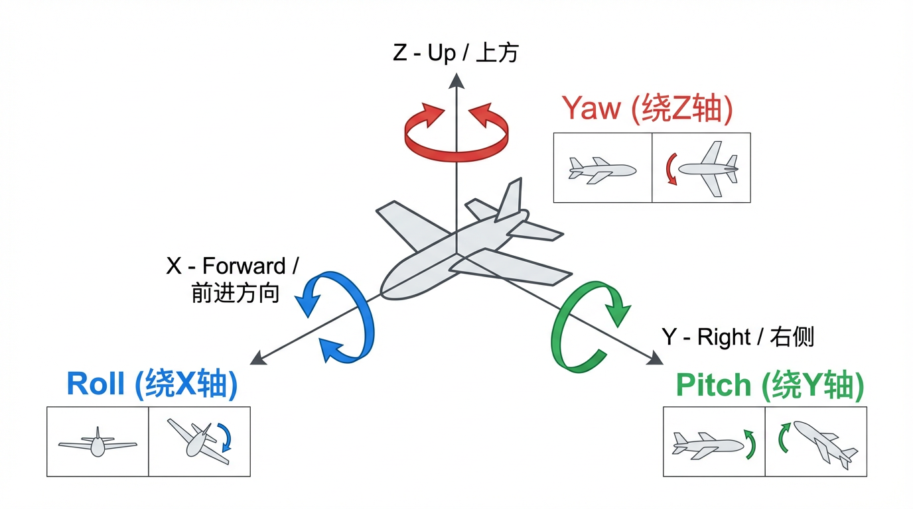

# 自净化、自强化数据飞轮建设 —— 术语详解

---

## 目录

- [一、大小脑交互范式相关术语](#一大小脑交互范式相关术语)
  - [1.1 分层/模块化架构 (Hierarchical/Modular Architecture)](#11-分层模块化架构-hierarchicalmodular-architecture)
  - [1.2 端到端 VLA 架构 (Vision-Language-Action E2E)](#12-端到端-vla-架构-vision-language-action-e2e)
  - [1.3 全身协同控制 (Whole-Body Control)](#13-全身协同控制-whole-body-control)
  - [1.4 Policy / 策略](#14-policy--策略)
  - [1.5 VLM (Vision Language Model) / 视觉语言模型](#15-vlm-vision-language-model--视觉语言模型)
- [二、数据输入与重映射层术语](#二数据输入与重映射层术语)
  - [2.1 任务空间 (Task Space) vs 关节空间 (Joint Space)](#21-任务空间-task-space-vs-关节空间-joint-space)
  - [2.2 重映射 / Retargeting](#22-重映射--retargeting)
  - [2.3 逆运动学 / IK (Inverse Kinematics)](#23-逆运动学--ik-inverse-kinematics)
  - [2.4 雅可比矩阵 (Jacobian Matrix)](#24-雅可比矩阵-jacobian-matrix)
  - [2.5 奇异点 (Singularity)](#25-奇异点-singularity)
  - [2.6 自碰撞 (Self-collision)](#26-自碰撞-self-collision)
  - [2.7 关节限位 (Joint Limits)](#27-关节限位-joint-limits)
  - [2.8 URDF (Unified Robot Description Format)](#28-urdf-unified-robot-description-format)
  - [2.9 二次规划 / QP (Quadratic Programming)](#29-二次规划--qp-quadratic-programming)
  - [2.10 6D Pose / 六自由度位姿](#210-6d-pose--六自由度位姿)
  - [2.11 RGB-D](#211-rgb-d)
  - [2.12 UMI (Universal Manipulation Interface)](#212-umi-universal-manipulation-interface)
- [三、在线监督与增强层术语](#三在线监督与增强层术语)
  - [3.1 Butterworth 低通滤波](#31-butterworth-低通滤波)
  - [3.2 卡尔曼滤波 (Kalman Filter)](#32-卡尔曼滤波-kalman-filter)
  - [3.3 样条插值 (Spline Interpolation)](#33-样条插值-spline-interpolation)
  - [3.4 运动学合规监督 (Kinematic Compliance)](#34-运动学合规监督-kinematic-compliance)
  - [3.5 Jerk / 加加速度](#35-jerk--加加速度)
  - [3.6 跟踪误差 (Tracking Error)](#36-跟踪误差-tracking-error)
  - [3.7 动作扭曲监督 (Distortion Detection)](#37-动作扭曲监督-distortion-detection)
- [四、验证与自净化层术语](#四验证与自净化层术语)
  - [4.1 开环回放 (Open-loop Replay)](#41-开环回放-open-loop-replay)
  - [4.2 运动捕捉 (Motion Capture)](#42-运动捕捉-motion-capture)
- [五、结构化与标签层术语](#五结构化与标签层术语)
  - [5.1 原子技能 (Atomic Skills)](#51-原子技能-atomic-skills)
  - [5.2 Gold / Silver / Trash 数据分级](#52-gold--silver--trash-数据分级)
- [六、训练方法相关术语](#六训练方法相关术语)
  - [6.1 模仿学习 / IL (Imitation Learning)](#61-模仿学习--il-imitation-learning)
  - [6.2 强化学习 / RL (Reinforcement Learning)](#62-强化学习--rl-reinforcement-learning)
  - [6.3 SFT (Supervised Fine-Tuning) / 监督微调](#63-sft-supervised-fine-tuning--监督微调)
  - [6.4 RLHF (Reinforcement Learning from Human Feedback)](#64-rlhf-reinforcement-learning-from-human-feedback)
  - [6.5 DPO (Direct Preference Optimization) / 直接偏好优化](#65-dpo-direct-preference-optimization--直接偏好优化)
  - [6.6 数据飞轮 (Data Flywheel)](#66-数据飞轮-data-flywheel)
- [参考文献](#参考文献)

---

## 一、大小脑交互范式相关术语

> 原文语境：文档第一部分"大小脑交互范式梳理"描述了三种机器人控制范式——分层架构、端到端 VLA、全身协同控制。"大脑"指高层语义决策（如 Agent、VLA），"小脑"指底层运动控制（如关节伺服、轨迹跟踪）。

### 1.1 分层/模块化架构 (Hierarchical/Modular Architecture)

**原文**：*"Agent 接受自然语言，发布目标位姿——planning + navigation + following 的经典分层控制，依赖环境建图。"*

**解释**：

分层/模块化架构是机器人系统最经典的设计范式，将一个复杂任务分解为多个层次的子问题，每层负责不同粒度的决策：

| 层级 | 功能 | 典型方法 |
|------|------|----------|
| **任务规划层 (Task Planning)** | 理解自然语言指令，分解为子任务序列 | LLM Agent、行为树 |
| **路径规划层 (Path Planning / Navigation)** | 在环境地图中搜索无碰撞路径 | A\*、RRT、Nav2 |
| **运动控制层 (Motion Control / Following)** | 跟踪规划路径，输出关节力矩或位置指令 | PID、MPC、阻抗控制 |

这种架构的优势在于**模块解耦**：每个模块可以独立开发和测试，便于调试和替换。劣势在于依赖精确的环境地图（SLAM），且层间信息传递存在延迟和信息损失。

代表性工作包括 ROS 2 Navigation Stack（Nav2）中的"全局规划 + 局部规划 + 控制器"三层架构 [参考文献 9]，以及 HOVER 等统一控制器框架在分层思想上的延伸。

---

### 1.2 端到端 VLA 架构 (Vision-Language-Action E2E)

**原文**：*"VLA 输入图片和指令，输出关节——需要合适的 data 以及 data 生成的 policy，监督遥操的数据质量 + kinematics 映射。"*

**解释**：

VLA（Vision-Language-Action）模型是一类将**视觉观测**、**自然语言指令**直接映射到**机器人动作**的端到端神经网络模型。与分层架构不同，VLA 不需要显式的地图、路径规划或运动学求解器——一个统一的模型完成从感知到执行的全过程。

**核心架构**（以 OpenVLA 为例）：

```
输入：RGB 图像 + 语言指令 (如 "把杯子放到盘子上")
  ↓
视觉编码器 (DINOv2 + SigLIP 融合)
  ↓  
投影层 → 映射到语言模型输入空间
  ↓
大语言模型骨干 (如 Llama 2 7B)
  ↓
输出：离散化的动作 token → 解码为连续关节动作
```

**代表性工作**：

- **RT-2-X** (Google DeepMind, 2023): 55B 参数的闭源 VLA，在 Open X-Embodiment 数据集上训练
- **OpenVLA** (Stanford, 2024): 7B 参数开源 VLA，基于 Llama 2 + DINOv2/SigLIP，在 970k 真实机器人演示上训练，比 RT-2-X 高 16.5% 成功率且参数少 7 倍 [参考文献 4]
- **SmolVLA**, **Pi0**, **Gr00t** 等也是 LeRobot 框架支持的 VLA 策略

VLA 对**数据质量**极其敏感：遥操采集的数据需要精确的 kinematics 映射（关节角与末端位姿的准确对应），否则策略会学到错误的动作-观测关联。这正是本文档数据飞轮要解决的核心问题。

---

### 1.3 全身协同控制 (Whole-Body Control)

**原文**：*"直接发布任务指令——从双手到全身的 policy，需要全身动捕数据引入以及 RL 结合 IL 的 training。"*

**解释**：

全身协同控制（Whole-Body Control, WBC）是让人形机器人同时协调**躯干、双臂、双手、腿部**等所有自由度来完成复杂任务的技术。与单臂操作不同，全身控制需要解决：

- **高维控制问题**：人形机器人通常有 30-56 个自由度（DoF），状态空间和动作空间都极其庞大
- **多接触约束**：脚与地面接触（维持平衡）、手与物体接触（完成操作）需要同时满足
- **动态平衡**：在执行操作任务的同时维持整体稳定性（如 ZMP 约束）

**典型方法**：

- **HWC-Loco** (2025): 分层全身控制框架，高层策略负责目标跟踪/安全恢复的切换，低层策略执行具体关节控制 [参考文献 9]
- **Puppeteer** (2024): 用分层世界模型实现视觉全身控制——高层"提线人"生成运动命令，低层"追踪器"执行关节级跟踪
- **HOVER** (2024): 统一多模式人形控制器，通过策略蒸馏将多种控制模式（运动追踪、根速度追踪等）整合到一个网络中

原文指出，全身协同控制需要**全身动捕数据**（通常由动作捕捉系统获取人类全身运动）以及 **RL + IL 混合训练**——先用模仿学习获得初始策略，再用强化学习增强泛化性和鲁棒性。

---

### 1.4 Policy / 策略

**原文多处出现**：*"data 生成的 policy"、"从双手到全身的 policy"、"高价值 Policy 训练库"*

**解释**：

在机器人学习领域，**策略（Policy）** 是指从**观测（Observation）到动作（Action）的映射函数** \(\pi: \mathcal{O} \rightarrow \mathcal{A}\)。

- **输入（观测）**：可以是 RGB 图像、关节角度、末端位姿、力/力矩传感器数据等
- **输出（动作）**：可以是关节角度指令、末端位姿增量、夹爪开合宽度等
- **实现方式**：可以是显式规则（如 PID 控制器）、概率模型（如高斯混合模型）、神经网络（如 Diffusion Policy、ACT、VLA 等）

在 LeRobot 框架中，所有策略都遵循统一接口：

- `select_action()`：推理时使用，根据当前观测输出动作
- `forward()`：训练时使用，计算损失函数

策略的质量直接取决于训练数据的质量，这也是本文档强调数据飞轮建设的核心原因。

---

### 1.5 VLM (Vision Language Model) / 视觉语言模型

**原文**：*"如 VLM 视觉确认"*

**解释**：

VLM（Vision Language Model，视觉语言模型）是能同时理解**图像**和**文本**的多模态大模型。在本文档的数据飞轮中，VLM 被用于**质量验证**——在开环回放后，通过 VLM 对回放结果进行视觉确认，判断任务是否完成（如"杯子是否放到了盘子上"）。

与 VLA 的区别：

| 模型 | 输入 | 输出 | 用途 |
|------|------|------|------|
| VLM | 图像 + 文本 | 文本（描述/判断） | 场景理解、任务验证 |
| VLA | 图像 + 文本指令 | 机器人动作序列 | 直接控制机器人 |

VLM 可视为 VLA 的"感知子集"——VLA 在 VLM 的基础上增加了动作输出能力。

---

## 二、数据输入与重映射层术语

> 原文语境：文档第二部分"输入与重映射层"和"阶段一：构建高鲁棒性的无本体数据重映射与过滤引擎"描述了如何将人类演示数据转换为机器人可执行的轨迹数据。

### 2.1 任务空间 (Task Space) vs 关节空间 (Joint Space)

**原文**：*"任务空间 -> 关节空间：针对 umi 类设备"*

**解释**：

这是机器人学中两个最基本的坐标空间概念：

**任务空间（Task Space）**，又称笛卡尔空间（Cartesian Space）或操作空间（Operational Space）：

- 描述末端执行器（如机械手）在三维世界中的**位置**和**姿态**
- 通常用 6 个变量表示：3 个平移分量 (x, y, z) + 3 个旋转分量 (roll, pitch, yaw)
- 直觉上对应"手在空间中的位置和朝向"

**关节空间（Joint Space）**，又称配置空间（Configuration Space, C-space）：

- 描述机器人每个关节的**角度值**
- 一个 n 自由度机器人的关节空间是 n 维的，如 6 轴机械臂有 6 个关节角 \(q = [q_1, q_2, ..., q_6]\)
- 直觉上对应"每个电机转了多少度"

两者之间的转换：
- **正运动学（Forward Kinematics, FK）**：关节空间 → 任务空间（给定关节角，计算末端位姿）
- **逆运动学（Inverse Kinematics, IK）**：任务空间 → 关节空间（给定末端位姿，求解关节角）

在数据飞轮中，UMI 等设备采集到的是任务空间数据（末端 6D 位姿），需要通过 IK 转换到关节空间才能在特定机器人上执行。

---

### 2.2 重映射 / Retargeting

**原文**：*"无本体重映射（Retargeting）：将人类手臂/设备的运动空间映射到机械臂空间，可以扩充数据源。"*

**解释**：

**运动重映射（Motion Retargeting）** 是将一种实体（如人类、另一台机器人、VR 控制器）的运动数据映射到目标机器人上的技术。由于人类与机器人在物理结构上存在显著差异（臂长、自由度数量、关节范围等），这种映射并非简单的坐标变换，而是一个带约束的优化问题。

**核心挑战（原文称之为"体现差距 / Embodiment Gap"）**：

- 人类肩关节有约 7 个自由度，而很多机械臂只有 6 个
- 人类手臂长度与机器人臂展不同
- 人类能做的动作（如手臂穿过躯干前方）可能使机器人超出关节限位或进入奇异点

**前沿方法**：

| 方法 | 年份 | 思路 | 速度 |
|------|------|------|------|
| **SEW-Mimic** | 2026 | 闭式几何解——对齐肩-肘-腕（SEW）关键点方向，无需 Jacobian 矩阵 | 3 kHz [参考文献 1] |
| **GMR** | 2025 | 基于优化的 IK 重映射，减少滑步、自穿透等伪影，支持 17+ 种人形机器人 | 实时 [参考文献 2] |
| **GeoRT** | 2025 | 神经网络手部重映射，保持运动保真度和 C-space 覆盖率 | 1 kHz [参考文献 3] |

原文强调"无本体重映射"——即**不需要操作者直接操控目标机器人本体**，而是用其他设备（UMI 夹爪、VR 手柄等）采集数据，再通过 Retargeting 映射到目标机械臂。这可以大幅扩充数据源，因为一次人类演示可以映射到多种不同的机器人平台。

---

### 2.3 逆运动学 / IK (Inverse Kinematics)

**原文**：*"带约束的 IK 求解器：除了求逆，引入碰撞检测、奇异点规避、关节限位的优化问题。"*

**解释**：

**逆运动学（Inverse Kinematics, IK）** 是给定末端执行器的期望位姿 \(T_{desired}\)，求解使机器人末端到达该位姿的关节角度 \(q\) 的过程：

\[
FK(q) = T_{desired} \quad \Rightarrow \quad q = IK(T_{desired})
\]

**IK 的复杂性**：
- **可能无解**：期望位姿超出机器人工作空间时没有可行的关节角
- **可能有多个解**：同一末端位姿可以由不同的关节角组合达到（如"肘部朝上"或"肘部朝下"）
- **可能对误差敏感**：在奇异点附近，微小的末端位移需要巨大的关节角变化

**求解方法**：

1. **解析法（Analytical/Closed-form）**：对特定构型的机械臂可以推导出公式解，速度极快但通用性差
2. **数值迭代法**：
   - **Newton-Raphson**：直接求 Jacobian 逆，\(q_{k+1} = q_k + J^{-1}(q_k) \cdot e_k\)
   - **Levenberg-Marquardt (LM)**：阻尼最小二乘法，在奇异点附近更稳定
   - **Gauss-Newton (GN)**：使用伪逆 \(J^\dagger\) 求解
3. **基于优化的方法（QP-based IK）**：将 IK 建模为二次规划问题，可以同时处理关节限位、碰撞避免等约束 [参考文献 8]

在数据飞轮中，IK 求解器是 Retargeting 引擎的核心组件——将人类演示的末端轨迹转换为机器人关节轨迹。原文强调需要"带约束的 IK 求解器"，即在求解过程中同时考虑碰撞检测和关节限位。

---

### 2.4 雅可比矩阵 (Jacobian Matrix)

**解释**：

**雅可比矩阵（Jacobian Matrix）** 是机器人运动学中最核心的数学工具之一，它描述了**关节速度**与**末端执行器速度**之间的线性映射关系：

\[
v = J(q) \cdot \dot{q}
\]

其中：
- \(v = [\dot{x}, \dot{y}, \dot{z}, \omega_x, \omega_y, \omega_z]^T\) 是末端的 6 维笛卡尔速度向量（3 个线速度 + 3 个角速度）
- \(\dot{q} = [\dot{q}_1, \dot{q}_2, ..., \dot{q}_n]^T\) 是 n 维关节速度向量
- \(J(q)\) 是 \(6 \times n\) 的雅可比矩阵，是关节角 \(q\) 的函数

**在逆运动学中的作用**：通过求逆 \(\dot{q} = J^{-1}(q) \cdot v\) 可以从期望的末端速度计算需要的关节速度。当 \(J\) 不可逆（奇异时）这个等式无法求解。

**在 Retargeting 中的意义**：传统遥操作系统使用 Jacobian 的逆/伪逆来实时将操作者的末端运动映射到关节运动。SEW-Mimic 等新方法摆脱了对 Jacobian 的依赖，用几何方法直接求解，避免了奇异点问题 [参考文献 1]。

---

### 2.5 奇异点 (Singularity)

**原文**：*"关键点：处理奇异点（Singularity）……人类能做的动作，机械臂可能会超出轴限。"*

**解释**：

**奇异点（Singularity）** 是机器人运动学中一种特殊的关节配置，在该配置下机器人**丧失一个或多个自由度**，导致：

1. **Jacobian 矩阵行列式为零**（\(\det(J) = 0\)），逆速度运动学方程无法求解
2. **末端执行器在某些方向上无法移动**——被"锁定"
3. **关节速度趋于无穷大**——即使末端只需要微小移动，某些关节也需要极速旋转
4. **逆运动学退化**——可能有无穷多解或无解

**六轴机械臂的三种典型奇异点**：

| 类型 | 条件 | 现象 |
|------|------|------|
| **腕部奇异点 (Wrist Singularity)** | 关节 4 和关节 6 的轴共线 | 末端绕某轴旋转时关节 4、6 同时高速旋转 |
| **肘部奇异点 (Elbow Singularity)** | 手臂完全伸直（肘角为 0°或 180°） | 手臂无法沿伸展方向移动 |
| **肩部奇异点 (Shoulder Singularity)** | 腕部中心落在关节 1 的旋转轴上 | 关节 1 无法确定旋转方向 |

**规避方法**：

- **路径规划层面**：规划路径时绕开奇异点附近的区域
- **阻尼最小二乘法（Damped Least Squares, DLS）**：用 \(J^T(JJ^T + \lambda^2 I)^{-1}\) 代替 \(J^{-1}\)，通过引入阻尼因子 \(\lambda\) 在牺牲精度的前提下保持数值稳定
- **冗余自由度**：使用 7 轴机械臂（多一个自由度），利用冗余度绕过奇异配置
- **几何方法**：如 SEW-Mimic 完全避开 Jacobian，从根本上避免奇异点问题 [参考文献 1]

[参考文献 10] 提供了六轴机械臂奇异点的完整教程。

---

### 2.6 自碰撞 (Self-collision)

**原文**：*"处理……自碰撞（Self-collision）"*

**解释**：

**自碰撞（Self-collision）** 是指机器人自身的不同连杆（link）之间发生物理干涉——例如机械臂的前臂撞到自己的躯干，或双臂机器人的两条手臂相互碰撞。

**为何在 Retargeting 中尤为重要**：人类身体有天然的自碰撞避免机制（本体感觉和反射弧），做动作时不会撞到自己。但将人类运动映射到机器人后，由于连杆长度和关节范围的差异，原本安全的人类动作可能导致机器人自碰撞。

**检测与避免方法**：

- **碰撞模型**：为机器人每个连杆建立简化几何体（球体、胶囊体、凸包），实时计算连杆间距离
- **距离约束**：在 IK 求解中加入不等式约束，要求任意两个可碰撞连杆间距离大于安全余量
- **QP-based IK**：将自碰撞约束作为二次规划的约束条件 [参考文献 8]
- **PlaCo 库**：提供 `AvoidSelfCollisionsConstraint`，在运动学求解器中直接添加自碰撞约束

---

### 2.7 关节限位 (Joint Limits)

**原文**：*"处理……关节限位（Joint limits）。人类能做的动作，机械臂可能会超出轴限。"*

**解释**：

**关节限位（Joint Limits）** 是每个关节角度的物理或软件上下界。分为：

- **位置限位**：关节角度范围，如 \(q_{min} \leq q_i \leq q_{max}\)，由机械结构决定
- **速度限位**：关节角速度上限 \(|\dot{q}_i| \leq \dot{q}_{max}\)，由电机性能决定
- **加速度限位**：关节角加速度上限 \(|\ddot{q}_i| \leq \ddot{q}_{max}\)，由电机力矩和负载决定
- **力矩限位**：关节输出力矩上限，由电机和减速器决定

**在 Retargeting 中的意义**：人类手臂的活动范围通常远大于机械臂的关节限位。例如，人类肩关节可以旋转约 360°，但很多工业机械臂的肩关节只有 ±170°。将人类动作映射到机器人时，必须确保映射后的关节角不超出限位，否则可能损坏机器人硬件。

---

### 2.8 URDF (Unified Robot Description Format)

**原文**：*"引入机器人 URDF 模型：将特定机械臂的物理参数输入系统。"*

**解释**：

**URDF（Unified Robot Description Format，统一机器人描述格式）** 是 ROS 生态中用于描述机器人物理结构的标准 XML 格式文件。URDF 文件包含：

- **连杆（Link）**：每个刚体部件的几何形状（碰撞体和可视化体）、质量、惯性矩阵
- **关节（Joint）**：连接两个连杆的运动副类型（旋转、平移、固定等）、关节轴方向、关节限位（位置/速度/力矩上下限）
- **运动学链（Kinematic Chain）**：从基座到末端执行器的关节-连杆链

```xml
<!-- URDF 示例片段 -->
<robot name="my_arm">
  <link name="base_link">
    <inertial> <mass value="5.0"/> ... </inertial>
    <collision> <geometry> <cylinder length="0.1" radius="0.05"/> </geometry> </collision>
  </link>
  <joint name="joint1" type="revolute">
    <parent link="base_link"/>
    <child link="link1"/>
    <axis xyz="0 0 1"/>
    <limit lower="-3.14" upper="3.14" velocity="2.0" effort="50.0"/>
  </joint>
  ...
</robot>
```

在数据飞轮的 Retargeting 引擎中，URDF 提供了目标机器人的完整物理参数——连杆长度、关节限位、碰撞几何等。IK 求解器读取 URDF 来建立运动学模型，确保重映射后的轨迹是物理可行的。Python 中可用 `roboticstoolbox` 或 `pinocchio` 库直接加载 URDF 进行运动学计算。

---

### 2.9 二次规划 / QP (Quadratic Programming)

**原文**：*"引入碰撞检测、奇异点规避、关节限位的优化问题（如二次规划 QP）。"*

**解释**：

**二次规划（Quadratic Programming, QP）** 是一种优化方法，目标函数为二次型，约束为线性等式和不等式：

\[
\min_x \quad \frac{1}{2} x^T Q x + c^T x
\]
\[
\text{s.t.} \quad Ax \leq b, \quad A_{eq} x = b_{eq}, \quad x_{lb} \leq x \leq x_{ub}
\]

**在 IK 中的应用**：将逆运动学建模为 QP 问题，可以在求解关节角的同时处理多种约束：

\[
\min_{\dot{q}} \quad \frac{1}{2} \|\dot{q}\|^2 \quad \text{(最小化关节速度)}
\]
\[
\text{s.t.} \quad J(q)\dot{q} = v_{desired} \quad \text{(末端速度约束)}
\]
\[
q_{min} \leq q + \dot{q}\Delta t \leq q_{max} \quad \text{(关节限位)}
\]
\[
d(q + \dot{q}\Delta t) \geq d_{safe} \quad \text{(碰撞距离约束)}
\]

QP 的优势在于可以同时优化多个目标（如关节速度最小化、操作度最大化）并满足硬约束（关节限位、碰撞避免），且有高效的数值求解器（如 OSQP、qpOASES）。Robotics Toolbox for Python 的 `ikine_QP` 方法和 PlaCo 库都基于 QP 实现全身 IK [参考文献 8]。

---

### 2.10 6D Pose / 六自由度位姿

**原文**：*"接收 UMI、VR 等设备采集的 RGB-D 视频序列 + 末端 6D Pose 数据。"*

**解释**：

**6D Pose（六自由度位姿）** 完整描述了一个刚体在三维空间中的位置和方向，由 6 个自由度组成：

- **3 个平移自由度**：沿 x, y, z 轴的位置 \((t_x, t_y, t_z)\)
- **3 个旋转自由度**：绕三个轴的旋转，可以用多种方式表示
  - 欧拉角 (roll, pitch, yaw)
  - 四元数 \((q_w, q_x, q_y, q_z)\)
  - 旋转矩阵 \(R \in SO(3)\)（3×3 正交矩阵）
  - 轴角表示 (axis-angle)

#### Roll / Pitch / Yaw 详解

Roll、Pitch、Yaw 是描述刚体三维旋转的三个**欧拉角（Euler Angles）**，最初来源于航空领域对飞机姿态的描述，后被广泛用于机器人学。用飞机作为类比最为直观：



| 名称 | 中文 | 旋转轴 | 直觉理解 | 生活类比 |
|------|------|--------|----------|----------|
| **Roll（横滚）** | 横滚角 | 绕 X 轴（前进方向）旋转 | 身体左右倾斜 | 摩托车过弯时的侧倾；飞机做桶滚动作 |
| **Pitch（俯仰）** | 俯仰角 | 绕 Y 轴（侧向）旋转 | 抬头或低头 | 点头动作；飞机爬升或俯冲 |
| **Yaw（偏航）** | 偏航角 | 绕 Z 轴（竖直向上）旋转 | 左转或右转 | 摇头动作；汽车转弯改变朝向 |

**在机械臂末端执行器中的含义**：

假设机械臂夹爪的"前方"是 X 轴（夹爪张开的方向），那么：

- **Roll** = 夹爪绕自身前方轴旋转 → 比如拧螺丝时手腕的旋转动作
- **Pitch** = 夹爪抬起或压下 → 比如将杯子从竖直翻转为倾斜倒水
- **Yaw** = 夹爪在水平面内左右转动 → 比如将物体从面向左侧转为面向前方

**数学表示**：三个欧拉角可以组合成一个 3×3 旋转矩阵 \(R\)。以 ZYX 顺序（先 Yaw 再 Pitch 最后 Roll，这是机器人学中最常用的约定）：

\[
R = R_z(\psi) \cdot R_y(\theta) \cdot R_x(\phi)
\]

其中 \(\phi\) = Roll, \(\theta\) = Pitch, \(\psi\) = Yaw，各轴的基本旋转矩阵为：

\[
R_x(\phi) = \begin{bmatrix} 1 & 0 & 0 \\ 0 & \cos\phi & -\sin\phi \\ 0 & \sin\phi & \cos\phi \end{bmatrix}, \quad
R_y(\theta) = \begin{bmatrix} \cos\theta & 0 & \sin\theta \\ 0 & 1 & 0 \\ -\sin\theta & 0 & \cos\theta \end{bmatrix}, \quad
R_z(\psi) = \begin{bmatrix} \cos\psi & -\sin\psi & 0 \\ \sin\psi & \cos\psi & 0 \\ 0 & 0 & 1 \end{bmatrix}
\]

**欧拉角的万向锁（Gimbal Lock）问题**：当 Pitch 角接近 ±90° 时，Roll 和 Yaw 会退化为同一个旋转轴，导致丢失一个旋转自由度。这就是为什么实际工程中常用**四元数**（quaternion）代替欧拉角——四元数没有万向锁问题，且插值更平滑。

完整的 6D 位姿通常用**齐次变换矩阵** \(T \in SE(3)\) 表示：

\[
T = \begin{bmatrix} R & t \\ 0 & 1 \end{bmatrix} \in \mathbb{R}^{4 \times 4}
\]

在 UMI 系统中，通过 GoPro 相机 + ORB-SLAM3 视觉惯性 SLAM 来追踪手持夹爪的 6D 位姿，精度可达毫米级，作为策略学习的动作数据 [参考文献 7]。

---

### 2.11 RGB-D

**原文**：*"接收 UMI、VR 等设备采集的 RGB-D 视频序列"*

**解释**：

**RGB-D** 是指同时包含**彩色图像（RGB）** 和**深度信息（Depth）** 的传感数据格式：

- **RGB**：标准三通道彩色图像，提供外观、纹理、颜色信息
- **D（Depth）**：每个像素对应的深度值（距离相机的距离），通常以毫米为单位

**常见获取设备**：
- Intel RealSense 系列（D435、D455 等）——通过结构光或双目立体获取深度
- Microsoft Azure Kinect——ToF（飞行时间）深度传感器
- Luxonis OAK-D——双目深度 + 神经网络加速

RGB-D 数据在机器人中的价值：提供三维场景理解能力——结合相机内参可以将 2D 像素 + 深度值还原为 3D 点云，用于物体定位、抓取点估计、障碍物检测等。在数据飞轮中，即使轨迹数据因 IK 无解而无法重映射（分支 C），RGB-D 图像仍可用于视觉预训练或奖励模型训练。

---

### 2.12 UMI (Universal Manipulation Interface)

**原文**：*"针对 umi 类设备"、"接收 UMI、VR 等设备采集的……数据"*

**解释**：

**UMI（Universal Manipulation Interface，通用操控接口）** 是斯坦福大学于 2024 年提出的一种便携式数据采集和策略学习框架，获得了 RSS 2024 最佳系统论文奖提名 [参考文献 7]。

**核心设计**：
- **手持式夹爪**：3D 打印的平行夹爪，模拟机器人末端执行器的形态
- **腕部 GoPro 相机**：鱼眼广角镜头，采集第一人称视角 RGB 图像
- **6D 位姿追踪**：通过 ORB-SLAM3 视觉惯性 SLAM 从 GoPro 视频中提取精确的末端 6D 位姿
- **策略接口**：使用相对 SE(3) 变换作为动作表示，实现硬件无关性

**工作流程**：

```
人类手持 UMI 夹爪演示任务
  ↓
GoPro 录制视频 + IMU 数据
  ↓
ORB-SLAM3 提取 6D 末端位姿序列
  ↓
训练 Diffusion Policy（输入 RGB 图像 + 相对位姿，输出动作序列）
  ↓
部署到 UR5 / Franka 等机器人（零样本迁移）
```

UMI 的关键创新在于**硬件无关性**——采集数据时不需要目标机器人在场，人类可以在任意环境中用手持夹爪演示，训练后的策略可以直接部署到不同的机器人平台。这正是原文中"无本体重映射"的典型应用场景。

---

## 三、在线监督与增强层术语

> 原文语境：文档"在线监督与增强层"描述了对遥操作信号进行实时质量控制的技术，包括信号平滑、运动学合规检查和动作扭曲检测。

### 3.1 Butterworth 低通滤波

**原文**：*"对遥操信号进行实时滤波（如 Butterworth 低通滤波、卡尔曼滤波）……消除人手的微小抖动。"*

**解释**：

**Butterworth 低通滤波器（Butterworth Low-pass Filter）** 是一种信号滤波器，特点是在通带内具有**最大平坦的频率响应**（无纹波），因此被广泛用于需要平滑但不失真的场景。

**在遥操作中的应用**：人类手部在操控设备时会产生高频微小抖动（通常 > 5-10 Hz），这些抖动如果直接发送给机器人关节电机，会导致电机振动、磨损加速。Butterworth 滤波器可以滤除这些高频噪声，只保留低频的有意运动。

**一阶 Butterworth 数字实现**（MoveIt2 中的实现方式 [参考文献 11]）：

\[
y_k = \frac{1}{1 + C} \cdot x_k + \frac{C - 1}{C + 1} \cdot y_{k-1}
\]

其中 \(C = \frac{2\pi}{\tan(\omega_d \cdot T)}\)，\(\omega_d\) 是截止频率，\(T\) 是采样周期。

一阶的优势：
- **不会过冲（overshoot）**：滤波后的信号不会超过输入信号的极值
- **计算效率高**：每个采样点只需一次乘加运算
- **只有一个调节参数**：截止频率（C 值越大 → 平滑效果越强，但延迟越大）

---

### 3.2 卡尔曼滤波 (Kalman Filter)

**原文**：*"对遥操信号进行实时滤波（如……卡尔曼滤波）"*

**解释**：

**卡尔曼滤波（Kalman Filter）** 是一种最优递归状态估计算法，通过融合**预测模型（运动方程）** 和**观测数据（传感器测量）** 来估计系统的真实状态，在两者之间取得最优平衡。

**核心思想（两步递归）**：

1. **预测步**：根据系统动力学模型预测下一时刻的状态
   \[
   \hat{x}_{k|k-1} = F_k \hat{x}_{k-1|k-1} + B_k u_k
   \]
   \[
   P_{k|k-1} = F_k P_{k-1|k-1} F_k^T + Q_k
   \]

2. **更新步**：用实际观测修正预测值
   \[
   K_k = P_{k|k-1} H_k^T (H_k P_{k|k-1} H_k^T + R_k)^{-1}
   \]
   \[
   \hat{x}_{k|k} = \hat{x}_{k|k-1} + K_k (z_k - H_k \hat{x}_{k|k-1})
   \]

其中 \(K_k\) 是**卡尔曼增益**——当传感器噪声小时（\(R_k\) 小），更信任观测值；当模型不确定性大时（\(Q_k\) 大），也更信任观测值。

**在遥操作中的应用**：
- **传感器融合**：融合多种传感器数据（如 Kinect 视觉 + IMU 惯性测量）来获取更准确的操作者手部位姿 [参考文献 12]
- **运动预测**：预测操作者未来的手部运动，补偿网络传输延迟
- **信号去噪**：假设手部运动满足某种动力学模型（如匀速运动），滤除不符合模型的高频噪声

与 Butterworth 滤波的区别：Butterworth 是纯频域滤波（不使用运动模型），卡尔曼滤波利用运动模型进行预测和修正，更适合非平稳信号。

---

### 3.3 样条插值 (Spline Interpolation)

**原文**：*"对遥操信号进行……样条插值"、"对解算出来的关节角序列进行滤波（如样条插值），确保不会引起电机剧烈震动。"*

**解释**：

**样条插值（Spline Interpolation）** 是通过分段低阶多项式来生成通过所有给定数据点的平滑曲线的技术。在机器人轨迹规划中，用于将离散的路径点（waypoints）连接成连续、平滑的关节角轨迹。

**常用类型及其连续性**：

| 类型 | 多项式阶数 | 连续性 | 特点 |
|------|-----------|--------|------|
| **线性插值** | 1 阶 | C⁰（仅位置连续） | 速度在路径点处不连续，会引起电机冲击 |
| **三次样条 (Cubic Spline)** | 3 阶 | C²（位置、速度、加速度连续） | 最常用，加速度连续但 Jerk 不连续 |
| **五次样条 (Quintic Spline)** | 5 阶 | C⁴（至 Jerk 连续） | 高速运动场景首选，Jerk 平滑 |
| **B 样条 (B-Spline)** | 可变 | 可调 | 局部控制性好，修改一个控制点不影响全局 |

**三次样条示例**（Python）：

```python
from scipy.interpolate import CubicSpline
import numpy as np

t = np.array([0, 1, 2, 3])        # 时间点
q = np.array([0, 0.5, 1.2, 0.8])  # 对应的关节角

cs = CubicSpline(t, q)
t_smooth = np.linspace(0, 3, 100)
q_smooth = cs(t_smooth)            # 平滑的关节角轨迹
v_smooth = cs(t_smooth, 1)         # 速度曲线（一阶导数）
a_smooth = cs(t_smooth, 2)         # 加速度曲线（二阶导数）
```

在数据飞轮中，样条插值有两个应用场景：

1. **遥操作信号平滑**：对人类操作者采集到的离散位姿序列进行样条拟合，得到连续平滑的参考轨迹
2. **IK 后处理**：IK 求解的关节角序列可能在相邻时间步之间有跳跃，通过样条插值平滑关节角轨迹，避免电机剧烈震动

[参考文献 14] 提供了多项式插值方法的详细教程和 Python 代码实现。

---

### 3.4 运动学合规监督 (Kinematic Compliance)

**原文**：*"运动学合规监督（Kinematic Compliance）：实时计算加速度、Jerk（加加速度）。如果超出机械臂硬件限制，立即触发降级（降速）或警告。"*

**解释**：

**运动学合规（Kinematic Compliance）** 是指实时监控机器人运动是否满足硬件的物理限制，确保轨迹在运动学上是"合规"的——即不会超出电机的能力范围。

**监控的关键量**：

| 指标 | 物理含义 | 限制来源 | 超限后果 |
|------|----------|----------|----------|
| **关节速度** \(\dot{q}\) | 关节旋转快慢 | 电机最大转速 | 电机失步/过热 |
| **关节加速度** \(\ddot{q}\) | 速度变化率 | 电机最大力矩 / 负载惯量 | 跟踪偏差增大 |
| **Jerk** \(\dddot{q}\) | 加速度变化率 | 减速器/传动系统的承受能力 | 机械振动/齿轮磨损 |

**合规监督的处理策略**：
- **降速（Speed Scaling）**：按比例缩小关节速度，使所有关节都在限位内
- **轨迹时间拉伸（Time Stretching）**：延长轨迹执行时间，降低速度和加速度峰值
- **告警与标记**：将超限片段标记为"不合规"，在数据飞轮中降级为 Silver 或 Trash

---

### 3.5 Jerk / 加加速度

**原文**：*"实时计算加速度、Jerk（加加速度）。"*

**解释**：

**Jerk（加加速度，又称急动度）** 是加速度对时间的导数，即位置的三阶导数：

\[
\text{Jerk} = \frac{d(\text{加速度})}{dt} = \frac{d^2(\text{速度})}{dt^2} = \frac{d^3(\text{位置})}{dt^3}
\]

**为什么 Jerk 对机器人很重要**：

- **人体感受**：人类对 Jerk 非常敏感（乘电梯的"顿挫感"就是高 Jerk 引起的）
- **机械寿命**：高 Jerk 会在减速器齿轮上产生冲击载荷，加速磨损
- **控制精度**：Jerk 不连续会导致电机控制信号出现阶跃，引起振动
- **运动平滑性**：Jerk 连续是"丝滑"运动的数学条件

**Jerk 限制的工程实践**：

典型的 Jerk 限制运动规划使用 7 段或 15 段 S 曲线（S-curve）加减速曲线，确保 Jerk 在整个轨迹中不超过设定阈值 [参考文献 13]。这比传统的梯形加减速（Jerk 为无穷大）运动更平滑，但计算更复杂。

在数据飞轮中，如果遥操采集到的轨迹 Jerk 超过机器人硬件限制，说明这段运动在真机上无法安全执行，应触发降速或标记。

---

### 3.6 跟踪误差 (Tracking Error)

**原文**：*"比较'操作者输入指令'与'机械臂实际执行（Follow-up）'的偏差（Tracking Error）。"*

**解释**：

**跟踪误差（Tracking Error）** 是指期望轨迹（参考指令）与实际执行轨迹之间的偏差：

\[
e(t) = q_{desired}(t) - q_{actual}(t)
\]

可以在关节空间（关节角偏差）或任务空间（末端位姿偏差）中计算。

**跟踪误差的来源**：

- **控制器带宽有限**：PID 控制器对高频指令的响应存在延迟
- **电机惯性**：电机无法瞬间改变速度
- **摩擦力**：关节摩擦导致的死区和滞后
- **外力干扰**：碰撞或接触力引起的轨迹偏移
- **通信延迟**：从指令发出到电机执行之间的延迟

**在数据飞轮中的用途**：跟踪误差是衡量遥操作数据质量的关键指标。如果误差过大，说明机器人无法忠实执行操作者的意图，该段数据不适合用于模仿学习（因为"观测到的状态"与"指令的动作"之间失去了对应关系）。

---

### 3.7 动作扭曲监督 (Distortion Detection)

**原文**：*"动作扭曲监督（Distortion Detection）：比较'操作者输入指令'与'机械臂实际执行'的偏差……偏差过大说明发生了碰撞或死锁，标记该片段。"*

**解释**：

**动作扭曲监督**是数据飞轮中的在线质量检测机制，通过持续监控跟踪误差来自动发现数据质量问题：

**检测逻辑**：

```
if |tracking_error| > threshold_warning:
    标记为 "注意" → 可能存在轻微卡顿
if |tracking_error| > threshold_critical:
    标记为 "扭曲" → 可能发生碰撞/死锁/IK 无解
    该片段降级为 Silver 或 Trash
```

**典型扭曲场景**：
- **碰撞**：机械臂撞到障碍物或自碰撞，实际轨迹停止但指令继续前进
- **死锁**：进入奇异点附近，关节无法响应末端移动指令
- **IK 无解**：期望位姿超出工作空间，求解器返回上一时刻的解，实际位姿不变
- **急停保护**：安全系统触发了紧急停止

---

## 四、验证与自净化层术语

> 原文语境：文档"验证与自净化层"描述了采集完成后的离线质量验证流程。

### 4.1 开环回放 (Open-loop Replay)

**原文**：*"开环回放（Open-loop Replay）：采集完成后，系统自动在仿真（或夜间闲置真机）中按固定频率回放动作。"*

**解释**：

**开环回放（Open-loop Replay）** 是将采集到的动作序列原样回放给机器人执行，**不使用任何反馈控制**来修正偏差：

- **开环（Open-loop）**：只执行预设的动作序列，不根据当前状态进行调整。与之对应的是**闭环（Closed-loop）**——根据实时观测调整动作
- **回放（Replay）**：将录制好的关节角序列按时间顺序发送给机器人

**为什么用开环回放做验证**：

开环回放是数据质量的"试金石"——如果一段关节角轨迹在开环回放下就能成功完成任务（如将零件放到指定位置），说明这段数据本身质量高，可以直接用于模仿学习训练。反之，如果回放失败（轨迹偏离、任务未完成），说明数据存在问题。

**验证流程**：

```
采集的关节角轨迹
  ↓
在仿真环境/夜间闲置真机中开环回放
  ↓
比较回放轨迹与采集轨迹的偏差
  ↓
用 VLM 视觉确认任务是否完成
  ↓
通过 → Gold（高价值训练数据）
未通过 → 降级为 Silver 或 Trash
```

---

### 4.2 运动捕捉 (Motion Capture)

**原文**：*"需要全身动捕数据引入"*

**解释**：

**运动捕捉（Motion Capture, MoCap）** 是通过传感器系统精确记录物体（通常是人体）运动的技术。在机器人学中，用于：

- **采集人类全身运动数据**：为全身控制策略提供训练数据
- **遥操作**：实时追踪操作者的身体姿态来控制人形机器人

**常见技术**：

| 类型 | 代表产品 | 原理 | 精度 |
|------|----------|------|------|
| 光学标记式 | Vicon、OptiTrack | 多红外相机追踪反光标记球 | < 0.1 mm |
| 惯性式 | Xsens、Noitom | 身上穿戴 IMU 传感器 | ~ 1-5° 关节角 |
| 无标记式（视觉） | 单目/多目相机 + 姿态估计 | 深度学习估计人体关键点 | ~ 5-20 mm |
| VR 设备 | Meta Quest 3、HTC Vive | inside-out/outside-in 追踪 | ~ 1-3 mm |

在全身协同控制中，动捕数据提供了"参考运动"——人形机器人通过模仿这些参考运动来学习自然、稳定的全身运动策略。GMR 等 Retargeting 方法可以将动捕数据映射到不同的人形机器人平台 [参考文献 2]。

---

## 五、结构化与标签层术语

> 原文语境：文档"结构化与标签层"描述了如何对清洗后的数据进行分级分类和技能标注。

### 5.1 原子技能 (Atomic Skills)

**原文**：*"原子技能库（Atomic Skills）映射：比如 Approach（靠近）、Grasp（抓取）、Transport（转移）、Insert（插入）。通过力矩突变、夹爪开合状态和速度变化结合腕部相机来自动切分动作片段——trunk。"*

**解释**：

**原子技能（Atomic Skills）** 是机器人操作任务中不可再分的**最小操作单元**。一个复杂的操作任务可以被分解为多个原子技能的有序组合：

```
"拧螺丝" = Approach → Align → Grasp → Transport → Insert → Tighten → Release → Retract
```

**常见原子技能**：

| 技能 | 英文 | 描述 | 典型特征 |
|------|------|------|----------|
| 靠近 | Approach | 末端从初始位置移向目标物体 | 速度由高到低，无接触力 |
| 对准 | Align | 调整末端姿态以匹配抓取角度 | 低速旋转为主 |
| 抓取 | Grasp | 夹爪闭合抓住物体 | 夹爪宽度突变，力矩突增 |
| 转移 | Transport | 抓着物体从一处移到另一处 | 有负载的稳定运动 |
| 插入 | Insert | 将物体插入孔位或放入容器 | 速度降低，力矩波动 |
| 释放 | Release | 夹爪张开释放物体 | 夹爪宽度突变 |

**自动切分方法**：原文提到通过以下信号的突变来自动识别技能边界：
- **力矩突变**：抓取瞬间力传感器读数急剧变化
- **夹爪开合状态变化**：夹爪从开到闭（抓取）或从闭到开（释放）
- **速度变化**：从快速运动切换到慢速精细操作
- **腕部相机图像变化**：通过视觉确认物体状态变化

原子技能库的价值在于可以将长轨迹切分为短片段，每个片段可以独立训练和评估，也可以组合成更复杂的技能序列。

---

### 5.2 Gold / Silver / Trash 数据分级

**原文**：
- *"可用（Gold）：轨迹平滑，完成任务，直接进入 Mid-training（SFT / 模仿学习）。"*
- *"一般/次优（Silver）：有卡顿或试错过程。可提取为 Post-training（RLHF/DPO 的负样本或次优偏好数据）。"*
- *"不可用（Trash）：碰撞、IK 无解、严重畸变，直接丢弃。"*

**解释**：

这是数据飞轮中的**数据质量分级体系**，将采集到的轨迹数据按质量分为三个等级，对应不同的下游用途：

```
          ┌─────────┐
          │ 采集数据 │
          └────┬────┘
               │
      ┌────────┼────────┐
      ▼        ▼        ▼
  ┌──────┐ ┌──────┐ ┌──────┐
  │ Gold │ │Silver│ │Trash │
  └──┬───┘ └──┬───┘ └──┬───┘
     │        │        │
     ▼        ▼        ▼
  SFT/IL   RLHF/DPO   丢弃
 (正样本)  (偏好数据)
```

| 等级 | 条件 | 用途 | 训练阶段 |
|------|------|------|----------|
| **Gold** | 轨迹平滑、IK 全程有解、任务完成 | 模仿学习的正样本 | Mid-training (SFT) |
| **Silver** | 有部分卡顿/试错但最终完成或部分完成 | RLHF/DPO 中的次优/负偏好样本 | Post-training (RLHF/DPO) |
| **Trash** | 碰撞、IK 无解、严重畸变 | 无法使用 | 直接丢弃 |

这种分级机制借鉴了 LLM 训练中的多阶段范式：先用高质量数据做 SFT（类似 Gold），再用偏好对比数据做 RLHF/DPO（类似 Gold vs Silver）。Silver 数据虽然不够完美，但作为"什么是不好的"参考样本同样有价值。

---

## 六、训练方法相关术语

> 原文语境：文档多处提到不同的训练方法，包括模仿学习、强化学习、SFT、RLHF、DPO 等，以及贯穿全文的"数据飞轮"概念。

### 6.1 模仿学习 / IL (Imitation Learning)

**原文**：*"SFT / 模仿学习"、"RL 结合 IL 的 training"*

**解释**：

**模仿学习（Imitation Learning, IL）** 是从专家演示数据中学习策略的方法——"看别人怎么做，自己也这样做"。

**主要范式**：

1. **行为克隆（Behavioral Cloning, BC）**：将模仿学习转化为监督学习问题
   - 数据集：\(\{(o_t, a_t)\}\)——专家在观测 \(o_t\) 下执行的动作 \(a_t\)
   - 训练：最小化 \(\mathcal{L} = \sum_t \|policy(o_t) - a_t\|^2\)
   - 优点：简单高效，等同于标准监督学习
   - 缺点：分布偏移（compounding error）——策略在训练时看到的是专家状态分布，部署时自身的小误差会累积导致偏离专家分布

2. **逆强化学习（Inverse Reinforcement Learning, IRL）**：从演示中推断专家的奖励函数，再用 RL 优化
   - 优点：学到的是"意图"而非"表面行为"，泛化性更强
   - 缺点：计算代价高

3. **DAgger（Dataset Aggregation）**：交互式模仿学习，通过在线查询专家来修正分布偏移

在数据飞轮中，Gold 级数据直接用于模仿学习（行为克隆），是最高效的训练方式。LeRobot 框架中的 ACT、Diffusion Policy 等都是模仿学习策略。

---

### 6.2 强化学习 / RL (Reinforcement Learning)

**原文**：*"RL 结合 IL 的 training"、"用于 RL 训练"*

**解释**：

**强化学习（Reinforcement Learning, RL）** 是智能体（Agent）通过与环境的**试错交互**来学习最优策略的方法。核心要素：

- **状态 (State, s)**：环境的当前情况
- **动作 (Action, a)**：智能体做出的决策
- **奖励 (Reward, r)**：环境对动作好坏的反馈信号
- **策略 (Policy, \(\pi\))**：从状态到动作的映射
- **目标**：最大化累积折扣奖励 \(J = \mathbb{E}\left[\sum_{t=0}^{T} \gamma^t r_t\right]\)

**与模仿学习的区别**：

| 维度 | 模仿学习 (IL) | 强化学习 (RL) |
|------|---------------|---------------|
| 数据来源 | 专家演示 | 自身探索 |
| 反馈信号 | 无（直接复制动作） | 奖励函数 |
| 探索能力 | 弱（受限于演示分布） | 强（可发现新策略） |
| 样本效率 | 高（少量演示即可学习） | 低（需要大量交互） |
| 安全性 | 高（模仿安全行为） | 低（探索可能危险） |

**在数据飞轮中的角色**：RL 可以：
- 对 IL 策略进行"精调"——先用 IL 获得初始策略，再用 RL 提升性能
- 训练纠错（Recovery）能力——用 Silver 数据标记的次优片段训练 RL 纠错策略
- 残差 RL（Residual RL）——在 IL 基础策略上叠加 RL 残差策略，如 DexFlyWheel 中的做法 [参考文献 5]

---

### 6.3 SFT (Supervised Fine-Tuning) / 监督微调

**原文**：*"直接进入 Mid-training（SFT / 模仿学习）"*

**解释**：

**SFT（Supervised Fine-Tuning，监督微调）** 是在高质量标注数据上对预训练模型进行监督学习训练的过程。

**在 LLM 领域**：
- 基础模型经过海量文本预训练后，通过 SFT 在精心标注的"指令-回答"数据对上微调，使模型学会遵从指令
- 训练损失：标准交叉熵损失 \(\mathcal{L}_{SFT} = -\sum_t \log P(y_t | y_{<t}, x)\)

**在机器人领域**：
- SFT 等同于行为克隆——在"观测-动作"数据对上进行监督训练
- VLA 模型（如 OpenVLA）的训练本质上就是 SFT：在大规模机器人演示数据集上微调视觉语言模型

**在数据飞轮中的位置**：SFT 是 "Mid-training" 阶段，使用 Gold 级数据（轨迹平滑、任务完成的高质量演示）进行训练。这是训练流水线中的第一步，为后续的 RLHF/DPO 偏好优化奠定基础。

---

### 6.4 RLHF (Reinforcement Learning from Human Feedback)

**原文**：*"可提取为 Post-training（RLHF / DPO 的负样本或次优偏好数据）"*

**解释**：

**RLHF（Reinforcement Learning from Human Feedback，基于人类反馈的强化学习）** 是在 SFT 之后，利用人类偏好判断来进一步优化模型的技术。RLHF 是使 ChatGPT 等模型"对齐"人类价值观的关键技术 [参考文献 15]。

**三阶段流程**：

```
阶段 1：SFT
  在高质量数据上监督微调 → 得到 SFT 模型

阶段 2：奖励模型训练
  SFT 模型生成多个回答 → 人类标注偏好排序
  → 训练奖励模型 R(x, y) 预测人类偏好分数

阶段 3：RL 优化（PPO）
  用奖励模型的分数作为奖励信号
  → 用 PPO 算法优化策略，最大化奖励同时约束与 SFT 模型的 KL 散度
```

\[
\max_{\pi} \mathbb{E}_{x, y \sim \pi}[R(x, y)] - \beta \cdot D_{KL}[\pi(y|x) \| \pi_{ref}(y|x)]
\]

**在机器人数据飞轮中的应用**：
- **Gold 数据** → 对应 RLHF 中的"好回答"（chosen）
- **Silver 数据** → 对应 RLHF 中的"差回答"（rejected）
- 通过对比 Gold 和 Silver 轨迹训练奖励模型，再用 RL 优化策略，使其更倾向于生成类似 Gold 的高质量轨迹

---

### 6.5 DPO (Direct Preference Optimization) / 直接偏好优化

**原文**：*"RLHF / DPO 的负样本或次优偏好数据"*

**解释**：

**DPO（Direct Preference Optimization，直接偏好优化）** 是 2023 年提出的 RLHF 的简化替代方案。它通过数学推导，将 RLHF 的三阶段流程简化为**一步直接优化**——不需要训练奖励模型，也不需要 RL 训练循环 [参考文献 15]。

**核心思想**：将 RLHF 的 RL 目标重新参数化，得到一个可以直接在偏好数据对上优化的损失函数：

\[
\mathcal{L}_{DPO} = -\mathbb{E}_{(x, y_w, y_l)} \left[ \log \sigma \left( \beta \log \frac{\pi_\theta(y_w|x)}{\pi_{ref}(y_w|x)} - \beta \log \frac{\pi_\theta(y_l|x)}{\pi_{ref}(y_l|x)} \right) \right]
\]

其中 \(y_w\) 是偏好样本（chosen，对应 Gold 数据），\(y_l\) 是非偏好样本（rejected，对应 Silver 数据），\(\beta\) 控制偏离参考策略的程度。

**DPO vs RLHF 对比**：

| 维度 | RLHF | DPO |
|------|------|-----|
| 是否需要奖励模型 | 需要单独训练 | 不需要 |
| 是否需要 RL 训练 | 需要 PPO | 不需要，等同于监督学习 |
| 训练稳定性 | 不稳定，超参数敏感 | 稳定，类似 SFT |
| 计算开销 | 高（需同时运行 4 个模型） | 低（只需 2 个模型） |
| 效果 | 经过充分调优可略优 | 接近甚至持平 |

**在数据飞轮中**：DPO 是 "Post-training" 阶段的首选方法——直接在 Gold（好轨迹）vs Silver（次优轨迹）的偏好对上训练策略，使策略学会区分"好的操作"和"不好的操作"，而无需复杂的 RL 训练流程。

---

### 6.6 数据飞轮 (Data Flywheel)

**原文**：*"构建高质量数据飞轮底座（Data Flywheel）"——贯穿全文的核心概念*

**解释**：

**数据飞轮（Data Flywheel）** 是一种自增强的闭环数据生态系统——更好的模型产生更好的数据，更好的数据训练出更好的模型，形成持续上升的正反馈循环。

**物理飞轮的隐喻**：就像物理飞轮需要最初的推力来启动，一旦转起来就能凭借惯性持续旋转并越转越快——数据飞轮需要初始的高质量种子数据，一旦系统运转起来，数据质量和模型能力会相互驱动、螺旋上升。

**本文档的数据飞轮架构**：

```
┌──────────────────────────────────────────────────────┐
│                   数据飞轮闭环                         │
│                                                      │
│  ① 数据采集 (UMI/VR/遥操作)                           │
│       ↓                                              │
│  ② 重映射引擎 (Retargeting + IK + QP)                 │
│       ↓                                              │
│  ③ 在线监督 (滤波/合规/扭曲检测)                        │
│       ↓                                              │
│  ④ 验证与自净化 (开环回放 + VLM 确认)                   │
│       ↓                                              │
│  ⑤ 分级标签 (Gold/Silver/Trash + 原子技能切分)          │
│       ↓                                              │
│  ⑥ 训练 (Gold→SFT/IL, Gold+Silver→RLHF/DPO, →RL)     │
│       ↓                                              │
│  ⑦ 更好的策略 → 辅助采集更好的数据 → 回到 ①             │
│                                                      │
└──────────────────────────────────────────────────────┘
```

**前沿代表性工作**：

- **DexFlyWheel** (NeurIPS 2025 Spotlight): 灵巧操作的自增强数据飞轮。从单个人类演示出发，通过 IL + 残差 RL + 策略展开 + 数据增强的闭环迭代，实现 500 倍轨迹增长和 82.6% 成功率 [参考文献 5]
- **Robot-Powered Data Flywheel (RPDF)** (2025): 将机器人从基础模型的"消费者"转变为"数据生成者"——部署到真实环境中边执行任务边收集数据，持续改进基础模型 [参考文献 6]

本文档提出的数据飞轮聚焦于**自净化能力**——通过 Retargeting 引擎、在线监督、开环回放验证、分级标签等机制，自动化地保证进入训练的数据质量，从而确保飞轮每一轮迭代都在提升而非退化。

---

## 参考文献

| # | 标题 | 来源 | 链接 |
|---|------|------|------|
| 1 | SEW-Mimic: A Closed-Form Geometric Retargeting Solver for Upper Body Humanoid Robot Teleoperation (Kousik et al., 2026) | arXiv:2602.01632 | [链接](https://arxiv.org/abs/2602.01632) |
| 2 | Retargeting Matters: General Motion Retargeting for Humanoid Motion Tracking (Araujo et al., 2025) | arXiv:2510.02252 / ICRA 2026 | [链接](https://arxiv.org/abs/2510.02252) |
| 3 | Geometric Retargeting: A Principled, Ultrafast Neural Hand Retargeting Algorithm (Yin et al., 2025) | arXiv:2503.07541 | [链接](https://arxiv.org/abs/2503.07541) |
| 4 | OpenVLA: An Open-Source Vision-Language-Action Model (Kim et al., 2024) | arXiv:2406.09246 / CoRL 2025 | [链接](https://arxiv.org/abs/2406.09246) |
| 5 | DexFlyWheel: A Scalable and Self-improving Data Generation Framework for Dexterous Manipulation (Zhu et al., 2025) | NeurIPS 2025 Spotlight | [链接](https://arxiv.org/abs/2509.23829) |
| 6 | Robot-Powered Data Flywheels: Deploying Robots in the Wild for Continual Data Collection and Foundation Model Adaptation (Grannen et al., 2025) | arXiv:2511.19647 | [链接](https://arxiv.org/abs/2511.19647) |
| 7 | Universal Manipulation Interface: In-The-Wild Robot Teaching Without In-The-Wild Robots (Chi et al., 2024) | RSS 2024 Best Systems Paper Finalist | [链接](https://arxiv.org/abs/2402.10329) |
| 8 | Ensuring Viability: A QP-based Inverse Kinematics for Handling Joint Range, Velocity and Acceleration Limits, as Well as Whole-body Collision Avoidance (2025) | Journal of Intelligent & Robotic Systems, Springer | [链接](https://link.springer.com/article/10.1007/s10846-025-02335-z) |
| 9 | HWC-Loco: A Hierarchical Whole-Body Control Approach to Robust Humanoid Locomotion (2025) | arXiv:2503.00923 | [链接](https://arxiv.org/abs/2503.00923) |
| 10 | What are Singularities in a Six-Axis Robot Arm? (Mecademic Tutorial) | mecademic.com | [链接](https://mecademic.com/insights/academic-tutorials/what-are-singularities-6-axis-robot-arm/) |
| 11 | MoveIt2 ButterworthFilter Class Reference | moveit.picknik.ai | [链接](https://moveit.picknik.ai/main/api/html/classonline__signal__smoothing_1_1ButterworthFilter.html) |
| 12 | Teleoperation control of Baxter robot using Kalman filter-based sensor fusion (Annamalai, 2017) | Systems Science & Control Engineering, 5(1), 156-167 | [链接](https://doi.org/10.1080/21642583.2017.1300109) |
| 13 | On Fast Jerk-Continuous Motion Functions with Higher-Order Kinematic Restrictions for Online Trajectory Generation (Alpers, 2022) | Robotics, 11(4), 73 | [链接](https://www.mdpi.com/2218-6581/11/4/73) |
| 14 | 平滑轨迹插值方法之多项式插值 | 知乎 | [链接](https://www.zhihu.com/tardis/zm/art/269230598) |
| 15 | Simplifying Alignment: From RLHF to Direct Preference Optimization (DPO) | HuggingFace Blog | [链接](https://huggingface.co/blog/ariG23498/rlhf-to-dpo) |
| 16 | Singularity and how to avoid it (Pardi, 2024) | Medium | [链接](https://medium.com/@evepardi/singularity-and-how-to-avoid-it-79ba9fcf85f9) |
| 17 | Hierarchical World Models as Visual Whole-Body Humanoid Controllers — Puppeteer (Hansen et al., 2024) | arXiv:2405.18418 | [链接](https://arxiv.org/abs/2405.18418) |
| 18 | HOVER: Versatile Neural Whole-Body Controller for Humanoid Robots (2024) | arXiv:2410.21229 | [链接](https://arxiv.org/abs/2410.21229) |
| 19 | Fast-UMI: A Scalable and Hardware-Independent Universal Manipulation Interface (Wu et al., 2024) | arXiv:2409.19499 | [链接](https://arxiv.org/abs/2409.19499) |
| 20 | Adaptive robot guidance through real-time compliance estimation and dual-modal control (2026) | Communications Engineering, Nature | [链接](https://www.nature.com/articles/s44172-026-00632-5) |
