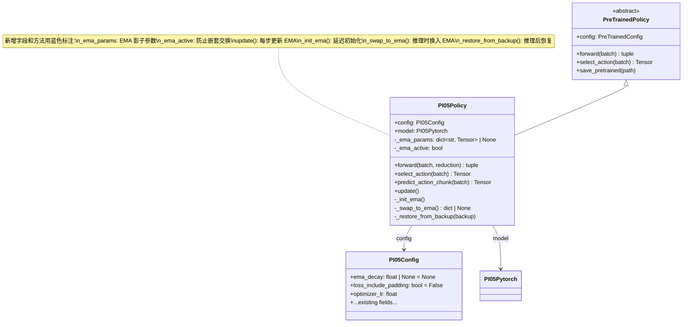
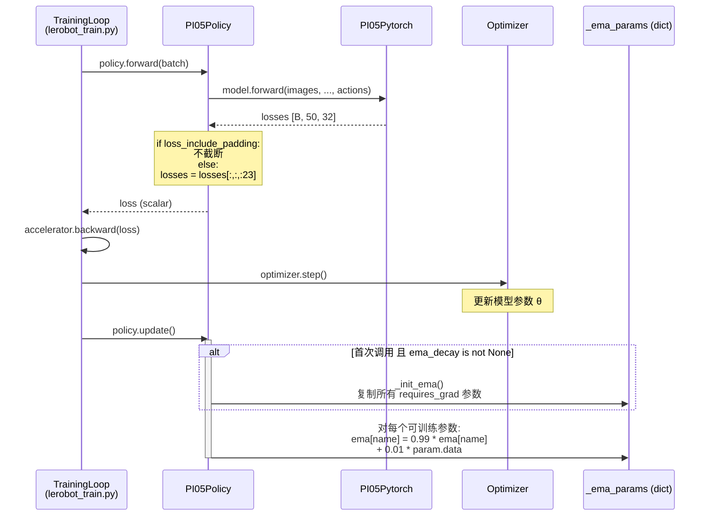
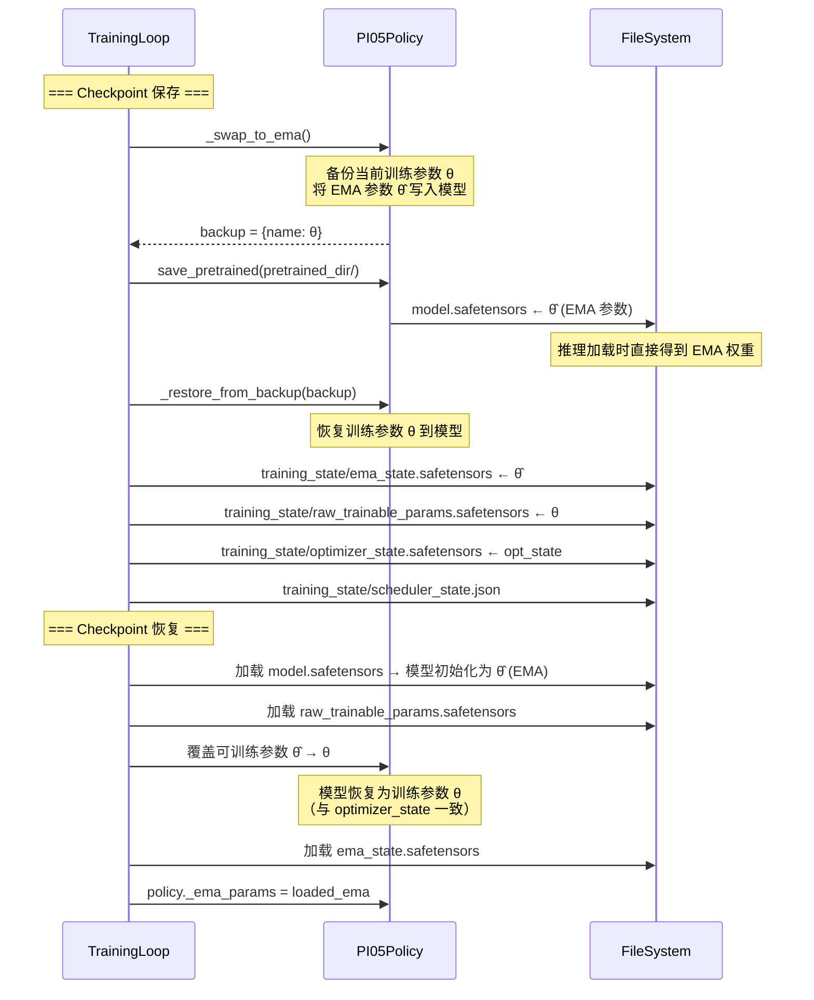
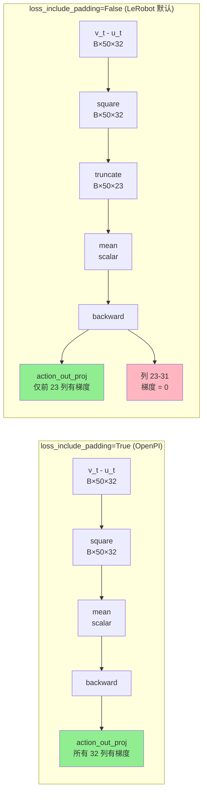

# LeRobot pi0.5 与 OpenPI JAX 对齐：EMA 与 Loss 截断 — 设计与实现方案

> **日期**: 2026-04-09
> **目标**: 使 LeRobot 的 pi0.5 fine-tuning 在 R1 Pro chassis 数据上产生与 OpenPI `pi05_r1pro_chassis` 等价的训练结果
> **范围**: 仅覆盖 **EMA (Exponential Moving Average)** 和 **Loss 截断** 两个对齐项
> **约束**: 不影响 LeRobot 现有用法，不影响 PI0.5 以外的策略/模块

---

## 目录

1. [背景与动机](#1-背景与动机)
2. [现状分析：两个代码库的差异追踪](#2-现状分析两个代码库的差异追踪)
3. [EMA 对齐设计](#3-ema-对齐设计)
4. [Loss 截断对齐设计](#4-loss-截断对齐设计)
5. [文件修改总表](#5-文件修改总表)
6. [兼容性分析](#6-兼容性分析)
7. [验证方案](#7-验证方案)
8. [附录：关键代码索引](#8-附录关键代码索引)

---

## 1. 背景与动机

### 1.1 问题陈述

在对 LeRobot 与 OpenPI 的 pi0.5 训练流程进行深度对比（参见 `pi05_alig_3.md`）后，发现两个与**模型质量**直接相关的差异：

| 差异项 | OpenPI JAX (`pi05_r1pro_chassis`) | LeRobot | 影响 |
|--------|-----------------------------------|---------|------|
| **EMA** | `ema_decay=0.99`，checkpoint 保存 EMA 参数 | **无 EMA 实现** | 推理模型质量差 0.5-3% |
| **Loss 截断** | MSE 在全部 **32 维**上计算（含 9 维 padding） | 截断到 **23 维**（实际动作维度） | 梯度流不同、Loss 尺度不同、隐式正则化缺失 |

### 1.2 目标等级

本方案修复后可达到 **L2 (Checkpoint 质量等价)** 层次：

```
L1: Loss 曲线对齐  ← 修复 Loss 截断即可
L2: Checkpoint 质量等价  ← 需同时修复 EMA + Loss 截断
L3: Action 输出逐元素等价  ← 跨框架不可达（RNG/数值精度差异）
```

### 1.3 设计原则

1. **Opt-in 配置**: 所有新行为通过配置开关控制，默认值保持现有行为
2. **最小侵入**: 改动集中在 PI05 策略内部，不修改通用训练循环的签名
3. **复用现有机制**: 利用训练循环已有的 `policy.update()` 钩子
4. **PEFT/DDP 兼容**: EMA 实现必须与 LoRA 和分布式训练兼容

---

## 2. 现状分析：两个代码库的差异追踪

### 2.1 EMA 差异追踪

#### OpenPI JAX 实现

**配置** (`openpi/src/openpi/training/config.py:492`):

```python
# TrainConfig 基类默认值
ema_decay: float | None = 0.99  # pi05_r1pro_chassis 继承此默认值
```

**初始化** (`openpi/scripts/train.py:106-114`):

```python
return training_utils.TrainState(
    step=0,
    params=params,
    model_def=nnx.graphdef(model),
    tx=tx,
    opt_state=tx.init(params.filter(config.trainable_filter)),
    ema_decay=config.ema_decay,           # 0.99
    ema_params=None if config.ema_decay is None else params,  # 初始值 = params 拷贝
)
```

**每步更新** (`openpi/scripts/train.py:169-175`):

```python
if state.ema_decay is not None:
    new_state = dataclasses.replace(
        new_state,
        ema_params=jax.tree.map(
            lambda old, new: state.ema_decay * old + (1 - state.ema_decay) * new,
            state.ema_params, new_params   # ema = 0.99 * ema_old + 0.01 * params_new
        ),
    )
```

**Checkpoint 保存** (`openpi/src/openpi/training/checkpoints.py:145-152`):

```python
def _split_params(state: training_utils.TrainState):
    if state.ema_params is not None:
        params = state.ema_params           # ← checkpoint "params" = EMA 参数（用于推理）
        train_state = replace(state, ema_params=None)
        # train_state.params 仍为原始训练参数（用于恢复训练）
    else:
        params = state.params
        train_state = replace(state, params={})
    return train_state, params
```

#### LeRobot 现状

- **PI05 策略** (`lerobot/src/lerobot/policies/pi05/modeling_pi05.py`): 无 `update()` 方法，无 EMA 相关代码
- **训练循环** (`lerobot/src/lerobot/scripts/lerobot_train.py:142-144`): 已有 EMA 钩子但 PI05 未使用

```python
# 训练循环已有的钩子（为 TDMPC 等策略设计）
if has_method(accelerator.unwrap_model(policy, keep_fp32_wrapper=True), "update"):
    accelerator.unwrap_model(policy, keep_fp32_wrapper=True).update()
```

- **其他策略的 EMA 参考** (`lerobot/src/lerobot/policies/tdmpc/modeling_tdmpc.py:797-811`):

```python
def update_ema_parameters(ema_net: nn.Module, net: nn.Module, alpha: float):
    """ema_param <- alpha * ema_param + (1 - alpha) * param"""
    for ema_module, module in zip(ema_net.modules(), net.modules(), strict=True):
        for (n_p_ema, p_ema), (n_p, p) in zip(
            ema_module.named_parameters(recurse=False),
            module.named_parameters(recurse=False), strict=True
        ):
            p_ema.mul_(alpha)
            p_ema.add_(p.to(dtype=p_ema.dtype).data, alpha=1 - alpha)
```

### 2.2 Loss 截断差异追踪

#### OpenPI JAX: 全维度 Loss

**来源**: `openpi/src/openpi/models/pi0.py:188-214`

```python
def compute_loss(self, rng, observation, actions, *, train=False):
    # ... flow matching 采样 ...
    v_t = self.action_out_proj(suffix_out[:, -self.action_horizon:])  # [B, 50, 32]
    # ★ MSE 在全部 32 维上计算，含 9 维 padding ★
    return jnp.mean(jnp.square(v_t - u_t), axis=-1)  # [B, 50]
```

**训练步聚合** (`openpi/scripts/train.py:150-151`):

```python
chunked_loss = model.compute_loss(rng, observation, actions, train=True)
loss = jnp.mean(chunked_loss)  # [B, 50] → scalar, 等价于 mean over (B × 50 × 32)
```

#### LeRobot: 截断到实际维度

**来源**: `lerobot/src/lerobot/policies/pi05/modeling_pi05.py:1264-1283`

```python
# 模型前向：MSE 在 32 维上计算
losses = self.model.forward(images, img_masks, tokens, masks, actions)  # [B, 50, 32]

# ★ 截断到实际动作维度 ★
original_action_dim = self.config.output_features[ACTION].shape[0]  # 23
losses = losses[:, :, :original_action_dim]  # [B, 50, 23]

loss = losses.mean()  # mean over (B × 50 × 23)
```

#### 差异影响示意

```
OpenPI (32 维 loss):
┌─────────────────────────────┬──────────────┐
│   实际动作维度 (dim 0-22)     │  Padding (23-31) │
│   MSE loss ✓ 梯度 ✓          │  MSE loss ✓ 梯度 ✓ │
│   目标: 学到的动作预测         │  目标: 预测 ≈ 0    │
└─────────────────────────────┴──────────────┘
  分母 = B × 50 × 32

LeRobot (23 维 loss):
┌─────────────────────────────┬──────────────┐
│   实际动作维度 (dim 0-22)     │  Padding (23-31) │
│   MSE loss ✓ 梯度 ✓          │  忽略 ✗ 梯度 = 0  │
└─────────────────────────────┴──────────────┘
  分母 = B × 50 × 23
```

**三重影响**:

| 影响 | 说明 |
|------|------|
| **梯度流** | OpenPI 的 `action_out_proj.weight` 全部 32 列有梯度；LeRobot 仅 23 列有梯度，后 9 列梯度为零 |
| **Loss 尺度** | OpenPI loss 分母含 9 个"容易"的 padding 维（目标为 0），数值偏低约 `23/32 ≈ 72%` |
| **隐式正则化** | OpenPI 训练后模型学会在 padding 维输出接近 0，提供额外约束信号 |

---

## 3. EMA 对齐设计

### 3.1 架构决策

**决策: 在 Policy 层实现 EMA（而非训练循环层）**

| 方案 | 优点 | 缺点 |
|------|------|------|
| A: 训练循环层 (`lerobot_train.py`) | 对所有策略通用 | 侵入通用代码，耦合 checkpoint 逻辑 |
| **B: 策略层 (`PI05Policy`)** ✓ | 自包含、利用现有 `update()` 钩子、不改训练循环签名 | 仅 PI05 可用（但这正是我们的目标） |
| C: 独立 `EMAModel` 类 | 解耦 | 需改训练循环来注入实例 |

**选择方案 B 的理由**:

1. 训练循环已有 `policy.update()` 钩子 → **零改动训练循环主逻辑**
2. EMA 状态属于策略内部状态，策略自己管理最自然
3. 不影响其他策略（TDMPC 已有自己的 `update()`）
4. Checkpoint 保存通过策略的 `_swap_to_ema()` / `_restore_from_backup()` 实现，干净隔离

**EMA 参数范围决策: 仅跟踪 `requires_grad=True` 的参数**

理由: OpenPI 的 EMA 覆盖所有参数，但由于冻结参数不变化，其 EMA 值恒等于原值 (`0.99 * x + 0.01 * x = x`)。仅跟踪可训练参数在数学上等价，且节省内存。

**延迟初始化决策: EMA 在第一次 `update()` 调用时初始化**

理由: PI05Policy 的 `__init__` 在 PEFT 包装和 DDP 包装之前执行。如果在 `__init__` 中初始化 EMA，参数名会与后续 `update()` 调用时不一致。延迟初始化保证参数名稳定。

### 3.2 类结构设计



### 3.3 训练步序列图



### 3.4 Checkpoint 保存/恢复流程



**Checkpoint 目录结构**（新增文件用 `★` 标注）:

```
005000/
├── pretrained_model/
│   ├── config.json
│   ├── model.safetensors      ← EMA 参数（用于推理部署）
│   └── ...
└── training_state/
    ├── optimizer_state.safetensors
    ├── scheduler_state.json
    ├── rng_state.safetensors
    ├── training_step.json
    ├── ema_state.safetensors              ★ EMA 影子参数
    └── raw_trainable_params.safetensors   ★ 原始训练参数（仅可训练部分）
```

### 3.5 核心代码实现

#### 3.5.1 配置项 (`configuration_pi05.py`)

```python
# 在 PI05Config 类中，finetuning settings 之后添加:

    # OpenPI alignment settings
    ema_decay: float | None = None  # EMA 衰减系数。设为 0.99 以对齐 OpenPI。None = 禁用
    loss_include_padding: bool = False  # 若 True，loss 包含 padding 维度（OpenPI 行为）
```

**默认值说明**:
- `ema_decay=None`: 禁用 EMA，保持现有行为
- 用户对齐 OpenPI 时设为 `0.99`

#### 3.5.2 EMA 实现 (`modeling_pi05.py`)

在 `PI05Policy.__init__` 末尾添加:

```python
def __init__(self, config: PI05Config):
    super().__init__(config)
    # ... 现有初始化代码 ...

    # EMA 状态（延迟初始化，在第一次 update() 时填充）
    self._ema_params: dict[str, torch.Tensor] | None = None
    self._ema_active: bool = False
```

新增方法:

```python
def _init_ema(self):
    """初始化 EMA 影子参数为当前可训练参数的拷贝。

    延迟到第一次 update() 调用时执行，确保 PEFT/DDP 包装已完成，参数名稳定。
    对应 OpenPI: train.py:113 — ema_params = params（初始同源）
    """
    self._ema_params = {}
    for name, param in self.named_parameters():
        if param.requires_grad:
            self._ema_params[name] = param.data.clone()

def update(self):
    """每个优化器步后调用，更新 EMA 影子参数。

    对应 OpenPI: train.py:169-175
    公式: ema = decay * ema + (1 - decay) * param
    """
    if self.config.ema_decay is None:
        return

    # 延迟初始化：首次调用时创建 EMA 影子参数
    if self._ema_params is None:
        self._init_ema()

    decay = self.config.ema_decay
    with torch.no_grad():
        for name, param in self.named_parameters():
            if param.requires_grad and name in self._ema_params:
                self._ema_params[name].mul_(decay).add_(param.data, alpha=1 - decay)

def _swap_to_ema(self) -> dict[str, torch.Tensor] | None:
    """将模型参数替换为 EMA 值，返回原始参数备份。

    使用 _ema_active 标志防止嵌套调用（select_action 调用 predict_action_chunk）。

    对应 OpenPI: checkpoints.py:145-152 中保存 EMA 参数的逻辑。
    """
    if self._ema_params is None or self._ema_active:
        return None
    backup = {}
    with torch.no_grad():
        for name, param in self.named_parameters():
            if name in self._ema_params:
                backup[name] = param.data.clone()
                param.data.copy_(self._ema_params[name])
    self._ema_active = True
    return backup

def _restore_from_backup(self, backup: dict[str, torch.Tensor] | None):
    """从备份恢复模型参数（EMA 推理后还原为训练参数）。"""
    if backup is None:
        return
    with torch.no_grad():
        for name, param in self.named_parameters():
            if name in backup:
                param.data.copy_(backup[name])
    self._ema_active = False
```

修改推理入口:

```python
# select_action 方法中（现有代码之前添加 EMA 交换）
@torch.no_grad()
def select_action(self, batch: dict[str, Tensor]) -> Tensor:
    # ... 现有 assertions ...
    self.eval()
    backup = self._swap_to_ema()
    try:
        if len(self._action_queue) == 0:
            actions = self.predict_action_chunk(batch)[:, : self.config.n_action_steps]
            self._action_queue.extend(actions.transpose(0, 1))
        return self._action_queue.popleft()
    finally:
        self._restore_from_backup(backup)
```

> **注意**: `predict_action_chunk` 被 `select_action` 调用时，`_ema_active=True`，`_swap_to_ema()` 返回 `None`，不会重复交换。若 `predict_action_chunk` 被外部直接调用，也应包裹 EMA 交换——但由于 `select_action` 是标准推理入口，此处仅在 `select_action` 中交换即可。

#### 3.5.3 Checkpoint 保存 (`train_utils.py`)

修改 `save_checkpoint` 函数:

```python
def save_checkpoint(
    checkpoint_dir: Path,
    step: int,
    cfg: TrainPipelineConfig,
    policy: PreTrainedPolicy,
    optimizer: Optimizer,
    scheduler: LRScheduler | None = None,
    preprocessor: PolicyProcessorPipeline | None = None,
    postprocessor: PolicyProcessorPipeline | None = None,
) -> None:
    pretrained_dir = checkpoint_dir / PRETRAINED_MODEL_DIR

    # ── 新增: EMA 参数交换 ──
    # 若策略有 EMA，先将 EMA 参数换入模型，使 model.safetensors 保存的是 EMA 权重
    ema_backup = None
    if hasattr(policy, '_swap_to_ema') and hasattr(policy, '_ema_params') and policy._ema_params is not None:
        ema_backup = policy._swap_to_ema()

    policy.save_pretrained(pretrained_dir)

    # 恢复训练参数
    if ema_backup is not None and hasattr(policy, '_restore_from_backup'):
        policy._restore_from_backup(ema_backup)
    # ── 新增结束 ──

    cfg.save_pretrained(pretrained_dir)
    if cfg.peft is not None:
        policy.config.save_pretrained(pretrained_dir)
    if preprocessor is not None:
        preprocessor.save_pretrained(pretrained_dir)
    if postprocessor is not None:
        postprocessor.save_pretrained(pretrained_dir)

    # ── 新增: 保存 EMA 和原始训练参数到 training_state ──
    ema_state = getattr(policy, '_ema_params', None)
    raw_trainable = None
    if ema_state is not None:
        raw_trainable = {
            name: param.data.clone()
            for name, param in policy.named_parameters()
            if param.requires_grad
        }
    save_training_state(
        checkpoint_dir, step, optimizer, scheduler,
        ema_state=ema_state, raw_trainable_params=raw_trainable,
    )
    # ── 新增结束 ──
```

修改 `save_training_state` 函数签名:

```python
def save_training_state(
    checkpoint_dir: Path,
    train_step: int,
    optimizer: Optimizer | None = None,
    scheduler: LRScheduler | None = None,
    ema_state: dict[str, Tensor] | None = None,           # 新增
    raw_trainable_params: dict[str, Tensor] | None = None, # 新增
) -> None:
    save_dir = checkpoint_dir / TRAINING_STATE_DIR
    save_dir.mkdir(parents=True, exist_ok=True)
    save_training_step(train_step, save_dir)
    save_rng_state(save_dir)
    if optimizer is not None:
        save_optimizer_state(optimizer, save_dir)
    if scheduler is not None:
        save_scheduler_state(scheduler, save_dir)

    # ── 新增: 保存 EMA 状态 ──
    if ema_state is not None:
        from safetensors.torch import save_file
        save_file(ema_state, save_dir / "ema_state.safetensors")
    if raw_trainable_params is not None:
        from safetensors.torch import save_file
        save_file(raw_trainable_params, save_dir / "raw_trainable_params.safetensors")
    # ── 新增结束 ──
```

#### 3.5.4 Checkpoint 恢复 (`lerobot_train.py`)

在 `train()` 函数的 resume 代码块之后添加:

```python
if cfg.resume:
    step, optimizer, lr_scheduler = load_training_state(
        cfg.checkpoint_path, optimizer, lr_scheduler
    )

    # ── 新增: 恢复 EMA 状态和原始训练参数 ──
    training_state_dir = cfg.checkpoint_path / TRAINING_STATE_DIR
    unwrapped = accelerator.unwrap_model(policy, keep_fp32_wrapper=True)

    # 1. 恢复原始训练参数（model.safetensors 中是 EMA 参数，需覆盖为训练参数）
    raw_path = training_state_dir / "raw_trainable_params.safetensors"
    if raw_path.exists():
        from safetensors.torch import load_file
        raw_params = load_file(str(raw_path), device=str(policy.device))
        with torch.no_grad():
            for name, param in unwrapped.named_parameters():
                if name in raw_params:
                    param.data.copy_(raw_params[name])

    # 2. 恢复 EMA 影子参数
    ema_path = training_state_dir / "ema_state.safetensors"
    if ema_path.exists() and hasattr(unwrapped, '_ema_params'):
        from safetensors.torch import load_file
        ema_params = load_file(str(ema_path), device=str(policy.device))
        unwrapped._ema_params = ema_params
    # ── 新增结束 ──
```

### 3.6 EMA 数学特性

```
设第 t 步训练参数为 θ_t，EMA 参数为 θ̂_t，衰减系数 α = 0.99:

递推公式:
  θ̂_0 = θ_0                           （初始同源）
  θ̂_t = α · θ̂_{t-1} + (1-α) · θ_t    （每步更新）

展开:
  θ̂_t = (1-α) · Σ_{i=0}^{t} α^{t-i} · θ_i

有效窗口: 1/(1-α) = 1/0.01 = 100 步

权重分布:
  最近 1 步:   权重 0.01     (1.0%)
  最近 10 步:  累积 ~9.6%
  最近 100 步: 累积 ~63.4%
  最近 500 步: 累积 ~99.3%
```

### 3.7 内存影响分析

| 场景 | 额外内存 | 说明 |
|------|----------|------|
| 全参数 fine-tuning (PI0.5 ~2.3B params) | ~4.6 GB (bfloat16) / ~9.2 GB (float32) | `_ema_params` + checkpoint 保存时 `raw_trainable` 临时拷贝 |
| LoRA fine-tuning (adapter ~2-50M params) | ~4-100 MB | 仅 adapter 参数的 EMA，几乎可忽略 |
| `ema_decay=None` (禁用) | 0 | 无额外开销 |

> **建议**: 全参数 fine-tuning 时搭配 `gradient_checkpointing=True` 以缓解总内存压力。

---

## 4. Loss 截断对齐设计

### 4.1 设计方案

**一句话**: 添加 `loss_include_padding` 配置开关，控制是否在 loss 计算中截断 padding 维度。

| 配置值 | 行为 | 对应 |
|--------|------|------|
| `loss_include_padding=False` (默认) | 截断到实际动作维度后计算 loss | **LeRobot 现有行为** |
| `loss_include_padding=True` | 在全部 max_action_dim 维度上计算 loss | **OpenPI 行为** |

### 4.2 梯度流对比



### 4.3 代码修改

**文件**: `lerobot/src/lerobot/policies/pi05/modeling_pi05.py`

**修改位置**: `PI05Policy.forward()` 方法，约第 1266-1268 行

**修改前**:

```python
# Truncate losses to actual action dimensions
original_action_dim = self.config.output_features[ACTION].shape[0]
losses = losses[:, :, :original_action_dim]
```

**修改后**:

```python
# Optionally truncate losses to actual action dimensions
# When loss_include_padding=True, loss includes padding dims (OpenPI behavior)
if not self.config.loss_include_padding:
    original_action_dim = self.config.output_features[ACTION].shape[0]
    losses = losses[:, :, :original_action_dim]
```

**总改动量**: 2 行新增，0 行删除。

### 4.4 Loss 数值影响

设 R1 Pro chassis (23 实际维度, 9 padding 维度):

| 指标 | `loss_include_padding=False` | `loss_include_padding=True` |
|------|------------------------------|------|
| 分母 | `B × 50 × 23` | `B × 50 × 32` |
| Padding 维贡献 | 0 | MSE(v_t[:,:,23:], 0) |
| 典型 loss 比例 | 较高（无"容易"维度稀释） | 较低（padding 维 loss 趋近 0） |
| `action_out_proj` 梯度覆盖 | 23/32 列 | 32/32 列 |

---

## 5. 文件修改总表

| 文件路径 | 修改内容 | 新增行数 | 影响范围 |
|---------|---------|---------|---------|
| `src/lerobot/policies/pi05/configuration_pi05.py` | 添加 `ema_decay` 和 `loss_include_padding` 配置字段 | ~4 | 仅 PI05 |
| `src/lerobot/policies/pi05/modeling_pi05.py` | 添加 EMA 方法 (`_init_ema`, `update`, `_swap_to_ema`, `_restore_from_backup`)；修改 `select_action` 添加 EMA 交换；修改 `forward` 添加 loss 截断开关 | ~55 | 仅 PI05 |
| `src/lerobot/utils/train_utils.py` | 修改 `save_checkpoint` 支持 EMA 参数交换和保存；修改 `save_training_state` 签名添加 EMA/raw 参数 | ~25 | 通用（但仅在策略有 EMA 时触发） |
| `src/lerobot/scripts/lerobot_train.py` | 添加 resume 时的 EMA 和 raw 参数恢复逻辑 | ~20 | 通用（但仅在文件存在时触发） |

**总计**: ~104 行新增/修改代码。

---

## 6. 兼容性分析

### 6.1 对现有 LeRobot 用法的影响

| 场景 | 影响 | 说明 |
|------|------|------|
| PI05 默认训练 (`ema_decay=None`) | **无影响** | `update()` 方法立即返回，`_ema_params=None`，所有新逻辑短路 |
| PI05 推理 (`from_pretrained`) | **无影响** | `_ema_params` 初始化为 None，`select_action` 中 `_swap_to_ema()` 返回 None |
| 非 PI05 策略 (ACT, Diffusion, TDMPC...) | **无影响** | 修改仅在 PI05 类内部，`train_utils.py` 的修改通过 `hasattr` 守护 |
| 旧 checkpoint 恢复 | **无影响** | EMA 恢复逻辑通过 `if ema_path.exists()` 守护，旧 checkpoint 无此文件则跳过 |
| PEFT/LoRA 训练 | **兼容** | EMA 延迟初始化确保参数名在 PEFT 包装后稳定 |
| 分布式训练 (DDP) | **兼容** | EMA 基于已同步的参数计算，各进程结果自然一致 |

### 6.2 配置对齐速查

用户要对齐 OpenPI `pi05_r1pro_chassis` 的 EMA + Loss 截断时，仅需设置:

```yaml
# 在训练配置中添加
policy:
  ema_decay: 0.99
  loss_include_padding: true
```

与 v3 文档中的其他 P0 项组合:

```yaml
policy:
  ema_decay: 0.99
  loss_include_padding: true
  optimizer_weight_decay: 1e-10    # P0-1
  # LR schedule 修复需改 schedulers.py  # P0-3（不在本文范围）
```

### 6.3 PI0 (非 PI05) 策略的影响

PI0 (`modeling_pi0.py`) 有类似的 loss 截断代码。本方案**不修改** PI0——如果未来需要，可以对 PI0 做类似修改。两个策略的代码是独立的，不存在继承关系。

---

## 7. 验证方案

### 7.1 Loss 截断验证

**测试 1: 梯度覆盖验证**

```python
# 伪代码
policy_truncated = PI05Policy(config(loss_include_padding=False, max_action_dim=32))
policy_full = PI05Policy(config(loss_include_padding=True, max_action_dim=32))

# 实际动作维度 = 23
batch = create_dummy_batch(action_dim=23, padded_to=32)

# 截断模式
loss_t, _ = policy_truncated.forward(batch)
loss_t.backward()
grad_t = policy_truncated.model.action_out_proj.weight.grad
assert grad_t[:, 23:].abs().sum() == 0  # 后 9 列梯度为 0
assert grad_t[:, :23].abs().sum() > 0   # 前 23 列有梯度

# 全维度模式
loss_f, _ = policy_full.forward(batch)
loss_f.backward()
grad_f = policy_full.model.action_out_proj.weight.grad
assert grad_f[:, 23:].abs().sum() > 0   # 后 9 列也有梯度
assert grad_f[:, :23].abs().sum() > 0   # 前 23 列有梯度
```

**测试 2: Loss 数值验证**

```python
# 全维度 loss 应低于截断 loss（padding 维目标为 0，容易预测）
assert loss_full.item() < loss_truncated.item()  # 大概率成立（训练初期除外）
```

### 7.2 EMA 验证

**测试 3: EMA 更新公式验证**

```python
policy = PI05Policy(config(ema_decay=0.99))
optimizer = AdamW(policy.parameters(), lr=1e-4)

# 手动执行一步
loss, _ = policy.forward(batch)
loss.backward()
optimizer.step()

# 记录参数值
params_after_step = {n: p.data.clone() for n, p in policy.named_parameters() if p.requires_grad}

# 触发 EMA 更新（首次调用，会初始化 + 更新）
policy.update()

# 验证: 首次 update 时 EMA 初始化为更新前的参数，然后立即执行一步 EMA
# 但由于是延迟初始化，_init_ema 在 update 内部调用，使用的是 optimizer.step() 后的参数
# 因此首次 EMA = param_current（因为 init 就是 current，然后 0.99*current + 0.01*current = current）
for name in policy._ema_params:
    assert torch.allclose(policy._ema_params[name], params_after_step[name])
```

**测试 4: EMA 推理验证**

```python
# 训练几步后 EMA 参数与训练参数不同
for _ in range(100):
    loss, _ = policy.forward(batch)
    loss.backward()
    optimizer.step()
    optimizer.zero_grad()
    policy.update()

# 验证 select_action 使用 EMA 参数
policy.eval()
action_ema = policy.select_action(inference_batch)

# 临时禁用 EMA 比较
saved_ema = policy._ema_params
policy._ema_params = None
action_raw = policy.select_action(inference_batch)
policy._ema_params = saved_ema

# 两者应该不同（EMA 平滑了参数）
assert not torch.allclose(action_ema, action_raw)
```

### 7.3 Checkpoint 往返验证

**测试 5: 保存-恢复一致性**

```python
# 训练 N 步
for step in range(N):
    train_step(policy, batch, optimizer)
    policy.update()

# 记录关键状态
ema_before = {k: v.clone() for k, v in policy._ema_params.items()}
raw_before = {n: p.data.clone() for n, p in policy.named_parameters() if p.requires_grad}

# 保存 checkpoint
save_checkpoint(checkpoint_dir, step, cfg, policy, optimizer, scheduler)

# 验证 model.safetensors 包含 EMA 参数
loaded_model_weights = load_file(checkpoint_dir / "pretrained_model/model.safetensors")
for name in ema_before:
    assert torch.allclose(loaded_model_weights[name], ema_before[name])

# 从 checkpoint 恢复
new_policy = PI05Policy.from_pretrained(checkpoint_dir / "pretrained_model")
# 恢复训练参数和 EMA
restore_ema_and_raw(new_policy, checkpoint_dir)

# 验证恢复后状态
for name in ema_before:
    assert torch.allclose(new_policy._ema_params[name], ema_before[name])
for name, param in new_policy.named_parameters():
    if name in raw_before:
        assert torch.allclose(param.data, raw_before[name])
```

### 7.4 端到端对齐验证

**测试 6: 与 OpenPI 的 Loss 曲线对比**

1. 在 OpenPI JAX 和 LeRobot 中使用相同数据、相同配置（含 `ema_decay=0.99`, `loss_include_padding=True`）
2. 运行 100-1000 步
3. 比较:
   - Loss 值：应在同一量级（允许 <5% 差异，因框架数值差异）
   - EMA 参数的 L2 距离：应随步数增长但保持有界
   - 梯度范数：应在同一量级

---

## 8. 附录：关键代码索引

### OpenPI 代码路径

| 文件 | 行号 | 内容 |
|------|------|------|
| `openpi/src/openpi/training/config.py` | 492 | `ema_decay: float \| None = 0.99` |
| `openpi/src/openpi/training/config.py` | 1024-1042 | `pi05_r1pro_chassis` TrainConfig 定义 |
| `openpi/scripts/train.py` | 106-114 | TrainState 初始化，EMA 参数同源 |
| `openpi/scripts/train.py` | 147-151 | `loss_fn`: `jnp.mean(chunked_loss)` |
| `openpi/scripts/train.py` | 169-175 | EMA 更新: `0.99 * old + 0.01 * new` |
| `openpi/src/openpi/models/pi0.py` | 188-214 | `compute_loss`: MSE 全 32 维 |
| `openpi/src/openpi/training/checkpoints.py` | 145-152 | `_split_params`: 保存 EMA 为推理参数 |
| `openpi/src/openpi/training/optimizer.py` | 66-85 | AdamW: `weight_decay=1e-10` |

### LeRobot 代码路径

| 文件 | 行号 | 内容 |
|------|------|------|
| `lerobot/src/lerobot/policies/pi05/configuration_pi05.py` | 84-89 | 优化器配置（待添加 EMA 字段） |
| `lerobot/src/lerobot/policies/pi05/modeling_pi05.py` | 783 | `F.mse_loss(u_t, v_t, reduction="none")` |
| `lerobot/src/lerobot/policies/pi05/modeling_pi05.py` | 1266-1268 | Loss 截断（待修改） |
| `lerobot/src/lerobot/policies/pi05/modeling_pi05.py` | 1213-1246 | `select_action`（待添加 EMA 交换） |
| `lerobot/src/lerobot/scripts/lerobot_train.py` | 142-144 | `policy.update()` 钩子（已存在） |
| `lerobot/src/lerobot/utils/train_utils.py` | 65-110 | `save_checkpoint`（待修改） |
| `lerobot/src/lerobot/policies/tdmpc/modeling_tdmpc.py` | 797-811 | EMA 参考实现 |
