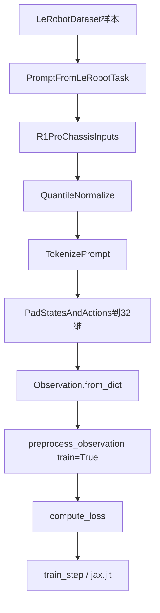
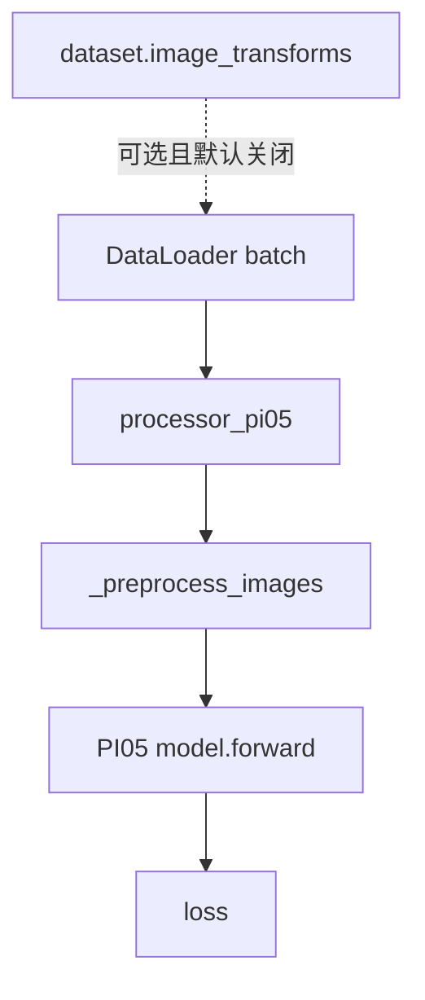
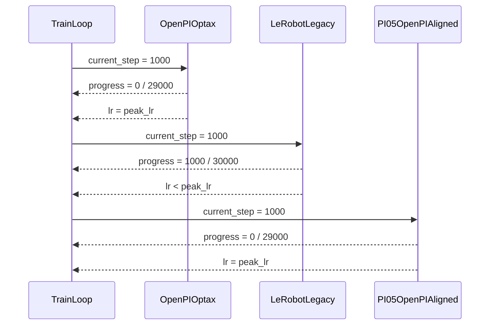
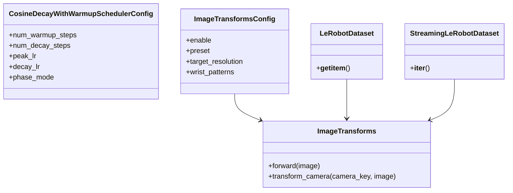

# LeRobot pi0.5 与 OpenPI JAX `pi05_r1pro_chassis` 对齐：LR Schedule 与数据增强设计与实现方案

> 日期: 2026-04-09  
> 目标: 使 LeRobot 的 pi0.5 fine-tuning 在 R1 Pro chassis 数据上尽可能逼近 OpenPI JAX `pi05_r1pro_chassis` 的训练行为与最终 checkpoint 质量  
> 范围: 本文只覆盖 `LR Schedule 余弦相位差异` 与 `数据增强` 两项  
> 约束: 尽量不影响现有 LeRobot 用法，不影响 pi0.5 以外的策略/模块，不修改训练主循环接口

---

## 目录

1. [本文定位](#1-本文定位)
2. [目标与边界](#2-目标与边界)
3. [OpenPI JAX 基线](#3-openpi-jax-基线)
4. [LeRobot 当前实现](#4-lerobot-当前实现)
5. [差异一：LR Schedule 余弦相位](#5-差异一lr-schedule-余弦相位)
6. [差异二：数据增强](#6-差异二数据增强)
7. [推荐设计与文件级实施方案](#7-推荐设计与文件级实施方案)
8. [验证方案](#8-验证方案)
9. [R1 Pro chassis 对齐清单](#9-r1-pro-chassis-对齐清单)
10. [附录：关键代码索引](#10-附录关键代码索引)

---

## 1. 本文定位

### 1.1 与现有文档的分工

本目录下已经有两份非常重要的前置分析：

- `aligdesign.md`：聚焦 **EMA** 与 **loss 是否包含 padding 维** 的对齐设计。
- `pi05_alig_3.md`：聚焦 **JAX `train.py` 作为基准** 时的系统性差异总览。

因此，本文不再重复以下内容的完整推导：

- EMA 机制与 checkpoint 保存策略
- loss 是否在 32 维上计算
- weight decay、dtype、seed、batch、steps 等其它差异的完整论证

本文的职责非常明确：

1. 把 `LR Schedule 余弦相位差异` 单独抽出来，形成可直接实施的设计。
2. 把 `JAX 训练时数据增强` 单独抽出来，形成可直接实施的设计。
3. 在“尽量不影响现有 LeRobot 用法”的约束下，给出 **共享层优先、默认不破坏旧行为** 的落地方案。

### 1.2 成功标准

延续前序文档中的 L1 / L2 / L3 定义：

| 等级 | 定义 | 本文贡献 |
|---|---|---|
| L1 | loss / lr / grad 量级与趋势对齐 | LR 相位修复是核心 |
| L2 | 最终 checkpoint 在任务上无统计显著差异 | 数据增强对齐是核心 |
| L3 | 同输入 action 逐元素接近 | 跨 JAX / PyTorch 不作为目标 |

本文的目标是支撑 **L1 + L2**，不承诺 **L3**。

---

## 2. 目标与边界

### 2.1 设计目标

为了让 LeRobot 的 pi0.5 fine-tuning 在 R1 Pro chassis 数据上尽可能逼近 OpenPI JAX `pi05_r1pro_chassis`，本文要求：

1. LeRobot 的 LR 曲线在逻辑步数上与 OpenPI 的 `optax.warmup_cosine_decay_schedule` 保持同相位。
2. LeRobot 的训练时图像增强在执行位置、视角规则、值域转换、train-only 语义上尽量贴近 OpenPI JAX。
3. 默认行为保持兼容，只有明确启用对齐模式时才进入新逻辑。

### 2.2 非目标

以下内容虽与“最终完全对齐”相关，但不在本文实施范围内：

- EMA 与 checkpoint 保存策略
- loss 是否包含 padding 维
- optimizer `weight_decay=1e-10`
- dtype / bf16
- prompt / tokenizer / quantile stats 的已有差异

这些内容需要与 `aligdesign.md`、`pi05_alig_3.md` 配套使用。

### 2.3 稳定边界与允许下沉的通用层

上一版文档倾向于把这两项对齐逻辑尽量限制在 pi05 专用层；在重新评估后，这个结论需要修正。

仍建议保持稳定、不直接改造的入口：

- `src/lerobot/scripts/lerobot_train.py`
- `src/lerobot/optim/factory.py`
- `src/lerobot/policies/factory.py`

但本次**允许且推荐**承载对齐逻辑的通用层包括：

- `src/lerobot/optim/schedulers.py`
- `src/lerobot/datasets/transforms.py`
- `src/lerobot/datasets/factory.py`
- `src/lerobot/datasets/lerobot_dataset.py`
- `src/lerobot/datasets/streaming_dataset.py`
- `src/lerobot/configs/default.py`

重新判断后的理由如下：

1. `LR Schedule 余弦相位差异` 本质上是共享 scheduler 数学语义问题，不是 pi05 私有逻辑。
2. `数据增强` 本质上是图像增强链与 camera-aware 分发能力问题，天然属于共享视觉数据层。
3. 仓库里已经有 `tests/optim/test_schedulers.py` 和 `tests/datasets/test_image_transforms.py` 两条成熟测试通道，适合为通用层修改提供回归兜底。

---

## 3. OpenPI JAX 基线

### 3.1 `pi05_r1pro_chassis` 的配置展开

OpenPI 的 `pi05_r1pro_chassis` 定义如下：

```python
TrainConfig(
    name="pi05_r1pro_chassis",
    model=pi0_config.Pi0Config(pi05=True),
    data=SimpleDataConfig(
        repo_id="r1_pro_data_convert_chassis",
        data_transforms=lambda model: _transforms.Group(
            inputs=[r1pro_chassis_policy.R1ProChassisInputs(model_type=model.model_type)],
            outputs=[r1pro_chassis_policy.R1ProChassisOutputs()],
        ),
        model_transforms=ModelTransformFactory(
            default_prompt="Open the door with a downward-press handle, go through it, and enter the room."
        ),
        base_config=DataConfig(prompt_from_task=True, action_sequence_keys=("actions",)),
    ),
    weight_loader=weight_loaders.CheckpointWeightLoader("gs://openpi-assets/checkpoints/pi05_base/params"),
    num_train_steps=30_000,
    batch_size=64,
)
```

这条配置没有显式覆盖 `TrainConfig` 的默认 scheduler / optimizer，因此它实际继承：

- `lr_schedule = CosineDecaySchedule(warmup_steps=1000, peak_lr=2.5e-5, decay_steps=30000, decay_lr=2.5e-6)`
- `optimizer = AdamW(b1=0.9, b2=0.95, eps=1e-8, weight_decay=1e-10, clip_gradient_norm=1.0)`
- `ema_decay = 0.99`
- `seed = 42`
- `num_workers = 2`

### 3.2 OpenPI 的 LR 定义

核心代码：

```python
class CosineDecaySchedule(LRScheduleConfig):
    warmup_steps: int = 1_000
    peak_lr: float = 2.5e-5
    decay_steps: int = 30_000
    decay_lr: float = 2.5e-6

    def create(self) -> optax.Schedule:
        return optax.warmup_cosine_decay_schedule(
            init_value=self.peak_lr / (self.warmup_steps + 1),
            peak_value=self.peak_lr,
            warmup_steps=self.warmup_steps,
            decay_steps=self.decay_steps,
            end_value=self.decay_lr,
        )
```

按 `pi05_r1pro_chassis` 实际参数展开：

- `init_lr = 2.5e-5 / 1001 ≈ 2.4975024975e-8`
- `peak_lr = 2.5e-5`
- `warmup_steps = 1000`
- `decay_steps = 30000`
- `end_lr = 2.5e-6`

可以把它写成下面两段公式：

```text
step < warmup_steps:
    lr(step) = init_lr + (peak_lr - init_lr) * step / warmup_steps

step >= warmup_steps:
    progress = (step - warmup_steps) / (decay_steps - warmup_steps)
    lr(step) = end_lr + 0.5 * (peak_lr - end_lr) * (1 + cos(pi * progress))
```

关键点不是“余弦衰减”四个字，而是：

- **余弦段的相位是从 warmup 结束时重新开始计数的**
- `step == warmup_steps` 时，learning rate 必须严格等于 `peak_lr`

### 3.3 OpenPI JAX 的增强执行位置

OpenPI JAX 不是在 dataset 层做增强，而是在模型前向前的 `preprocess_observation(train=True)` 中做增强：

```python
if train:
    image = image / 2.0 + 0.5

    transforms = []
    if "wrist" not in key:
        height, width = image.shape[1:3]
        transforms += [
            augmax.RandomCrop(int(width * 0.95), int(height * 0.95)),
            augmax.Resize(width, height),
            augmax.Rotate((-5, 5)),
        ]
    transforms += [
        augmax.ColorJitter(brightness=0.3, contrast=0.4, saturation=0.5),
    ]
    sub_rngs = jax.random.split(rng, image.shape[0])
    image = jax.vmap(augmax.Chain(*transforms))(sub_rngs, image)

    image = image * 2.0 - 1.0
```

对应规则如下：

| 视角 | 增强链 | 说明 |
|---|---|---|
| `base_0_rgb` 等非 wrist | `RandomCrop(95%) -> Resize -> Rotate(-5, 5) -> ColorJitter(0.3, 0.4, 0.5)` | 几何增强 + 颜色增强 |
| `left_wrist_0_rgb` / `right_wrist_0_rgb` | `ColorJitter(0.3, 0.4, 0.5)` | 只做颜色增强 |

另外还有 3 个必须保留的语义：

1. 增强仅在 `train=True` 时启用。
2. 增强运行在 **图像已被归一到 `[-1, 1]` 之后、送入模型之前**。
3. 增强实际操作在 `[0, 1]` 域完成，增强后再映射回 `[-1, 1]`。

### 3.4 OpenPI JAX 训练路径示意



---

## 4. LeRobot 当前实现

### 4.1 LeRobot 的 scheduler 来源

LeRobot 的 pi0.5 config 当前会通过 `get_scheduler_preset()` 返回通用 `CosineDecayWithWarmupSchedulerConfig`：

```python
def get_scheduler_preset(self):
    return CosineDecayWithWarmupSchedulerConfig(
        peak_lr=self.optimizer_lr,
        decay_lr=self.scheduler_decay_lr,
        num_warmup_steps=self.scheduler_warmup_steps,
        num_decay_steps=self.scheduler_decay_steps,
    )
```

而通用 scheduler 的后半段实现是：

```python
def cosine_decay_schedule(current_step):
    step = min(current_step, actual_decay_steps)
    cosine_decay = 0.5 * (1 + math.cos(math.pi * step / actual_decay_steps))
    alpha = self.decay_lr / self.peak_lr
    decayed = (1 - alpha) * cosine_decay + alpha
    return decayed
```

问题就出在这里：**它直接使用绝对 `current_step` 进入余弦段**。

### 4.2 LeRobot 的当前图像路径

LeRobot pi0.5 训练路径中，图像进入模型前只做了 resize 和 `[-1, 1]` 归一，并没有训练态增强：

```python
def _preprocess_images(self, batch):
    # ...
    if img.shape[1:3] != self.config.image_resolution:
        img = resize_with_pad_torch(img, *self.config.image_resolution)

    img = img * 2.0 - 1.0
    # ...
    return images, img_masks

def forward(self, batch, reduction="mean"):
    images, img_masks = self._preprocess_images(batch)
    tokens, masks = batch["observation.language.tokens"], batch["observation.language.attention_mask"]
    actions = self.prepare_action(batch)
    losses = self.model.forward(images, img_masks, tokens, masks, actions)
```

### 4.3 现有 dataset-level transforms 的能力边界

LeRobot 已经有 `datasets/transforms.py`，但**按当前能力**还不能直接承载 OpenPI JAX 对齐方案：

| 项目 | 当前 `datasets/transforms.py` | OpenPI JAX 训练增强 |
|---|---|---|
| 执行位置 | dataset / dataloader 层 | model forward 前 |
| 是否默认启用 | 否 | `train=True` 时内建启用 |
| 是否区分 wrist / non-wrist | 否 | 是 |
| 是否严格固定增强链 | 否，默认是随机子集 | 是 |
| dataset 是否传入 camera key | 否 | 需要 |
| 是否内建 `resize_with_pad -> augment` 顺序 | 否 | 是 |

但与上一版不同，这里不再得出“因此不能放在通用层”的结论。更准确的结论是：

- **当前实现不能直接复用**
- **但扩展后的 `datasets/transforms.py` 反而是最自然的共享承载层**

原因是它已经具备：

- 通用配置入口 `DatasetConfig.image_transforms`
- 独立测试文件 `tests/datasets/test_image_transforms.py`
- 可视化脚本 `src/lerobot/scripts/lerobot_imgtransform_viz.py`

也就是说，问题不在“它属于通用层”，而在“它目前还缺少 camera-aware 和 OpenPI preset 能力”。

### 4.4 LeRobot 当前路径示意



---

## 5. 差异一：LR Schedule 余弦相位

### 5.1 根因

OpenPI 的余弦相位从 `warmup_steps` 结束处重新开始计数，LeRobot 当前实现则直接使用绝对 step。

这会带来两个直接后果：

1. 在 warmup 切换到 cosine 的第一步，LeRobot 的 lr 已经低于 peak。
2. 在训练中后期，LeRobot 的 lr 系统性偏低。

### 5.2 时序图：为什么 `step=1000` 时已经错位



### 5.3 数值对照

下面的样本点使用与 OpenPI `pi05_r1pro_chassis` 相同的参数：

- `peak_lr = 2.5e-5`
- `decay_lr = 2.5e-6`
- `warmup_steps = 1000`
- `decay_steps = 30000`

| 逻辑步 | OpenPI / 目标值 | LeRobot 当前 | 相对差异 | 建议实现 |
|---:|---:|---:|---:|---:|
| 0 | `2.497502497502e-08` | `2.497502497502e-08` | `0%` | 一致 |
| 999 | `2.497502497502e-05` | `2.497502497502e-05` | `0%` | 一致 |
| 1000 | `2.500000000000e-05` | `2.493837132289e-05` | `-0.2465%` | 对齐为 peak |
| 1001 | `2.499999993399e-05` | `2.493824811685e-05` | `-0.2470%` | 对齐 |
| 15000 | `1.435906272159e-05` | `1.375000000000e-05` | `-4.24%` | 对齐 |
| 30000 | `2.500000000000e-06` | `2.500000000000e-06` | `0%` | 一致 |

这说明它不是“尾部差一点”的问题，而是整个 post-warmup 余弦段都错位。

### 5.4 候选方案对比

| 方案 | 做法 | 优点 | 缺点 | 结论 |
|---|---|---|---|---|
| A | 继续做 pi05-only scheduler 包装层 | 对其它 policy 表面零影响 | 共享 scheduler 的语义问题被继续掩盖，重复代码继续存在 | 不再推荐 |
| B | 在共享 `CosineDecayWithWarmupSchedulerConfig` 中新增 `phase_mode`，默认 `post_warmup`，保留 `absolute` 回退 | 实现收口在通用层，可测试、可回退、可渐进上线 | 需要对所有 consumer 做一次回归 | **推荐** |
| C | 直接无开关改写共享 scheduler 公式 | 实现最简单 | 一旦出现回归，无法显式切回旧曲线做 bisect | 次选 |

### 5.5 更新后的推荐方案

重新分析后，本文建议把 LR 对齐**直接放到共享 scheduler 层**，而不是再新建 pi05-only 子类。

原因是当前 `CosineDecayWithWarmupSchedulerConfig` 已被多条策略配置直接复用：

- `pi0`
- `pi05`
- `pi0_fast`
- `smolvla`
- `xvla`
- `groot`
- `groot2`
- `wall_x`
- `sarm`
- `str_groot`

因此它本来就是共享语义承载点。当前公式里的相位差不应继续被视为“pi05 特例”，而应视为**共享 scheduler 的数学定义需要校正**。

更新后的推荐方案：

1. 在 `src/lerobot/optim/schedulers.py` 的 `CosineDecayWithWarmupSchedulerConfig` 中新增共享字段：
   - `phase_mode: Literal["post_warmup", "absolute"] = "post_warmup"`
2. 默认使用 `post_warmup`，使共享默认语义与 OpenPI / optax 对齐。
3. 保留 `absolute` 仅作为兼容回退或 bisect 手段。
4. **不再优先推荐**新增 pi05-only scheduler subclass。

### 5.6 通用层实现草图

```python
@dataclass
class CosineDecayWithWarmupSchedulerConfig(LRSchedulerConfig):
    num_warmup_steps: int
    num_decay_steps: int
    peak_lr: float
    decay_lr: float
    phase_mode: Literal["post_warmup", "absolute"] = "post_warmup"

    def build(self, optimizer: Optimizer, num_training_steps: int) -> LambdaLR:
        actual_warmup_steps = self.num_warmup_steps
        actual_decay_steps = self.num_decay_steps

        if num_training_steps < self.num_decay_steps:
            scale_factor = num_training_steps / self.num_decay_steps
            actual_warmup_steps = int(self.num_warmup_steps * scale_factor)
            actual_decay_steps = num_training_steps

        def lr_lambda(current_step: int) -> float:
            init_ratio = 1 / (actual_warmup_steps + 1)

            if current_step <= 0:
                return init_ratio

            if current_step < actual_warmup_steps:
                return init_ratio + (1 - init_ratio) * current_step / actual_warmup_steps

            alpha = self.decay_lr / self.peak_lr

            if self.phase_mode == "absolute":
                progress = min(current_step, actual_decay_steps) / actual_decay_steps
            else:
                total_cosine_steps = max(1, actual_decay_steps - actual_warmup_steps)
                relative_step = min(current_step - actual_warmup_steps, total_cosine_steps)
                progress = relative_step / total_cosine_steps

            cosine = 0.5 * (1 + math.cos(math.pi * progress))
            return (1 - alpha) * cosine + alpha

        return LambdaLR(optimizer, lr_lambda, -1)
```

### 5.7 为什么这次不再推荐 pi05-only scheduler wrapper

OpenPI JAX 用的是函数式 schedule，LeRobot 用的是 PyTorch `LambdaLR`。两者框架不同，但这并不妨碍把“post-warmup cosine”定义成共享层的 canonical 语义。

只要满足下面两点，训练主循环就无需修改：

- scheduler 公式与 OpenPI 保持一致
- 调用时机仍然是每个 optimizer step 后 `scheduler.step()`

因此，这次的最佳收口点不是 `PI05Config`，而是共享 `CosineDecayWithWarmupSchedulerConfig`。

---

## 6. 差异二：数据增强

### 6.1 根因

OpenPI 的增强有 4 个强约束：

1. **发生在 model forward 前，而不是 dataset 层**
2. **只在训练时发生**
3. **区分 wrist / non-wrist**
4. **先从 `[-1, 1]` 回到 `[0, 1]`，增强后再映射回 `[-1, 1]`**

LeRobot 当前 pi05 路径没有任何等价逻辑。

### 6.2 对通用层放置的重新判断

上一版文档不建议把增强方案放进 `datasets/transforms.py`，核心原因是它当时既不能表达 OpenPI 的固定增强链，也不能表达 camera-aware 分支。

重新分析后，更准确的结论是：

- **当前实现不能直接复用**
- **但扩展后的共享 image transform 栈，反而是这次增强对齐最好的落点**

因为它已经具备：

- 通用配置入口：`DatasetConfig.image_transforms`
- 单独测试文件：`tests/datasets/test_image_transforms.py`
- 可视化脚本：`src/lerobot/scripts/lerobot_imgtransform_viz.py`

换句话说，问题不在“它是通用层”，而在“它还缺少 OpenPI 所需的 camera-aware 能力与固定 preset”。

### 6.3 为什么通用数据增强层现在是合理落点

把增强下沉到共享层后，确实会与 OpenPI JAX 的执行位置存在一个工程差异：

- OpenPI：`preprocess_observation(train=True)`，更靠近 model forward
- LeRobot 共享层方案：dataset decode 之后、processor / model 之前

但对这条增强链而言，它只依赖：

- 图像像素
- 图像尺寸
- camera key 是否包含 `wrist`

它**不依赖**：

- token
- state
- action
- model hidden state

因此，只要共享层 preset 内部显式保证以下顺序：

```text
resize_with_pad -> (non-wrist: crop + resize + rotate) -> color_jitter
```

并保持输出仍满足下游预处理的张量 contract，那么把增强放到共享图像 transform 层，对 L2 目标是可接受的工程折中。

### 6.4 数据流图


### 6.5 候选方案对比

| 方案 | 做法 | 优点 | 缺点 | 结论 |
|---|---|---|---|---|
| A | 继续放在 `PI05Policy.forward()` | 位置最像 OpenPI | 逻辑分散在 policy 层，难复用，难借用现成 transform 测试 | 不再优先推荐 |
| B | 新增共享增强 utility，但仍由 `PI05Policy.forward()` 调用 | 复用部分逻辑 | 共享与调用层拆成两半，接口仍在 policy 层 | 可接受 |
| C | 扩展共享 `ImageTransforms` + dataset camera-aware dispatch + OpenPI preset | 共享承载层清晰，可视化 / 测试 / 其它 policy 复用路径最自然 | 需要修改 dataset 调用入口 | **推荐** |

### 6.6 更新后的推荐方案

更新后的推荐方案是把增强方案放到**共享 image transform 栈**中：

1. 扩展 `src/lerobot/datasets/transforms.py` 的 `ImageTransformsConfig`
2. 让 `ImageTransforms` 支持一个共享 preset，例如：
   - `preset: Literal["random_subset", "openpi_camera_aware"] = "random_subset"`
3. 扩展 `LeRobotDataset` 与 `StreamingLeRobotDataset`，让它们在调用 transform 时能够把 `camera_key` 一起传给共享 transform dispatcher
4. `datasets/factory.py` 继续作为唯一装配点
5. 不再优先要求在 `PI05Policy.forward()` 里增加专用 augmentation helper

### 6.7 关键设计点：camera-aware dispatch

当前数据集实现只有：

```python
item[cam] = self.image_transforms(item[cam])
```

这不足以表达：

- base camera 与 wrist camera 的不同增强策略
- OpenPI 的固定链

因此共享层必须补齐一个 camera-aware dispatch 能力。推荐设计如下：

```python
class ImageTransforms(Transform):
    def transform_camera(self, camera_key: str, image: torch.Tensor) -> torch.Tensor:
        if self._cfg.preset == "random_subset":
            return self.tf(image)
        if self._cfg.preset == "openpi_camera_aware":
            return self._openpi_camera_aware(camera_key, image)
        raise ValueError(f"Unknown preset: {self._cfg.preset}")
```

而 dataset 入口改为：

```python
if self.image_transforms is not None:
    for cam in image_keys:
        if hasattr(self.image_transforms, "transform_camera"):
            item[cam] = self.image_transforms.transform_camera(cam, item[cam])
        else:
            item[cam] = self.image_transforms(item[cam])
```

这样可以同时满足：

- 旧 callable / 旧 transform 行为不变
- 新 OpenPI preset 可以读取 `camera_key`

### 6.8 通用层实现草图

```python
@dataclass
class ImageTransformsConfig:
    enable: bool = False
    preset: Literal["random_subset", "openpi_camera_aware"] = "random_subset"
    target_resolution: tuple[int, int] = (224, 224)
    wrist_patterns: tuple[str, ...] = ("wrist",)
    non_wrist_crop_scale: float = 0.95
    rotate_degrees: tuple[float, float] = (-5.0, 5.0)
    color_jitter_brightness: float = 0.3
    color_jitter_contrast: float = 0.4
    color_jitter_saturation: float = 0.5


class ImageTransforms(Transform):
    def transform_camera(self, camera_key: str, image: torch.Tensor) -> torch.Tensor:
        if self._cfg.preset == "random_subset":
            return self.tf(image)

        image = resize_with_pad_if_needed(image, self._cfg.target_resolution)
        image = ensure_float_image_in_0_1(image)

        is_wrist = any(pattern in camera_key for pattern in self._cfg.wrist_patterns)
        if not is_wrist:
            image = random_crop_then_resize(image, scale=self._cfg.non_wrist_crop_scale)
            image = random_rotate(image, degrees=self._cfg.rotate_degrees)

        image = color_jitter(
            image,
            brightness=self._cfg.color_jitter_brightness,
            contrast=self._cfg.color_jitter_contrast,
            saturation=self._cfg.color_jitter_saturation,
        )
        return image
```

### 6.9 为什么这次不再优先改 `PI05Policy.forward()`

把增强继续放在 `PI05Policy.forward()` 的主要问题有 3 个：

1. 无法直接复用现有 `tests/datasets/test_image_transforms.py`
2. 无法直接借助 `lerobot_imgtransform_viz` 做可视化核对
3. 其它 policy 将来如果也要复用同类 camera-aware 链路，只能再次复制逻辑

因此，在用户已经允许通用层变更的前提下，共享 image transform 栈更值得投入。

### 6.10 残余差异与接受标准

即使采用共享层方案，仍会有两类残余差异：

1. 执行位置从 “model-side preprocess” 平移到了 “dataset-side transform”
2. augmax 与 torchvision / 共享实现之间仍有底层插值与采样细节差异

本文接受的目标是：

- 不追求像素级一致
- 追求增强规则、统计行为与最终 checkpoint 质量接近
- 用更强的单元测试和集成测试来弥补共享层变更带来的 blast radius

---

## 7. 推荐设计与文件级实施方案

### 7.1 总体设计



### 7.2 需要修改的文件

| 文件 | 变更 | 目的 |
|---|---|---|
| `src/lerobot/optim/schedulers.py` | 直接扩展共享 `CosineDecayWithWarmupSchedulerConfig` | 让 LR 相位在通用层统一 |
| `src/lerobot/datasets/transforms.py` | 增加 OpenPI camera-aware preset 与 `transform_camera()` | 让增强逻辑落在共享图像 transform 栈 |
| `src/lerobot/configs/default.py` | 为 `ImageTransformsConfig` 补共享配置项 | 暴露通用配置表面 |
| `src/lerobot/datasets/factory.py` | 保持为唯一装配点，装配共享 transform preset | 统一数据侧入口 |
| `src/lerobot/datasets/lerobot_dataset.py` | 支持 camera-aware transform dispatch | 让离线训练数据集可按 camera key 分派增强 |
| `src/lerobot/datasets/streaming_dataset.py` | 支持同样的 camera-aware dispatch | 保持 streaming 路径一致 |

### 7.3 明确不修改的文件

| 文件 | 不修改原因 |
|---|---|
| `src/lerobot/scripts/lerobot_train.py` | 训练主循环不需要知道 OpenPI 细节 |
| `src/lerobot/optim/factory.py` | 工厂仍只负责 build optimizer / scheduler |
| `src/lerobot/policies/pi05/modeling_pi05.py` | 新版方案不再优先把增强塞进 policy forward |
| `src/lerobot/policies/pi05/processor_pi05.py` | 本文不改 tokenizer / normalization 路径 |
| `src/lerobot/policies/factory.py` | 不需要额外感知 OpenPI augmentation preset |

### 7.4 建议的默认值策略

为了兼容现有 LeRobot 使用方式，建议默认值如下：

```python
CosineDecayWithWarmupSchedulerConfig.phase_mode = "post_warmup"
ImageTransformsConfig.enable = False
ImageTransformsConfig.preset = "random_subset"
```

这里的含义是：

- scheduler 的共享默认语义被校正为 OpenPI / optax 一致
- 图像增强仍保持 opt-in，不会默认影响现有训练

在“OpenPI JAX 对齐训练”场景下，增强侧显式启用：

```text
--dataset.image_transforms.enable=true
--dataset.image_transforms.preset=openpi_camera_aware
```

如果确实需要回退旧 scheduler 曲线，则显式使用共享回退模式：

```text
phase_mode=absolute
```

### 7.5 与已有对齐项的组合关系

如果最终目标是“尽量接近 OpenPI JAX `pi05_r1pro_chassis` 的训练结果”，则除了本文两项外，仍建议同时启用或落地以下既有项：

- `optimizer_weight_decay=1e-10`
- `ema_decay=0.99`
- `loss_include_padding=true`
- `dtype=bfloat16`
- 同样的 `seed=42`
- 同样的 `batch_size=64`
- 同样的 `num_train_steps=30000`
- 同样的 quantile stats / action padding / tokenizer 路径

否则，本文只能对齐 LR 和 augmentation 两个局部行为，无法单独保证最终 checkpoint 完全逼近。

### 7.6 兼容性与回滚

本文方案具备天然回滚能力：

- 把共享 scheduler 的 `phase_mode` 切回 `absolute`，即可恢复旧曲线
- 保持 `dataset.image_transforms.enable=false`，即可完全不启用共享增强 preset

因此它适合以“共享实现 + 显式配置 + 充分测试”的方式逐步上线。

---

## 8. 验证方案

由于这次推荐把实现下沉到共享层，测试必须显著强于上一版。建议按“单元测试 -> 数据集集成测试 -> policy 对齐测试 -> 训练 smoke test”四层推进。

### 8.1 Scheduler 单元测试

直接扩展现有 `tests/optim/test_schedulers.py`：

1. 增加 `phase_mode="post_warmup"` 的样本点精确值测试：
   - `0`
   - `1`
   - `999`
   - `1000`
   - `1001`
   - `15000`
   - `30000`
2. 若保留 `phase_mode="absolute"` 回退，则同时测试 legacy 曲线仍能复现。
3. 增加 `num_training_steps < num_decay_steps` 的 auto-scaling 测试。
4. 验证 `save_scheduler_state()` / `load_scheduler_state()` 对新增字段仍兼容。
5. 保留现有 `_last_lr` smoke test，避免破坏 PyTorch scheduler state 行为。

验收标准：

- `post_warmup` 模式与 OpenPI 参考公式在关键步点误差小于 `1e-12`
- `absolute` 模式与当前 legacy 行为一致
- scheduler state_dict 可正常保存 / 恢复

### 8.2 Scheduler 跨 policy smoke test

由于共享 scheduler 被多个 policy 直接复用，建议新增一组跨 policy smoke test：

- `pi0`
- `pi05`
- `pi0_fast`
- `smolvla`
- `xvla`
- `groot`
- `groot2`
- `wall_x`
- `sarm`
- `str_groot`

测试内容：

1. 调用各自的 `get_scheduler_preset()`
2. 用一个最小 optimizer 构造 `scheduler.build(...)`
3. 执行一次 `optimizer.step()` + `scheduler.step()`
4. 断言不报错，且 lr 为有限值

建议测试落点：

- 扩展 `tests/optim/test_schedulers.py`
- 或在 `tests/policies/test_policies.py` 中补一组 smoke build

### 8.3 ImageTransforms 单元测试

直接扩展现有 `tests/datasets/test_image_transforms.py`：

1. `preset="openpi_camera_aware"` 的构造测试
2. `transform_camera("observation.images.base_0_rgb", img)` 时：
   - 发生 crop / rotate / color jitter
3. `transform_camera("observation.images.left_wrist_rgb", img)` 时：
   - 只发生 color jitter
4. shape 不变
5. dtype / 值域 contract 不变
6. 用 `seeded_context` 验证同 seed 下可重复
7. 旧 `forward(img)` 路径与 `preset="random_subset"` 行为不回归

这一步非常关键，因为共享增强层的正确性首先要在 transform 级别闭环，而不是直接依赖训练实验判断。

### 8.4 Dataset 集成测试

由于共享增强方案依赖 dataset 入口的 camera-aware dispatch，必须增加数据集集成测试：

1. `LeRobotDataset.__getitem__` 在 `image_transforms` 提供 `transform_camera()` 时，会按 `camera_key` 分派
2. `StreamingLeRobotDataset` 也具备同样行为
3. 对旧 callable（只有 `__call__`，没有 `transform_camera`）保持向后兼容
4. 缺失 camera / empty camera 场景不应报错

建议测试文件：

- 新增 `tests/datasets/test_camera_aware_image_transforms_dispatch.py`
- 或并入 `tests/datasets/test_image_transforms.py`

### 8.5 PI05 对齐集成测试

继续复用已有的 `tests/policies/pi0_pi05/test_pi05_alignment.py`，补充两类测试：

1. 用启用 `openpi_camera_aware` preset 后的数据 batch 进入 `PI05Policy.forward()`，确保：
   - shape 正常
   - dtype 正常
   - 无 tokenizer / processor / model 接口错误
2. 对 base 与 wrist 图像分别构造最小 batch，检查增强规则差异是否按设计生效

这一步用于保证“共享增强层的输出”确实能被 pi05 对齐路径稳定消费。

### 8.6 训练 smoke test

建议扩展 `tests/training/test_visual_validation.py` 或新增一个最小训练 smoke test：

1. 启用共享 scheduler 修复后，1-step / 2-step 训练可正常运行
2. 启用 `dataset.image_transforms.preset=openpi_camera_aware` 后，最小离线训练可正常运行
3. camera rename / empty cameras / camera mismatch 现有逻辑不回归

目标不是验证最终成功率，而是确保：

- 训练入口没被通用层变更破坏
- 共享增强和共享 scheduler 可以与真实 `train()` 调用共存

### 8.7 可视化与手动核对

建议继续利用 `src/lerobot/scripts/lerobot_imgtransform_viz.py` 做共享层增强可视化，对比：

- 原图
- `openpi_camera_aware` 之后的 base 图
- `openpi_camera_aware` 之后的 wrist 图

确认：

- base 相机出现 crop / rotate
- wrist 相机不出现 rotate
- 所有相机都出现 brightness / contrast / saturation 扰动

### 8.8 端到端实验

建议在 R1 Pro chassis 数据上做 3 组实验：

| 组别 | 配置 | 用途 |
|---|---|---|
| A | LeRobot 现状 | baseline |
| B | 仅修共享 scheduler 相位 | 观察 loss / lr / grad 行为 |
| C | 修共享 scheduler 相位 + 启用共享 OpenPI preset 增强 | 观察最终 checkpoint 质量 |

重点记录：

- `lr`
- `loss`
- `grad_norm`
- `param_norm`
- 最终 checkpoint 的离线评估结果

---

## 9. R1 Pro chassis 对齐清单

如果要让 LeRobot 的 pi0.5 fine-tuning 尽量接近 OpenPI JAX `pi05_r1pro_chassis`，建议至少检查下面这份 checklist：

### 9.1 本文直接覆盖的项目

- 共享 `CosineDecayWithWarmupSchedulerConfig.phase_mode=post_warmup`
- `--dataset.image_transforms.enable=true`
- `--dataset.image_transforms.preset=openpi_camera_aware`

### 9.2 本文不展开、但必须同步确认的项目

- `--steps=30000`
- `--batch_size=64`
- `--seed=42`
- `--policy.optimizer_lr=2.5e-5`
- `--policy.scheduler_warmup_steps=1000`
- `--policy.scheduler_decay_steps=30000`
- `--policy.scheduler_decay_lr=2.5e-6`
- `--policy.optimizer_weight_decay=1e-10`
- `--policy.ema_decay=0.99`
- `--policy.loss_include_padding=true`
- `--policy.dtype=bfloat16`
- quantile stats 与 OpenPI 使用的 assets 保持一致
- 图像 key / action dim / prompt / tokenizer 路径与 R1 Pro chassis 配置保持一致

### 9.3 推荐的启用顺序

1. 先修共享 scheduler，相位与参考公式对齐。
2. 再补共享 image transform preset 与 dataset camera-aware dispatch。
3. 先跑单元测试与 smoke test，再与 EMA / loss / wd 等其它对齐项组合做端到端实验。

---

## 10. 附录：关键代码索引

### OpenPI

- `/mnt/r/share/lkx/pi/openpi/src/openpi/training/config.py`
- `/mnt/r/share/lkx/pi/openpi/src/openpi/training/optimizer.py`
- `/mnt/r/share/lkx/pi/openpi/src/openpi/models/model.py`
- `/mnt/r/share/lkx/pi/openpi/src/openpi/policies/r1pro_chassis_policy.py`
- `/mnt/r/share/lkx/pi/openpi/scripts/train.py`

### LeRobot

- `/home/Luogang/SRC/Robot/lerobot/src/lerobot/optim/schedulers.py`
- `/home/Luogang/SRC/Robot/lerobot/src/lerobot/datasets/transforms.py`
- `/home/Luogang/SRC/Robot/lerobot/src/lerobot/datasets/factory.py`
- `/home/Luogang/SRC/Robot/lerobot/src/lerobot/datasets/lerobot_dataset.py`
- `/home/Luogang/SRC/Robot/lerobot/src/lerobot/datasets/streaming_dataset.py`
- `/home/Luogang/SRC/Robot/lerobot/src/lerobot/configs/default.py`
- `/home/Luogang/SRC/Robot/lerobot/src/lerobot/scripts/lerobot_train.py`
- `/home/Luogang/SRC/Robot/lerobot/src/lerobot/policies/pi05/modeling_pi05.py`

---

## 结论

在 LR schedule 与数据增强这两个问题上，重新分析后的关键结论是：

1. **LR 相位差是共享 scheduler 数学语义问题，应该优先在通用层修正**
2. **增强链是共享视觉数据增强能力问题，应该优先在共享 image transform 栈中补齐**

因此，本文更新后的推荐方案不再是“继续堆 pi05-only 包装层”，而是：

- 在 `schedulers.py` 中修正共享 `CosineDecayWithWarmupSchedulerConfig`
- 在 `datasets/transforms.py` / `lerobot_dataset.py` / `streaming_dataset.py` 中补共享的 OpenPI camera-aware augment preset 与分发能力
- 用更强的 unit / integration / smoke 测试矩阵，为这类可能影响其它 policy 的通用层修改兜底

这样做会扩大改动触达面，但能让共享基础设施本身更接近 OpenPI 的 canonical 语义，也更利于后续其它 policy 复用同类能力。
