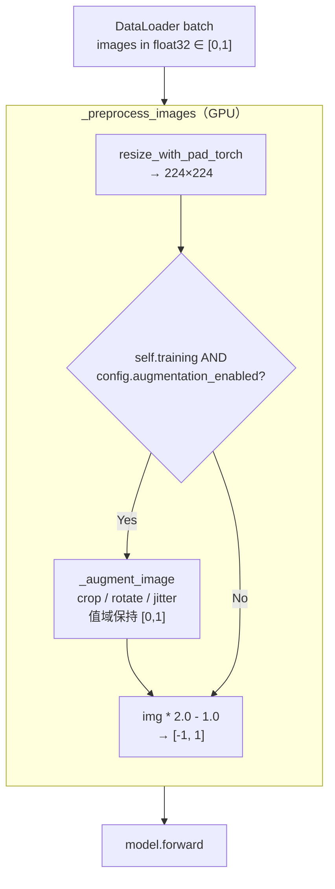
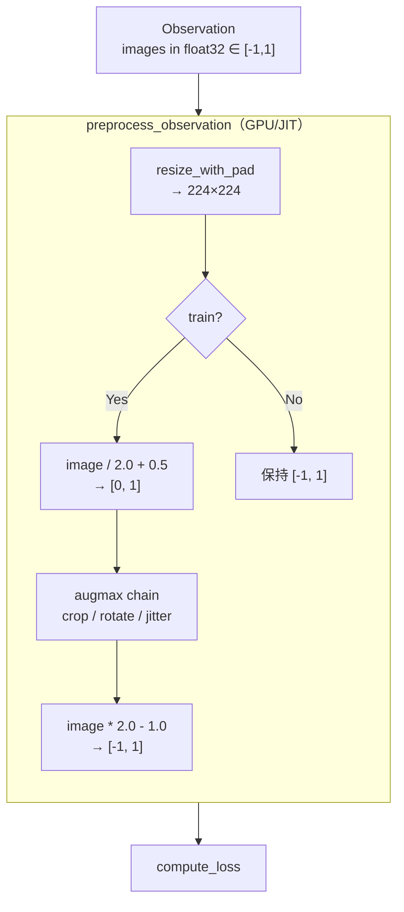

# LeRobot pi0.5 与 OpenPI JAX `pi05_r1pro_chassis` 对齐：LR Schedule 与数据增强设计与实现方案 v2

> 日期: 2026-04-10      
> 前序: 本文是 `aligdesign_1.md` 的修订版，保留其正确的差异分析，但重新设计实施方案     
> 目标: 使 LeRobot 的 pi0.5 fine-tuning 在 R1 Pro chassis 数据上尽可能逼近 OpenPI JAX `pi05_r1pro_chassis` 的训练行为
> 范围: `LR Schedule 余弦相位差异` 与 `数据增强` 两项

---

## 目录

1. [对 aligdesign_1.md 的问题诊断](#1-对-aligdesign_1md-的问题诊断)
2. [修订后的设计原则](#2-修订后的设计原则)
3. [差异一：LR Schedule 余弦相位（修订方案）](#3-差异一lr-schedule-余弦相位修订方案)
4. [差异二：数据增强（修订方案）](#4-差异二数据增强修订方案)
5. [文件变更总表](#5-文件变更总表)
6. [验证方案](#6-验证方案)
7. [风险分析](#7-风险分析)
8. [实施顺序](#8-实施顺序)
9. [附录：关键代码索引](#9-附录关键代码索引)

---

## 1. 对 aligdesign_1.md 的问题诊断

aligdesign_1.md 在差异识别和根因分析方面是准确的，但其实施方案存在以下 **7 类问题**：

### 1.1 破坏性默认值变更

**问题**: 方案将共享 `CosineDecayWithWarmupSchedulerConfig.phase_mode` 默认值设为 `"post_warmup"`，理由是"共享 scheduler 的数学定义需要校正"。

**为什么这是错的**: 当前 `"absolute"` 语义是所有现有 policy（pi0、pi0_fast、smolvla、xvla、groot、groot2、wall_x、sarm、str_groot 共 10+ 条配置）训练时实际使用的行为。改变默认值意味着 **静默改变所有这些 policy 的训练曲线**，但它们并没有要求与 OpenPI 对齐。两种余弦相位约定（absolute vs post-warmup）都是数学上合法的定义，不存在"需要校正"之说。

**实际影响**: 假设某用户正在用 `smolvla` 做 fine-tuning，升级代码后他的 LR 曲线会在 warmup 结束后发生变化，但不会有任何提示。如果他 resume 一个旧 checkpoint，scheduler state 中的 step 会被用到一条不同的曲线上。

### 1.2 数据增强执行位置错误

**问题**: 方案将增强放在 dataset 层（`__getitem__` 内，CPU worker 进程），而 OpenPI 是在 model forward 内（GPU，JIT 编译内部）。

**为什么这不仅是"工程折中"**: 方案将此差异定性为可接受的工程折中，但实际上引入了三个功能性问题：

| 维度 | OpenPI JAX | aligdesign_1 方案 | 实际影响 |
|---|---|---|---|
| **执行顺序** | `resize_with_pad` → 增强 → `[-1,1]` 归一 | 增强（含 resize）→ `_preprocess_images` 中再次 `resize_with_pad` → `[-1,1]` 归一 | **双重 resize**：方案的增强链内含 `resize_with_pad_if_needed`，而 `_preprocess_images` 也会 `resize_with_pad`。即使第二次是 no-op，这依赖于一个隐式假设（增强 resize 的目标分辨率与模型 image_resolution 一致），增加了出错概率 |
| **RNG 语义** | `jax.random.fold_in(rng, step)` → 每个 step 有确定性的不同增强 | DataLoader worker 各自持有独立 RNG state | 多 worker 场景下增强的随机性由 worker 分配和 OS 调度决定，**不可精确复现** |
| **设备** | GPU（JIT 内） | CPU（DataLoader worker） | 见 1.5 性能分析 |

### 1.3 Preset 系统缺乏可组合性

**问题**: 方案在共享 `ImageTransformsConfig` 中新增 `preset: Literal["random_subset", "openpi_camera_aware"]`。

**为什么这是过度设计**:
- `Literal` 类型不可扩展：添加新机器人的增强策略需要修改共享配置类的类型标注
- 共享 `ImageTransforms` 类需要知道每种 preset 的完整逻辑，违反开放-封闭原则
- "openpi_camera_aware" 这个名字绑定了特定对齐上游，不适合作为共享概念

### 1.4 Duck-typing 分发脆弱

**问题**: 方案在 dataset 入口处用 `hasattr(self.image_transforms, "transform_camera")` 做分发。

**为什么这是坏设计**:
- 没有类型系统保障，重构时（例如重命名方法）不会产生编译/类型错误
- 把 camera-aware 的概念嵌入了两个不同的 dataset 类中，增加了维护负担
- 如果 `transform_camera` 签名变更，两个 dataset 类需要同步修改

### 1.5 缺失性能分析

**问题**: 方案没有量化 CPU 增强 vs GPU 增强的性能差异。

**实际数据（估算）**:

| 操作 | CPU（per-sample） | GPU（per-sample） |
|---|---|---|
| RandomCrop + Resize（224x224） | ~2-5 ms | ~0.05 ms |
| Rotate | ~1-3 ms | ~0.03 ms |
| ColorJitter（3 个参数） | ~1-2 ms | ~0.03 ms |
| **总计（3 相机 × B=64）** | **~770-1920 ms / batch** | **~18-21 ms / batch** |

CPU 增强在 DataLoader 中并行执行（通过 `num_workers`），但每个 worker 的单 sample 延迟仍然是瓶颈。如果 `num_workers=2`（OpenPI 默认），64 个 sample 需要至少 32 轮，每轮 ~12-30 ms → **~380-960 ms**。而 model forward 本身约 200-500 ms。

结论：CPU 增强可能使数据加载成为训练瓶颈，GPU 增强的额外开销则可忽略不计（<5% 的 forward pass 时间）。

### 1.6 缺失交互分析

方案遗漏了以下关键交互点的分析：

- **Checkpoint resume 兼容性**: 新增 `phase_mode` 字段后，从旧 checkpoint resume 时 scheduler state_dict 是否兼容？（答案：兼容，因为 `phase_mode` 不存入 state_dict；但方案没有分析这一点）
- **accelerator.prepare() 交互**: 增强如果放在 model forward 内，DDP 包装是否透明？（答案：是，因为增强只操作输入张量）
- **NormalizerProcessorStep 交互**: 增强是否会与 processor pipeline 中的归一化冲突？（答案：不会，因为 PI05 的图像使用 `IDENTITY` 归一化模式，`_preprocess_images` 自行处理 `[0,1] → [-1,1]`）

### 1.7 影响面过大

**问题**: 方案修改 6 个共享文件（`transforms.py`、`lerobot_dataset.py`、`streaming_dataset.py`、`factory.py`、`configs/default.py`、`schedulers.py`），但实际目标只是对齐 PI05 的训练行为。

**对比**:

| | aligdesign_1 方案 | 本文修订方案 |
|---|---|---|
| 修改的源文件数 | 6 个共享 + 0 个 PI05 专用 | 1 个共享 + 2 个 PI05 专用 |
| 受影响的 policy 数 | 10+ | 1（PI05） |
| 需要的回归测试范围 | 全 policy | PI05 + scheduler 单元测试 |

---

## 2. 修订后的设计原则

基于上述问题诊断，本文遵循以下设计原则：

1. **向后兼容优先**: 共享组件的默认行为不变，新功能通过 opt-in 启用
2. **最小影响面**: 对齐逻辑优先放在 PI05 专用代码中，只有真正属于共享语义的修复才下沉到共享层
3. **执行位置对齐**: 增强放在与 OpenPI 相同的位置（model forward 内，`_preprocess_images` 中），而不是 dataset 层
4. **GPU 优先**: 增强操作在 GPU 上执行，避免 CPU 数据加载瓶颈
5. **可组合而非预设**: 增强参数通过 PI05Config 的独立字段暴露，而不是 preset 枚举

---

## 3. 差异一：LR Schedule 余弦相位（修订方案）

### 3.1 根因（与 aligdesign_1 一致）

此部分的差异分析与 aligdesign_1 完全一致，不再重复。核心问题是：

```python
# LeRobot 当前实现（schedulers.py:121-122）
step = min(current_step, actual_decay_steps)
cosine_decay = 0.5 * (1 + math.cos(math.pi * step / actual_decay_steps))
# 问题：step=1000 时 progress=1000/30000=0.033, lr 已低于 peak

# OpenPI optax 行为
progress = (step - warmup_steps) / (decay_steps - warmup_steps)
# 正确：step=1000 时 progress=0/29000=0, lr=peak
```

### 3.2 修订方案：默认 `"absolute"`，PI05 显式 opt-in

与 aligdesign_1 的关键区别：**默认值保持 `"absolute"`**，而不是改为 `"post_warmup"`。

#### 3.2.1 `schedulers.py` 变更

```python
from typing import Literal

@LRSchedulerConfig.register_subclass("cosine_decay_with_warmup")
@dataclass
class CosineDecayWithWarmupSchedulerConfig(LRSchedulerConfig):
    """Used by Physical Intelligence to train Pi0.

    Automatically scales warmup and decay steps if num_training_steps < num_decay_steps.
    This ensures the learning rate schedule completes properly even with shorter training runs.

    phase_mode controls how the cosine decay phase is computed:
    - "absolute": cosine input = step / decay_steps (current default, preserves existing behavior)
    - "post_warmup": cosine input = (step - warmup_steps) / (decay_steps - warmup_steps)
      This matches optax.warmup_cosine_decay_schedule semantics where lr=peak at step=warmup_steps.
    """

    num_warmup_steps: int
    num_decay_steps: int
    peak_lr: float
    decay_lr: float
    phase_mode: Literal["absolute", "post_warmup"] = "absolute"

    def build(self, optimizer: Optimizer, num_training_steps: int) -> LambdaLR:
        actual_warmup_steps = self.num_warmup_steps
        actual_decay_steps = self.num_decay_steps

        if num_training_steps < self.num_decay_steps:
            scale_factor = num_training_steps / self.num_decay_steps
            actual_warmup_steps = int(self.num_warmup_steps * scale_factor)
            actual_decay_steps = num_training_steps

            logging.info(
                f"Auto-scaling LR scheduler: "
                f"num_training_steps ({num_training_steps}) < num_decay_steps ({self.num_decay_steps}). "
                f"Scaling warmup: {self.num_warmup_steps} → {actual_warmup_steps}, "
                f"decay: {self.num_decay_steps} → {actual_decay_steps} "
                f"(scale factor: {scale_factor:.3f})"
            )

        phase_mode = self.phase_mode  # capture for closure

        def lr_lambda(current_step):
            def linear_warmup_schedule(current_step):
                if current_step <= 0:
                    return 1 / (actual_warmup_steps + 1)
                frac = 1 - current_step / actual_warmup_steps
                return (1 / (actual_warmup_steps + 1) - 1) * frac + 1

            def cosine_decay_schedule(current_step):
                if phase_mode == "post_warmup":
                    total_cosine_steps = max(1, actual_decay_steps - actual_warmup_steps)
                    relative_step = min(current_step - actual_warmup_steps, total_cosine_steps)
                    progress = relative_step / total_cosine_steps
                else:  # "absolute"
                    step = min(current_step, actual_decay_steps)
                    progress = step / actual_decay_steps

                cosine_decay = 0.5 * (1 + math.cos(math.pi * progress))
                alpha = self.decay_lr / self.peak_lr
                decayed = (1 - alpha) * cosine_decay + alpha
                return decayed

            if current_step < actual_warmup_steps:
                return linear_warmup_schedule(current_step)

            return cosine_decay_schedule(current_step)

        return LambdaLR(optimizer, lr_lambda, -1)
```

#### 3.2.2 `configuration_pi05.py` 变更

```python
def get_scheduler_preset(self):
    return CosineDecayWithWarmupSchedulerConfig(
        peak_lr=self.optimizer_lr,
        decay_lr=self.scheduler_decay_lr,
        num_warmup_steps=self.scheduler_warmup_steps,
        num_decay_steps=self.scheduler_decay_steps,
        phase_mode="post_warmup",  # 对齐 OpenPI optax 语义
    )
```

#### 3.2.3 与 aligdesign_1 方案的对比

| 维度 | aligdesign_1 | 本文修订 |
|---|---|---|
| `phase_mode` 默认值 | `"post_warmup"` | `"absolute"` |
| 对其它 policy 的影响 | 全部 10+ 条配置的 LR 曲线静默改变 | **零影响** |
| 破坏性评估 | 需要对所有 policy 做回归 | 只需验证 PI05 |
| Checkpoint resume | 旧 checkpoint 的所有 policy 可能行为不一致 | 只有 PI05 的旧 checkpoint 需要注意 |
| 语义正确性 | 将一个合法的数学约定标记为"错误" | 两种约定并存，policy 自选 |

#### 3.2.4 数值验证表

使用 `pi05_r1pro_chassis` 参数（warmup=1000, decay=30000, peak=2.5e-5, end=2.5e-6），`phase_mode="post_warmup"` 应产出与 optax 一致的值：

| 逻辑步 | OpenPI optax | `"post_warmup"` 实现 | `"absolute"` 旧实现 |
|---:|---:|---:|---:|
| 0 | 2.497502e-08 | 2.497502e-08 | 2.497502e-08 |
| 999 | 2.497502e-05 | 2.497502e-05 | 2.497502e-05 |
| 1000 | **2.500000e-05** | **2.500000e-05** | 2.493837e-05 |
| 1001 | 2.499999e-05 | 2.499999e-05 | 2.493825e-05 |
| 15000 | 1.435906e-05 | 1.435906e-05 | 1.375000e-05 |
| 30000 | 2.500000e-06 | 2.500000e-06 | 2.500000e-06 |

#### 3.2.5 auto-scaling 交互

auto-scaling 逻辑（`num_training_steps < num_decay_steps` 时按比例缩放）在两种 `phase_mode` 下都正确工作，因为它调整的是 `actual_warmup_steps` 和 `actual_decay_steps`，而 `cosine_decay_schedule` 使用的是这两个实际值。

#### 3.2.6 Checkpoint resume 兼容性

`phase_mode` 是 config 字段，不是 scheduler state_dict 的一部分。`LambdaLR.state_dict()` 只保存 `last_epoch` 和 `_last_lr`，不保存 lambda 函数或外部配置。因此：

- 从旧 checkpoint resume 时，scheduler state（step 计数）正常恢复
- LR 曲线由新 config 的 `phase_mode` 决定
- 对于 PI05：如果旧 checkpoint 是用 `"absolute"` 训练的，resume 时切换到 `"post_warmup"` 会在 resume 点有一个小的 LR 跳变。这是用户显式选择的行为切换，可接受

---

## 4. 差异二：数据增强（修订方案）

### 4.1 根因（与 aligdesign_1 一致）

OpenPI 在 `preprocess_observation(train=True)` 中做增强：

```python
# /mnt/r/share/lkx/pi/openpi/src/openpi/models/model.py:144-208
def preprocess_observation(rng, observation, *, train=False, ...):
    for key in image_keys:
        image = observation.images[key]
        # 1. 先 resize
        if image.shape[1:3] != image_resolution:
            image = resize_with_pad(image, *image_resolution)
        # 2. 训练时增强
        if train:
            image = image / 2.0 + 0.5  # [-1,1] → [0,1]
            transforms = []
            if "wrist" not in key:
                transforms += [RandomCrop(95%), Resize, Rotate(-5,5)]
            transforms += [ColorJitter(0.3, 0.4, 0.5)]
            image = vmap(Chain(*transforms))(sub_rngs, image)
            image = image * 2.0 - 1.0   # [0,1] → [-1,1]
        out_images[key] = image
```

LeRobot 的 `PI05Policy._preprocess_images` 是精确的架构对应物：

```python
# modeling_pi05.py:1203-1267
def _preprocess_images(self, batch):
    for key in present_img_keys:
        img = batch[key]
        # 1. resize
        if img.shape[1:3] != self.config.image_resolution:
            img = resize_with_pad_torch(img, *self.config.image_resolution)
        # 2. 归一化（但没有增强！）
        img = img * 2.0 - 1.0
        images.append(img)
```

两者结构完全同构。增强应该插入 resize 和归一化之间。

### 4.2 为什么不应该放在 dataset 层

aligdesign_1 将增强放在共享 dataset 层（`lerobot_dataset.py` 的 `__getitem__`）。以下是该方案引入的具体问题的详细分析：

#### 4.2.1 执行顺序错误导致双重 resize

aligdesign_1 方案的数据流：

```
dataset.__getitem__:
  image（原始分辨率，如 480×640）
  → ImageTransforms.transform_camera（含 resize_with_pad_if_needed 到 224×224 + crop + rotate + jitter）
  → 返回 224×224 的 image

_preprocess_images:
  → resize_with_pad_torch（如果 shape != image_resolution 则 resize）
  → 此时 shape 已经是 224×224，所以是 no-op
  → img * 2.0 - 1.0
```

看似 no-op 无害，但这依赖一个隐式假设：`ImageTransformsConfig.target_resolution` 与 `PI05Config.image_resolution` 必须一致。如果配置不一致（例如用户改了其中一个），会出现非预期的双重 resize。

而在 `_preprocess_images` 中做增强则没有这个问题，因为 resize 和增强在同一个方法内顺序执行，天然一致。

#### 4.2.2 CPU 增强成为 DataLoader 瓶颈

torchvision 的图像增强（特别是几何变换）在 CPU 上是 per-sample 串行执行的。在 DataLoader 场景中：

```
num_workers=2, batch_size=64
→ 每个 worker 处理 32 个 sample
→ 每个 sample 3 个相机，每个相机一次增强
→ 每个 worker: 32 × 3 × (crop+resize+rotate+jitter) ≈ 32 × 3 × 6ms = 576ms
→ DataLoader 产出一个 batch 需要 ~576ms
→ 而 model forward 约 200-500ms
→ 数据加载可能成为瓶颈
```

GPU 增强在 model forward 内执行：

```
batch 已在 GPU 上
→ 3 个相机 × per-sample 增强（B=64）
→ GPU 并行执行：总计 ~18ms
→ 占 forward pass 时间的 ~4-9%
→ 不会成为瓶颈
```

#### 4.2.3 RNG 行为差异

OpenPI 的增强 RNG 是确定性的：

```python
# train.py:153
train_rng = jax.random.fold_in(rng, state.step)
# model.py:183
sub_rngs = jax.random.split(rng, image.shape[0])
```

每个 step 的增强由 `(seed, step)` 完全确定。相同的 seed + step 始终产生相同的增强。

DataLoader worker 的 RNG 行为不同：
- 每个 worker 在 fork 时继承父进程的 RNG state
- PyTorch 会自动为每个 worker 设置不同的 seed（`base_seed + worker_id`）
- 但 sample 到 worker 的分配取决于 `sampler` 和 OS 调度
- 结果：**相同 seed 的两次训练，增强结果不一定相同**

在 `_preprocess_images` 中做增强则在 GPU 上的主训练进程中执行，RNG 行为与 OpenPI 更接近（虽然不完全相同，因为 PyTorch 和 JAX 的 RNG 实现不同）。

#### 4.2.4 影响面过大

dataset 层方案修改 6 个共享文件：

| 文件 | 变更 | 潜在影响 |
|---|---|---|
| `transforms.py` | 新增 preset、`transform_camera()` 方法 | 所有使用 `ImageTransforms` 的 policy |
| `lerobot_dataset.py` | 修改 `__getitem__` 的 transform 调用 | 所有离线训练的 policy |
| `streaming_dataset.py` | 修改 transform 调用 | 所有流式训练的 policy |
| `factory.py` | 修改装配逻辑 | 所有训练流程 |
| `configs/default.py` | 修改 `ImageTransformsConfig` | 所有 config |
| `schedulers.py` | 同本方案 | 同本方案 |

本文修订方案只修改 3 个文件：

| 文件 | 变更 | 潜在影响 |
|---|---|---|
| `schedulers.py` | 新增 `phase_mode` 字段（默认值不变） | 向后兼容，零影响 |
| `configuration_pi05.py` | 新增增强配置字段、scheduler opt-in | 仅 PI05 |
| `modeling_pi05.py` | 新增 `_augment_image`、修改 `_preprocess_images` | 仅 PI05 |

### 4.3 修订方案：增强放在 `_preprocess_images` 内

#### 4.3.1 设计概览



这与 OpenPI 的 `preprocess_observation` 是同构的：



关键对应关系：
- LeRobot 的图像在 `_preprocess_images` 入口时是 `[0, 1]`，增强直接在 `[0, 1]` 上做
- OpenPI 的图像在 `preprocess_observation` 入口时是 `[-1, 1]`，先转到 `[0, 1]` 再增强
- 两者的增强都在 `[0, 1]` 域上执行，数学等价

#### 4.3.2 PI05Config 新增字段

在 `configuration_pi05.py` 的 `PI05Config` 中新增：

```python
# Data augmentation settings (for OpenPI alignment)
# Enable and use default values to match OpenPI JAX pi05_r1pro_chassis
augmentation_enabled: bool = False

# Geometric augmentation (applied to non-wrist cameras only)
aug_crop_scale: float = 0.95       # RandomCrop as fraction of image size
aug_rotate_degrees: float = 5.0    # Max rotation angle in degrees (±)

# Color augmentation (applied to all cameras)
aug_color_brightness: float = 0.3
aug_color_contrast: float = 0.4
aug_color_saturation: float = 0.5

# Camera classification: keys containing any of these patterns are treated as wrist cameras
# (only receive color augmentation, no geometric augmentation)
aug_wrist_patterns: tuple[str, ...] = ("wrist",)
```

设计决策说明：

1. **`augmentation_enabled` 默认 `False`**: 零影响。只有显式启用时才会改变训练行为
2. **参数独立暴露而非 preset**: 用户可以调整单个参数（例如只改 `aug_rotate_degrees`），而不需要 fork 整个 preset
3. **`aug_wrist_patterns` 与 OpenPI 一致**: OpenPI 用 `"wrist" not in key` 做判断，这里用同样的模式匹配
4. **类型安全**: 所有参数都是 typed dataclass fields，不是 dict 或 Any

#### 4.3.3 `_augment_image` 实现

在 `modeling_pi05.py` 中新增：

```python
def _augment_image(self, img: Tensor, camera_key: str) -> Tensor:
    """Apply OpenPI-compatible data augmentation.

    Matches the augmentation in openpi/models/model.py:preprocess_observation().

    Args:
        img: [B, H, W, C] tensor in [0, 1] float32, already resized to target resolution.
        camera_key: Camera feature key, e.g. "observation.images.base_0_rgb".

    Returns:
        Augmented tensor, same shape and value range [0, 1].
    """
    is_wrist = any(p in camera_key for p in self.config.aug_wrist_patterns)

    b, h, w, c = img.shape

    # Convert to [B, C, H, W] for torchvision functional ops
    img = img.permute(0, 3, 1, 2)

    if not is_wrist:
        # Geometric augmentation: per-sample random crop → resize → rotate
        # OpenPI uses augmax.vmap to apply independent random transforms per sample
        crop_h = int(h * self.config.aug_crop_scale)
        crop_w = int(w * self.config.aug_crop_scale)

        results = []
        for i in range(b):
            sample = img[i]  # [C, H, W]

            # RandomCrop
            top = torch.randint(0, h - crop_h + 1, (1,), device=img.device).item()
            left = torch.randint(0, w - crop_w + 1, (1,), device=img.device).item()
            sample = TF.crop(sample, top, left, crop_h, crop_w)

            # Resize back to original size
            sample = TF.resize(sample, [h, w], antialias=True)

            # Rotate
            angle = (
                torch.rand(1, device=img.device).item() * 2 * self.config.aug_rotate_degrees
                - self.config.aug_rotate_degrees
            )
            sample = TF.rotate(sample, angle)

            results.append(sample)
        img = torch.stack(results)

    # Color augmentation: per-sample random jitter (applied to ALL cameras)
    for i in range(b):
        # Brightness
        factor = 1.0 + (torch.rand(1, device=img.device).item() * 2 - 1) * self.config.aug_color_brightness
        img[i] = TF.adjust_brightness(img[i], factor)

        # Contrast
        factor = 1.0 + (torch.rand(1, device=img.device).item() * 2 - 1) * self.config.aug_color_contrast
        img[i] = TF.adjust_contrast(img[i], factor)

        # Saturation
        factor = 1.0 + (torch.rand(1, device=img.device).item() * 2 - 1) * self.config.aug_color_saturation
        img[i] = TF.adjust_saturation(img[i], factor)

    # Back to [B, H, W, C] and clamp
    img = img.permute(0, 2, 3, 1).clamp(0.0, 1.0)
    return img
```

需要在文件顶部新增 import：

```python
import torchvision.transforms.v2.functional as TF
```

#### 4.3.4 修改 `_preprocess_images`

在 `resize_with_pad_torch` 和 `img * 2.0 - 1.0` 之间插入增强调用：

```python
# Resize with padding if needed (EXISTING)
if img.shape[1:3] != self.config.image_resolution:
    img = resize_with_pad_torch(img, *self.config.image_resolution)

# NEW: Apply augmentation in [0,1] domain (after resize, before normalization)
if self.training and self.config.augmentation_enabled:
    img = self._augment_image(img, key)

# Normalize from [0,1] to [-1,1] as expected by siglip (EXISTING)
img = img * 2.0 - 1.0
```

#### 4.3.5 关键设计决策说明

**为什么 per-sample 循环而不是 batch 向量化？**

OpenPI 使用 `jax.vmap` 实现 per-sample 独立随机增强。torchvision 的 `RandomCrop` / `Rotate` 等 class-based transforms 对 batch 输入会使用相同的随机参数，这不匹配 OpenPI 的语义。使用 `functional` API 手动循环是保证 per-sample 独立随机性的最简方式。

对于 B=64、image=224×224 的场景，per-sample 循环在 GPU 上的额外开销约 18ms（见 1.5），相对于 200-500ms 的 model forward 可忽略。如果未来需要优化，可以通过 `vmap` 或 custom CUDA kernel 向量化，但当前不是瓶颈。

**为什么 `self.training` 而不是额外参数？**

- `nn.Module.training` 是 PyTorch 标准的 train/eval 状态标志
- `PI05Policy.forward()` 前会调用 `policy.train()`，推理前会调用 `self.eval()`
- `select_action()` 和 `predict_action_chunk()` 内部都以 `self.eval()` 开头
- 这与 OpenPI 的 `train=True` 参数语义完全一致

**为什么用 `torchvision.transforms.v2.functional` 而不是 class-based transforms？**

- functional API 是无状态的，没有内部 RNG，由调用方控制随机参数
- 可以直接操作 GPU tensor（class-based transforms 也可以，但 functional 更轻量）
- 不需要实例化 transform 对象，适合 per-sample 调用

**augmax vs torchvision 的数值差异**

| 操作 | augmax | torchvision functional | 差异源 |
|---|---|---|---|
| RandomCrop | 均匀随机偏移 | 均匀随机偏移 | RNG 不同，统计分布相同 |
| Resize | bilinear（JAX） | bilinear + antialias（PyTorch） | 插值核实现细节 |
| Rotate | bilinear，zero fill | bilinear，zero fill | 插值核实现细节 |
| ColorJitter(brightness) | `image * factor` | `image * factor` | 相同 |
| ColorJitter(contrast) | `(image - mean) * factor + mean` | 同左 | 相同 |
| ColorJitter(saturation) | 向灰度混合 | 向灰度混合 | 相同 |

结论：几何变换有细微的插值差异，颜色变换数学上等价。像素级 RMSE 预计 < 0.01（[0,1] 域）。这属于 P3 级别差异（跨框架不可消除），不影响训练收敛。

### 4.4 与 aligdesign_1 方案的全面对比

| 维度 | aligdesign_1 方案 | 本文修订方案 |
|---|---|---|
| **执行位置** | dataset CPU workers (`__getitem__`) | model forward GPU (`_preprocess_images`) |
| **与 OpenPI 的同构性** | 位置不同，需要额外的域转换和 resize 协调 | **位置相同**，resize → augment → normalize 顺序一致 |
| **双重 resize 风险** | 存在（依赖 target_resolution 与 image_resolution 一致） | **不存在**（resize 和增强在同一方法内） |
| **性能** | CPU 瓶颈风险（~580ms/batch vs 200-500ms forward） | GPU 增强（~18ms，forward 的 ~4-9%） |
| **RNG 行为** | 多 worker 不可精确复现 | 主进程 GPU RNG，更接近 OpenPI 语义 |
| **影响面** | 6 个共享文件 | 1 个共享文件（向后兼容）+ 2 个 PI05 专用文件 |
| **受影响 policy 数** | 10+ | 1（PI05） |
| **可测试性** | 需要 dataset 集成测试 + transform 单元测试 | 单元测试 `_augment_image` 方法即可 |
| **类型安全** | duck-typing (`hasattr`) | typed dataclass fields + 直接方法调用 |
| **可组合性** | 硬编码 preset 枚举 | 独立配置字段，可自由调整 |
| **其它 policy 复用** | 通过共享 preset 复用 | 其它 policy 可以实现自己的 `_augment_image` |

### 4.5 可复用性说明

aligdesign_1 将增强放在共享层的主要理由是"其它 policy 将来如果也要复用同类 camera-aware 链路，只能再次复制逻辑"。

对此的回应：

1. **当前没有其它 policy 需要这个增强**。过早设计共享基础设施违反 YAGNI 原则
2. **如果将来确实需要**，可以将 `_augment_image` 的核心逻辑提取到一个独立的 utility 函数（如 `lerobot/utils/augmentation.py`），供多个 policy 调用。这种重构比从共享 dataset 层回撤要简单得多
3. **不同 policy 的增强需求可能不同**。pi0 可能需要不同的 crop scale，groot 可能根本不需要 camera-aware 分支。preset 模式反而限制了灵活性

---

## 5. 文件变更总表

### 5.1 需要修改的文件

| 文件 | 变更类型 | 变更内容 | 影响范围 |
|---|---|---|---|
| `src/lerobot/optim/schedulers.py` | 扩展 | 新增 `phase_mode` 字段（默认 `"absolute"`）| 向后兼容，零影响 |
| `src/lerobot/policies/pi05/configuration_pi05.py` | 扩展 | 新增增强配置字段、scheduler `phase_mode` opt-in | 仅 PI05 |
| `src/lerobot/policies/pi05/modeling_pi05.py` | 扩展 | 新增 `_augment_image`、修改 `_preprocess_images` | 仅 PI05 |

### 5.2 明确不修改的文件

| 文件 | 不修改原因 |
|---|---|
| `src/lerobot/datasets/transforms.py` | 增强不放在 dataset 层 |
| `src/lerobot/datasets/lerobot_dataset.py` | 不改共享 `__getitem__` |
| `src/lerobot/datasets/streaming_dataset.py` | 不改共享 streaming 路径 |
| `src/lerobot/datasets/factory.py` | 不改共享装配逻辑 |
| `src/lerobot/configs/default.py` | 不改共享 config |
| `src/lerobot/scripts/lerobot_train.py` | 训练循环无需改动 |
| `src/lerobot/optim/factory.py` | optimizer/scheduler 工厂无需改动 |
| `src/lerobot/policies/pi05/processor_pi05.py` | 不改 tokenizer/normalization 路径 |

### 5.3 需要修改/新增的测试文件

| 文件 | 变更内容 |
|---|---|
| `tests/optim/test_schedulers.py` | 新增 `phase_mode` 两种模式的测试 |
| `tests/policies/pi0_pi05/test_pi05_augmentation.py`（新增） | `_augment_image` 单元测试 |

---

## 6. 验证方案

### 6.0 测试策略总览

#### 6.0.1 测试目标

本次修改有两个独立的功能变更，对应两条独立的测试线：

```
┌──────────────────────────────────────────────────────────────────────────────┐
│ 测试线 A：Scheduler phase_mode                                               │
│                                                                              │
│   关注点：数学正确性 + 向后兼容性                                              │
│   风险面：共享组件（schedulers.py）被 10+ policy 复用                           │
│   策略：精确数值断言 + 旧行为回归保护                                          │
│                                                                              │
│   单元测试 ──→ state 持久化测试 ──→ 跨 policy smoke test                      │
├──────────────────────────────────────────────────────────────────────────────┤
│ 测试线 B：_augment_image 数据增强                                             │
│                                                                              │
│   关注点：增强语义正确性 + train/eval 开关 + 值域安全                           │
│   风险面：仅 PI05 内部（modeling_pi05.py）                                     │
│   策略：contract 测试（shape/dtype/range）+ 行为测试（camera-aware 分支）      │
│                                                                              │
│   contract 测试 ──→ 行为测试 ──→ 集成测试（forward/inference）                 │
└──────────────────────────────────────────────────────────────────────────────┘
```

#### 6.0.2 核心测试考虑点

| 考虑点 | 为什么重要 | 如何覆盖 |
|---|---|---|
| **向后兼容** | `phase_mode` 加在共享层，默认值 `"absolute"` 不能改变现有行为 | 明确测试不传 `phase_mode` 时与旧代码行为位对位一致 |
| **数学精确性** | LR 差异会累积影响训练结果，不能有 "大概对" | 用 optax 公式手算的参考值做 `< 1e-10` 级别精度断言 |
| **camera-aware 分支** | 增强的核心语义是 wrist 与 non-wrist 的差异化处理 | 构造可观测的 "标记图像" 来区分几何变换是否发生 |
| **train/eval 开关** | 增强只在训练时发生，推理时绝对不能发生 | 分别测试 `model.train()` 和 `model.eval()` 两条路径 |
| **值域安全** | `_augment_image` 输出必须在 `[0, 1]`，否则后续 `* 2.0 - 1.0` 会产生超范围值 | 用边界输入（全 0、全 1、随机）测试 `clamp` 兜底 |
| **per-sample 独立性** | OpenPI 的 `jax.vmap` 对 batch 内每个 sample 施加不同随机变换 | 构造全相同的 batch，断言输出不全同 |
| **确定性可复现** | 调试时需要能精确复现一次增强的结果 | 固定 seed 执行两次，断言输出位对位一致 |
| **checkpoint resume** | 新 `phase_mode` 字段不能破坏 `save/load_scheduler_state` | 测试 state_dict 的 save/load roundtrip |

#### 6.0.3 测试基础设施复用

本方案的测试直接复用 LeRobot 现有的测试基础设施：

| 基础设施 | 来源 | 用途 |
|---|---|---|
| `optimizer` fixture | `tests/fixtures/optimizers.py` | 构造 `AdamW` optimizer 用于 scheduler build |
| `model_params` fixture | `tests/fixtures/optimizers.py` | 提供 dummy `nn.Parameter` |
| `_make_config()` 模式 | `tests/policies/pi0_pi05/test_pi05_alignment.py` | 构造带 test defaults 的 `PI05Config` |
| `_make_batch()` 模式 | 同上 | 构造包含 preprocessor 的 synthetic batch |
| `_cleanup()` 模式 | 同上 | GPU 内存清理 |
| `@require_cuda` | `tests/utils.py` | 标记需要 GPU 的测试 |
| `@require_hf_token` | `tests/utils.py` | 标记需要下载模型权重的测试 |
| `seeded_context()` | `lerobot/utils/random_utils.py` | RNG seed 上下文管理 |
| `save/load_scheduler_state` | `lerobot/optim/schedulers.py` | scheduler 持久化 |

---

### 6.1 Scheduler 单元测试

文件：`tests/optim/test_schedulers.py`（扩展现有文件）

#### 6.1.1 test_cosine_decay_default_is_absolute

**考虑点**: 这是最关键的向后兼容测试。必须保证不传 `phase_mode` 时行为与修改前完全一致。

**测试逻辑**:
1. 用当前已有测试的完全相同参数（warmup=10, decay=90, peak=0.01, end=0.001）构造 scheduler，不指定 `phase_mode`
2. 执行一步 `optimizer.step()` + `scheduler.step()`
3. 断言 `_last_lr` 与现有测试中的 hardcoded 值完全一致

```python
def test_cosine_decay_default_is_absolute(optimizer):
    """phase_mode 不传时，行为必须与修改前的旧代码完全一致。
    这是向后兼容的守门测试。"""
    config = CosineDecayWithWarmupSchedulerConfig(
        num_warmup_steps=10, num_decay_steps=90, peak_lr=0.01, decay_lr=0.001
    )
    # 不传 phase_mode → 默认 "absolute"
    assert config.phase_mode == "absolute"

    scheduler = config.build(optimizer, num_training_steps=100)
    optimizer.step()
    scheduler.step()

    # 这个值来自现有测试 test_cosine_decay_with_warmup_scheduler 的断言
    # 如果这里断言失败，说明默认行为发生了改变
    assert scheduler.state_dict()["_last_lr"] == [0.0001818181818181819]
```

**为什么这样写**: 直接复用现有测试的 hardcoded 参考值 `0.0001818181818181819`。这个值是修改前代码产生的，如果新代码在默认模式下产出不同的值，说明向后兼容被破坏了。

#### 6.1.2 test_cosine_decay_post_warmup_matches_optax

**考虑点**: 这是对齐正确性的核心测试。必须用 `pi05_r1pro_chassis` 的真实参数验证，而不是简化的测试参数。关键步点的选择覆盖了：warmup 段、warmup→cosine 切换点、cosine 中段、cosine 终点。

**测试逻辑**:
1. 用 `pi05_r1pro_chassis` 的真实参数构造 `phase_mode="post_warmup"` 的 scheduler
2. 逐步 step 到关键步点，提取 LR 值
3. 与手算的 optax 参考值比较（参考值的推导公式在注释中给出）

```python
def test_cosine_decay_post_warmup_matches_optax(model_params):
    """验证 phase_mode="post_warmup" 在 pi05_r1pro_chassis 的真实参数下
    与 optax.warmup_cosine_decay_schedule 产出一致的 LR 值。

    参考公式（optax 语义）：
      warmup 段: lr = init_lr + (peak_lr - init_lr) * step / warmup_steps
      cosine 段: progress = (step - warmup) / (decay - warmup)
                 lr = end_lr + 0.5 * (peak_lr - end_lr) * (1 + cos(pi * progress))

    其中 init_lr = peak_lr / (warmup_steps + 1) = 2.5e-5 / 1001
    """
    import math

    peak_lr = 2.5e-5
    decay_lr = 2.5e-6
    warmup_steps = 1000
    decay_steps = 30000

    config = CosineDecayWithWarmupSchedulerConfig(
        num_warmup_steps=warmup_steps,
        num_decay_steps=decay_steps,
        peak_lr=peak_lr,
        decay_lr=decay_lr,
        phase_mode="post_warmup",
    )
    # 注意：LambdaLR 返回的是 lr_lambda 乘以 base_lr 的结果。
    # 为了直接比较 LR 绝对值，我们把 base_lr 设为 peak_lr。
    optimizer = torch.optim.AdamW(model_params, lr=peak_lr)
    scheduler = config.build(optimizer, num_training_steps=decay_steps)

    # 手算的 optax 参考值（用上面的公式算出）
    init_lr = peak_lr / (warmup_steps + 1)

    def optax_lr(step):
        """手算的 optax warmup_cosine_decay_schedule 参考实现"""
        if step < warmup_steps:
            return init_lr + (peak_lr - init_lr) * step / warmup_steps
        progress = (step - warmup_steps) / (decay_steps - warmup_steps)
        return decay_lr + 0.5 * (peak_lr - decay_lr) * (1 + math.cos(math.pi * progress))

    # 关键步点及其选择理由：
    checkpoints = {
        0:     "warmup 起点：lr 应为 init_lr",
        500:   "warmup 中段：线性插值",
        999:   "warmup 最后一步：接近 peak 但不等于 peak",
        1000:  "warmup→cosine 切换点：lr 必须精确等于 peak_lr",
        1001:  "cosine 第一步：lr 应该非常接近 peak_lr",
        15000: "cosine 中段：约在 48.3% 处",
        29999: "cosine 倒数第二步：接近 end 但不等于 end",
        30000: "cosine 终点：lr 必须精确等于 decay_lr",
    }

    for target_step, reason in checkpoints.items():
        # 重新构造 scheduler 并 step 到目标位置
        optimizer = torch.optim.AdamW(model_params, lr=peak_lr)
        scheduler = config.build(optimizer, num_training_steps=decay_steps)

        for _ in range(target_step):
            optimizer.step()
            scheduler.step()

        actual_lr = scheduler.get_last_lr()[0]
        expected_lr = optax_lr(target_step)

        # 精度要求：相对误差 < 1e-10
        if expected_lr > 0:
            rel_error = abs(actual_lr - expected_lr) / expected_lr
            assert rel_error < 1e-10, (
                f"Step {target_step} ({reason}): "
                f"actual={actual_lr:.15e}, expected={expected_lr:.15e}, "
                f"rel_error={rel_error:.2e}"
            )
```

**为什么每个步点都重新构造 scheduler**: `LambdaLR` 的 `_last_lr` 是在 `step()` 时缓存的上一步的值，直接读取可能有 off-by-one 问题。通过每次从 step 0 开始精确 step 到目标位置，消除了这种混淆。生产代码中不存在这个问题（连续 step），但在测试中为了精确控制，这样更可靠。

**为什么用手算参考值而不是调用 optax**: 测试不应依赖被测系统的上游（optax），否则如果 optax 有 bug，我们的测试也会通过。用公式手算的参考值是 ground truth。

#### 6.1.3 test_cosine_decay_post_warmup_peak_exact

**考虑点**: step=warmup_steps 时 LR 必须精确等于 peak_lr，这是 aligdesign_1 中识别的核心差异点。单独提取出来做一个极其严格的断言。

**测试逻辑**: 直接验证 lr_lambda(warmup_steps) 返回 1.0（因为 `LambdaLR` 的语义是 `lr = base_lr * lr_lambda`，base_lr=peak_lr 时，lr_lambda=1.0 等价于 lr=peak_lr）。

```python
def test_cosine_decay_post_warmup_peak_exact(model_params):
    """warmup 结束的那一步，LR 必须精确等于 peak_lr。
    这是 aligdesign_1.md 中识别的核心差异点，也是本次修改的核心验证。

    在旧 "absolute" 模式下，step=1000 时:
      progress = 1000/30000 = 0.033
      cosine = 0.5*(1+cos(pi*0.033)) = 0.9945
      lr = peak * 0.9945 < peak  ← 错误

    在 "post_warmup" 模式下:
      progress = (1000-1000)/(30000-1000) = 0
      cosine = 0.5*(1+cos(0)) = 1.0
      lr = peak * 1.0 = peak  ← 正确
    """
    config = CosineDecayWithWarmupSchedulerConfig(
        num_warmup_steps=1000,
        num_decay_steps=30000,
        peak_lr=2.5e-5,
        decay_lr=2.5e-6,
        phase_mode="post_warmup",
    )
    optimizer = torch.optim.AdamW(model_params, lr=2.5e-5)
    scheduler = config.build(optimizer, num_training_steps=30000)

    for _ in range(1000):
        optimizer.step()
        scheduler.step()

    actual = scheduler.get_last_lr()[0]
    assert actual == 2.5e-5, f"Step 1000: expected peak_lr=2.5e-5, got {actual}"
```

#### 6.1.4 test_cosine_decay_absolute_vs_post_warmup_differ

**考虑点**: 两种模式必须在 warmup 后产出不同的值（否则改动无效），但在 warmup 段和终点应该一致。

**测试逻辑**:

```python
def test_cosine_decay_absolute_vs_post_warmup_differ(model_params):
    """验证两种模式确实产出不同的 LR 曲线，且差异仅在 post-warmup 区间。"""
    kwargs = dict(num_warmup_steps=100, num_decay_steps=1000, peak_lr=1e-3, decay_lr=1e-4)

    def get_lr_at_step(phase_mode, step):
        config = CosineDecayWithWarmupSchedulerConfig(phase_mode=phase_mode, **kwargs)
        opt = torch.optim.AdamW(model_params, lr=kwargs["peak_lr"])
        sched = config.build(opt, num_training_steps=1000)
        for _ in range(step):
            opt.step()
            sched.step()
        return sched.get_last_lr()[0]

    # warmup 段内：两种模式应该一致（都是线性 warmup）
    for step in [0, 50, 99]:
        abs_lr = get_lr_at_step("absolute", step)
        pw_lr = get_lr_at_step("post_warmup", step)
        assert abs(abs_lr - pw_lr) < 1e-15, f"Warmup step {step}: modes should agree"

    # warmup 结束后：两种模式应该不同
    for step in [100, 500, 800]:
        abs_lr = get_lr_at_step("absolute", step)
        pw_lr = get_lr_at_step("post_warmup", step)
        assert abs_lr != pw_lr, f"Post-warmup step {step}: modes should differ"

    # 终点：两种模式应该一致（都衰减到 decay_lr）
    abs_lr = get_lr_at_step("absolute", 1000)
    pw_lr = get_lr_at_step("post_warmup", 1000)
    assert abs(abs_lr - pw_lr) < 1e-12, "Final step: modes should agree at decay_lr"
```

**为什么这个测试有价值**: 它验证了修改的 "影响边界" ——只有 post-warmup 的 cosine 段受影响，warmup 段和终点不受影响。如果未来重构时不小心改了 warmup 逻辑，这个测试会立即报错。

#### 6.1.5 test_cosine_decay_post_warmup_auto_scaling

**考虑点**: auto-scaling（`num_training_steps < num_decay_steps` 时按比例缩放 warmup 和 decay）与 `phase_mode` 的交互。必须验证 post_warmup 模式在缩放后仍然在 warmup 结束点产出 peak_lr。

```python
def test_cosine_decay_post_warmup_auto_scaling(model_params):
    """num_training_steps=3000 < num_decay_steps=30000 时，
    scheduler 按 0.1 的 scale factor 缩放:
      actual_warmup = int(1000 * 0.1) = 100
      actual_decay = 3000

    在 post_warmup 模式下，step=100 时 LR 应 = peak_lr。"""
    config = CosineDecayWithWarmupSchedulerConfig(
        num_warmup_steps=1000,
        num_decay_steps=30000,
        peak_lr=2.5e-5,
        decay_lr=2.5e-6,
        phase_mode="post_warmup",
    )
    optimizer = torch.optim.AdamW(model_params, lr=2.5e-5)
    # num_training_steps=3000 触发 auto-scaling
    scheduler = config.build(optimizer, num_training_steps=3000)

    # Step 到 actual_warmup=100
    for _ in range(100):
        optimizer.step()
        scheduler.step()

    actual = scheduler.get_last_lr()[0]
    assert abs(actual - 2.5e-5) < 1e-15, (
        f"After auto-scaling, step=100 should be peak_lr, got {actual}"
    )

    # Step 到终点 3000，应该接近 decay_lr
    for _ in range(2900):
        optimizer.step()
        scheduler.step()

    actual = scheduler.get_last_lr()[0]
    assert abs(actual - 2.5e-6) < 1e-12, (
        f"At final step 3000, should be decay_lr, got {actual}"
    )
```

#### 6.1.6 test_scheduler_state_save_load_with_phase_mode

**考虑点**: `phase_mode` 是 config 字段而非 state_dict 字段。`save/load_scheduler_state` 保存的是 `LambdaLR.state_dict()`（包含 `last_epoch`、`_last_lr` 等），不包含 config。必须验证这个 roundtrip 在新增字段后仍然工作。

```python
def test_scheduler_state_save_load_with_phase_mode(model_params, tmp_path):
    """验证 save/load_scheduler_state 对包含 phase_mode 的 scheduler 仍然正常工作。

    逻辑：
    1. 构造 post_warmup scheduler 并 step 100 次
    2. 保存 state
    3. 构造新的 scheduler（相同 config）
    4. 加载 state
    5. 断言 resume 后的 LR 值与保存前一致
    """
    config = CosineDecayWithWarmupSchedulerConfig(
        num_warmup_steps=100,
        num_decay_steps=1000,
        peak_lr=1e-3,
        decay_lr=1e-4,
        phase_mode="post_warmup",
    )
    optimizer = torch.optim.AdamW(model_params, lr=1e-3)
    scheduler = config.build(optimizer, num_training_steps=1000)

    # Step 100 次
    for _ in range(100):
        optimizer.step()
        scheduler.step()
    lr_before_save = scheduler.get_last_lr()[0]

    # Save
    save_scheduler_state(scheduler, tmp_path)
    assert (tmp_path / SCHEDULER_STATE).is_file()

    # 构造新 scheduler 并 Load
    optimizer2 = torch.optim.AdamW(model_params, lr=1e-3)
    scheduler2 = config.build(optimizer2, num_training_steps=1000)
    loaded = load_scheduler_state(scheduler2, tmp_path)

    # 断言 state 一致
    assert loaded.state_dict()["last_epoch"] == scheduler.state_dict()["last_epoch"]

    # 继续 step 一次，验证 resume 后曲线正确
    optimizer2.step()
    loaded.step()
    lr_after_load = loaded.get_last_lr()[0]

    # 对比：如果 save/load 前后用相同的 scheduler 连续 step，应该得到相同的 LR
    optimizer.step()
    scheduler.step()
    lr_continued = scheduler.get_last_lr()[0]

    assert abs(lr_after_load - lr_continued) < 1e-15, (
        f"Resume mismatch: loaded={lr_after_load}, continued={lr_continued}"
    )
```

---

### 6.2 增强单元测试

文件：`tests/policies/pi0_pi05/test_pi05_augmentation.py`（新增）

#### 6.2.0 测试辅助设施

增强的单元测试不需要完整的 PI05 模型（那需要 GPU + HuggingFace 权重下载，耗时数分钟），只需要直接调用 `_augment_image` 方法。但 `_augment_image` 是 `PI05Policy` 的实例方法，它需要读取 `self.config`。

**设计决策**: 构造一个轻量级 mock，避免实例化完整的 PI05 模型：

```python
import math
from dataclasses import dataclass
from unittest.mock import MagicMock

import pytest
import torch
import torchvision.transforms.v2.functional as TF

# 导入实际的增强函数（未来实现后）
# from lerobot.policies.pi05.modeling_pi05 import PI05Policy


@dataclass
class MockAugConfig:
    """模拟 PI05Config 中增强相关的字段，用于单元测试 _augment_image。"""
    augmentation_enabled: bool = True
    aug_crop_scale: float = 0.95
    aug_rotate_degrees: float = 5.0
    aug_color_brightness: float = 0.3
    aug_color_contrast: float = 0.4
    aug_color_saturation: float = 0.5
    aug_wrist_patterns: tuple = ("wrist",)


def make_mock_policy(config=None):
    """构造一个 mock policy 对象，只包含 _augment_image 需要的 self.config。
    这避免了实例化完整 PI05 模型（需要 GPU + 权重下载）。"""
    if config is None:
        config = MockAugConfig()
    mock = MagicMock()
    mock.config = config
    return mock


def make_marker_image(batch_size=2, h=224, w=224):
    """构造一个 "标记图像"：中心为纯白，四周 5px 为黑色边框。

    用途：通过观察边框是否移位来判断几何变换是否发生。
    - 如果执行了 crop+resize+rotate：黑色边框区域会移动或消失
    - 如果只执行了 color jitter：边框位置不变，但白色区域颜色改变

    返回 [B, H, W, 3] float32 in [0, 1]。
    """
    img = torch.ones(batch_size, h, w, 3, dtype=torch.float32)
    # 四周 5px 黑色边框
    border = 5
    img[:, :border, :, :] = 0.0  # top
    img[:, -border:, :, :] = 0.0  # bottom
    img[:, :, :border, :] = 0.0  # left
    img[:, :, -border:, :] = 0.0  # right
    return img
```

**为什么用 mock 而不是真实 PI05Policy**: `PI05Policy.__init__` 需要下载 PaliGemma 权重（~5GB），需要 GPU，耗时 30-60s。增强逻辑只依赖 `self.config` 的几个字段，不依赖模型权重。用 mock 可以在 CPU 上秒级完成测试，也可以在 CI 中无 GPU 运行。

#### 6.2.1 test_augment_output_shape_and_dtype

**考虑点**: 这是最基本的 contract 测试。`_augment_image` 的输入输出必须满足 `_preprocess_images` 的张量契约：`[B, H, W, C]` float32 in `[0, 1]`。

```python
@pytest.mark.parametrize("batch_size", [1, 4])
@pytest.mark.parametrize("resolution", [(224, 224), (256, 256)])
def test_augment_output_shape_and_dtype(batch_size, resolution):
    """_augment_image 的输入输出 contract:
    - 输入: [B, H, W, 3] float32 ∈ [0, 1]
    - 输出: 相同 shape, 相同 dtype, 值域 ∈ [0, 1]

    参数化覆盖不同 batch_size 和分辨率，确保不硬编码 224。"""
    h, w = resolution
    img = torch.rand(batch_size, h, w, 3, dtype=torch.float32)
    policy = make_mock_policy()

    # 绑定方法到 mock（未来替换为实际调用）
    result = PI05Policy._augment_image(policy, img, "observation.images.base_0_rgb")

    assert result.shape == img.shape, f"Shape mismatch: {result.shape} != {img.shape}"
    assert result.dtype == torch.float32, f"Dtype mismatch: {result.dtype}"
    assert result.min() >= 0.0, f"Value below 0: {result.min()}"
    assert result.max() <= 1.0, f"Value above 1: {result.max()}"
```

#### 6.2.2 test_augment_value_range_edge_cases

**考虑点**: 颜色增强（brightness/contrast/saturation）可能把像素值推到 `[0, 1]` 范围外。`_augment_image` 末尾的 `clamp(0.0, 1.0)` 必须正确兜底。极端输入（全 0、全 1）是最容易触发溢出的。

```python
@pytest.mark.parametrize("fill_value", [0.0, 1.0, 0.5])
def test_augment_value_range_edge_cases(fill_value):
    """极端输入值（全黑/全白/中灰）经过增强后仍必须在 [0, 1] 内。

    逻辑：
    - fill=0.0: brightness*0 仍为 0，但 contrast 可能产生负值
    - fill=1.0: brightness*1.3 = 1.3 > 1.0，必须被 clamp
    - fill=0.5: 正常情况
    """
    img = torch.full((2, 224, 224, 3), fill_value, dtype=torch.float32)
    policy = make_mock_policy()

    torch.manual_seed(0)  # 固定 seed 确保可复现
    result = PI05Policy._augment_image(policy, img, "observation.images.base_0_rgb")

    assert result.min() >= 0.0, f"fill={fill_value}: min={result.min()}"
    assert result.max() <= 1.0, f"fill={fill_value}: max={result.max()}"
```

#### 6.2.3 test_augment_non_wrist_has_geometric

**考虑点**: 这是 camera-aware 分支的核心功能测试。non-wrist 相机应该执行几何变换（crop + resize + rotate），而不仅仅是颜色变换。

**测试逻辑**: 使用 "标记图像"（白色中心 + 黑色边框）。几何变换会移动或裁切边框像素，导致边框区域的像素值发生变化。通过检查边框区域的像素变化来判断几何变换是否执行了。

```python
def test_augment_non_wrist_has_geometric():
    """non-wrist 相机应用完整增强链：crop(95%) + resize + rotate + color_jitter。

    检测方法：
    用 "标记图像"（中心白色 + 5px 黑色边框）作为输入。
    几何变换（crop + rotate）会导致边框像素移位。
    检查最外圈像素是否发生了变化来判断几何变换是否执行。

    注意：由于增强是随机的，存在极小概率 crop 恰好不裁到边框
    且 rotate 角度为 ~0。用固定 seed + 多次尝试来降低假阳性。
    """
    img = make_marker_image(batch_size=4, h=224, w=224)  # [4, 224, 224, 3]
    policy = make_mock_policy()

    torch.manual_seed(42)
    result = PI05Policy._augment_image(policy, img, "observation.images.base_0_rgb")

    # 边框区域（最外 2px）在原图中全为 0（黑色）
    # 几何变换后，这些位置可能出现非零值（被白色区域填充）
    top_border = result[:, :2, :, :]      # [B, 2, W, 3]
    bottom_border = result[:, -2:, :, :]
    left_border = result[:, :, :2, :]
    right_border = result[:, :, -2:, :]

    border_pixels = torch.cat([
        top_border.reshape(-1),
        bottom_border.reshape(-1),
        left_border.reshape(-1),
        right_border.reshape(-1),
    ])

    # 如果几何变换发生了，边框区域不会全为 0
    # （crop 95% 会把内容向边缘移动，rotate 会旋转整张图）
    original_border = torch.cat([
        img[:, :2, :, :].reshape(-1),
        img[:, -2:, :, :].reshape(-1),
        img[:, :, :2, :].reshape(-1),
        img[:, :, -2:, :].reshape(-1),
    ])

    border_changed = not torch.allclose(border_pixels, original_border, atol=1e-6)
    assert border_changed, (
        "non-wrist camera: border pixels should change after geometric augmentation "
        "(crop+resize+rotate). If this fails, geometric transforms may not be applied."
    )
```

#### 6.2.4 test_augment_wrist_no_geometric

**考虑点**: wrist 相机只应用颜色增强，不应用几何变换。这意味着边框位置不变，但颜色值应该变化。

```python
def test_augment_wrist_no_geometric():
    """wrist 相机只执行 color_jitter，不执行几何变换。

    检测方法：
    1. 用 "标记图像" 验证边框像素位置不变（无几何变换）
    2. 用非边框区域（中心白色）验证颜色值发生变化（有颜色增强）
    """
    img = make_marker_image(batch_size=4, h=224, w=224)
    policy = make_mock_policy()

    torch.manual_seed(42)
    result = PI05Policy._augment_image(policy, img, "observation.images.left_wrist_0_rgb")

    # 1. 边框位置不变：原图边框为 0，增强后边框应仍为 0 附近
    #    （color jitter 对全黑像素影响很小：brightness*0=0, contrast 中心化后也接近 0）
    border_original = img[:, :5, :, :].reshape(-1)
    border_result = result[:, :5, :, :].reshape(-1)

    # 对于全黑边框，brightness(factor) = 0*factor = 0
    # contrast 可能稍有偏移但不会大幅移动
    # 关键是几何位置不变：黑色像素仍在边框处
    # 用一个宽松的阈值检查位置一致性
    assert torch.allclose(border_result, border_original, atol=0.15), (
        "wrist camera: border pixels should stay in place (no geometric transform). "
        f"Max diff: {(border_result - border_original).abs().max()}"
    )

    # 2. 中心区域颜色变化：原图中心为 1.0（白色），增强后应不全等于 1.0
    center_original = img[:, 50:100, 50:100, :].reshape(-1)
    center_result = result[:, 50:100, 50:100, :].reshape(-1)
    center_changed = not torch.allclose(center_result, center_original, atol=1e-6)
    assert center_changed, (
        "wrist camera: center pixel colors should change after color jitter"
    )
```

#### 6.2.5 test_augment_wrist_pattern_matching

**考虑点**: `aug_wrist_patterns` 的模式匹配必须正确区分各种 camera key。

```python
@pytest.mark.parametrize(
    "camera_key, expected_is_wrist",
    [
        ("observation.images.base_0_rgb", False),
        ("observation.images.left_wrist_0_rgb", True),
        ("observation.images.right_wrist_0_rgb", True),
        ("observation.images.head_rgb", False),
        ("observation.images.wrist_cam", True),
        ("observation.images.overhead_rgb", False),
    ],
)
def test_augment_wrist_pattern_matching(camera_key, expected_is_wrist):
    """验证 camera key 到 wrist/non-wrist 的分类是否正确。

    逻辑：用一个构造好的图像，比较增强后的结果是否包含几何变换。
    wrist 相机不应有几何变换，non-wrist 相机应有。

    这是一个间接测试：通过行为差异推断分类是否正确。
    """
    config = MockAugConfig(aug_wrist_patterns=("wrist",))
    policy = make_mock_policy(config)

    img = make_marker_image(batch_size=2, h=224, w=224)
    torch.manual_seed(123)
    result = PI05Policy._augment_image(policy, img, camera_key)

    # 检查边框是否移位（几何变换的信号）
    border_original = img[:, :2, :, :].reshape(-1)
    border_result = result[:, :2, :, :].reshape(-1)
    has_geometric = not torch.allclose(border_result, border_original, atol=0.1)

    if expected_is_wrist:
        # wrist 不应有几何变换（但可能有轻微 color jitter 影响黑色边框）
        assert not has_geometric, f"{camera_key}: wrist camera should NOT have geometric transforms"
    else:
        assert has_geometric, f"{camera_key}: non-wrist camera should have geometric transforms"
```

#### 6.2.6 test_augment_per_sample_independence

**考虑点**: OpenPI 使用 `jax.vmap` 对 batch 内每个 sample 施加独立的随机变换。我们的 per-sample 循环必须做到相同的效果：batch 中相同的输入经过增强后应产出不同的结果。

```python
def test_augment_per_sample_independence():
    """batch 中完全相同的输入图像，增强后各 sample 应该不同。

    逻辑：
    1. 构造 B=8 的 batch，所有 sample 完全相同
    2. 执行增强
    3. 逐 pair 比较增强后的 sample
    4. 断言不是所有 pair 都相同（统计上极不可能全相同）

    OpenPI 通过 jax.random.split(rng, batch_size) 给每个 sample 独立的 RNG。
    我们通过 per-sample 循环 + torch.randint/torch.rand 实现同样的效果。
    """
    batch_size = 8
    # 所有 sample 完全相同
    single = torch.rand(1, 224, 224, 3, dtype=torch.float32)
    img = single.expand(batch_size, -1, -1, -1).clone()  # clone 确保不是 view

    policy = make_mock_policy()
    torch.manual_seed(42)
    result = PI05Policy._augment_image(policy, img, "observation.images.base_0_rgb")

    # 检查 sample 间是否有差异
    num_different_pairs = 0
    for i in range(1, batch_size):
        if not torch.allclose(result[0], result[i], atol=1e-6):
            num_different_pairs += 1

    # batch_size=8 时，至少应有多个 pair 不同
    assert num_different_pairs >= batch_size // 2, (
        f"Only {num_different_pairs}/{batch_size-1} samples differ from sample 0. "
        "Per-sample independence may not be working."
    )
```

#### 6.2.7 test_augment_deterministic_with_seed

**考虑点**: 固定 seed 下增强必须可精确复现，这对调试至关重要。

```python
def test_augment_deterministic_with_seed():
    """固定 torch seed 下，两次相同输入的增强结果必须位对位一致。

    这验证 _augment_image 的所有随机性都来自 torch RNG，
    没有额外的不可控随机源。"""
    img = torch.rand(4, 224, 224, 3, dtype=torch.float32)
    policy = make_mock_policy()

    torch.manual_seed(42)
    result1 = PI05Policy._augment_image(
        policy, img.clone(), "observation.images.base_0_rgb"
    )

    torch.manual_seed(42)
    result2 = PI05Policy._augment_image(
        policy, img.clone(), "observation.images.base_0_rgb"
    )

    torch.testing.assert_close(result1, result2)
```

#### 6.2.8 test_augment_color_jitter_parameters

**考虑点**: 颜色增强的参数（brightness=0.3, contrast=0.4, saturation=0.5）必须正确传递到 torchvision functional 调用。通过设置极端参数值并检查结果来验证。

```python
def test_augment_color_jitter_parameters():
    """验证 config 中的颜色增强参数确实被使用。

    方法：设置 brightness=0（无亮度变化），对比默认 brightness=0.3 的结果。
    如果参数生效，两者应该产出不同的结果（统计上）。"""
    img = torch.full((4, 224, 224, 3), 0.5, dtype=torch.float32)

    # 配置 A：仅 wrist（只有 color jitter），brightness=0.3
    config_a = MockAugConfig(aug_color_brightness=0.3)
    policy_a = make_mock_policy(config_a)
    torch.manual_seed(42)
    result_a = PI05Policy._augment_image(
        policy_a, img.clone(), "observation.images.wrist_cam"
    )

    # 配置 B：brightness=0.0（无亮度扰动）
    config_b = MockAugConfig(aug_color_brightness=0.0)
    policy_b = make_mock_policy(config_b)
    torch.manual_seed(42)
    result_b = PI05Policy._augment_image(
        policy_b, img.clone(), "observation.images.wrist_cam"
    )

    # brightness 不同 → 结果应不同（除非 random factor 恰好为 1.0）
    assert not torch.allclose(result_a, result_b, atol=1e-4), (
        "Different brightness settings should produce different results"
    )
```

---

### 6.3 增强开关测试（需要完整模型）

文件：`tests/policies/pi0_pi05/test_pi05_augmentation.py`（同文件，但这些测试需要 `@require_cuda` + `@require_hf_token`）

这些测试验证增强与完整的 PI05 训练/推理流程的集成。

#### 6.3.1 test_augment_disabled_by_default

**考虑点**: `augmentation_enabled=False`（默认值）时，`_preprocess_images` 的输出必须与修改前的代码完全一致。这是增强功能的向后兼容守门测试。

**测试逻辑**: 构造两个完全相同的 policy（一个用新代码 + 默认 config，一个作为参考），用相同的输入运行 `_preprocess_images`，断言输出位对位一致。

```python
@require_cuda
@require_hf_token
def test_augment_disabled_by_default():
    """默认 config（augmentation_enabled=False）时，
    forward 的输出不应受到任何增强代码的影响。

    这是向后兼容的守门测试：确保新增的 augmentation 代码路径
    在 config 未启用时完全是 dead code。"""
    _cleanup()
    set_seed(42)

    config = _make_config()
    assert not config.augmentation_enabled  # 确认默认是 False

    policy = PI05Policy(config)
    batch, _, _ = _make_batch(config, config.device)

    policy.train()
    with torch.autocast(device_type="cuda", dtype=torch.bfloat16):
        loss, loss_dict = policy.forward(batch)

    # 核心断言：loss 是有限值（不是 NaN/Inf）
    assert torch.isfinite(loss), f"Loss should be finite, got {loss}"
    # 断言 loss_dict 结构正确
    assert "loss" in loss_dict

    del policy, batch
    _cleanup()
```

#### 6.3.2 test_augment_enabled_training_forward

**考虑点**: `augmentation_enabled=True` 时训练 forward 必须正常工作。增强不应破坏梯度流、不应产生 NaN、不应改变 loss_dict 结构。

```python
@require_cuda
@require_hf_token
def test_augment_enabled_training_forward():
    """augmentation_enabled=True 时，训练 forward 应正常工作。

    验证内容：
    1. loss 是有限值（增强没有产生 NaN/Inf）
    2. 反向传播正常（梯度存在且有限）
    3. loss_dict 结构不变

    这里不验证 loss 值本身是否 "更好" ——那是端到端实验的工作。
    只验证增强代码不会破坏训练流程。"""
    _cleanup()
    set_seed(42)

    config = _make_config(augmentation_enabled=True)
    policy = PI05Policy(config)
    batch, _, _ = _make_batch(config, config.device)

    policy.train()
    with torch.autocast(device_type="cuda", dtype=torch.bfloat16):
        loss, loss_dict = policy.forward(batch)

    # 1. loss 有限
    assert torch.isfinite(loss), f"Loss should be finite with augmentation, got {loss}"

    # 2. 反向传播正常
    loss.backward()
    grad_exists = any(
        p.grad is not None and torch.isfinite(p.grad).all()
        for p in policy.parameters()
        if p.requires_grad
    )
    assert grad_exists, "At least some gradients should exist and be finite"

    # 3. loss_dict 结构
    assert "loss" in loss_dict
    assert "loss_per_dim" in loss_dict

    del policy, batch
    _cleanup()
```

#### 6.3.3 test_augment_eval_mode_no_effect

**考虑点**: 即使 `augmentation_enabled=True`，`model.eval()` 时（推理路径）增强必须不执行。这通过 `self.training` 守卫实现。如果守卫失败，推理结果会不确定（每次推理产出不同 action）。

```python
@require_cuda
@require_hf_token
def test_augment_eval_mode_no_effect():
    """augmentation_enabled=True + model.eval() 时，
    predict_action_chunk 的结果应该是确定性的。

    逻辑：
    1. 用相同 seed 调用两次 predict_action_chunk
    2. 如果增强在 eval 时被错误启用，两次输出会不同（随机增强）
    3. 如果增强正确被禁用，两次输出应该完全一致
    """
    _cleanup()
    set_seed(42)

    config = _make_config(augmentation_enabled=True)
    policy = PI05Policy(config)
    batch, _, _ = _make_batch(config, config.device)

    policy.eval()

    # 第一次推理
    set_seed(42)
    policy.reset()
    with torch.autocast(device_type="cuda", dtype=torch.bfloat16):
        action1 = policy.predict_action_chunk(batch).clone()

    # 第二次推理（相同 seed → 相同 denoise RNG → 应该相同结果）
    set_seed(42)
    policy.reset()
    with torch.autocast(device_type="cuda", dtype=torch.bfloat16):
        action2 = policy.predict_action_chunk(batch).clone()

    torch.testing.assert_close(action1, action2, msg=(
        "With augmentation_enabled=True but model.eval(), "
        "inference should be deterministic. If actions differ, "
        "augmentation may be leaking into eval mode."
    ))

    del policy, batch
    _cleanup()
```

**为什么用 `predict_action_chunk` 而不是 `select_action`**: `select_action` 内部有 action queue 逻辑，第二次调用可能从 queue 返回而不是重新推理。`predict_action_chunk` 更直接。

#### 6.3.4 test_augment_training_vs_eval_differ

**考虑点**: 反向验证：当增强启用时，train 模式和 eval 模式应该产出不同的结果（因为 train 有增强扰动），确认增强确实在 train 时生效了。

```python
@require_cuda
@require_hf_token
def test_augment_training_vs_eval_differ():
    """train 模式有增强，eval 模式无增强。两者对相同输入应产出不同结果。

    如果这个测试失败（两者相同），说明增强代码虽然存在但没有实际执行。
    """
    _cleanup()
    set_seed(42)

    config = _make_config(augmentation_enabled=True)
    policy = PI05Policy(config)
    batch, _, _ = _make_batch(config, config.device)

    # train 模式下的 loss
    policy.train()
    set_seed(100)
    with torch.autocast(device_type="cuda", dtype=torch.bfloat16):
        loss_train, _ = policy.forward(batch)
    loss_train_val = loss_train.item()

    # eval 模式下的 loss（需要临时用 forward 获取 loss）
    policy.eval()
    set_seed(100)
    with torch.no_grad():
        with torch.autocast(device_type="cuda", dtype=torch.bfloat16):
            loss_eval, _ = policy.forward(batch)
    loss_eval_val = loss_eval.item()

    # 有增强 vs 无增强，loss 应该不同
    assert abs(loss_train_val - loss_eval_val) > 1e-6, (
        f"train loss ({loss_train_val:.6f}) and eval loss ({loss_eval_val:.6f}) "
        "should differ when augmentation is enabled"
    )

    del policy, batch
    _cleanup()
```

---

### 6.4 回归测试

#### 6.4.1 现有测试回归

**考虑点**: 必须确认所有现有测试在修改后仍然通过。

```bash
# 1. Scheduler 现有测试（必须全部通过）
pytest tests/optim/test_schedulers.py -v

# 2. PI05 现有测试（如果有 GPU）
pytest tests/policies/pi0_pi05/ -v -m "not manual"

# 3. 全量 non-manual 测试
pytest --strict-markers -m "not manual"
```

**特别关注**: `test_cosine_decay_with_warmup_scheduler` 现有测试必须通过。它的 hardcoded `_last_lr` 值 `0.0001818181818181819` 是 `"absolute"` 模式的结果。如果这个测试失败，说明默认行为被改变了。

#### 6.4.2 新测试运行方式

```bash
# Scheduler 新测试（CPU，秒级）
pytest tests/optim/test_schedulers.py -v -k "phase_mode or post_warmup"

# 增强单元测试（CPU，秒级，不需要 GPU 和 HF token）
pytest tests/policies/pi0_pi05/test_pi05_augmentation.py -v -k "not require_cuda"

# 增强集成测试（需要 GPU + HF token，分钟级）
pytest tests/policies/pi0_pi05/test_pi05_augmentation.py -v -k "require_cuda"
```

---

### 6.5 可视化验证（手动）

**考虑点**: 自动化测试验证的是 "代码正确性"（shape/dtype/range/分支逻辑），但无法验证 "增强效果是否视觉上合理"。例如 crop 95% + rotate 5° 的视觉效果是否太微弱以至于实际上无效？这需要人眼确认。

建议增加一个独立脚本 `scripts/visualize_pi05_augmentation.py`：

```python
"""可视化 PI05 数据增强效果。

用法:
    python scripts/visualize_pi05_augmentation.py \
        --dataset_repo_id r1_pro_data_convert_chassis \
        --output_dir /tmp/aug_viz \
        --num_samples 5

输出结构:
    /tmp/aug_viz/
        sample_0/
            base_0_rgb_original.png
            base_0_rgb_augmented_1.png
            base_0_rgb_augmented_2.png
            base_0_rgb_augmented_3.png
            left_wrist_0_rgb_original.png
            left_wrist_0_rgb_augmented_1.png
            ...
"""

def visualize():
    # 1. 加载一个 batch 的原始图像
    # 2. 构造 PI05Policy，启用增强
    # 3. 对同一张图多次增强（不同 seed），保存为 PNG
    # 4. 目视确认：
    #    - base 相机：有可见的 crop 偏移、轻微旋转、颜色变化
    #    - wrist 相机：无几何变化，有颜色变化
    pass
```

**目视确认清单**:

| 检查项 | 预期效果 | 如果不符 |
|---|---|---|
| base 相机有 crop | 图像边缘轻微裁切（~5%），内容稍有偏移 | `aug_crop_scale` 未生效 |
| base 相机有 rotate | 图像轻微旋转（±5°），边角出现黑色填充 | `aug_rotate_degrees` 未生效 |
| wrist 相机无 crop/rotate | 图像几何结构完全不变 | wrist 分支逻辑错误 |
| 所有相机有色彩变化 | 亮度/对比度/饱和度有可见变化 | color jitter 未生效 |
| 多次增强结果不同 | 同一张图的多次增强产出不同结果 | RNG 可能被固定 |

---

### 6.6 端到端训练实验

**考虑点**: 单元测试和集成测试保证代码正确性，但最终对齐效果需要通过训练实验验证。

#### 6.6.1 实验设计

| 组别 | scheduler | 增强 | 其它配置 | 目的 |
|---|---|---|---|---|
| A | `phase_mode="absolute"`（旧） | `augmentation_enabled=False` | 其余对齐 | baseline |
| B | `phase_mode="post_warmup"`（新） | `augmentation_enabled=False` | 其余对齐 | 隔离 LR 修复 |
| C | `phase_mode="post_warmup"`（新） | `augmentation_enabled=True` | 其余对齐 | 完整对齐 |

"其余对齐" 指同时启用：`optimizer_weight_decay=1e-10`, `ema_decay=0.99`, `loss_include_padding=True`, `dtype=bfloat16`, `batch_size=64`, `steps=30000`, `seed=42`。

#### 6.6.2 记录指标

每 100 步记录一次（通过 wandb）：

| 指标 | 用途 |
|---|---|
| `lr` | B 组 vs A 组：LR 曲线是否与 OpenPI 一致（可叠加图对比） |
| `loss` | C 组 vs A 组：loss 收敛速度和最终值 |
| `grad_norm` | 检查增强是否影响梯度稳定性 |
| `param_norm` | 检查参数漂移 |
| `ema_param_norm` | EMA 参数跟踪 |

#### 6.6.3 验收标准

| 指标 | 验收条件 |
|---|---|
| LR 曲线（B 组） | 与 OpenPI 的 LR 曲线在关键步点的相对差异 < 0.01% |
| Loss 收敛（C 组 vs A 组） | C 组最终 loss 不高于 A 组（允许更低） |
| 训练稳定性 | 30000 步内无 NaN/Inf |
| 离线评估（如可用） | C 组 checkpoint 在任务上的成功率不低于 A 组 |

---

## 7. 风险分析

### 7.1 风险矩阵

| 风险 | 可能性 | 影响 | 缓解措施 |
|---|---|---|---|
| `phase_mode` 字段破坏 draccus 序列化 | 低 | 中 | draccus 原生支持 `Literal` 类型。测试 `save/load_scheduler_state` |
| per-sample 循环对大 batch 性能不佳 | 低 | 低 | B=64 时 ~18ms，占 forward <9%。未来可向量化优化 |
| torchvision functional 对边界值产生 NaN | 极低 | 高 | `clamp(0.0, 1.0)` 兜底；测试覆盖全黑/全白/随机输入 |
| `self.training` 在某些代码路径下状态错误 | 极低 | 中 | 所有现有推理路径已正确调用 `eval()`。测试覆盖 |
| Resume 旧 PI05 checkpoint 后 LR 跳变 | 中 | 低 | 这是用户显式选择 `phase_mode="post_warmup"` 的结果，可预期 |
| PEFT/LoRA 包装影响增强 | 极低 | 低 | 增强操作在输入图像上，不涉及模型权重，对 PEFT 透明 |
| `accelerator.autocast()` 影响增强精度 | 低 | 低 | 增强使用 float32 图像，autocast 只影响 matmul |
| 其它 policy 用户看到 `phase_mode` 字段困惑 | 低 | 低 | docstring 已说明两种模式的含义 |

### 7.2 对比 aligdesign_1 方案的风险差异

| 风险类别 | aligdesign_1 | 本方案 |
|---|---|---|
| 破坏其它 policy 训练行为 | **高**（默认值变更） | **无**（默认值不变） |
| 共享 dataset 代码回归 | **中**（修改 `__getitem__`） | **无**（不修改） |
| 共享 transform 系统回归 | **中**（新增 preset/dispatch） | **无**（不修改） |
| 配置不一致导致隐式 bug | **中**（target_resolution 需与 image_resolution 一致） | **无**（单一方法内顺序执行） |
| DataLoader 性能劣化 | **中**（CPU 增强成为瓶颈） | **无**（GPU 增强） |

---

## 8. 实施顺序

### Step 1: Scheduler 修复

1. 修改 `src/lerobot/optim/schedulers.py`：新增 `phase_mode` 字段和分支逻辑
2. 修改 `src/lerobot/policies/pi05/configuration_pi05.py`：`get_scheduler_preset()` 传入 `phase_mode="post_warmup"`
3. 新增/扩展 `tests/optim/test_schedulers.py`：覆盖两种模式
4. 运行现有 scheduler 测试确认无回归

### Step 2: 增强实现

1. 修改 `src/lerobot/policies/pi05/configuration_pi05.py`：新增增强配置字段
2. 修改 `src/lerobot/policies/pi05/modeling_pi05.py`：新增 `_augment_image`，修改 `_preprocess_images`
3. 新增 `tests/policies/pi0_pi05/test_pi05_augmentation.py`
4. 运行现有 PI05 测试确认无回归

### Step 3: 验证

1. 运行全量现有测试：`pytest --strict-markers -m "not manual"`
2. 数值验证：LR 曲线 vs optax 参考值
3. 可视化验证：增强效果目视确认
4. Smoke test：10-step 训练成功

### Step 4: 端到端实验

1. A/B/C 三组对比实验
2. 记录完整训练指标
3. 最终 checkpoint 离线评估

---

## 9. 附录：关键代码索引

### OpenPI

| 文件 | 内容 |
|---|---|
| `openpi/src/openpi/training/optimizer.py:16-31` | `CosineDecaySchedule` 定义 |
| `openpi/src/openpi/models/model.py:144-208` | `preprocess_observation` 增强逻辑 |
| `openpi/src/openpi/training/config.py:1024-1042` | `pi05_r1pro_chassis` 配置 |
| `openpi/scripts/train.py:137-191` | `train_step` 训练循环 |

### LeRobot（需要修改）

| 文件 | 当前行号 | 内容 |
|---|---|---|
| `src/lerobot/optim/schedulers.py:80-132` | `CosineDecayWithWarmupSchedulerConfig` 完整定义 |
| `src/lerobot/policies/pi05/configuration_pi05.py:84-101` | 优化器和 scheduler 相关配置 |
| `src/lerobot/policies/pi05/configuration_pi05.py:155-161` | `get_scheduler_preset()` |
| `src/lerobot/policies/pi05/modeling_pi05.py:1203-1267` | `_preprocess_images` |
| `src/lerobot/policies/pi05/modeling_pi05.py:1312-1349` | `forward()` |

### LeRobot（不修改但需要理解）

| 文件 | 内容 |
|---|---|
| `src/lerobot/datasets/transforms.py` | 现有共享 `ImageTransforms`，本方案不修改 |
| `src/lerobot/datasets/lerobot_dataset.py:1104-1107` | 现有 dataset 增强入口，本方案不修改 |
| `src/lerobot/scripts/lerobot_train.py` | 训练主循环，无需改动 |

---

## 结论

与 aligdesign_1 相比，本方案的核心改进是：

1. **LR Schedule**: `phase_mode` 默认 `"absolute"` 而非 `"post_warmup"`，保证所有现有 policy 的训练行为不变，PI05 通过 `get_scheduler_preset()` 显式 opt-in
2. **数据增强**: 放在 `_preprocess_images` 而非 dataset 层，与 OpenPI 位置同构，GPU 执行，无双重 resize 风险，无共享代码修改
3. **影响面**: 3 个文件 vs 6 个文件，1 个 policy 受影响 vs 10+ 个

总原则：**对齐是 PI05 的需求，对齐逻辑应该在 PI05 的代码中**。共享层只做必要的向后兼容扩展（`phase_mode` 字段），不做语义变更。
