# LeRobot Pi0.5 与 OpenPI JAX 对齐训练：综合设计与实现方案 v2

> **日期**: 2026-04-12
> **版本**: v2 — 严格对齐 CLI 覆盖参数
> **目标**: 在 `lerobot/bt/pi05/alig/trainr1/` 中生成训练代码，使用 LeRobot 框架复现 OpenPI JAX `pi05_r1pro_chassis` 配置下由以下命令行语句执行的训练结果
> **基准**: OpenPI **JAX 训练路径** (`scripts/train.py`)，配置 `pi05_r1pro_chassis`
> **前序**: `aligdesign_2.md` (v1，参数有误已废弃), `pi05_alig_3.md` (差异分析), `aligdesign.md` (EMA/Loss设计), `aligdesign_1v2.md` (LR/增强设计)

## 对齐目标 CLI 命令

```bash
uv run python scripts/train.py pi05_r1pro_chassis \
    --exp_name $EXPNAME --batch_size 256 \
    --num_train_steps 100000 --save_interval 500 --keep_period 2500
```

**与 v1 (`aligdesign_2.md`) 的关键差异**:

| 参数 | v1 (错误) | v2 (本文, 正确) | 来源 |
|------|----------|----------------|------|
| batch_size | 64 | **256** | CLI `--batch_size 256` |
| num_train_steps | 30000 | **100000** | CLI `--num_train_steps 100000` |
| save_interval | 1000 | **500** | CLI `--save_interval 500` |
| keep_period | 5000 | **2500** | CLI `--keep_period 2500` |
| num_workers | 4 | **2** | OpenPI TrainConfig 默认 |

---

## 目录

1. [项目概述与目标](#1-项目概述与目标)
2. [系统架构分析](#2-系统架构分析)
3. [参数对齐分析](#3-参数对齐分析)
4. [LR Schedule 行为分析](#4-lr-schedule-行为分析)
5. [数据管道设计](#5-数据管道设计)
6. [训练流程设计](#6-训练流程设计)
7. [内存与多 GPU 分析](#7-内存与多-gpu-分析)
8. [Checkpoint 管理与 keep_period](#8-checkpoint-管理与-keep_period)
9. [核心代码变更](#9-核心代码变更)
10. [trainr1/ 文件结构](#10-trainr1-文件结构)
11. [验证方案](#11-验证方案)
12. [风险分析与缓解](#12-风险分析与缓解)
13. [实施步骤](#13-实施步骤)

---

## 1. 项目概述与目标

### 1.1 问题陈述

OpenPI 使用 JAX 框架训练 Pi0.5 VLA 模型 (~2.3B 参数)，LeRobot 使用 PyTorch。两者在多个维度上存在默认参数差异。v1 设计文档 (`aligdesign_2.md`) 对齐了错误的参数 (batch_size=64, steps=30000)，未反映实际 CLI 覆盖后的最终训练参数。

### 1.2 CLI 参数覆盖链

OpenPI 的参数从多层来源合并，CLI 参数拥有最高优先级：

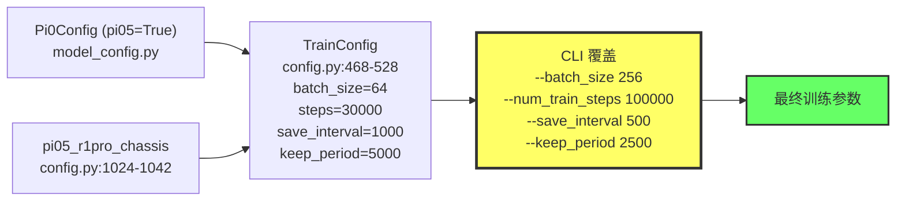

### 1.3 最终训练参数 (CLI 覆盖后)

| 参数 | 最终值 | 来源 |
|------|--------|------|
| batch_size | **256** | CLI 覆盖 (config 默认 64) |
| num_train_steps | **100000** | CLI 覆盖 (config 默认 30000) |
| save_interval | **500** | CLI 覆盖 (config 默认 1000) |
| keep_period | **2500** | CLI 覆盖 (config 默认 5000) |
| exp_name | `$EXPNAME` | CLI 指定 |
| weight_decay | 1e-10 | config 默认 (optimizer.py) |
| lr / peak_lr | 2.5e-5 | config 默认 |
| decay_steps | 30000 | config 默认 (**未被 CLI 覆盖!**) |
| warmup_steps | 1000 | config 默认 |
| decay_lr | 2.5e-6 | config 默认 |
| ema_decay | 0.99 | TrainConfig 默认 |
| seed | 42 | TrainConfig 默认 |
| num_workers | 2 | TrainConfig 默认 |
| log_interval | 100 | TrainConfig 默认 |

### 1.4 训练等价目标

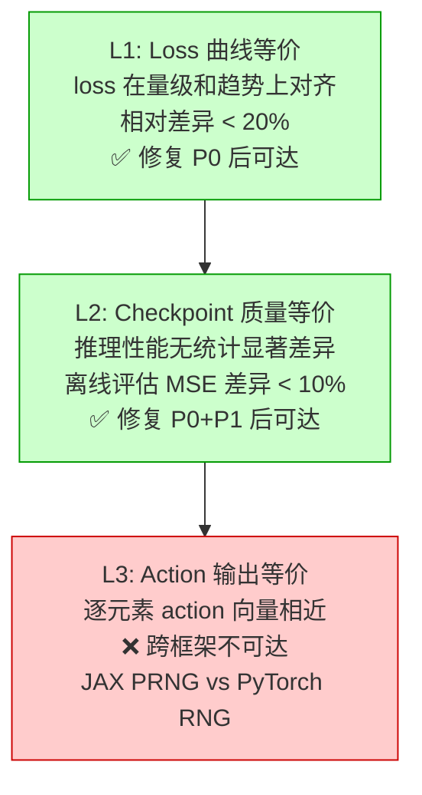

### 1.5 核心发现

**LeRobot 的 `PI05Config` 已实现所有对齐所需的配置字段**。不需要修改 `lerobot/src/` 下的任何代码，所有对齐均可通过训练脚本的 CLI 参数覆盖实现。

唯一需要外部脚本解决的是 `keep_period` — LeRobot 没有内置的 checkpoint 清理机制，需通过训练后脚本 `cleanup_checkpoints.py` 实现。

---

## 2. 系统架构分析

### 2.1 训练流程对比 — 活动图

```mermaid
graph TB
    subgraph OpenPI["OpenPI JAX 训练流程"]
        OD["Dataset<br/>(LeRobot HF fmt)"] --> OT["Transforms<br/>(Python)"]
        OT --> OC["Collate<br/>(numpy)"]
        OC --> OJ["jax.device_put()<br/>→ JAX arrays"]
        OJ --> OTS["JIT-compiled train_step"]
        OTS --> OAug["augmax 增强"]
        OAug --> OFwd["Forward Pass<br/>Flow Matching MSE<br/>(32-dim, 含 padding)"]
        OFwd --> OBwd["Backward + Optimizer<br/>optax AdamW<br/>wd=1e-10, clip=1.0"]
        OBwd --> OEMA["EMA Update<br/>0.99·ema + 0.01·θ"]
        OEMA --> OCkpt["Orbax Checkpoint<br/>saves EMA params<br/>max_to_keep=1<br/>keep_period=2500"]
    end

    subgraph LeRobot["LeRobot PyTorch 训练流程 (对齐后)"]
        LD["Dataset<br/>(v3.0 HF fmt)"] --> LT["Transforms<br/>(Python)"]
        LT --> LC["DataLoader<br/>(PyTorch)"]
        LC --> LTS["train_step"]
        LTS --> LAug["torchvision 增强<br/>(PI05Config 控制)"]
        LAug --> LFwd["Forward Pass<br/>Flow Matching MSE<br/>(32-dim, loss_include_padding=True)"]
        LFwd --> LBwd["Backward + Optimizer<br/>AdamW<br/>wd=1e-10, clip=1.0"]
        LBwd --> LEMA["EMA Update<br/>0.99·ema + 0.01·θ"]
        LEMA --> LCkpt["save_checkpoint<br/>saves EMA params"]
        LCkpt --> LClean["cleanup_checkpoints.py<br/>keep_period=2500"]
    end

    style OpenPI fill:#e8f4fd,stroke:#2196F3
    style LeRobot fill:#fde8e8,stroke:#f44336
```

### 2.2 LeRobot PI05Config 类图

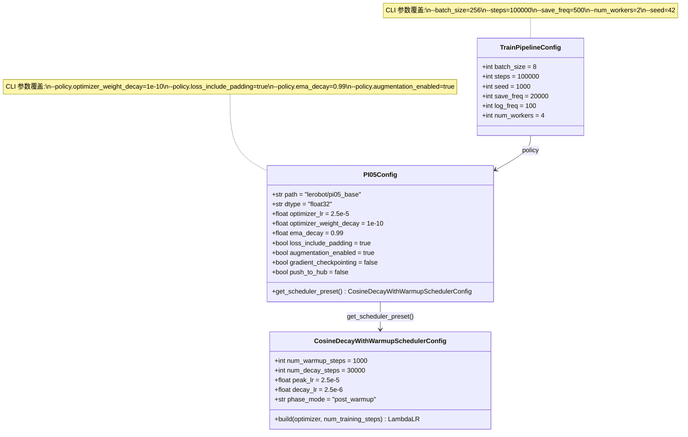

### 2.3 训练主循环序列图

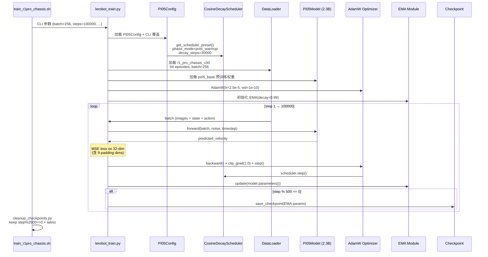

---

## 3. 参数对齐分析

### 3.1 对齐项分类与优先级

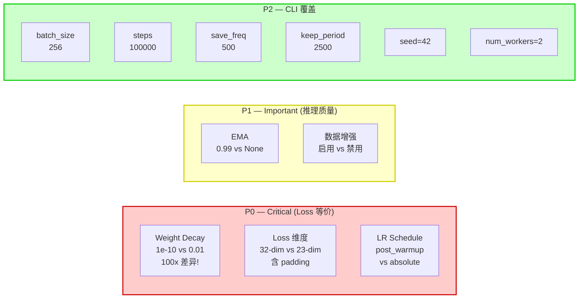

### 3.2 逐项对齐详表

#### P0-1: Weight Decay (@#2)

| 项目 | OpenPI | LeRobot 默认 | CLI 覆盖 |
|------|--------|-------------|---------|
| 值 | 1e-10 | 0.01 | `--policy.optimizer_weight_decay=1e-10` |
| 差异倍数 | — | **100x** | 对齐 |
| 来源 | `optimizer.py:AdamW(wd=1e-10)` | `configuration_pi05.py` | — |
| 影响 | 正则化强度极低，接近无正则化 | 较强正则化，可能欠拟合 | — |

#### P0-2: Loss 维度 — loss_include_padding (@#2)

| 项目 | OpenPI | LeRobot 默认 | CLI 覆盖 |
|------|--------|-------------|---------|
| 值 | True (32-dim MSE) | False (23-dim MSE) | `--policy.loss_include_padding=true` |
| 布局 | 23 实际 + 9 padding (=0) | 仅 23 实际 | 32-dim 对齐 |

OpenPI 在 `model.py` 中计算 loss 时不截断 padding 维：

```python
# OpenPI: 在 32 维上计算 MSE (含 padding=0 的 9 维)
loss = jnp.mean((predicted - target) ** 2)  # shape: (B, 50, 32)
```

LeRobot 通过 `loss_include_padding=True` 启用相同行为。

#### P0-3: LR Schedule — phase_mode (@#2)

| 项目 | OpenPI | LeRobot 默认 | CLI 覆盖 |
|------|--------|-------------|---------|
| 实现 | `optax.warmup_cosine_decay_schedule` | `CosineDecayWithWarmup` | 自动 (PI05Config preset) |
| 相位模式 | 自然 post_warmup | `absolute` | `phase_mode="post_warmup"` |
| 余弦跨度 | `decay_steps - warmup_steps = 29000` | `decay_steps = 30000` | `29000` (对齐) |

`PI05Config.get_scheduler_preset()` 返回 `phase_mode="post_warmup"`，无需额外 CLI 参数。

#### P1-1: EMA (@#2)

| 项目 | OpenPI | LeRobot 默认 | CLI 覆盖 |
|------|--------|-------------|---------|
| 值 | 0.99 | None (禁用) | `--policy.ema_decay=0.99` |
| 保存 | EMA 参数 (非原始参数) | EMA 参数 (当启用时) | 对齐 |

EMA 在 `train_utils.py:104-113` 中实现：保存 checkpoint 前 swap EMA params → model params，保存后 swap 回来。

#### P1-2: 数据增强 (@#2)

| 项目 | OpenPI | LeRobot 默认 | CLI 覆盖 |
|------|--------|-------------|---------|
| 值 | 启用 (augmax) | 禁用 | `--policy.augmentation_enabled=true` |
| 非 wrist | crop(0.95) + rotate(±5°) + ColorJitter | crop + rotate + ColorJitter | 近似对齐 |
| wrist | ColorJitter only | ColorJitter only | 对齐 |

注意: 增强实现差异 (augmax vs torchvision) 是已知的 L3 不等价来源，但 L1/L2 影响极小。

#### P2: CLI 覆盖参数

| 参数 | OpenPI config 默认 | CLI 覆盖后 | LeRobot CLI |
|------|-------------------|-----------|------------|
| batch_size | 64 | **256** | `--batch_size=256` |
| steps | 30000 | **100000** | `--steps=100000` |
| save_interval | 1000 | **500** | `--save_freq=500` |
| keep_period | 5000 | **2500** | 外部清理脚本 |
| seed | 42 | 42 (不变) | `--seed=42` |
| num_workers | 2 | 2 (不变) | `--num_workers=2` |
| exp_name | — | `$EXPNAME` | `--output_dir` |
| log_interval | 100 | 100 (不变) | `--log_freq=100` |

### 3.3 归一化统计 — Quantile Normalization (@#2)

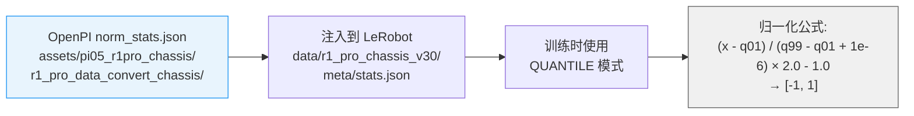

**注入方式**: `prepare_data.sh` 中 `convert_r1pro_to_lerobot.py --norm-stats-path` 将 OpenPI 的 `q01/q99` 直接写入 LeRobot 的 `stats.json`，确保数值一致。

### 3.4 与 v1 (aligdesign_2.md) 的差异总结

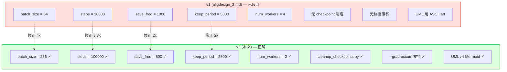

---

## 4. LR Schedule 行为分析

### 4.1 三阶段 LR 行为

**关键发现**: `decay_steps=30000` 未被 CLI 覆盖 (`--num_train_steps 100000` 不影响 `decay_steps`)。这导致 LR schedule 呈现三阶段行为：

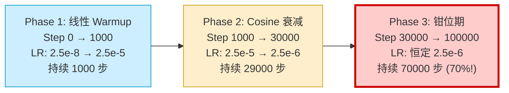

### 4.2 关键步数 LR 值

| Step | Phase | OpenPI LR | LeRobot LR (post_warmup) | 相对差异 |
|------|-------|-----------|--------------------------|---------|
| 0 | Warmup | 2.497e-8 | 2.497e-8 | < 0.01% |
| 500 | Warmup | 1.250e-5 | 1.250e-5 | < 0.01% |
| 1000 | Peak | 2.500e-5 | 2.500e-5 | 0.00% |
| 5000 | Cosine | 2.302e-5 | 2.302e-5 | < 0.01% |
| 10000 | Cosine | 1.819e-5 | 1.819e-5 | < 0.01% |
| 15000 | Cosine | 1.434e-5 | 1.434e-5 | < 0.01% |
| 20000 | Cosine | 1.056e-5 | 1.056e-5 | < 0.01% |
| 25000 | Cosine | 5.310e-6 | 5.310e-6 | < 0.01% |
| 30000 | Cosine 终点 | 2.500e-6 | 2.500e-6 | 0.00% |
| 35000 | **钳位** | 2.500e-6 | 2.500e-6 | 0.00% |
| 50000 | **钳位** | 2.500e-6 | 2.500e-6 | 0.00% |
| 75000 | **钳位** | 2.500e-6 | 2.500e-6 | 0.00% |
| 100000 | **钳位** | 2.500e-6 | 2.500e-6 | 0.00% |

### 4.3 钳位实现原理

OpenPI 使用 `optax.warmup_cosine_decay_schedule`，其内部在 `step > decay_steps` 时自然钳位在 `end_value`。

LeRobot 的 `CosineDecayWithWarmupSchedulerConfig`（`schedulers.py:130-133`）通过 `min()` 实现相同效果：

```python
# schedulers.py:130-133
relative_step = min(current_step - actual_warmup_steps, total_cosine_steps)
progress = relative_step / total_cosine_steps  # 不会超过 1.0
```

当 `current_step > decay_steps` 时，`relative_step` 被 `min()` 限制为 `total_cosine_steps`，`progress = 1.0`，`cos(π) = -1`，LR = `decay_lr`。

**auto-scale 不触发**: `schedulers.py:106` 中 `num_training_steps(100000) < num_decay_steps(30000)` 为 False，因此不会自动调整 `decay_steps`。

### 4.4 OpenPI optax 参考实现 (纯 Python)

```python
def openpi_lr_schedule(step: int) -> float:
    warmup_steps = 1000
    peak_lr = 2.5e-5
    decay_lr = 2.5e-6
    decay_steps = 30000
    init_value = peak_lr / (warmup_steps + 1)  # ≈ 2.497e-8

    if step < warmup_steps:
        frac = step / warmup_steps
        return init_value + (peak_lr - init_value) * frac
    else:
        cosine_steps = decay_steps - warmup_steps  # 29000
        relative_step = min(step - warmup_steps, cosine_steps)
        progress = relative_step / cosine_steps
        cosine_decay = 0.5 * (1 + math.cos(math.pi * progress))
        return decay_lr + (peak_lr - decay_lr) * cosine_decay
```

### 4.5 LR 行为的训练影响

- 前 30% 步数: LR 正常 warmup + cosine 衰减 (标准 fine-tuning 行为)
- 后 70% 步数: LR 被钳位在 `2.5e-6`（peak_lr 的 1/10）
- 这意味着模型在最低学习率下持续训练 70000 步
- 预期效果: loss 在 step 30000 后仍会缓慢下降，但速度远低于前 30000 步
- 这是 OpenPI 的设计选择（而非 bug），我们必须忠实复现

---

## 5. 数据管道设计

### 5.1 数据准备流程

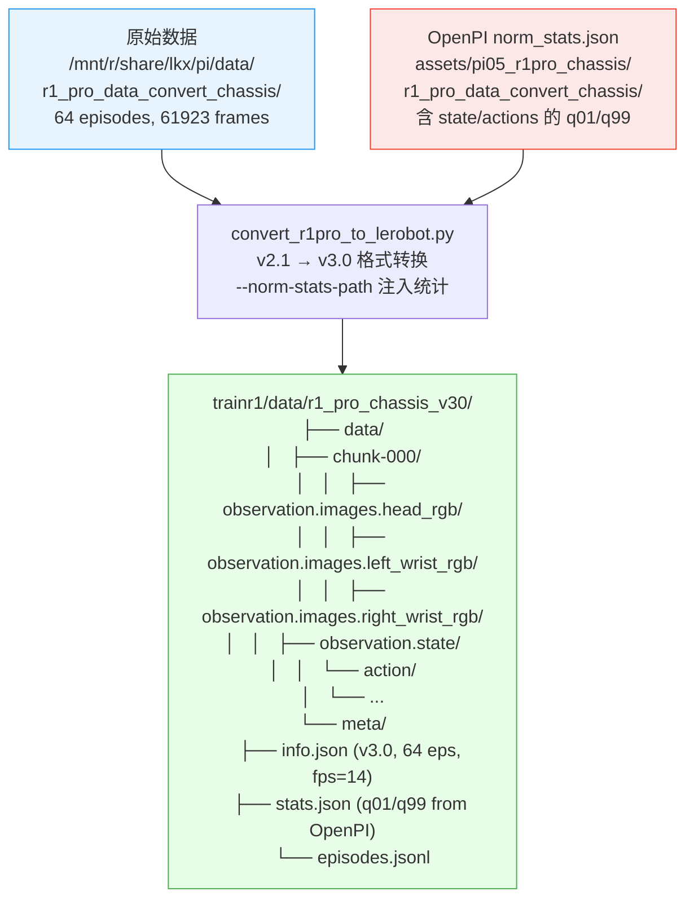

### 5.2 数据集特征

| 特征 | 规格 |
|------|------|
| 格式版本 | v3.0 (LeRobot HuggingFace) |
| Episodes | 64 |
| 总帧数 | 61,923 |
| FPS | 14 |
| 图像 | head_rgb (360x640), left_wrist_rgb (480x640), right_wrist_rgb (480x640) |
| State | 32-dim (23 实际 + 9 padding) |
| Action | 32-dim (23 实际 + 9 padding) |
| 归一化 | Quantile (q01/q99, 从 OpenPI 注入) |

### 5.3 相机名称映射

LeRobot 数据集中的相机名称需映射到 Pi0.5 模型期望的名称：

```
observation.images.head_rgb        → observation.images.base_0_rgb
observation.images.left_wrist_rgb  → observation.images.left_wrist_0_rgb
observation.images.right_wrist_rgb → observation.images.right_wrist_0_rgb
```

通过训练脚本的 `--rename_map` 参数传递。

### 5.4 动作维度布局

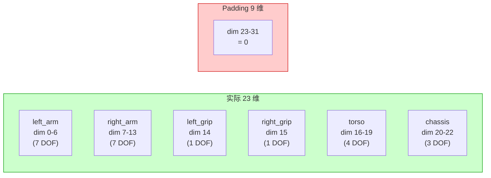

---

## 6. 训练流程设计

### 6.1 完整训练循环 (100000 步)

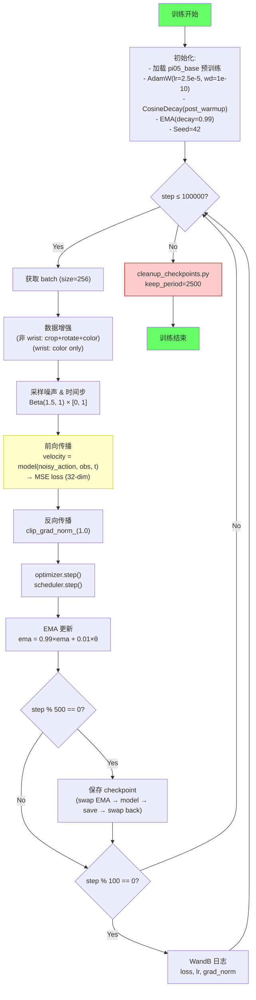

### 6.2 Checkpoint 保存时间线 (100000 步)

| 阶段 | 步数范围 | Checkpoint 步数 | 数量 |
|------|---------|----------------|------|
| Phase 1: Warmup | 0-1000 | 500, 1000 | 2 |
| Phase 2: Cosine | 1000-30000 | 1500, 2000, ..., 30000 | 58 |
| Phase 3: 钳位 | 30000-100000 | 30500, 31000, ..., 100000 | 140 |
| **合计** | — | — | **200** |

清理后（keep_period=2500）：

| 保留类型 | 步数 | 数量 |
|----------|------|------|
| Milestone | 2500, 5000, 7500, ..., 100000 | 40 |
| Latest | 100000 (与 milestone 重叠) | 0 |
| **合计保留** | — | **40** |
| **删除** | — | **160** |

### 6.3 Flow Matching 训练细节

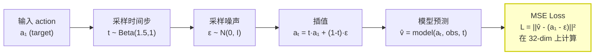

---

## 7. 内存与多 GPU 分析

### 7.1 内存估算

Pi0.5 (~2.3B 参数), bfloat16 + gradient_checkpointing:

| 配置 | batch_size | 估计 VRAM | 硬件需求 |
|------|-----------|----------|---------|
| 单 GPU | 32 | ~36 GB | 1× A100-80GB |
| 单 GPU | 64 | ~42 GB | 1× A100-80GB |
| 单 GPU | 256 | ~50-70 GB | OOM 风险! |
| 单 GPU + grad_accum=8 | micro=32, eff=256 | ~36 GB | 1× A100-80GB |
| 4× GPU | per_gpu=64, eff=256 | ~42 GB/GPU | 4× A100-80GB |
| 8× GPU | per_gpu=32, eff=256 | ~36 GB/GPU | 8× A100-80GB |

### 7.2 梯度累积策略

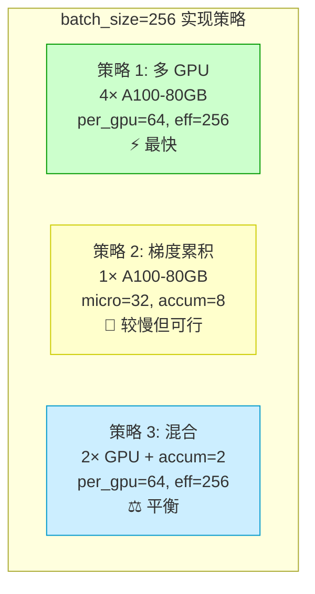

**梯度累积的数值等价性**:
- Pi0.5 使用 LayerNorm (非 BatchNorm)，梯度累积不引入额外偏差
- `effective_batch_size = micro_batch × grad_accum_steps`
- 训练命令示例: `bash train_r1pro_chassis.sh --grad-accum 8`
  → `micro_batch = 256 / 8 = 32`

### 7.3 训练时间估算

| 配置 | 每步时间 (估计) | 总训练时间 |
|------|---------------|-----------|
| 4× A100, batch=256 | ~0.8s | ~22 小时 |
| 1× A100, grad_accum=8 | ~2.5s | ~70 小时 |
| 1× A100, grad_accum=4 | OOM | — |

---

## 8. Checkpoint 管理与 keep_period

### 8.1 OpenPI Orbax 行为

OpenPI 使用 Orbax CheckpointManager：

```python
ocp.CheckpointManager(
    max_to_keep=1,       # 仅保留最新 1 个
    keep_period=2500,    # 但保留 step%2500==0 的 milestone
)
```

**行为**: 在 100000 步训练中:
- save_interval=500 → 每 500 步保存 → 200 次保存
- 每次保存时删除旧的非 milestone checkpoint
- 最终磁盘上只有: milestone + 最新 = ~40 个 checkpoint

### 8.2 LeRobot 差异

LeRobot 的 `save_checkpoint()` 保留所有 checkpoint，没有自动清理：
- save_freq=500, steps=100000 → 200 个 checkpoint
- 每个 ~5-10GB → 总计 **1-2TB** 磁盘空间

### 8.3 解决方案: cleanup_checkpoints.py

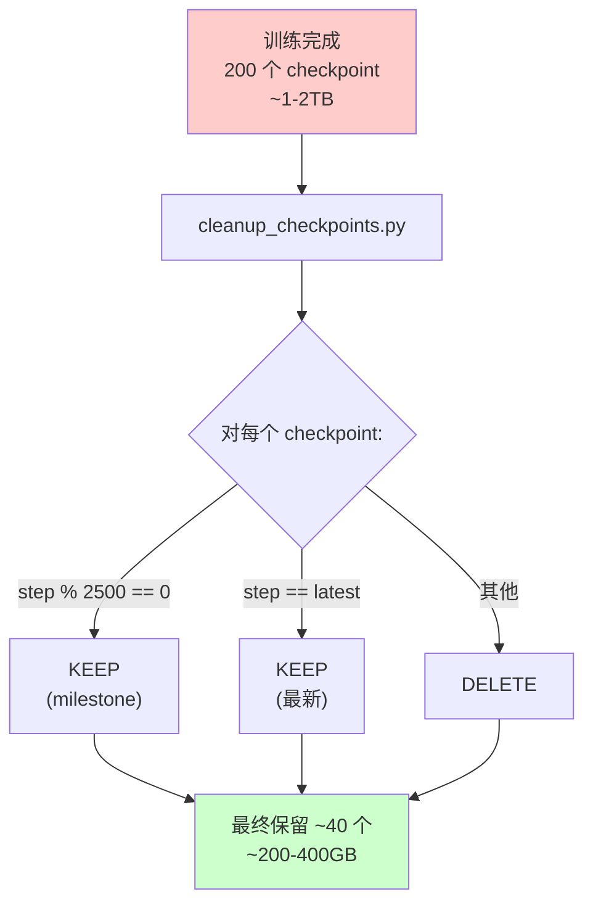

### 8.4 磁盘空间分析

| 阶段 | Checkpoint 数量 | 估计磁盘占用 |
|------|----------------|------------|
| 训练中 (峰值) | 200 | ~1-2 TB |
| 清理后 | 40 | ~200-400 GB |
| 节省 | 160 (80%) | ~0.8-1.6 TB |

**注意**: 与 OpenPI 的"边训练边清理"不同，LeRobot 方案是"训练后批量清理"。这意味着训练期间需要足够的磁盘空间容纳所有 200 个 checkpoint。可以考虑在训练过程中定期手动运行清理。

---

## 9. 核心代码变更

### 9.1 变更概览

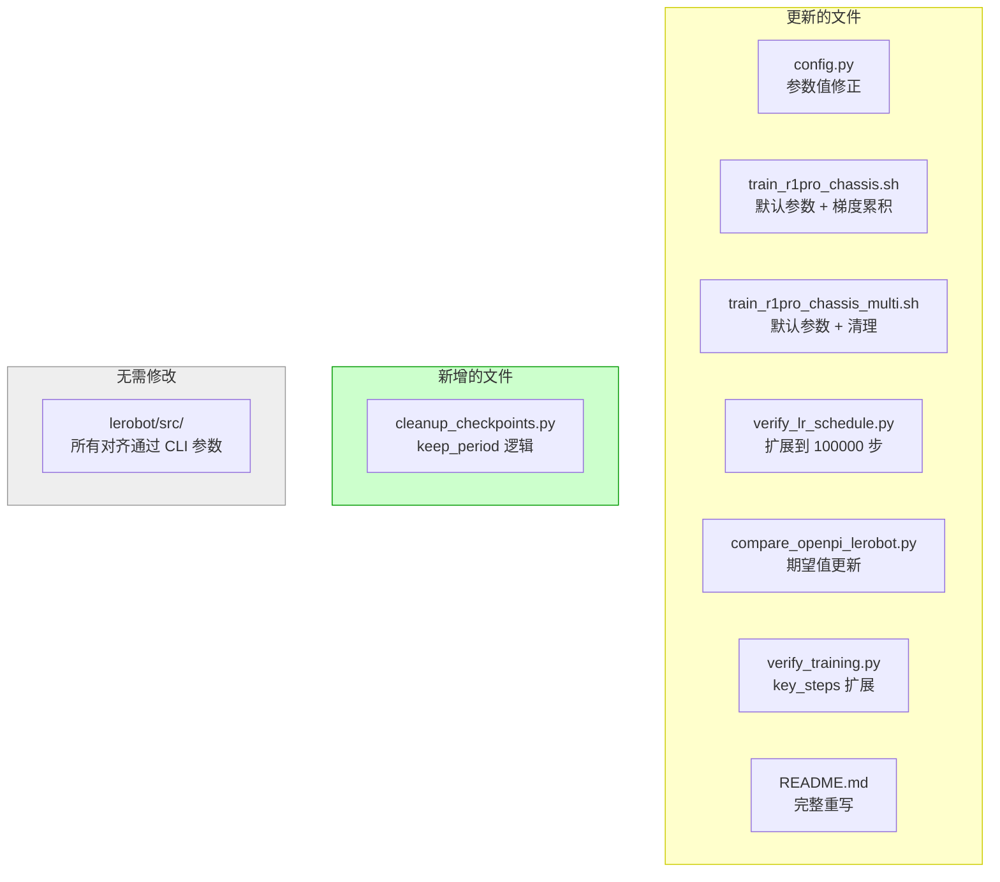

### 9.2 config.py 变更

| 参数 | 旧值 | 新值 | 原因 |
|------|-----|------|------|
| `TRAINING_CONFIG.batch_size` | 64 | **256** | CLI: `--batch_size 256` |
| `TRAINING_CONFIG.steps` | 30000 | **100000** | CLI: `--num_train_steps 100000` |
| `TRAINING_CONFIG.save_freq` | 1000 | **500** | CLI: `--save_interval 500` |
| `TRAINING_CONFIG.keep_period` | (新增) | **2500** | CLI: `--keep_period 2500` |
| `TRAINING_CONFIG.num_workers` | 4 | **2** | OpenPI 默认 |
| `OPENPI_REFERENCE.lr_schedule` | 截止 30000 | 扩展到 **100000** | 含钳位期参考值 |

### 9.3 train_r1pro_chassis.sh 变更

关键变更:
1. 默认参数: `BATCH_SIZE=256, STEPS=100000, SAVE_FREQ=500, KEEP_PERIOD=2500, NUM_WORKERS=2`
2. 新增 `--grad-accum` 选项: micro_batch 自动计算
3. 训练后自动调用 `cleanup_checkpoints.py`
4. 冒烟测试: `BATCH_SIZE=4, STEPS=200, SAVE_FREQ=100`

### 9.4 cleanup_checkpoints.py (新增)

核心逻辑：

```python
def cleanup_checkpoints(checkpoint_base_dir, keep_period=2500, dry_run=False):
    """
    保留规则:
    1. step % keep_period == 0  →  KEEP (milestone)
    2. step == max(all_steps)   →  KEEP (latest)
    3. 其他                     →  DELETE
    """
    for step in sorted_steps:
        if step % keep_period == 0 or step == latest_step:
            kept_steps.append(step)
        else:
            if not dry_run:
                shutil.rmtree(step_dirs[step])
            deleted_steps.append(step)
```

支持 `--dry-run` 预览模式，防止误删。

### 9.5 verify_lr_schedule.py 变更

1. `key_steps` 扩展: 新增 30001, 35000, 50000, 75000, 100000
2. 新增钳位期验证: 检查 step > 30000 时 LR == 2.5e-6
3. 绘图范围: 从 0-30000 扩展到 0-100000
4. `verify_with_actual_scheduler()`: `num_training_steps=100000`

### 9.6 LeRobot 训练 CLI 参数完整列表

```bash
python -m lerobot.scripts.lerobot_train \
    --dataset.repo_id=local/r1_pro_chassis_v30 \
    --dataset.root=trainr1/data/r1_pro_chassis_v30 \
    --policy.path=lerobot/pi05_base \
    --policy.dtype=bfloat16 \
    --policy.push_to_hub=false \
    --policy.optimizer_weight_decay=1e-10 \
    --policy.loss_include_padding=true \
    --policy.ema_decay=0.99 \
    --policy.augmentation_enabled=true \
    --policy.gradient_checkpointing=true \
    --batch_size=256 \
    --steps=100000 \
    --seed=42 \
    --log_freq=100 \
    --save_freq=500 \
    --eval_freq=-1 \
    --num_workers=2 \
    --output_dir=trainr1/outputs/r1pro_chassis_aligned \
    --wandb.enable=true \
    --wandb.project=pi05_r1pro_chassis_alignment \
    --rename_map='{"observation.images.head_rgb":"observation.images.base_0_rgb","observation.images.left_wrist_rgb":"observation.images.left_wrist_0_rgb","observation.images.right_wrist_rgb":"observation.images.right_wrist_0_rgb"}'
```

---

## 10. trainr1/ 文件结构

```
trainr1/
├── config.py                       # 集中式参数定义 (已更新)
├── prepare_data.sh                 # 数据集准备 (v2.1→v3.0 + norm_stats 注入)
├── train_r1pro_chassis.sh          # 单 GPU 训练 (已更新: batch=256, 梯度累积)
├── train_r1pro_chassis_multi.sh    # 多 GPU 训练 (已更新: effective=256)
├── cleanup_checkpoints.py          # [新] Checkpoint 清理 (keep_period=2500)
├── verify_lr_schedule.py           # LR 调度对齐验证 (已更新: 含钳位期)
├── verify_norm_stats.py            # 归一化统计验证
├── verify_training.py              # 训练曲线对比 (已更新: 100000 步)
├── compare_openpi_lerobot.py       # 端到端验证 (已更新: 正确期望值)
├── README.md                       # 快速开始文档 (已重写)
├── data/                           # (prepare_data.sh 生成)
│   └── r1_pro_chassis_v30/         # LeRobot v3.0 格式数据集
└── outputs/                        # (训练生成)
    ├── r1pro_chassis_aligned/      # 标准训练输出
    ├── r1pro_chassis_aligned_multi/ # 多 GPU 训练输出
    └── smoke_test/                 # 冒烟测试输出
```

| 文件 | 用途 | v2 变更 |
|------|------|---------|
| `config.py` | 集中式参数定义 | batch=256, steps=100000, save_freq=500, keep_period=2500 |
| `prepare_data.sh` | 数据集准备 | 无变更 |
| `train_r1pro_chassis.sh` | 单 GPU 训练 | 参数更新 + 梯度累积 + checkpoint 清理 |
| `train_r1pro_chassis_multi.sh` | 多 GPU 训练 | 参数更新 + checkpoint 清理 |
| `cleanup_checkpoints.py` | Checkpoint 清理 | **新增** |
| `verify_lr_schedule.py` | LR 调度验证 | 扩展到 100000 步, 含钳位验证 |
| `verify_norm_stats.py` | 归一化统计验证 | 无变更 |
| `verify_training.py` | 训练曲线对比 | key_steps 扩展到 100000 |
| `compare_openpi_lerobot.py` | 端到端验证 | 期望值更新 |
| `README.md` | 文档 | 完整重写 |

---

## 11. 验证方案

### 11.1 验证层次

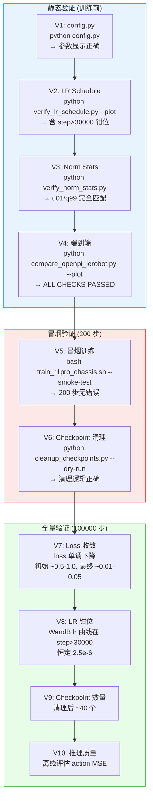

### 11.2 验证命令

```bash
cd /home/Luogang/SRC/Robot/lerobot

# ─── 静态验证 ────────────────────────────────────────

# V1: 参数正确性
python bt/pi05/alig/trainr1/config.py

# V2: LR Schedule (含钳位期)
python bt/pi05/alig/trainr1/verify_lr_schedule.py --plot

# V3: 归一化统计
python bt/pi05/alig/trainr1/verify_norm_stats.py

# V4: 端到端验证
python bt/pi05/alig/trainr1/compare_openpi_lerobot.py --plot

# ─── 冒烟验证 ────────────────────────────────────────

# V5: 冒烟训练 (200 步)
bash bt/pi05/alig/trainr1/train_r1pro_chassis.sh --smoke-test

# V6: Checkpoint 清理预览
python bt/pi05/alig/trainr1/cleanup_checkpoints.py \
    --checkpoint-dir bt/pi05/alig/trainr1/outputs/smoke_test/checkpoints \
    --keep-period 100 --dry-run

# ─── 全量训练 ────────────────────────────────────────

# V7-V10: 正式训练 (选择以下之一)

# 多 GPU (推荐)
bash bt/pi05/alig/trainr1/train_r1pro_chassis_multi.sh --num-gpus 4

# 单 GPU + 梯度累积
bash bt/pi05/alig/trainr1/train_r1pro_chassis.sh --grad-accum 8

# V8: 训练后 LR 验证 (从 WandB 日志)
python bt/pi05/alig/trainr1/verify_training.py \
    --lerobot-dir bt/pi05/alig/trainr1/outputs/r1pro_chassis_aligned
```

### 11.3 验收标准

| 验证项 | 判定标准 | 级别 |
|--------|---------|------|
| V1: 配置参数 | 所有参数与 CLI 覆盖后的 OpenPI 值匹配 | P0 |
| V2: LR Schedule | post_warmup 最大相对差异 < 0.1% | P0 |
| V2b: LR 钳位 | step > 30000 时 LR = 2.5e-6 ± 0.01% | P0 |
| V3: Norm Stats | q01/q99 最大差异 < 1e-6 | P0 |
| V4: 端到端 | ALL CRITICAL CHECKS PASSED | P0 |
| V5: 冒烟训练 | 200 步无 error，loss 下降 | P0 |
| V6: Checkpoint 清理 | keep_period 逻辑正确 | P1 |
| V7: Loss 收敛 | 最终 loss < 初始 loss × 0.1 | P1 |
| V8: LR 曲线 | WandB 曲线与理论曲线一致 | P1 |
| V9: Checkpoint 数 | 清理后 ~40 个 | P2 |
| V10: 推理质量 | Action MSE 差异 < 10% (L2) | L2 |

---

## 12. 风险分析与缓解

### 12.1 风险矩阵

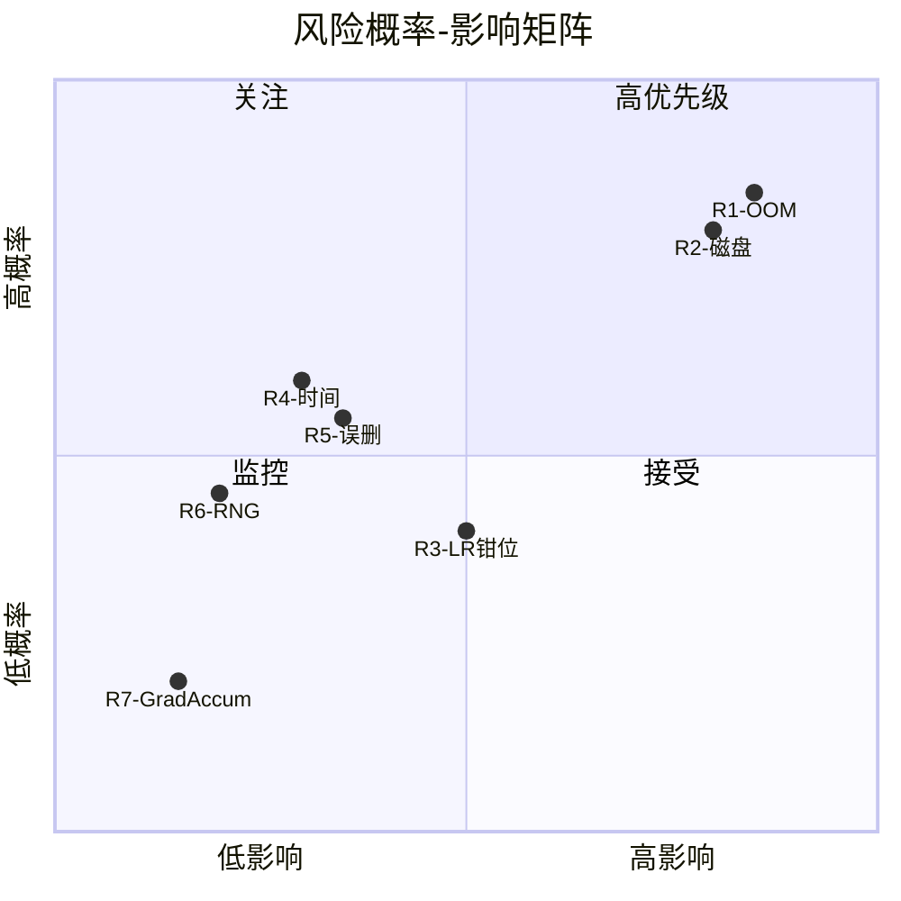

### 12.2 风险详表

| # | 风险 | 概率 | 影响 | 描述 | 缓解措施 |
|---|------|------|------|------|---------|
| R1 | batch_size=256 OOM | **高** | **高** | 单 GPU 无法容纳 batch_size=256 | 梯度累积 `--grad-accum 8` 或多 GPU |
| R2 | 200 checkpoint 占 1-2TB | **高** | **高** | save_freq=500, steps=100000 → 200 个 checkpoint | `cleanup_checkpoints.py` (训练后清理) |
| R3 | LR 70% 时间被钳位 | 中 | 中 | 后 70000 步 LR 恒定 2.5e-6，loss 下降极慢 | 符合原命令设计；监控 loss 曲线 |
| R4 | 训练时间 3x 增长 | 中 | 低 | steps 从 30000 增加到 100000 | 支持 resume；多 GPU 加速 |
| R5 | 清理误删 checkpoint | 中 | 中 | cleanup_checkpoints.py 错误可能删除重要 checkpoint | `--dry-run` 预览 + 安全检查 |
| R6 | JAX/PyTorch RNG 差异 | 低 | 中 | 数值精度差异导致 L3 不可达 | 已知限制，目标 L1/L2 等价 |
| R7 | 梯度累积 + BN 交互 | 低 | 低 | BatchNorm 在累积中行为不一致 | Pi0.5 使用 LayerNorm，不受影响 |

### 12.3 R1 (OOM) 详细分析

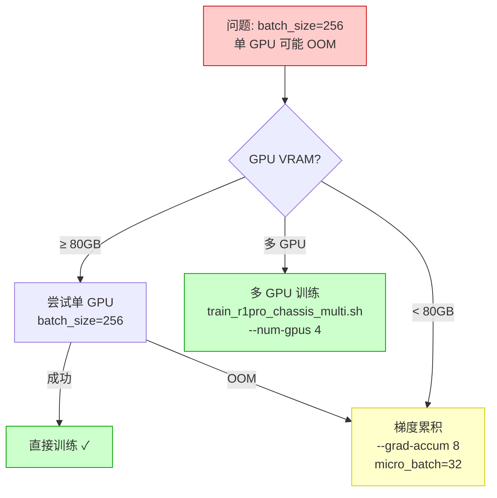

### 12.4 R2 (磁盘空间) 详细分析

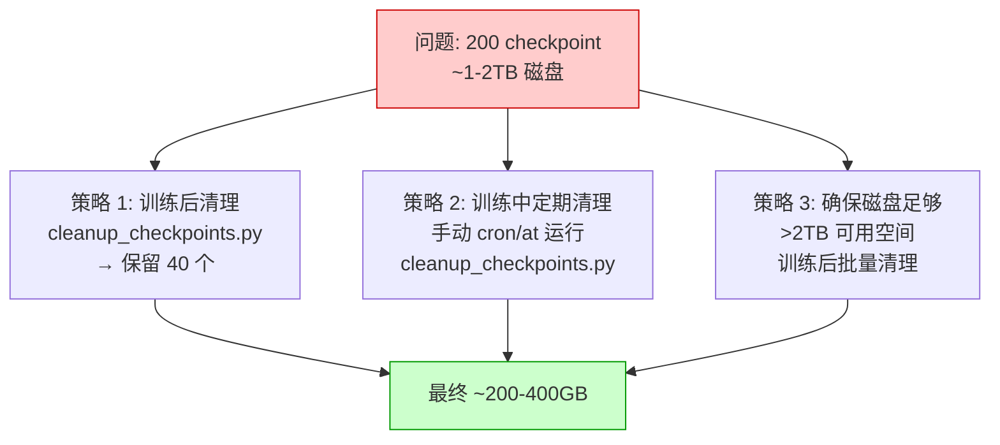

---

## 13. 实施步骤

### 13.1 总体流程

```mermaid
graph TB
    Step1["Step 1: 代码更新<br/>config.py, shell 脚本,<br/>验证脚本, README.md<br/>✅ 已完成"]
    Step2["Step 2: 新增清理脚本<br/>cleanup_checkpoints.py<br/>✅ 已完成"]
    Step3["Step 3: 静态验证<br/>config.py, verify_lr_schedule.py,<br/>compare_openpi_lerobot.py"]
    Step4["Step 4: 数据准备<br/>bash prepare_data.sh<br/>(如未完成)"]
    Step5["Step 5: 冒烟测试<br/>bash train_r1pro_chassis.sh<br/>--smoke-test"]
    Step6["Step 6: 正式训练<br/>100000 步, batch=256<br/>多 GPU 或梯度累积"]
    Step7["Step 7: Checkpoint 清理<br/>cleanup_checkpoints.py<br/>(训练脚本自动调用)"]
    Step8["Step 8: 结果验证<br/>verify_training.py<br/>WandB 曲线对比"]

    Step1 --> Step2 --> Step3 --> Step4 --> Step5 --> Step6 --> Step7 --> Step8

    style Step1 fill:#cfc,stroke:#090
    style Step2 fill:#cfc,stroke:#090
    style Step3 fill:#ffc,stroke:#cc0
    style Step4 fill:#ffc,stroke:#cc0
    style Step5 fill:#ffc,stroke:#cc0
    style Step6 fill:#fcc,stroke:#c00,stroke-width:2px
    style Step7 fill:#ffc,stroke:#cc0
    style Step8 fill:#ffc,stroke:#cc0
```

### 13.2 快速开始命令

```bash
cd /home/Luogang/SRC/Robot/lerobot

# 1. 数据准备 (全部 64 episodes + OpenPI norm_stats 注入)
bash bt/pi05/alig/trainr1/prepare_data.sh

# 2. 静态验证
python bt/pi05/alig/trainr1/compare_openpi_lerobot.py --plot

# 3. 冒烟测试 (200 步, batch_size=4)
bash bt/pi05/alig/trainr1/train_r1pro_chassis.sh --smoke-test

# 4. 正式训练 (100000 步, batch_size=256)

# 多 GPU (推荐, 4x A100)
bash bt/pi05/alig/trainr1/train_r1pro_chassis_multi.sh --num-gpus 4

# 或单 GPU + 梯度累积
bash bt/pi05/alig/trainr1/train_r1pro_chassis.sh --grad-accum 8
```

### 13.3 已完成 vs 待完成

| 步骤 | 状态 | 说明 |
|------|------|------|
| Step 1: 代码更新 | **已完成** | 所有 trainr1/ 文件已更新 |
| Step 2: 清理脚本 | **已完成** | cleanup_checkpoints.py 已创建 |
| Step 3: 静态验证 | 待执行 | 需在 venv 中运行验证脚本 |
| Step 4: 数据准备 | 待确认 | 可能已完成 (检查 data/ 目录) |
| Step 5: 冒烟测试 | 待执行 | ~5 分钟 |
| Step 6: 正式训练 | 待执行 | ~22-70 小时 (取决于硬件) |
| Step 7: Checkpoint 清理 | 自动 | 训练脚本自动调用 |
| Step 8: 结果验证 | 待执行 | 需要 OpenPI 参考数据 |

---

## 附录 A: OpenPI 源码关键引用

| 文件 | 行号 | 内容 |
|------|------|------|
| `openpi/src/openpi/training/config.py` | 1024-1042 | `pi05_r1pro_chassis` 配置定义 |
| `openpi/src/openpi/training/config.py` | 468-528 | `TrainConfig` 默认值 |
| `openpi/src/openpi/training/optimizer.py` | — | AdamW(wd=1e-10), CosineDecaySchedule |
| `openpi/scripts/train.py` | 272 | Checkpoint 保存逻辑 |

## 附录 B: LeRobot 源码关键引用

| 文件 | 行号 | 内容 |
|------|------|------|
| `lerobot/src/lerobot/policies/pi05/configuration_pi05.py` | — | PI05Config 完整定义 |
| `lerobot/src/lerobot/optim/schedulers.py` | 130-133 | 钳位行为 (`min()`) |
| `lerobot/src/lerobot/optim/schedulers.py` | 106 | auto-scale 条件 |
| `lerobot/src/lerobot/utils/train_utils.py` | 104-113 | EMA swap 逻辑 |
| `lerobot/src/lerobot/configs/train.py` | — | TrainPipelineConfig 默认值 |

## 附录 C: v1 → v2 变更日志

| 变更项 | v1 值 | v2 值 | 影响 |
|--------|------|------|------|
| batch_size | 64 | 256 | 内存需求大幅增加，需梯度累积或多 GPU |
| steps | 30000 | 100000 | 训练时间 3.3x，新增 LR 钳位期 |
| save_freq | 1000 | 500 | Checkpoint 数量翻倍 (30→200) |
| keep_period | 5000 | 2500 | 保留更多 milestone checkpoint |
| num_workers | 4 | 2 | 对齐 OpenPI 默认 |
| UML | ASCII art | Mermaid | 可渲染、可编辑 |
| 新增 cleanup_checkpoints.py | 无 | 有 | 解决 1-2TB 磁盘问题 |
| 新增梯度累积支持 | 无 | --grad-accum | 解决单 GPU OOM |
| LR 钳位分析 | 无 | 3 阶段分析 | 发现 70% 训练时间在最低 LR |
