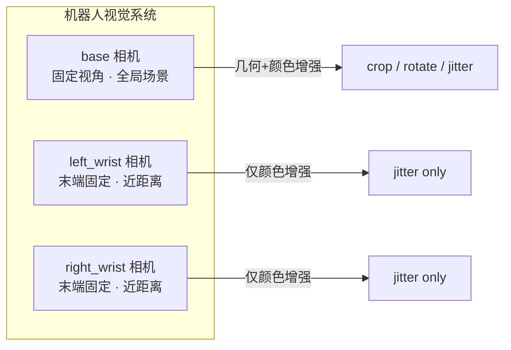
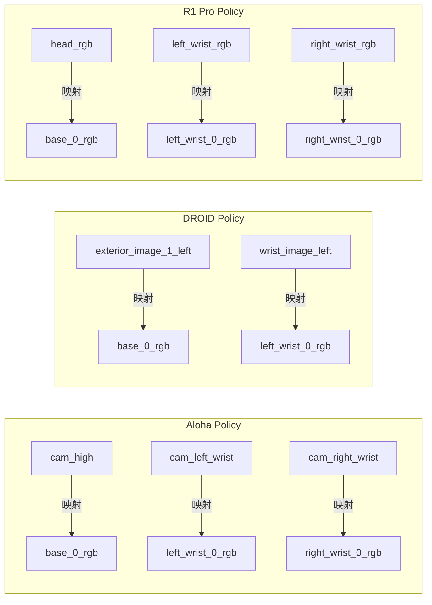
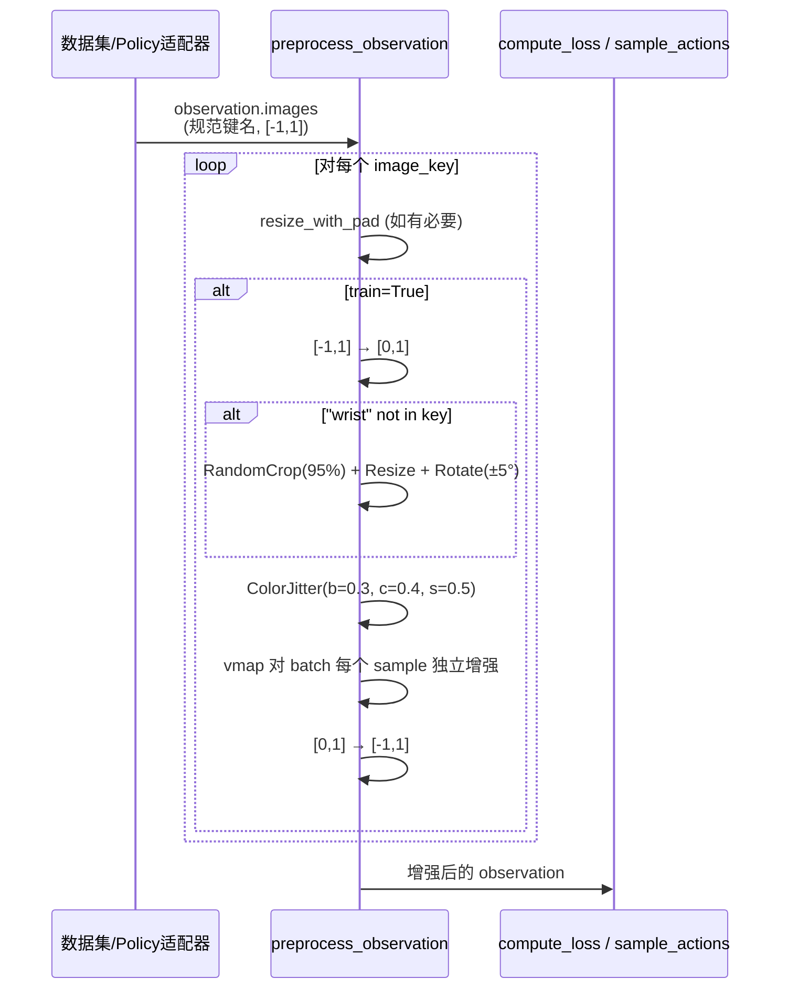
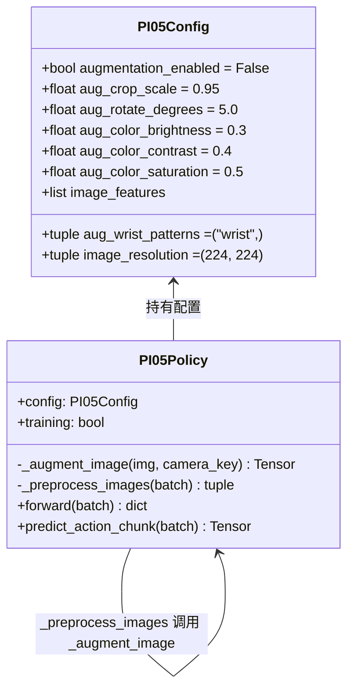
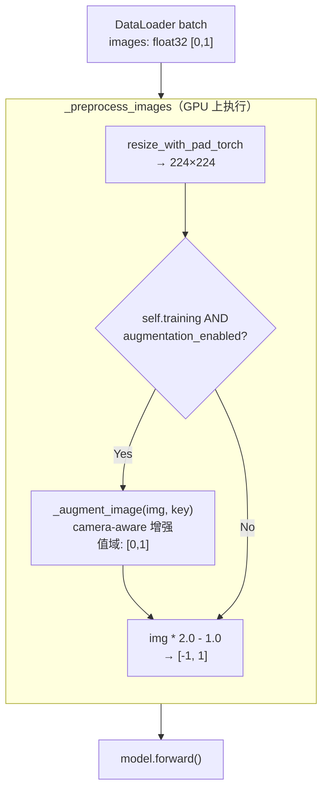
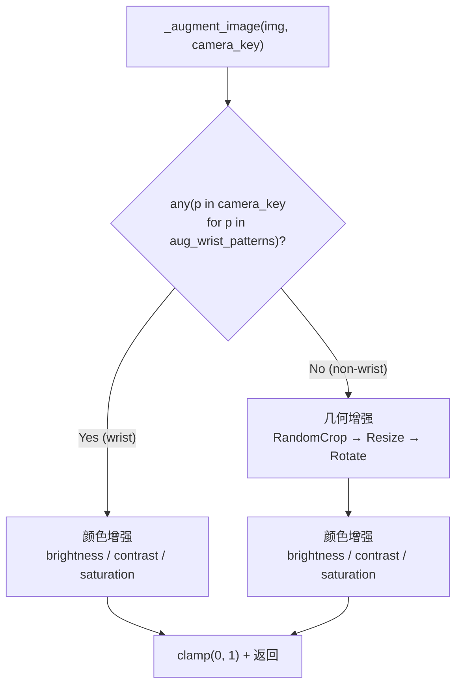
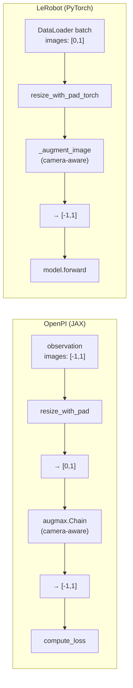
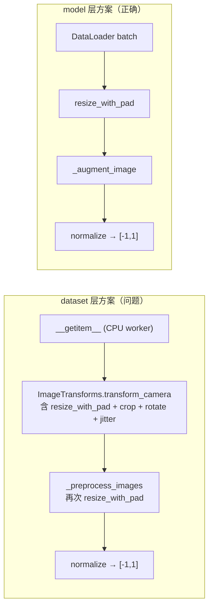

# Camera-Aware 数据处理分析

本文档结合 OpenPI 源码和 LeRobot 设计文档（`aligdesign_1v2.md`），系统说明 camera-aware 数据增强的原理、OpenPI 实现、LeRobot 对齐方案及其架构设计。

---

## 目录

1. [为什么要区分 wrist / non-wrist 相机](#1-为什么要区分-wrist--non-wrist-相机)
2. [OpenPI 如何实现 camera-aware](#2-openpi-如何实现-camera-aware)
3. [增强策略对比](#3-增强策略对比)
4. [LeRobot 中的实现方案](#4-lerobot-中的实现方案)
5. [OpenPI vs LeRobot 架构对比](#5-openpi-vs-lerobot-架构对比)
6. [为什么不放在 dataset 层](#6-为什么不放在-dataset-层)

---

## 1. 为什么要区分 wrist / non-wrist 相机

机器人通常配备两类视觉传感器：

| 类别 | 安装位置 | 视觉特征 | 典型名称 |
|------|----------|----------|----------|
| **base（非 wrist）** | 机器人外部固定支架（头部、高处） | 全局场景，视角固定 | `head_rgb`、`cam_high` |
| **wrist** | 机械臂末端 | 近距离手部/物体交互，视角随末端执行器运动 | `left_wrist_rgb`、`cam_left_wrist` |



**区分对待的原因**：

- **几何增强对 base 相机是安全的**：RandomCrop（模拟微小视角偏移）和 Rotate（模拟相机安装角度偏差）都是 base 相机在真实部署中可能遇到的变化，属于合理的域随机化（domain randomization）。

- **几何增强对 wrist 相机是危险的**：wrist 相机拍到的是末端执行器与目标物体之间精细的空间关系。crop 和 rotate 会改变图像中物体的相对位置，破坏模型学到的 "图像像素位置 → 执行器应该移动多远" 的映射。wrist 视角本身已经随机械臂运动在不断变化，不需要额外的几何扰动。

- **颜色增强对两类相机都安全**：亮度、对比度、饱和度的变化不改变空间关系，只模拟光照条件的变化，这对所有相机都是合理的。

---

## 2. OpenPI 如何实现 camera-aware

### 2.1 规范键名系统

OpenPI 定义了一组固定的**规范图像键名**（`openpi/src/openpi/models/model.py`）：

```python
IMAGE_KEYS = (
    "base_0_rgb",
    "left_wrist_0_rgb",
    "right_wrist_0_rgb",
)
```

键名中是否包含 `"wrist"` 子串，直接决定了该相机的增强策略。这不是通过配置文件或标志位，而是通过**命名约定**隐式传递的。

### 2.2 Policy 映射层

每个机器人平台的 Policy 适配器负责把原始相机字段名映射到规范键名：



映射代码示例（R1 Pro，`r1pro_chassis_policy.py`）：

```python
inputs = {
    "image": {
        "base_0_rgb": base_image,          # head_rgb 映射而来
        "left_wrist_0_rgb": left_wrist,    # left_wrist_rgb 映射而来
        "right_wrist_0_rgb": right_wrist,  # right_wrist_rgb 映射而来
    },
}
```

### 2.3 预处理中的分支逻辑

核心增强逻辑位于 `preprocess_observation()`（JAX 版本，`model.py:144-208`）：

```python
def preprocess_observation(rng, observation, *, train=False,
                           image_keys=IMAGE_KEYS, image_resolution=(224, 224)):
    for key in image_keys:
        image = observation.images[key]

        # Step 1: Resize
        if image.shape[1:3] != image_resolution:
            image = resize_with_pad(image, *image_resolution)

        # Step 2: 训练时增强
        if train:
            image = image / 2.0 + 0.5    # [-1,1] → [0,1]

            transforms = []
            if "wrist" not in key:        # <-- camera-aware 分支点
                height, width = image.shape[1:3]
                transforms += [
                    augmax.RandomCrop(int(width * 0.95), int(height * 0.95)),
                    augmax.Resize(width, height),
                    augmax.Rotate((-5, 5)),
                ]
            transforms += [
                augmax.ColorJitter(brightness=0.3, contrast=0.4, saturation=0.5),
            ]

            sub_rngs = jax.random.split(rng, image.shape[0])
            image = jax.vmap(augmax.Chain(*transforms))(sub_rngs, image)

            image = image * 2.0 - 1.0    # [0,1] → [-1,1]

        out_images[key] = image
```

关键点：
- **`"wrist" not in key`** 是唯一的分支条件——纯字符串子串判断
- 几何增强链（crop → resize → rotate）只对 non-wrist 相机构建
- 颜色增强（ColorJitter）无条件追加到所有相机的 transforms 列表
- `jax.vmap` 确保 batch 内每个 sample 用独立的 RNG，得到不同的随机增强

### 2.4 完整数据流



---

## 3. 增强策略对比

### 3.1 策略表

| 相机类别 | 几何增强 | 颜色增强 | 判断条件 |
|----------|----------|----------|----------|
| **non-wrist**（`base_0_rgb` 等） | RandomCrop(95%) → Resize → Rotate(±5°) | ColorJitter(brightness=0.3, contrast=0.4, saturation=0.5) | `"wrist" not in key` |
| **wrist**（`left_wrist_0_rgb` 等） | 无 | ColorJitter(brightness=0.3, contrast=0.4, saturation=0.5) | `"wrist" in key` |

### 3.2 各增强操作的语义

| 操作 | 参数 | 物理含义 | 为什么 wrist 不需要 |
|------|------|----------|---------------------|
| **RandomCrop** | 95% 边长 | 模拟 base 相机的微小视角偏移 | wrist 视角已随末端运动变化 |
| **Resize** | 回到原尺寸 | crop 后恢复分辨率 | — |
| **Rotate** | ±5° | 模拟相机安装角度偏差 | wrist 相机姿态由臂决定，角度信息有物理意义 |
| **ColorJitter** | b=0.3, c=0.4, s=0.5 | 模拟光照变化 | 光照变化对两类相机都存在，均需增强 |

### 3.3 RNG 机制

OpenPI 使用确定性 RNG：

```
train_rng = jax.random.fold_in(rng, state.step)   # 每个 step 唯一
sub_rngs  = jax.random.split(train_rng, batch_size) # 每个 sample 独立
```

相同 `(seed, step)` 始终产生相同增强结果——完全可复现。

---

## 4. LeRobot 中的实现方案

基于 `aligdesign_1v2.md` 的修订方案，LeRobot 的 camera-aware 增强放在 **PI05 模型层**（`_preprocess_images` 内），而非共享 dataset 层。

### 4.1 架构概览



### 4.2 数据流



### 4.3 camera-aware 分支逻辑

`_augment_image` 方法（`modeling_pi05.py`）：



核心代码（`modeling_pi05.py:1204-1267`）：

```python
def _augment_image(self, img: Tensor, camera_key: str) -> Tensor:
    is_wrist = any(p in camera_key for p in self.config.aug_wrist_patterns)

    b, h, w, c = img.shape
    img = img.permute(0, 3, 1, 2).clone()  # → [B, C, H, W]

    if not is_wrist:
        crop_h = int(h * self.config.aug_crop_scale)
        crop_w = int(w * self.config.aug_crop_scale)
        results = []
        for i in range(b):
            sample = img[i]
            top = torch.randint(0, h - crop_h + 1, (1,), device=img.device).item()
            left = torch.randint(0, w - crop_w + 1, (1,), device=img.device).item()
            sample = TF.crop(sample, top, left, crop_h, crop_w)
            sample = TF.resize(sample, [h, w], antialias=True)
            angle = (torch.rand(1, device=img.device).item() * 2 * self.config.aug_rotate_degrees
                     - self.config.aug_rotate_degrees)
            sample = TF.rotate(sample, angle)
            results.append(sample)
        img = torch.stack(results)

    # 颜色增强：对所有相机
    for i in range(b):
        factor = 1.0 + (torch.rand(1, device=img.device).item() * 2 - 1) * self.config.aug_color_brightness
        img[i] = TF.adjust_brightness(img[i], factor)
        factor = 1.0 + (torch.rand(1, device=img.device).item() * 2 - 1) * self.config.aug_color_contrast
        img[i] = TF.adjust_contrast(img[i], factor)
        factor = 1.0 + (torch.rand(1, device=img.device).item() * 2 - 1) * self.config.aug_color_saturation
        img[i] = TF.adjust_saturation(img[i], factor)

    img = img.permute(0, 2, 3, 1).clamp(0.0, 1.0)  # → [B, H, W, C]
    return img
```

### 4.4 配置字段（`configuration_pi05.py`）

```python
# Data augmentation settings (for OpenPI alignment)
augmentation_enabled: bool = False       # 默认关闭，opt-in 启用

# 几何增强（仅 non-wrist）
aug_crop_scale: float = 0.95             # crop 比例
aug_rotate_degrees: float = 5.0          # 旋转角度范围

# 颜色增强（所有相机）
aug_color_brightness: float = 0.3
aug_color_contrast: float = 0.4
aug_color_saturation: float = 0.5

# wrist 判断模式
aug_wrist_patterns: tuple[str, ...] = ("wrist",)
```

设计要点：
- `augmentation_enabled` 默认 `False`，不影响任何现有行为
- 参数独立暴露而非 preset 枚举，用户可以单独调整
- `aug_wrist_patterns` 与 OpenPI 的 `"wrist" not in key` 语义一致

### 4.5 调用入口（`_preprocess_images`）

增强插入在 `resize` 和 `normalize` 之间，与 OpenPI 结构同构：

```python
# modeling_pi05.py:_preprocess_images (简化)
for key in present_img_keys:
    img = batch[key]

    if is_channels_first:
        img = img.permute(0, 2, 3, 1)          # → [B, H, W, C]

    if img.shape[1:3] != self.config.image_resolution:
        img = resize_with_pad_torch(img, ...)   # Step 1: resize

    if self.training and self.config.augmentation_enabled:
        img = self._augment_image(img, key)     # Step 2: augment (camera-aware)

    img = img * 2.0 - 1.0                       # Step 3: normalize

    images.append(img)
```

---

## 5. OpenPI vs LeRobot 架构对比

### 5.1 数据流对比



### 5.2 逐项对比表

| 维度 | OpenPI (JAX) | LeRobot (PyTorch) |
|------|-------------|-------------------|
| **增强位置** | `preprocess_observation` (model 层, JIT 内) | `_preprocess_images` (model 层, GPU) |
| **camera-aware 判断** | `"wrist" not in key` | `any(p in key for p in aug_wrist_patterns)` |
| **图像入口值域** | `[-1, 1]`（先转到 `[0,1]` 再增强） | `[0, 1]`（直接增强） |
| **增强值域** | `[0, 1]` | `[0, 1]` |
| **输出值域** | `[-1, 1]` | `[-1, 1]` |
| **per-sample 机制** | `jax.vmap` + 独立 RNG | `for i in range(b)` + `torch.rand` |
| **几何增强库** | `augmax` (JAX) | `torchvision.transforms.v2.functional` |
| **颜色增强库** | `augmax.ColorJitter` | `TF.adjust_brightness/contrast/saturation` |
| **RNG** | `jax.random.fold_in(rng, step)` 确定性 | PyTorch 主进程 GPU RNG |
| **配置方式** | 硬编码在 `preprocess_observation` 内 | `PI05Config` dataclass 字段 |

### 5.3 数值等价性

| 操作 | augmax (JAX) | torchvision (PyTorch) | 差异 |
|------|-------------|----------------------|------|
| RandomCrop | 均匀随机偏移 | 均匀随机偏移 | RNG 不同，统计分布相同 |
| Resize | bilinear (JAX) | bilinear + antialias (PyTorch) | 插值核实现细节 |
| Rotate | bilinear, zero fill | bilinear, zero fill | 插值核实现细节 |
| Brightness | `image * factor` | `image * factor` | 相同 |
| Contrast | `(image - mean) * factor + mean` | 同左 | 相同 |
| Saturation | 向灰度混合 | 向灰度混合 | 相同 |

几何变换存在细微的跨框架插值差异（像素级 RMSE < 0.01），颜色变换数学等价。

---

## 6. 为什么不放在 dataset 层

`aligdesign_1v2.md` 对比了两种方案：将增强放在共享 dataset 层（`aligdesign_1` 方案）vs 放在 PI05 模型层（修订方案）。修订方案更优的原因：

### 6.1 执行位置不同导致的问题



### 6.2 对比总结

| 维度 | dataset 层方案 | model 层方案（采用） |
|------|---------------|---------------------|
| **与 OpenPI 同构** | 否（位置不同，需额外协调） | **是**（resize → augment → normalize 顺序一致） |
| **双重 resize 风险** | 存在（dataset resize + `_preprocess_images` resize） | 不存在（在同一方法内顺序执行） |
| **执行设备** | CPU (DataLoader worker) | GPU |
| **性能** | ~580ms/batch (CPU 瓶颈) | ~18ms/batch (GPU, forward 的 ~4-9%) |
| **RNG 行为** | 多 worker 不可精确复现 | 主进程 GPU RNG，更接近 OpenPI |
| **影响面** | 6 个共享文件，10+ policy 受影响 | 1 个共享文件 + 2 个 PI05 专用文件 |
| **类型安全** | duck-typing (`hasattr`) | typed dataclass + 直接方法调用 |
| **可组合性** | 硬编码 preset 枚举 | 独立配置字段，可自由调整 |
| **可复用性** | 通过共享层复用 | 未来可提取到 `lerobot/utils/augmentation.py` |

### 6.3 核心理由

1. **执行顺序对齐**：OpenPI 的增强发生在 `resize` 之后、`normalize` 之前。放在 model 层的 `_preprocess_images` 天然处于这个位置。放在 dataset 层则需要额外协调两个独立配置（`ImageTransformsConfig.target_resolution` 和 `PI05Config.image_resolution`）。

2. **最小影响面**：当前只有 PI05 需要这种增强。把 camera-aware 概念嵌入共享 dataset 类会影响 10+ 个 policy，违反 YAGNI 原则。

3. **可测试性**：model 层方案只需对 `_augment_image` 做单元测试。dataset 层方案需要 dataset 集成测试 + transform 单元测试 + 跨组件协调测试。

---

## 参考文件索引

| 文件 | 关键行号 | 内容 |
|------|---------|------|
| `openpi/src/openpi/models/model.py` | 38-43, 144-208 | IMAGE_KEYS 定义, `preprocess_observation` |
| `openpi/src/openpi/policies/aloha_policy.py` | 40-70 | Aloha 相机键名映射 |
| `openpi/src/openpi/policies/droid_policy.py` | 47-56 | DROID 相机键名映射 |
| `openpi/src/openpi/policies/r1pro_chassis_policy.py` | 55-72 | R1 Pro 相机键名映射 |
| `src/lerobot/policies/pi05/configuration_pi05.py` | 102-117 | PI05Config 增强字段 |
| `src/lerobot/policies/pi05/modeling_pi05.py` | 1204-1267 | `_augment_image` 实现 |
| `src/lerobot/policies/pi05/modeling_pi05.py` | 1269-1337 | `_preprocess_images` 增强调用 |
| `src/lerobot/datasets/lerobot_dataset.py` | 1104-1107 | dataset 层 transform 应用（无 camera-aware） |
| `bt/pi05/alig/aligdesign_1v2.md` | 261-628 | 增强方案完整设计 |
