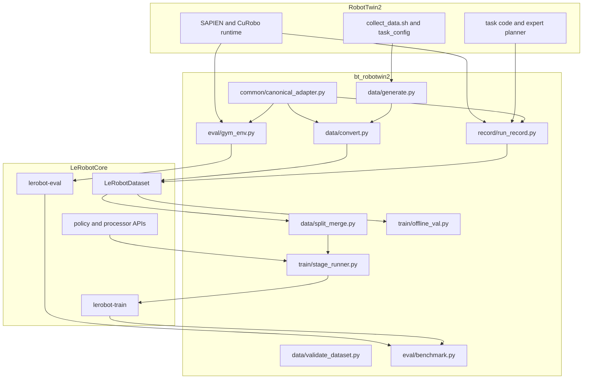
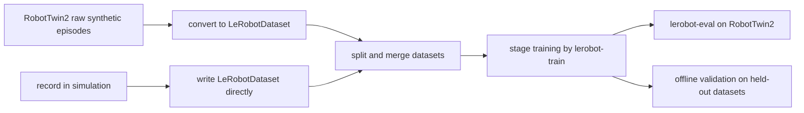
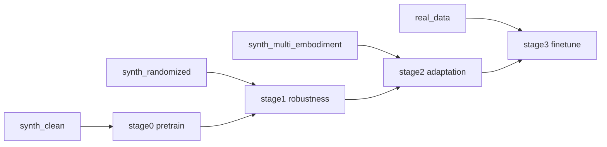
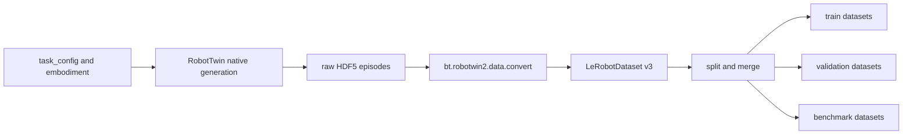
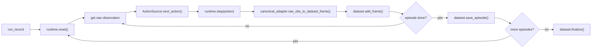
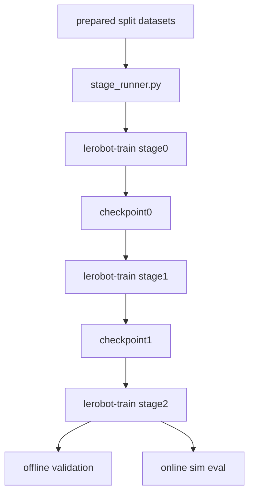
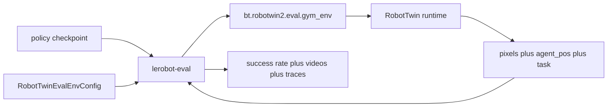
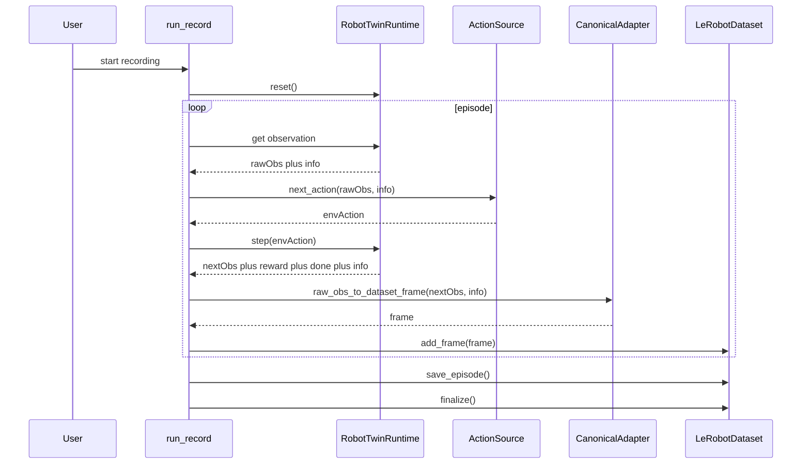
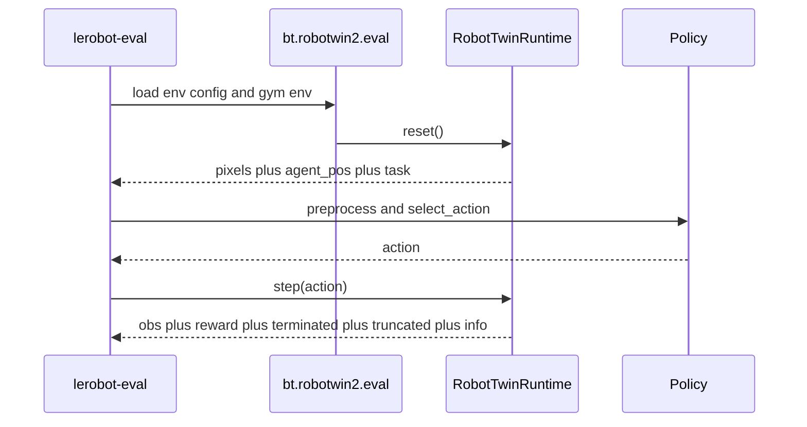
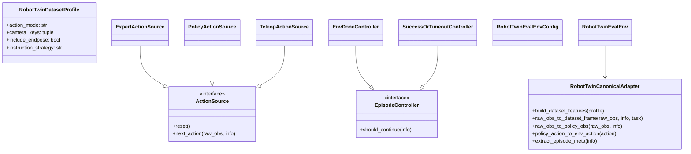

# bt/robotwin2 设计方案

## 1. 目标

在**尽量不修改 `LeRobot` 原生代码**的前提下，把 `RobotTwin2` 与 `LeRobot` 在以下四个方面做系统整合：

1. `data`
   - 合成
   - 采集
   - 转换
   - split / merge / lineage 管理
2. `record`
   - 在 RobotTwin2 仿真中直接录制 `LeRobotDataset`
   - 支持 expert / policy / teleop 三类动作源
3. `train`
   - 使用 `LeRobot` 原生训练入口 `lerobot-train`
   - 在外部做 stage / curriculum / offline validation 编排
4. `evaluation`
   - 使用 `LeRobot` 原生评测入口 `lerobot-eval`
   - 通过本地插件把 RobotTwin2 暴露成 `gym` 环境

这个方案的核心原则是：

- `RobotTwin2` 负责仿真、任务、domain randomization、expert 轨迹生成、benchmark
- `LeRobot` 负责 dataset、policy、processor、train、eval 的公共 API
- `bt/robotwin2` 负责桥接、包装、编排

换句话说：

- **不把 RobotTwin2 逻辑塞进 `src/lerobot/`**
- **不把 LeRobot 变成 RobotTwin2 的 fork**
- **而是在 `bt/robotwin2` 里做一个本地 companion layer**

---

## 2. 非目标

第一阶段不追求：

1. 把 `RobotTwin2` 变成 `LeRobot` 的内置一等公民命令
2. 在单一 Python 环境中同时安装完整 `LeRobot + RobotTwin2 + SAPIEN + CuRobo`
3. 在第一版就改造 `lerobot-record`、`lerobot-train`、`lerobot-eval` 内核
4. 在训练时做复杂的 runtime 多数据集动态混合

这些都可以做，但不属于最小侵入方案的 v1 范围。

---

## 3. 现有 LeRobot 可复用扩展点

这个设计成立的前提，是 `LeRobot` 已经提供了足够好的公共 API 和扩展点。

### 3.1 数据集 API

`LeRobotDataset` 已经可以在外部代码中直接创建和写入，不需要改主仓：

- `LeRobotDataset.create(...)`
- `dataset.add_frame(...)`
- `dataset.save_episode()`
- `dataset.finalize()`

这意味着 `bt/robotwin2` 可以自己把 RobotTwin2 数据写成标准 `LeRobotDataset v3`。

### 3.2 训练 API

`LeRobot` 训练流程本质上就是：

- 构造 dataset
- 构造 policy
- DataLoader 喂给训练循环

因此 `bt/robotwin2` 完全可以在外部做：

- stage 编排
- curriculum
- synthetic/real 数据切换
- offline validation

然后调用 `lerobot-train` 即可。

### 3.3 环境扩展点

`LeRobot` 的 `make_env()` 已支持通过 `package_name` 或 `HubEnvConfig` 动态导入环境：

```python
if cfg.gym_id not in gym_registry:
    importlib.import_module(cfg.package_name)
```

同时 CLI 解析阶段支持显式加载本地插件包：

```python
plugin_args = parse_plugin_args(PLUGIN_DISCOVERY_SUFFIX, cli_args)
for plugin_cli_arg, plugin_path in plugin_args.items():
    load_plugin(plugin_path)
```

因此 `bt/robotwin2` 可以通过本地插件方式接入 `lerobot-eval`，而不改 `LeRobot` 主代码。

### 3.4 评测 observation 约定

`LeRobot` 当前 eval 侧已经能识别以下 observation 结构：

- `pixels`
- `pixels` 可以是 dict，多相机
- `agent_pos`
- `task` / `task_description`

因此最简做法是：让 `bt/robotwin2/eval/gym_env.py` 输出 `LeRobot` 已经认识的 observation 结构，而不是改 `LeRobot`。

---

## 4. 总体架构

### 4.1 组件图



### 4.2 总体工作流图



---

## 5. 设计原则

### 5.1 单一 canonical adapter

所有 `data / record / evaluation` 都必须共用同一个 `canonical_adapter`，统一管理：

1. camera key 映射
2. state / action 的维度和顺序
3. task / instruction 规则
4. success / reward / done / endpose 的保留方式

否则会出现三套不同的映射逻辑，最终 train/eval/record 不一致。

### 5.2 离线数据与在线环境使用同一语义

- 离线转换出来的 dataset
- record in sim 录出来的 dataset
- eval in sim 喂给 policy 的 observation

都应当遵守同一个命名契约：

- `observation.state`
- `action`
- `observation.images.head`
- `observation.images.left_wrist`
- `observation.images.right_wrist`
- `task`

### 5.3 尽量“外编排、内复用”

能在外部脚本层完成的事情，优先放在 `bt/robotwin2`：

- stage 训练编排
- dataset split/merge
- benchmark 批量评测
- 记录流程控制

只在必要时才考虑改 `LeRobot` 主仓。

---

## 6. 精确目录树

下面是推荐的 `bt/robotwin2` 精确目录树。

```text
bt/
  robotwin2/
    README.md
    design.md
    __init__.py

    common/
      __init__.py
      canonical_adapter.py
      schema.py
      profiles.py
      metadata.py
      paths.py

    data/
      __init__.py
      generate.py
      convert.py
      split_merge.py
      validate_dataset.py

    record/
      __init__.py
      run_record.py
      action_sources.py
      expert_sources.py
      teleop_sources.py
      episode_controller.py

    train/
      __init__.py
      stage_runner.py
      curriculum.py
      offline_val.py
      checkpoint_eval.py

    eval/
      __init__.py
      env_config.py
      gym_registration.py
      gym_env.py
      benchmark.py
      run_eval.py

    configs/
      data/
        generate_example.yaml
        convert_example.yaml
        split_example.yaml
      record/
        record_policy_example.yaml
        record_expert_example.yaml
        record_teleop_example.yaml
      train/
        curriculum_example.yaml
      eval/
        eval_task_example.yaml
        benchmark_example.yaml

    scripts/
      generate.sh
      convert.sh
      split.sh
      record.sh
      train_curriculum.sh
      eval_benchmark.sh

    output/
      raw/
      processed/
      datasets/
      checkpoints/
      reports/
```

---

## 7. 每个文件职责

### 7.1 `common/`

| 文件 | 职责 |
| --- | --- |
| `canonical_adapter.py` | 统一定义 RobotTwin2 与 LeRobot 的 observation、action、task、meta 映射 |
| `schema.py` | 定义 dataset feature schema、camera naming、action mode 等契约 |
| `profiles.py` | 管理不同数据/训练/评测 profile，比如 `qpos_rgb_v1`、`qpos_rgb_endpose_v1` |
| `metadata.py` | 负责 lineage、source commit、seed、scene info、task config 等元数据抽取 |
| `paths.py` | 统一输出目录、命名规则、cache、临时目录布局 |

### 7.2 `data/`

| 文件 | 职责 |
| --- | --- |
| `generate.py` | 调用 RobotTwin2 原生命令进行 bulk synthetic generation |
| `convert.py` | 把原始 HDF5 或处理后数据转换成 `LeRobotDataset v3` |
| `split_merge.py` | 生成 `train/val/test` 与 synthetic/real 的离线聚合数据集 |
| `validate_dataset.py` | 做 dataset smoke check、feature 校验、最小 policy forward 校验 |

### 7.3 `record/`

| 文件 | 职责 |
| --- | --- |
| `run_record.py` | 在 RobotTwin2 仿真中录制 `LeRobotDataset` |
| `action_sources.py` | 定义 `ActionSource` 抽象与工厂 |
| `expert_sources.py` | 对接 RobotTwin2 expert / planner / task script |
| `teleop_sources.py` | 对接本地 keyboard / gamepad / leader-arm 等输入 |
| `episode_controller.py` | 管理 episode 结束条件、success 或 timeout、reset 规则 |

### 7.4 `train/`

| 文件 | 职责 |
| --- | --- |
| `stage_runner.py` | 用子进程方式编排多个 `lerobot-train` stage |
| `curriculum.py` | 管理 clean -> randomized -> real 的 curriculum |
| `offline_val.py` | 用 held-out dataset 做离线 validation |
| `checkpoint_eval.py` | 训练后自动调用在线 sim eval 选择 checkpoint |

### 7.5 `eval/`

| 文件 | 职责 |
| --- | --- |
| `env_config.py` | 注册 `RobotTwinEvalEnvConfig`，供 `lerobot-eval` 使用 |
| `gym_registration.py` | 注册 `gym` 环境 ID，连接本地 package 和 env 实现 |
| `gym_env.py` | 适配 RobotTwin2 runtime 为 `gym.Env` |
| `benchmark.py` | 批量跑 task/task_config/embodiment/seed 的 benchmark |
| `run_eval.py` | 封装 `lerobot-eval` 或直接调用 benchmark runner |

### 7.6 `configs/`

这些配置文件不是必须用 YAML，但建议存在，因为：

- 便于多 stage 训练
- 便于保存实验设置
- 便于复现实验与 benchmark

### 7.7 `scripts/`

shell 脚本不是核心逻辑，只是便于团队使用：

- 固定环境变量
- 激活 conda 或 uv 环境
- 封装常用命令

---

## 8. CLI 设计

第一阶段不新增 `LeRobot` 主仓 console entrypoint。所有入口都通过 `python -m bt.robotwin2....` 或 `bash bt/robotwin2/scripts/...` 使用。

## 8.1 数据生成 CLI

### 命令

```bash
python -m bt.robotwin2.data.generate \
  --config bt/robotwin2/configs/data/generate_example.yaml
```

### 作用

- 调 `RobotTwin2` 原生命令进行 bulk collect
- 管理 `task_name / task_config / embodiment / gpu_id / episode_num / seed`
- 输出到 `bt/robotwin2/output/raw/...`

### 关键参数

- `robotwin_repo_root`
- `task_name`
- `task_config`
- `embodiment`
- `gpu_id`
- `episode_num`
- `expert_data_num`
- `command_prefix`

---

## 8.2 数据转换 CLI

### 命令

```bash
python -m bt.robotwin2.data.convert \
  --config bt/robotwin2/configs/data/convert_example.yaml
```

### 作用

- 扫描 RobotTwin2 原始输出
- 转成 `LeRobotDataset v3`
- 输出 `meta/robotwin_episodes.jsonl` 等 sidecar

### 关键参数

- `input_path`
- `output_root`
- `repo_id`
- `fps`
- `action_mode`
- `camera_profile`
- `instruction_strategy`
- `use_videos`

---

## 8.3 数据切分与聚合 CLI

### 命令

```bash
python -m bt.robotwin2.data.split_merge \
  --config bt/robotwin2/configs/data/split_example.yaml
```

### 作用

- 构造 `train_synth_clean / train_synth_randomized / val / test / finetune_real`
- 支持按 `seed / task / embodiment / randomization` 切分

---

## 8.4 录制 CLI

### 命令

```bash
python -m bt.robotwin2.record.run_record \
  --config bt/robotwin2/configs/record/record_policy_example.yaml
```

### 作用

- 在 RobotTwin2 中直接录制 `LeRobotDataset`
- 支持三类动作源：
  - `expert`
  - `policy`
  - `teleop`

### 关键参数

- `task_name`
- `task_config`
- `embodiment`
- `record_mode`
- `action_source.type`
- `policy.path`
- `episode_controller.type`
- `dataset.output_root`

---

## 8.5 训练编排 CLI

### 命令

```bash
python -m bt.robotwin2.train.stage_runner \
  --config bt/robotwin2/configs/train/curriculum_example.yaml
```

### 作用

- 按多个 stage 调用 `lerobot-train`
- 支持 `clean -> randomized -> real finetune`
- 每个 stage 结束后触发 offline val 和 online eval

### 关键参数

- `stages`
- `base_policy_path`
- `output_root`
- `run_offline_val`
- `run_online_eval`

---

## 8.6 评测 CLI

### 命令

```bash
PYTHONPATH=. lerobot-eval \
  --env.discover_packages_path=bt.robotwin2.eval \
  --env.type=robotwin2_eval \
  --env.task=beat_block_hammer \
  --policy.path=/path/to/checkpoint
```

### 作用

- 让 `lerobot-eval` 通过本地插件加载 RobotTwin2 env
- 不改 `LeRobot` 主仓

### 批量 benchmark 命令

```bash
python -m bt.robotwin2.eval.benchmark \
  --config bt/robotwin2/configs/eval/benchmark_example.yaml
```

---

## 9. 核心代码样例

## 9.1 `common/canonical_adapter.py`

这个文件是整个设计最关键的共享层。

```python
from dataclasses import dataclass
from typing import Any

@dataclass
class RobotTwinDatasetProfile:
    action_mode: str = "qpos"
    camera_keys: tuple[str, ...] = ("head", "left_wrist", "right_wrist")
    include_endpose: bool = False
    instruction_strategy: str = "first_non_empty"


class RobotTwinCanonicalAdapter:
    def build_dataset_features(self, profile: RobotTwinDatasetProfile) -> dict[str, dict]:
        """返回 LeRobotDataset.create() 需要的 features 字典。"""
        raise NotImplementedError

    def raw_obs_to_dataset_frame(self, raw_obs: dict, info: dict, task: str) -> dict[str, Any]:
        """RobotTwin 原始观测 -> LeRobot dataset frame。"""
        raise NotImplementedError

    def raw_obs_to_policy_obs(self, raw_obs: dict, info: dict) -> dict[str, Any]:
        """RobotTwin 原始观测 -> policy 输入结构。"""
        raise NotImplementedError

    def policy_action_to_env_action(self, action) -> Any:
        """LeRobot policy action -> RobotTwin env action。"""
        raise NotImplementedError

    def extract_episode_meta(self, info: dict) -> dict[str, Any]:
        """抽取 scene_info、seed、embodiment、success 等元信息。"""
        raise NotImplementedError
```

### 设计要点

- `data.convert`
- `record.run_record`
- `eval.gym_env`

都必须复用它，不能各写一份映射逻辑。

---

## 9.2 `data/convert.py`

```python
from lerobot.datasets.lerobot_dataset import LeRobotDataset
from bt.robotwin2.common.canonical_adapter import RobotTwinCanonicalAdapter


def convert_robotwin_dataset(input_path, output_root, repo_id, profile):
    adapter = RobotTwinCanonicalAdapter()
    features = adapter.build_dataset_features(profile)

    dataset = LeRobotDataset.create(
        repo_id=repo_id,
        fps=15,
        root=output_root,
        robot_type="robotwin2",
        features=features,
        use_videos=True,
    )

    for episode in iterate_robotwin_episodes(input_path):
        for raw_obs, raw_action, info in iterate_steps(episode):
            frame = adapter.raw_obs_to_dataset_frame(raw_obs, info, task=info["task"])
            dataset.add_frame(frame)
        dataset.save_episode()

    dataset.finalize()
    return dataset
```

### 设计要点

- 完全复用 `LeRobotDataset`
- 不改 `src/lerobot/`
- 只在桥接层做 mapping

---

## 9.3 `record/run_record.py`

这里**不建议** v1 直接改 `lerobot-record`，而是在 `bt/robotwin2` 内做仿真录制 runner。

```python
from lerobot.datasets.lerobot_dataset import LeRobotDataset
from lerobot.policies.factory import make_policy, make_pre_post_processors
from bt.robotwin2.common.canonical_adapter import RobotTwinCanonicalAdapter


def run_record(cfg):
    adapter = RobotTwinCanonicalAdapter()
    runtime = make_robotwin_runtime(cfg)
    action_source = make_action_source(cfg)
    controller = make_episode_controller(cfg)

    dataset = LeRobotDataset.create(
        repo_id=cfg.dataset.repo_id,
        fps=cfg.dataset.fps,
        root=cfg.dataset.root,
        robot_type="robotwin2",
        features=adapter.build_dataset_features(cfg.profile),
        use_videos=cfg.dataset.use_videos,
    )

    for _ in range(cfg.dataset.num_episodes):
        raw_obs, info = runtime.reset()
        action_source.reset()

        while controller.should_continue(info):
            env_action = action_source.next_action(raw_obs, info)
            raw_obs, reward, terminated, truncated, info = runtime.step(env_action)
            frame = adapter.raw_obs_to_dataset_frame(raw_obs, info, task=info["task"])
            dataset.add_frame(frame)
            info["terminated"] = terminated
            info["truncated"] = truncated

        dataset.save_episode()

    dataset.finalize()
```

### 设计要点

- 逻辑上等价于 `lerobot-record`
- 但不强依赖 `robot.get_observation()` / `robot.send_action()`
- episode 边界由 env 驱动，不是时间驱动

---

## 9.4 `train/stage_runner.py`

```python
import subprocess


def run_stage(stage_cfg, pretrained_path=None):
    cmd = [
        "lerobot-train",
        f"--dataset.repo_id={stage_cfg['repo_id']}",
        f"--dataset.root={stage_cfg['root']}",
        f"--output_dir={stage_cfg['output_dir']}",
        f"--job_name={stage_cfg['name']}",
        f"--steps={stage_cfg['steps']}",
        f"--batch_size={stage_cfg['batch_size']}",
    ]
    if pretrained_path:
        cmd.append(f"--policy.path={pretrained_path}")
    subprocess.run(cmd, check=True)
```

### 设计要点

- 不改 `lerobot-train`
- 由 `bt/robotwin2` 管理 stage
- `lerobot-train` 继续只做单次训练

---

## 9.5 `eval/env_config.py`

这个插件配置类让 `lerobot-eval` 能认出本地 RobotTwin2 环境。

```python
from dataclasses import dataclass
from lerobot.envs.configs import EnvConfig


@EnvConfig.register_subclass("robotwin2_eval")
@dataclass
class RobotTwinEvalEnvConfig(EnvConfig):
    task: str | None = None
    task_config: str = "demo_clean"
    embodiment: str = "aloha-agilex"
    fps: int = 15
    episode_length: int = 300

    @property
    def package_name(self) -> str:
        return "bt.robotwin2.eval.gym_registration"

    @property
    def gym_id(self) -> str:
        return "bt_robotwin2/RobotTwinEval-v0"

    @property
    def gym_kwargs(self) -> dict:
        return {
            "task": self.task,
            "task_config": self.task_config,
            "embodiment": self.embodiment,
        }
```

### 设计要点

- 不改 `LeRobot` env core
- 通过本地 plugin 注册进 CLI

---

## 9.6 `eval/gym_env.py`

这里最重要的是：**输出 `LeRobot` 已经认识的 observation 结构**。

```python
import gymnasium as gym


class RobotTwinEvalEnv(gym.Env):
    def __init__(self, task, task_config, embodiment):
        self.runtime = make_runtime(task=task, task_config=task_config, embodiment=embodiment)
        self._task_text = task

    def reset(self, *, seed=None, options=None):
        raw_obs, info = self.runtime.reset(seed=seed)
        obs = {
            "pixels": {
                "head": raw_obs["cam_high"],
                "left_wrist": raw_obs["cam_left_wrist"],
                "right_wrist": raw_obs["cam_right_wrist"],
            },
            "agent_pos": raw_obs["qpos"],
        }
        return obs, info

    def step(self, action):
        raw_obs, reward, terminated, truncated, info = self.runtime.step(action)
        obs = {
            "pixels": {
                "head": raw_obs["cam_high"],
                "left_wrist": raw_obs["cam_left_wrist"],
                "right_wrist": raw_obs["cam_right_wrist"],
            },
            "agent_pos": raw_obs["qpos"],
        }
        return obs, reward, terminated, truncated, info

    def task_description(self):
        return self._task_text
```

### 设计要点

- `LeRobot` 已经能识别 `pixels` 和 `agent_pos`
- 不需要新增 `LeRobot` 主仓 processor
- 可以直接走 `lerobot-eval`

---

## 10. 记录、训练、评测之间如何形成闭环

## 10.1 统一数据契约

离线转换、在线录制、在线评测必须统一使用：

- 相同 camera key
- 相同 state / action 语义
- 相同 task 文本策略
- 相同 metadata 保留策略

否则会出现：

- train 吃的是 `head`
- eval 喂的是 `cam_high`
- dataset 里 `action` 是 `qpos`
- env.step()` 期待 `ee`

## 10.2 推荐训练阶段



## 10.3 离线与在线双重验证

- `offline validation`
  - 用 held-out dataset 看 val loss
- `online evaluation`
  - 用 `lerobot-eval` + RobotTwin2 env 看 success rate、rollout video、failure trace

---

## 11. 图

## 11.1 数据工作流图



## 11.2 Record 工作流图



## 11.3 Train 工作流图



## 11.4 Evaluation 组件图



## 11.5 Record 序列图



## 11.6 Evaluation 序列图



## 11.7 类图



---

## 12. 与 `lerobot-record` 的关系

### 12.1 v1 方案

v1 **不改** `lerobot-record`。

原因：

- `lerobot-record` 当前围绕真实 robot 抽象设计
- episode 结束条件更偏时间驱动
- episode 之间 reset 更偏手动流程
- 直接硬改会牵扯 `robot` 抽象、teleop、episode control、多处逻辑

所以 v1 推荐：

- 在 `bt/robotwin2/record/run_record.py` 中实现等价的仿真录制流程
- 复用 `LeRobotDataset`、policy、processor
- 但不动主仓 `lerobot-record`

### 12.2 后续可选增强

如果后续你真的需要统一体验，再考虑在 `LeRobot` 主仓引入：

- `RecordBackend`
- `RealRobotRecordBackend`
- `RobotTwinRecordBackend`

但这属于 v2 或 v3，不属于最小侵入方案。

---

## 13. 哪些情况下才需要改 LeRobot 原生代码

以下需求，才建议考虑改主仓：

1. 你希望直接支持：
   - `lerobot-record --backend.type=robotwin2`
2. 你希望 env plugin 自动发现，而不是每次显式传：
   - `--env.discover_packages_path=bt.robotwin2.eval`
3. 你希望 `lerobot-train` 原生支持：
   - 多 stage curriculum
   - inline offline val
   - inline online sim eval

如果没有这些需求，那么当前方案可以做到：

- `data`：零改动主仓
- `record`：零改动主仓
- `train`：零改动主仓
- `evaluation`：零改动主仓

---

## 14. 实施顺序

## Phase 1

- 建立 `common/canonical_adapter.py`
- 实现 `data/generate.py`
- 实现 `data/convert.py`
- 实现 `data/split_merge.py`

目标：

- 先打通 `RobotTwin2 -> LeRobotDataset v3`

## Phase 2

- 实现 `record/run_record.py`
- 支持 `expert` 和 `policy` 两种动作源

目标：

- 打通“仿真中直接录制 LeRobotDataset”

## Phase 3

- 实现 `eval/env_config.py`
- 实现 `eval/gym_registration.py`
- 实现 `eval/gym_env.py`
- 实现 `eval/benchmark.py`

目标：

- 打通 `lerobot-eval` 在线评测 RobotTwin2

## Phase 4

- 实现 `train/stage_runner.py`
- 实现 `offline_val.py`
- 实现 `checkpoint_eval.py`

目标：

- 建立完整 synthetic clean -> synthetic randomized -> real finetune 工作流

---

## 15. 最终结论

在“尽量不改 `LeRobot` 原生代码”的约束下，把所有主要逻辑放到 `bt/robotwin2` 中，完全可以实现：

- 数据合成与转换
- 仿真录制
- 阶段式训练编排
- 在线评测与 benchmark

并且这是一个比直接修改主仓更干净、更可控、更容易回退和维护的方案。

一句话总结：

> `bt/robotwin2` 应当被设计成一个本地 companion layer，复用 `LeRobot` 的公共 API 和扩展点，把 `RobotTwin2` 接成一个 synthetic data backend、simulation record backend 和 benchmark backend，而不是把 RobotTwin2 逻辑直接并进 LeRobot 主仓。
