# bt/robotwin2 设计方案 v3

## 0. 文档定位

本文档用于**取代** `bt/robotwin2/design.md` 与 `bt/robotwin2/design2.md`，作为后续实现 `RobotTwin2 x LeRobot` 集成的主设计文档。

`design3.md` 的写法遵循三个原则：

1. 吸收 `design.md` 的优点：
   - 四平面拆分清晰
   - 目录树和文件职责细
   - 边界感强，知道什么不该塞进 `src/lerobot/`
2. 吸收 `design2.md` 的优点：
   - 对 `LeRobot` 当前扩展点贴得更紧
   - 伪代码更工程化
   - 风险、附录、兼容性分析更完整
3. 修正两者的问题：
   - 减少重复与冗长
   - 修正与当前 `LeRobot` 代码不完全匹配的抽象化表述
   - 对“零改动主仓”的表述加边界条件
   - 明确哪些内容是**当前已有能力**，哪些只是 **`bt/robotwin2` 计划实现**

本文档的最终目标，不是写一篇“概念上正确”的愿景文，而是写一篇：

- 能指导开发落地
- 不误导读者以为某些能力已经在仓库里存在
- 同时又尽量不要求修改 `LeRobot` 主仓

---

## 1. 背景与上下文

### 1.1 问题背景

`RobotTwin2` 与 `LeRobot` 在机器人学习栈中定位不同，但互补性很强：

- `RobotTwin2` 强在：
  - 仿真任务
  - 大规模 synthetic data generation
  - 强 domain randomization
  - benchmark
  - expert data synthesis
- `LeRobot` 强在：
  - 统一的 `LeRobotDataset`
  - 训练入口 `lerobot-train`
  - 评测入口 `lerobot-eval`
  - policy / processor / dataset / Hub 生态

因此，理想整合方式不是：

- 把 `RobotTwin2` 并进 `LeRobot` 主仓
- 或把 `LeRobot` 当成 `RobotTwin2` 的一个子模块

而是：

> 在 `bt/robotwin2` 中做一个本地 companion layer，复用 `LeRobot` 的公共 API 与扩展点，把 `RobotTwin2` 接成 synthetic data backend、simulation record backend、training orchestration backend 和 benchmark backend。

### 1.2 约束条件

本设计的关键约束是：

1. **尽量不改 `LeRobot` 原生代码**
2. 如果必须改，也只在必要时做非常小的核心增强
3. 第一阶段的核心能力必须主要落在 `bt/robotwin2/`

这意味着我们需要充分利用 `LeRobot` 当前已经存在的扩展点，而不是重新发明轮子。

### 1.3 当前仓库上下文

当前仓库并非“完全上游原始 LeRobot”，本分支已经存在一些与策略、训练相关的分支内改动。  
因此本文中所谓：

> “零改动 `LeRobot` 主仓”

更准确的意思是：

> **在当前仓库状态基础上，不再为 RobotTwin2 integration 额外修改 `src/lerobot/` 的核心实现。**

---

## 2. 外部依据与为什么这样设计

### 2.1 RobotTwin2 官方定位

根据 RobotTwin2 的论文、项目页与官方文档，RobotTwin2 的官方叙事主要是：

- 一个可扩展的 synthetic data generator
- 一个具备强 domain randomization 的 benchmark
- 面向双臂协作操作
- 带有 expert synthesis / task code generation 的仿真系统

因此在体系分工上，RobotTwin2 更像：

- 数据生成后端
- 仿真环境后端
- benchmark 后端

而不是一个训练框架。

### 2.2 LeRobot 官方定位

根据 LeRobot 论文、官方文档、仓库结构与 issue/PR 演进，LeRobot 的主叙事是：

- 统一 dataset 格式
- 标准 train/eval 命令
- 多策略支持
- 可扩展的 env/plugin 机制
- Hub 友好的数据与模型工作流

所以 LeRobot 更像：

- 数据平面
- 训练平面
- 评测入口
- 统一 processor / policy runtime

### 2.3 为什么不应该把 RobotTwin2 逻辑直接塞进 `src/lerobot/`

原因主要有四个：

1. **依赖边界不同**
   - RobotTwin2 倾向于带 SAPIEN、CuRobo、仿真资产与 GPU 依赖
   - LeRobot 倾向于保持训练/数据/评测框架层的通用性
2. **职责边界不同**
   - RobotTwin2 解决的是合成数据与 benchmark 问题
   - LeRobot 解决的是训练、评测、数据标准化问题
3. **维护边界不同**
   - 直接修改 `LeRobot` core，会让 RobotTwin2 特定逻辑进入主框架，长期侵蚀通用性
4. **当前代码已经提供了足够的扩展点**
   - dataset API
   - plugin discovery
   - dynamic env import
   - CLI 层外编排空间

### 2.4 为什么 `design3.md` 把 `record` 单独列成一层

如果只谈：

- `data`
- `train`
- `evaluation`

会遗漏一个特别关键的桥梁层：`record`

因为一旦 `RobotTwin2` 能直接在仿真中录制 `LeRobotDataset`，就可以打通：

- synthetic generation
- interactive sim collection
- policy rollout collection
- expert collection
- DAgger / intervention

这对形成闭环比单纯的格式转换更重要。

---

## 3. 现有 LeRobot 扩展点

本节只列与 `bt/robotwin2` 最相关、且当前仓库中真实存在的扩展点。

### 3.1 Dataset API：外部代码可直接创建和写入

`LeRobotDataset` 已经天然支持被外部 companion 代码直接使用：

- `LeRobotDataset.create(...)`
- `dataset.add_frame(...)`
- `dataset.save_episode()`
- `dataset.finalize()`

这意味着 `bt/robotwin2` 完全可以在不改 `src/lerobot/` 的情况下，自己完成：

- RobotTwin2 原始数据转换
- 仿真录制
- sidecar metadata 写入

### 3.2 `lerobot-train`：适合被外部 stage runner 编排

`LeRobot` 当前训练的核心能力足够清晰：

- dataset 构造
- policy 构造
- DataLoader
- 可选在线 env eval

因此，`bt/robotwin2` 无需改 `lerobot-train` 即可实现：

- stage training
- curriculum
- synthetic -> real finetune
- offline validation orchestration

方法是：

- 在 `bt/robotwin2/train/stage_runner.py` 中做外部编排
- 把 `lerobot-train` 当作单 stage 训练器使用

### 3.3 Plugin discovery：支持显式加载本地扩展包

`LeRobot` CLI 解析阶段已经支持 `discover_packages_path`：

```python
# src/lerobot/configs/parser.py
plugin_args = parse_plugin_args(PLUGIN_DISCOVERY_SUFFIX, cli_args)
for plugin_cli_arg, plugin_path in plugin_args.items():
    load_plugin(plugin_path)
```

这给 `bt/robotwin2` 提供了一个非常关键的能力：

> 可以在不修改主仓的情况下，通过 CLI 显式加载本地 companion package。

例如未来可以这样用：

```bash
PYTHONPATH=. lerobot-eval \
  --env.discover_packages_path=bt.robotwin2 \
  --env.type=robotwin2_eval \
  --policy.path=/path/to/checkpoint
```

### 3.4 Dynamic env import：环境可在本地包中注册

`LeRobot` 的 `make_env()` 已支持按 `package_name` 动态导入：

```python
# src/lerobot/envs/factory.py
if cfg.gym_id not in gym_registry:
    importlib.import_module(cfg.package_name)
```

这意味着：

- `bt/robotwin2/eval/gym_registration.py` 可以本地注册 `gym` 环境
- `bt/robotwin2/eval/env_config.py` 可以注册新的 `EnvConfig` 子类
- `lerobot-eval` 可以直接消费这个环境

### 3.5 Eval observation 兼容层已经存在

`LeRobot` 的 `preprocess_observation()` 已识别：

- `pixels`
- `pixels` 为 dict
- `agent_pos`

而 `add_envs_task()` 也支持从 env 中获取：

- `task_description()`
- 或 `task()`

因此最小侵入的在线评测方式是：

> 让 `bt/robotwin2/eval/gym_env.py` 输出 `LeRobot` 已经认识的 observation 协议，而不是新增主仓 processor。

### 3.6 `bt/hil` 提供了“少改主仓”的仓内先例

`bt/hil/README.md` 已明确展示了一种模式：

> 不改 `src/` 下的 LeRobot 代码，只在 demo 侧复用已有的 `gym_hil + processor + dataset` 流程。

这证明：

- `bt/` 作为 companion layer 是符合当前仓库风格的
- `RobotTwin2` 放到 `bt/robotwin2` 也是合理选择

---

## 4. 目标、非目标与边界

## 4.1 目标

在 `bt/robotwin2` 中建立四平面整合方案：

1. `DataPlane`
   - synthetic generation orchestration
   - conversion to `LeRobotDataset`
   - split/merge/manifest/lineage
2. `RecordPlane`
   - record in sim
   - expert/policy/teleop action sources
3. `TrainPlane`
   - stage runner
   - curriculum
   - offline validation
4. `EvalPlane`
   - local plugin env
   - `lerobot-eval` benchmark integration

## 4.2 非目标

v1 不追求：

1. 把 RobotTwin2 变成 `LeRobot` 主仓内置一等命令
2. 在 v1 就改造 `lerobot-record` / `lerobot-train` / `lerobot-eval` 内核
3. 在一个环境里统一安装全部 LeRobot + RobotTwin2 重依赖
4. 在训练时做复杂的 runtime 多数据集混合

## 4.3 边界判断

### v1 默认边界

- `bt/robotwin2` 新增功能
- `LeRobot` 只复用公共 API
- 不新增 `src/lerobot/` 针对 RobotTwin2 的特殊逻辑

### v2 才考虑的边界外改动

- `lerobot-record --backend.type=robotwin2`
- env 自动发现，无需 `discover_packages_path`
- `lerobot-train` 原生支持多 stage、offline val、inline online eval

---

## 5. 核心设计原则

## 5.1 单一 `canonical_adapter`

这是整个设计里最重要的约束。

`data / record / evaluation` 三条链路都必须共用一个统一映射层，负责：

1. camera key 映射
2. state 维度与顺序
3. action 维度与顺序
4. task / instruction 规则
5. metadata 保留规则

否则后果非常严重：

- 离线数据和在线评测用的 observation 语义不同
- policy 训练吃的是 `qpos`，评测时环境却期待 `ee`
- 相机命名在不同模块中漂移

## 5.2 优先外编排，避免内侵入

能在外部实现的能力，都优先放在 `bt/robotwin2`：

- dataset conversion
- record in sim
- stage training
- benchmark

只有真正无法在外部实现时，才考虑修改 `LeRobot` 主仓。

## 5.3 离线与在线必须共用语义

以下三类数据必须对齐：

1. 离线转换的 `LeRobotDataset`
2. 仿真录制出来的 `LeRobotDataset`
3. 在线 env rollout 喂给 policy 的 observation/action

## 5.4 先解决 `qpos`，再谈 `ee`

根据 RobotTwin2 文档和社区整合问题，action 语义是跨框架最容易错的地方。

因此设计上建议：

- v1 以 `qpos` 为主
- `ee` / `delta_ee` 作为 profile 扩展
- 不要第一版同时把多种 action mode 混成默认路径

原因：

- `qpos` 与数据集、仿真、训练的语义最直接
- 社区已有 issue 表明 action semantics mismatch 很容易让 eval 失真

## 5.5 companion layer 必须可逐步演进

设计必须允许：

- v1：零新增 core 修改
- v2：增强使用体验
- v3：必要时抽象少量 core extension

---

## 6. 总体架构

## 6.1 四平面 + 共享层

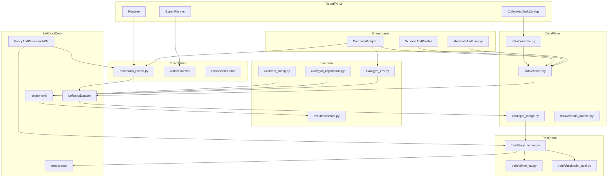

## 6.2 总体工作流图

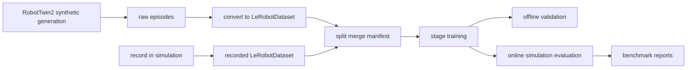

## 6.3 为什么这样分层

这种分层比“直接把 RobotTwin2 功能塞进 LeRobot 脚本”更好的原因是：

1. `RobotTwin2` 的 heavy runtime 和 `LeRobot` 的 core training framework 被解耦
2. 所有 RobotTwin2 相关逻辑都能被限制在 `bt/robotwin2`
3. 训练和评测入口仍然使用 LeRobot 原生命令
4. 未来若真的需要 core abstraction，也可以在 companion layer 稳定后再回推

---

## 7. 精确目录树

```text
bt/
  __init__.py
  robotwin2/
    __init__.py
    README.md
    design.md
    design2.md
    design3.md

    common/
      __init__.py
      canonical_adapter.py
      schema.py
      profiles.py
      metadata.py
      paths.py

    data/
      __init__.py
      generate.py
      convert.py
      split_merge.py
      validate_dataset.py

    record/
      __init__.py
      run_record.py
      action_sources.py
      expert_sources.py
      teleop_sources.py
      episode_controller.py

    train/
      __init__.py
      stage_runner.py
      curriculum.py
      offline_val.py
      checkpoint_eval.py

    eval/
      __init__.py
      env_config.py
      gym_registration.py
      gym_env.py
      benchmark.py
      run_eval.py

    configs/
      data/
        generate_example.yaml
        convert_example.yaml
        split_example.yaml
      record/
        record_expert_example.yaml
        record_policy_example.yaml
        record_teleop_example.yaml
      train/
        curriculum_example.yaml
      eval/
        eval_task_example.yaml
        benchmark_example.yaml

    scripts/
      generate.sh
      convert.sh
      split.sh
      record.sh
      train_curriculum.sh
      eval_benchmark.sh

    output/
      raw/
      processed/
      datasets/
      checkpoints/
      reports/
```

## 7.1 为什么目录要这样分

### `common/`

这是整个 companion layer 的共享核心：

- observation / action / task / metadata 映射
- dataset profiles
- 路径与命名规则

### `data/`

这里负责所有离线数据能力：

- bulk generation orchestration
- format conversion
- split/merge
- dataset validation

### `record/`

这里单独实现**仿真录制**，而不是直接侵入 `lerobot-record`。

### `train/`

这里不重写训练器，只做外部编排：

- stage
- curriculum
- offline validation
- checkpoint selection

### `eval/`

这里负责本地 plugin env，让 `lerobot-eval` 可以消费 RobotTwin2 仿真。

---

## 8. 每个文件职责

## 8.1 `common/`

| 文件 | 职责 |
| --- | --- |
| `canonical_adapter.py` | 全局唯一 observation/action/task/meta 映射层 |
| `schema.py` | 定义 dataset contract、key 命名和 feature schema |
| `profiles.py` | 定义 `qpos_rgb_v1`、`qpos_rgb_endpose_v1` 等 profile |
| `metadata.py` | lineage、source commit、seed、scene info、task config 等抽取 |
| `paths.py` | 输出路径、缓存路径、dataset 命名规则 |

## 8.2 `data/`

| 文件 | 职责 |
| --- | --- |
| `generate.py` | 运行 RobotTwin2 原生命令生成 synthetic data |
| `convert.py` | 原始数据或中间 HDF5 -> `LeRobotDataset v3` |
| `split_merge.py` | 构造 `train/val/test` 与 synthetic/real 聚合数据集 |
| `validate_dataset.py` | feature 校验、最小 `policy.forward()` smoke check、数据目录自检 |

## 8.3 `record/`

| 文件 | 职责 |
| --- | --- |
| `run_record.py` | 仿真录制主流程 |
| `action_sources.py` | `ActionSource` 抽象与工厂 |
| `expert_sources.py` | RobotTwin2 expert / planner action source |
| `teleop_sources.py` | keyboard / gamepad / leader-arm 等输入源 |
| `episode_controller.py` | `done`、`timeout`、`success_or_timeout` 等 episode 结束策略 |

## 8.4 `train/`

| 文件 | 职责 |
| --- | --- |
| `stage_runner.py` | 多阶段训练编排，调用 `lerobot-train` |
| `curriculum.py` | 定义 clean -> randomized -> real 等 stage 逻辑 |
| `offline_val.py` | held-out dataset validation |
| `checkpoint_eval.py` | 每个阶段结束后调用在线 sim eval 选择 checkpoint |

## 8.5 `eval/`

| 文件 | 职责 |
| --- | --- |
| `env_config.py` | 注册 `RobotTwinEvalEnvConfig` |
| `gym_registration.py` | 注册 gym id |
| `gym_env.py` | 把 RobotTwin2 runtime 封装成 `gym.Env` |
| `benchmark.py` | 按 task/task_config/embodiment/seed 批量评测 |
| `run_eval.py` | 对单任务 eval 或本地 benchmark 做统一 CLI 封装 |

## 8.6 `configs/`

| 文件 | 职责 |
| --- | --- |
| `data/generate_example.yaml` | synthetic generation 的最小示例配置 |
| `data/convert_example.yaml` | raw -> `LeRobotDataset` 转换示例配置 |
| `data/split_example.yaml` | split/merge 与 dataset grouping 示例配置 |
| `record/record_expert_example.yaml` | expert 录制示例 |
| `record/record_policy_example.yaml` | policy rollout 录制示例 |
| `record/record_teleop_example.yaml` | teleop 录制示例 |
| `train/curriculum_example.yaml` | 多 stage 训练与 curriculum 示例 |
| `eval/eval_task_example.yaml` | 单任务在线评测示例 |
| `eval/benchmark_example.yaml` | 批量 benchmark matrix 示例 |

## 8.7 `scripts/`

| 文件 | 职责 |
| --- | --- |
| `generate.sh` | 包装 `python -m bt.robotwin2.data.generate`，设置 RobotTwin 运行环境 |
| `convert.sh` | 包装 `python -m bt.robotwin2.data.convert` |
| `split.sh` | 包装 `python -m bt.robotwin2.data.split_merge` |
| `record.sh` | 包装 `python -m bt.robotwin2.record.run_record` |
| `train_curriculum.sh` | 包装 `python -m bt.robotwin2.train.stage_runner` |
| `eval_benchmark.sh` | 包装 `python -m bt.robotwin2.eval.benchmark` |

这些脚本不是核心逻辑，只负责：

1. 激活环境
2. 设置环境变量
3. 规范化命令行参数
4. 提供团队可复用的固定入口

---

## 9. CLI 设计

本方案默认使用两类命令入口：

1. `python -m bt.robotwin2....`
2. `bash bt/robotwin2/scripts/...`

第一阶段不要求为 `bt/robotwin2` 新增 `pyproject.toml` console scripts。

## 9.1 数据生成

### 命令

```bash
python -m bt.robotwin2.data.generate \
  --config bt/robotwin2/configs/data/generate_example.yaml
```

### 职责

- 调 `RobotTwin2` 原生命令，如 `collect_data.sh`
- 管理 `task_name / task_config / embodiment / gpu / seed`
- 输出 raw artifacts 到 `bt/robotwin2/output/raw/...`

### 关键参数

- `robotwin_repo_root`
- `task_name`
- `task_config`
- `embodiment`
- `gpu_id`
- `episode_num`
- `command_prefix`
- `raw_output_root`

## 9.2 数据转换

### 命令

```bash
python -m bt.robotwin2.data.convert \
  --config bt/robotwin2/configs/data/convert_example.yaml
```

### 职责

- 读取 raw HDF5 / 中间格式
- 调用 `LeRobotDataset.create()` / `add_frame()` / `save_episode()`
- 写出标准 `LeRobotDataset v3`

### 关键参数

- `input_path`
- `output_root`
- `repo_id`
- `profile`
- `fps`
- `use_videos`
- `instruction_strategy`

## 9.3 数据切分与聚合

### 命令

```bash
python -m bt.robotwin2.data.split_merge \
  --config bt/robotwin2/configs/data/split_example.yaml
```

### 职责

- 生成：
  - `train_synth_clean`
  - `train_synth_randomized`
  - `val_synth_clean`
  - `val_synth_randomized`
  - `test_sim_benchmark`
  - `finetune_real`
- 做离线 merge，避免 runtime 动态 mixture 成为默认训练路径

## 9.4 仿真录制

### 命令

```bash
python -m bt.robotwin2.record.run_record \
  --config bt/robotwin2/configs/record/record_policy_example.yaml
```

### 职责

- 在 RobotTwin2 仿真中直接录制 `LeRobotDataset`
- 支持：
  - `expert`
  - `policy`
  - `teleop`

### 关键参数

- `task_name`
- `task_config`
- `embodiment`
- `action_source.type`
- `policy.path`
- `episode_controller.type`
- `dataset.output_root`

## 9.5 多阶段训练

### 命令

```bash
python -m bt.robotwin2.train.stage_runner \
  --config bt/robotwin2/configs/train/curriculum_example.yaml
```

### 职责

- 以多个 stage 编排 `lerobot-train`
- 支持：
  - synthetic clean
  - synthetic randomized
  - synthetic multi-embodiment
  - real finetune

## 9.6 单任务评测

### 命令

```bash
PYTHONPATH=. lerobot-eval \
  --env.discover_packages_path=bt.robotwin2 \
  --env.type=robotwin2_eval \
  --env.task=beat_block_hammer \
  --policy.path=/path/to/checkpoint
```

### 职责

- 通过本地插件把 RobotTwin2 env 接到 `lerobot-eval`

## 9.7 批量 benchmark

### 命令

```bash
python -m bt.robotwin2.eval.benchmark \
  --config bt/robotwin2/configs/eval/benchmark_example.yaml
```

### 职责

- 按任务、任务配置、机器人本体、seed 批量评测
- 输出 success rate、rollout 视频、失败案例摘要

---

## 10. 共享层：`canonical_adapter`

## 10.1 为什么它是整个设计的核心

如果没有共享适配层，通常会出现三套不同逻辑：

1. `data/convert.py` 一套字段映射
2. `record/run_record.py` 一套字段映射
3. `eval/gym_env.py` 一套字段映射

最终会导致：

- train/eval observation 不一致
- record 和 convert 的 action 语义不同
- 相机 key 漂移
- task 文本规则漂移

因此 `design3` 的最强约束是：

> 所有 `data / record / evaluation` 必须共用一个 `CanonicalAdapter`。

## 10.2 类图

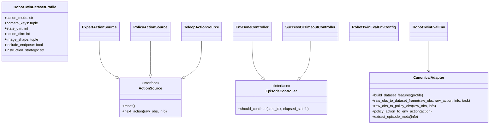

## 10.3 代码样例：profile 与 adapter

```python
from dataclasses import dataclass
from typing import Any

import numpy as np
from lerobot.configs.types import FeatureType, PolicyFeature


@dataclass
class RobotTwinDatasetProfile:
    action_mode: str = "qpos"
    camera_keys: tuple[str, ...] = ("head", "left_wrist", "right_wrist")
    state_dim: int = 14
    action_dim: int = 14
    image_shape: tuple[int, int, int] = (480, 640, 3)
    include_endpose: bool = False
    instruction_strategy: str = "first_non_empty"


class CanonicalAdapter:
    def __init__(self, profile: RobotTwinDatasetProfile):
        self.profile = profile

    def build_dataset_features(self) -> dict[str, PolicyFeature]:
        features = {
            "observation.state": PolicyFeature(type=FeatureType.STATE, shape=(self.profile.state_dim,)),
            "action": PolicyFeature(type=FeatureType.ACTION, shape=(self.profile.action_dim,)),
        }
        for cam in self.profile.camera_keys:
            features[f"observation.images.{cam}"] = PolicyFeature(
                type=FeatureType.VISUAL,
                shape=self.profile.image_shape,
            )
        return features

    def raw_obs_to_dataset_frame(
        self,
        raw_obs: dict,
        raw_action: np.ndarray,
        info: dict,
        task: str,
    ) -> dict[str, Any]:
        frame = {
            "observation.state": raw_obs["qpos"].astype(np.float32),
            "action": raw_action.astype(np.float32),
            "task": task,
        }
        if "cam_high" in raw_obs:
            frame["observation.images.head"] = raw_obs["cam_high"]
        if "cam_left_wrist" in raw_obs:
            frame["observation.images.left_wrist"] = raw_obs["cam_left_wrist"]
        if "cam_right_wrist" in raw_obs:
            frame["observation.images.right_wrist"] = raw_obs["cam_right_wrist"]
        return frame

    def raw_obs_to_policy_obs(self, raw_obs: dict, info: dict) -> dict[str, Any]:
        return {
            "pixels": {
                "head": raw_obs["cam_high"],
                "left_wrist": raw_obs["cam_left_wrist"],
                "right_wrist": raw_obs["cam_right_wrist"],
            },
            "agent_pos": raw_obs["qpos"],
        }

    def policy_action_to_env_action(self, action: np.ndarray) -> np.ndarray:
        if self.profile.action_mode == "qpos":
            return action
        raise NotImplementedError("Non-qpos action profiles are v2+ features.")

    def extract_episode_meta(self, info: dict) -> dict[str, Any]:
        return {
            "task": info.get("task", ""),
            "success": info.get("success", False),
            "seed": info.get("seed"),
            "embodiment": info.get("embodiment"),
            "scene_info": info.get("scene_info", {}),
        }
```

## 10.4 设计原因

### 为什么 profile 是必要的

因为 RobotTwin2 不一定只有一套固定配置：

- 可能有不同本体
- 可能有不同 camera 布局
- 可能有不同 action mode
- 可能有不同 state 维度

所以要把：

- dataset schema
- observation mapping
- action mapping

统一参数化，而不是写死在各模块里。

### 为什么 v1 默认只支持 `qpos`

原因有三个：

1. RobotTwin2 当前公开材料里，`qpos` 语义更直接稳定
2. dataset 转换、record、eval 三条链路最容易统一
3. 社区问题已经证明 action semantics mismatch 会直接导致评测失真

因此：

- v1：`qpos`
- v2：`ee`
- v3：`delta_ee` / hybrid

---

## 11. DataPlane 设计

## 11.1 DataPlane 职责

DataPlane 负责：

1. synthetic generation orchestration
2. raw -> `LeRobotDataset v3`
3. split / merge / manifest / lineage
4. dataset validation
5. augmentation 语义对齐

### 注意：这里的 augmentation 分两层

#### 第一层：RobotTwin2 内部 augmentation

来自 RobotTwin2 自身：

- `demo_clean`
- `demo_randomized`
- object clutter
- lighting
- texture
- embodiment variation

#### 第二层：LeRobot 训练侧 augmentation

来自 LeRobot 自身：

- image transforms
- normalization
- train-time visual jitter

这两层不是互斥，而是应当互补。

## 11.2 数据契约

### v1 最小 canonical contract

| 键 | 含义 |
| --- | --- |
| `observation.state` | RobotTwin2 的主状态向量，默认 `qpos` |
| `action` | 与 `observation.state` 对齐的主动作向量，默认 `qpos action` |
| `observation.images.head` | 头部或高位视角 |
| `observation.images.left_wrist` | 左腕相机 |
| `observation.images.right_wrist` | 右腕相机 |
| `task` | 训练主文本 |

### v1 sidecar metadata

不要求都进主训练输入，但必须记录：

- `task_name`
- `task_config`
- `embodiment`
- `seed`
- `scene_info`
- `source_commit`
- `instruction_candidates`
- `camera_map`

## 11.3 为什么要 split / merge / manifest

如果只做一份大数据集，后续你会无法稳定完成：

- clean vs randomized 的对比
- 训练域 vs 测试域隔离
- multi-embodiment ablation
- synthetic -> real finetune

因此 DataPlane 必须显式输出：

- `train_synth_clean`
- `train_synth_randomized`
- `val_synth_clean`
- `val_synth_randomized`
- `test_sim_benchmark`
- `finetune_real`

## 11.4 数据工作流图

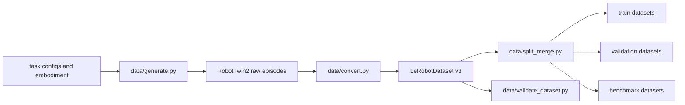

## 11.5 数据序列图

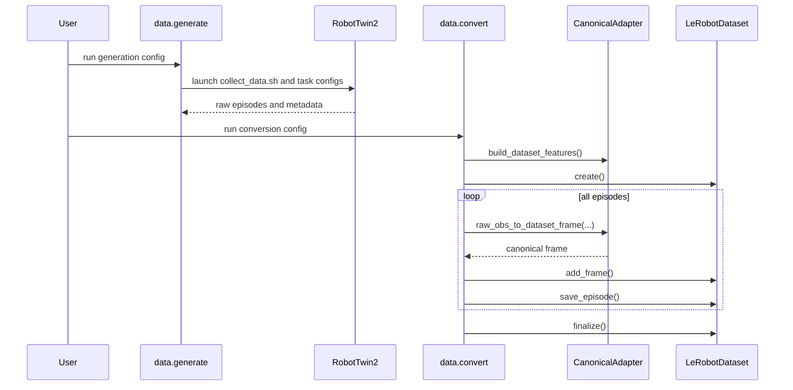

## 11.6 代码样例：`data/convert.py`

```python
from lerobot.datasets.lerobot_dataset import LeRobotDataset
from bt.robotwin2.common.canonical_adapter import CanonicalAdapter, RobotTwinDatasetProfile


def convert_dataset(input_path, output_root, repo_id):
    profile = RobotTwinDatasetProfile()
    adapter = CanonicalAdapter(profile)

    dataset = LeRobotDataset.create(
        repo_id=repo_id,
        fps=15,
        root=output_root,
        robot_type="robotwin2",
        features=adapter.build_dataset_features(),
        use_videos=True,
    )

    for episode in iterate_robotwin_episodes(input_path):
        for raw_obs, raw_action, info in iterate_episode_steps(episode):
            frame = adapter.raw_obs_to_dataset_frame(
                raw_obs=raw_obs,
                raw_action=raw_action,
                info=info,
                task=info["task"],
            )
            dataset.add_frame(frame)
        dataset.save_episode()

    dataset.finalize()
```

---

## 12. RecordPlane 设计

## 12.1 为什么 v1 不直接改 `lerobot-record`

`lerobot-record` 当前设计是**真实机器人导向**的。

它的核心录制逻辑依赖：

- `robot.get_observation()`
- `robot.send_action()`
- episode 按录制时长控制
- episode 之间手动 reset

这和 RobotTwin2 的仿真语义：

- `env.reset()`
- `env.step()`
- `terminated / truncated / success`

并不一致。

因此，v1 的合理设计是：

> 在 `bt/robotwin2/record/run_record.py` 里实现一个仿真专用 recorder，复用 `LeRobotDataset`、policy、processor API，但不侵入 `lerobot-record` 主脚本。

## 12.2 什么时候才值得改 `lerobot-record`

只有当你明确需要下面这些原生体验时，才建议修改 `LeRobot` 主仓：

- `lerobot-record --backend.type=robotwin2`
- 让真实机器人和仿真录制共享同一命令、同一配置结构、同一 backend 抽象

否则，v1 companion recorder 更稳。

## 12.3 RecordPlane 组件图

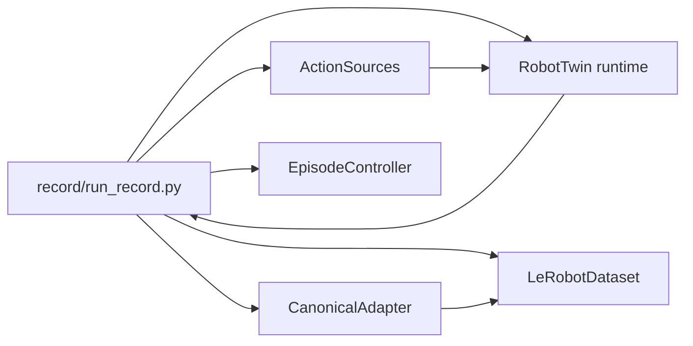

## 12.4 动作源

RecordPlane 支持三类动作源：

1. `expert`
   - RobotTwin2 自带 expert/planner/replay
2. `policy`
   - `LeRobot` policy checkpoint
3. `teleop`
   - keyboard / gamepad / leader-arm 等

### 建议的落地顺序

- v1 先做 `expert` 和 `policy`
- `teleop` 放到 v1.5 或 v2

原因：

- `expert` 和 `policy` 不依赖 GUI/输入设备
- `teleop` 往往受图形环境、远程桌面、输入转发影响
- `bt/hil` 已经证明 companion demo 的做法可行，但 teleop 是后续增强项更合适

## 12.5 EpisodeController

仿真录制不应该简单按时长裁 episode，而应支持：

- `env_done`
- `max_steps`
- `success_or_timeout`

## 12.6 Record 工作流图

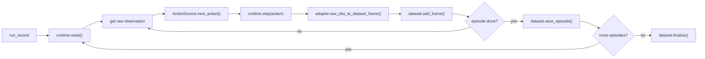

## 12.7 Record 序列图

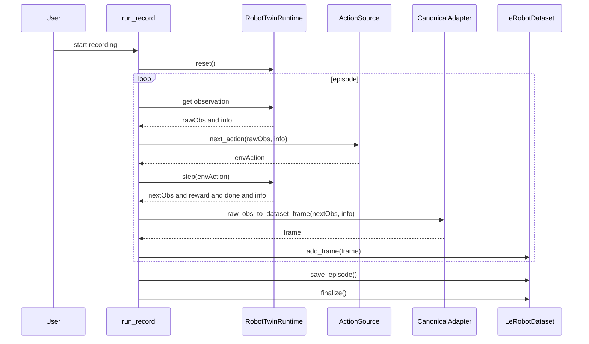

## 12.8 代码样例：`record/run_record.py`

```python
from lerobot.datasets.lerobot_dataset import LeRobotDataset
from bt.robotwin2.common.canonical_adapter import CanonicalAdapter, RobotTwinDatasetProfile


def run_record(cfg):
    profile = RobotTwinDatasetProfile()
    adapter = CanonicalAdapter(profile)
    runtime = make_robotwin_runtime(cfg)
    action_source = make_action_source(cfg)
    controller = make_episode_controller(cfg)

    dataset = LeRobotDataset.create(
        repo_id=cfg.dataset.repo_id,
        fps=cfg.dataset.fps,
        root=cfg.dataset.root,
        robot_type="robotwin2",
        features=adapter.build_dataset_features(),
        use_videos=cfg.dataset.use_videos,
    )

    for _ in range(cfg.dataset.num_episodes):
        raw_obs, info = runtime.reset()
        action_source.reset()
        step_idx = 0

        while controller.should_continue(step_idx=step_idx, elapsed_s=info.get("elapsed_s", 0.0), info=info):
            env_action = action_source.next_action(raw_obs, info)
            raw_obs, reward, terminated, truncated, info = runtime.step(env_action)
            frame = adapter.raw_obs_to_dataset_frame(
                raw_obs=raw_obs,
                raw_action=env_action,
                info=info,
                task=info["task"],
            )
            dataset.add_frame(frame)
            step_idx += 1
            info["terminated"] = terminated
            info["truncated"] = truncated

        dataset.save_episode()

    dataset.finalize()
```

---

## 13. TrainPlane 设计

## 13.1 TrainPlane 的职责

TrainPlane 的目标不是重写训练器，而是做：

- stage 编排
- curriculum
- offline validation
- checkpoint selection
- synthetic -> real 的流程控制

## 13.2 为什么不改 `lerobot-train`

`lerobot-train` 已经足够强，没必要第一版去动它：

- 它已经支持 dataset、policy、optimizer、scheduler、eval env
- companion layer 更适合负责“什么时候训什么数据，用哪个 checkpoint 接着训”

这也是 `design3` 和 `design.md`、`design2.md` 一致保留的核心判断。

## 13.3 建议的训练阶段

### v1 推荐的 curriculum

1. `stage0_synth_clean`
2. `stage1_synth_randomized`
3. `stage2_synth_multi_embodiment`
4. `stage3_real_finetune`

### 为什么这样分

- `clean`：先学基础任务结构和动作分布
- `randomized`：再学鲁棒性
- `multi_embodiment`：再学本体变化
- `real_finetune`：最后做 sim2real gap 收敛

## 13.4 为什么不默认用 runtime 多数据集混合

这是一个非常重要的设计选择。

原因：

1. 当前 `LeRobot` 主训练路径更适合单一 dataset 输入
2. companion layer 更容易把多源数据先离线聚合
3. 离线聚合更利于 reproducibility 和 lineage 记录

因此 v1 推荐：

- 先 `split_merge`
- 再 `stage_runner`

而不是在训练过程中动态拼很多 repo/root。

## 13.5 Train 工作流图

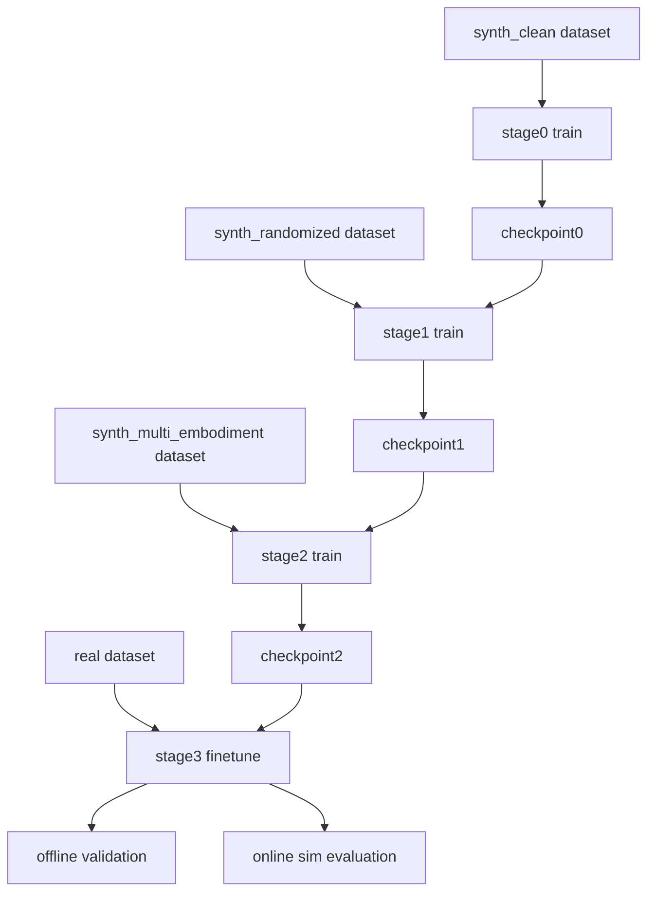

## 13.6 代码样例：`train/stage_runner.py`

```python
import subprocess


def run_stage(stage_cfg, pretrained_path=None):
    cmd = [
        "lerobot-train",
        f"--dataset.repo_id={stage_cfg['repo_id']}",
        f"--dataset.root={stage_cfg['root']}",
        f"--output_dir={stage_cfg['output_dir']}",
        f"--job_name={stage_cfg['name']}",
        f"--steps={stage_cfg['steps']}",
        f"--batch_size={stage_cfg['batch_size']}",
    ]
    if pretrained_path:
        cmd.append(f"--policy.path={pretrained_path}")
    subprocess.run(cmd, check=True)
```

## 13.7 策略兼容性建议

不是所有策略都应默认作为 RobotTwin2 integration 的第一优先级。

### v1 推荐重点支持

- `ACT`
- `Diffusion`
- `SmolVLA`
- 本分支已有的 `Groot2`
- 本分支已有的 `StrGroot`

### 原因

- 它们已是当前仓库策略生态的重要组成部分
- 本分支已有 Groot2/StrGroot 相关改动
- 更接近当前实验分支实际需求

### 不建议 v1 过度泛化

不要在 design3 里假设所有策略都天然兼容 RobotTwin2 integration。  
设计上应把：

- 策略兼容性
- action semantics
- camera schema

都视为 profile 与验证问题，而不是默认已解。

---

## 14. EvalPlane 设计

## 14.1 为什么评测最适合走本地插件

`LeRobot` 已经提供了：

- plugin discovery
- `EnvConfig` 扩展
- local `gym` 环境动态导入

所以最自然的路线是：

- 在 `bt/robotwin2/eval/` 内注册本地 env
- 用 `lerobot-eval` 直接消费

而不是：

- 在 `LeRobot` 主仓增加一个 RoboTwin2 内置 env

## 14.2 目标 observation 协议

为了尽量零侵入，`RobotTwinEvalEnv` 应输出 `LeRobot` 已经能识别的 observation：

- `pixels`
- `pixels` 为 dict
- `agent_pos`
- `task_description()`

这样就可以复用：

- `preprocess_observation()`
- `add_envs_task()`

而不需要强制改 `env_processor` 主逻辑。

## 14.3 Evaluation 工作流图

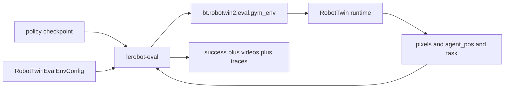

## 14.4 Evaluation 序列图

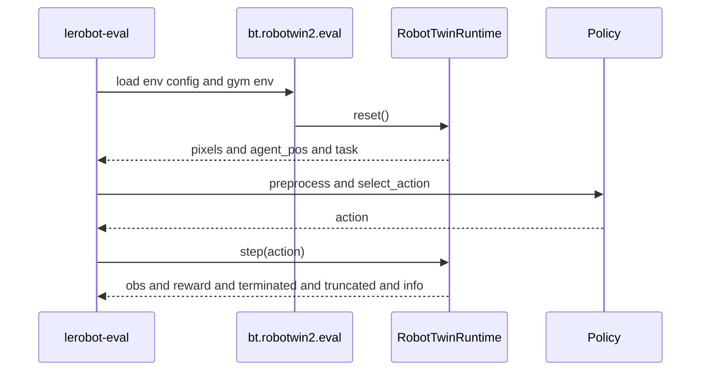

## 14.5 代码样例：`eval/env_config.py`

```python
from dataclasses import dataclass
from lerobot.envs.configs import EnvConfig


@EnvConfig.register_subclass("robotwin2_eval")
@dataclass
class RobotTwinEvalEnvConfig(EnvConfig):
    task: str | None = None
    task_config: str = "demo_clean"
    embodiment: str = "aloha-agilex"
    fps: int = 15
    episode_length: int = 300

    @property
    def package_name(self) -> str:
        return "bt.robotwin2.eval.gym_registration"

    @property
    def gym_id(self) -> str:
        return "bt_robotwin2/RobotTwinEval-v0"

    @property
    def gym_kwargs(self) -> dict:
        return {
            "task": self.task,
            "task_config": self.task_config,
            "embodiment": self.embodiment,
        }
```

## 14.6 代码样例：`eval/gym_env.py`

```python
import gymnasium as gym


class RobotTwinEvalEnv(gym.Env):
    def __init__(self, task, task_config, embodiment):
        self.runtime = make_runtime(task=task, task_config=task_config, embodiment=embodiment)
        self._task_text = task

    def reset(self, *, seed=None, options=None):
        raw_obs, info = self.runtime.reset(seed=seed)
        obs = {
            "pixels": {
                "head": raw_obs["cam_high"],
                "left_wrist": raw_obs["cam_left_wrist"],
                "right_wrist": raw_obs["cam_right_wrist"],
            },
            "agent_pos": raw_obs["qpos"],
        }
        return obs, info

    def step(self, action):
        raw_obs, reward, terminated, truncated, info = self.runtime.step(action)
        obs = {
            "pixels": {
                "head": raw_obs["cam_high"],
                "left_wrist": raw_obs["cam_left_wrist"],
                "right_wrist": raw_obs["cam_right_wrist"],
            },
            "agent_pos": raw_obs["qpos"],
        }
        return obs, reward, terminated, truncated, info

    def task_description(self):
        return self._task_text
```

## 14.7 为什么优先本地 plugin，而不是先做 EnvHub

原因：

1. 本地 plugin 更容易调试
2. 不需要先处理远程发布和 `trust_remote_code`
3. 可以更快验证 env wrapper 是否与 `lerobot-eval` 对齐

### EnvHub 在哪里合适

EnvHub 适合在 v2 或 v3：

- 当本地 plugin 已稳定
- benchmark 语义已稳定
- 需要跨机器复现和共享时

---

## 15. `bt/robotwin2` 与 `LeRobot` 主仓的边界

## 15.1 v1 默认全部放在 `bt/robotwin2` 的能力

以下能力都应该优先放在 `bt/robotwin2`：

- synthetic generation orchestration
- format conversion
- dataset split/merge/manifest
- sim record runner
- action sources
- stage runner
- offline validation
- local eval plugin
- benchmark runner

## 15.2 只有这些情况下才值得改 `LeRobot` 主仓

### 情况 A：你想统一原生命令体验

例如希望直接支持：

```bash
lerobot-record --backend.type=robotwin2
```

这时才值得在主仓引入：

- `RecordBackend`
- `RealRobotRecordBackend`
- `RobotTwinRecordBackend`

### 情况 B：你想让 env 插件自动发现

如果不想每次都写：

```bash
--env.discover_packages_path=bt.robotwin2
```

才值得修改 `register_third_party_plugins()` 的自动发现规则。

### 情况 C：你想让 train 内核直接支持 curriculum

例如：

- inline val dataset
- inline online sim eval
- multi-stage config

这时才值得改 `lerobot-train.py`。

## 15.3 边界判断结论

### 精确表述

以下说法是**正确**的：

> 在当前仓库状态下，RobotTwin2 integration 的 v1 版本，可以在不对 `LeRobot` 主仓再做额外 RobotTwin2 特化改动的情况下完成。

以下说法是**不够严谨**的：

> 所有整合能力都永远不需要改 LeRobot 主仓。

因为：

- v2 / v3 为了统一用户体验，可能是值得适度回推 abstraction 的

---

## 16. 为什么 `design3` 比 `design.md` 和 `design2.md` 更好

## 16.1 相比 `design.md`

`design3` 保留了：

- 四平面能力拆分
- 精确目录树
- 文件职责
- 多张 Mermaid 图
- “什么情况下才改主仓”的边界章节

同时改进了：

- 对当前 `LeRobot` 扩展点的对齐更严谨
- 避免过多只停留在概念层的 `NotImplementedError` 式描述
- 更清楚地区分 v1 companion 能力和未来 core enhancement

## 16.2 相比 `design2.md`

`design3` 保留了：

- 更贴近代码的扩展点描述
- branch context 和工程实现感
- 风险和兼容性视角

同时改进了：

- 降低冗长和重复
- 避免把某些简化版 `LeRobot` 基类误写成当前真实实现
- 避免绝对化表述“全部零改动主仓”

---

## 17. 验证方案

## 17.1 DataPlane 验证

检查点：

1. `convert.py` 能生成合法 `LeRobotDataset`
2. `lerobot-info` 可以读取
3. `LeRobotDataset(...)` 能正常加载
4. 最小 `policy.forward()` smoke check 通过

## 17.2 RecordPlane 验证

检查点：

1. expert 录制能生成 episode
2. policy 录制能生成 episode
3. 输出 dataset 可被 `LeRobotDataset` 读取
4. episode meta 与 raw runtime 信息对齐

## 17.3 TrainPlane 验证

检查点：

1. `stage_runner.py` 能串起多个 `lerobot-train`
2. checkpoint 可衔接下一 stage
3. 离线 val 能独立运行

## 17.4 EvalPlane 验证

检查点：

1. `--env.discover_packages_path=bt.robotwin2` 能正常注册 env
2. `lerobot-eval` 能创建 RobotTwin2 eval env
3. rollout 成功
4. success / reward / video 输出正确

## 17.5 统一不变量

以下不变量必须在文档和实现里始终保持：

1. `data.convert`、`record.run_record`、`eval.gym_env` 共用同一 `CanonicalAdapter`
2. v1 默认主 action mode 为 `qpos`
3. v1 不要求修改 `LeRobot` 主仓
4. `RecordPlane` 是 companion runner，不伪装成已经改造过的 `lerobot-record`

---

## 18. 实施顺序

## Phase 1：共享层与数据

- 建立 `common/canonical_adapter.py`
- 建立 `data/generate.py`
- 建立 `data/convert.py`
- 建立 `data/split_merge.py`
- 建立 `data/validate_dataset.py`

目标：

- 先打通 `RobotTwin2 -> LeRobotDataset v3`

## Phase 2：仿真录制

- 建立 `record/run_record.py`
- 先实现 `expert`
- 再实现 `policy`
- `teleop` 作为增强项

目标：

- 让 companion 层可以在仿真中直接录制 `LeRobotDataset`

## Phase 3：在线评测

- 建立 `eval/env_config.py`
- 建立 `eval/gym_registration.py`
- 建立 `eval/gym_env.py`
- 建立 `eval/benchmark.py`

目标：

- 打通 `lerobot-eval` 的 RobotTwin2 benchmark

## Phase 4：训练编排

- 建立 `train/stage_runner.py`
- 建立 `offline_val.py`
- 建立 `checkpoint_eval.py`

目标：

- 形成完整 `synthetic clean -> synthetic randomized -> real finetune` 流程

## Phase 5：体验增强（可选）

只在真正需要时，才考虑：

- `lerobot-record` backend abstraction
- env auto-discovery
- train core inline val / online eval

---

## 19. 风险与开放问题

## 19.1 action 语义风险

风险最大的问题不是“格式”，而是“语义”：

- `qpos`
- `ee`
- `delta_ee`

这些如果不统一，会直接导致：

- train/eval 不一致
- policy rollout 失真

因此第一版必须保守地只稳定 `qpos`。

## 19.2 camera schema 风险

RobotTwin2 的相机输出命名和分辨率不一定在所有任务中完全一致。  
因此必须由 profile 和 adapter 去统一，而不是把相机 key 写死在多处。

## 19.3 teleop 风险

teleop 在仿真中通常最依赖：

- GUI
- 输入设备
- 远程桌面

因此：

- v1 不宜把 teleop 当成最先实现路径
- `bt/hil` 的 companion demo 经验可以复用

## 19.4 benchmark 语义风险

要明确区分：

- train on clean, test on clean
- train on clean, test on randomized
- train on synth, finetune on real

否则 benchmark 数字没有可解释性。

---

## 20. 最终结论

`design3` 的最终判断是：

1. 在当前仓库状态下，**可以**在几乎不改 `LeRobot` 主仓的前提下，把 RobotTwin2 接入：
   - `data`
   - `record`
   - `train`
   - `evaluation`
2. 最合理的实现方式不是把逻辑塞进 `src/lerobot/`，而是把 `bt/robotwin2` 做成一个 companion layer
3. 真正关键的不是“多写几个脚本”，而是建立一个**单一共享的 canonical adapter**
4. 只有当你明确追求：
   - 统一原生命令体验
   - 自动插件发现
   - train core 内建多阶段能力
   
   才需要考虑修改 `LeRobot` 主仓

一句话总结：

> `bt/robotwin2` 应该被设计成一个本地 companion package，复用 `LeRobot` 的 dataset、policy、train、eval 公共 API，把 RobotTwin2 接成 synthetic data backend、simulation record backend 和 benchmark backend，而不是把 RobotTwin2 特化逻辑直接并入 `LeRobot` 主仓。
