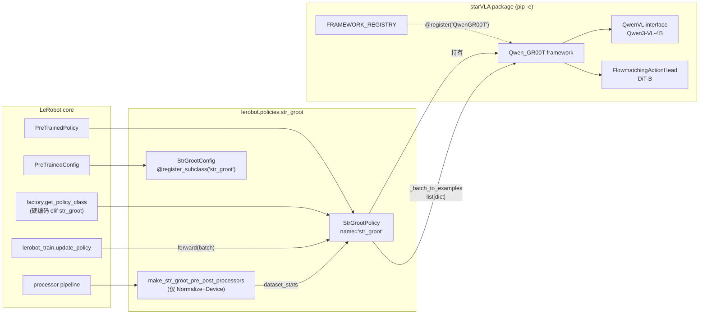
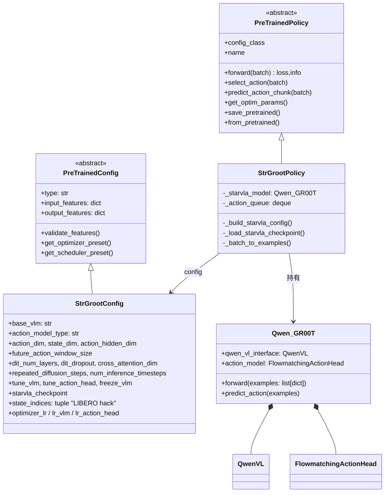
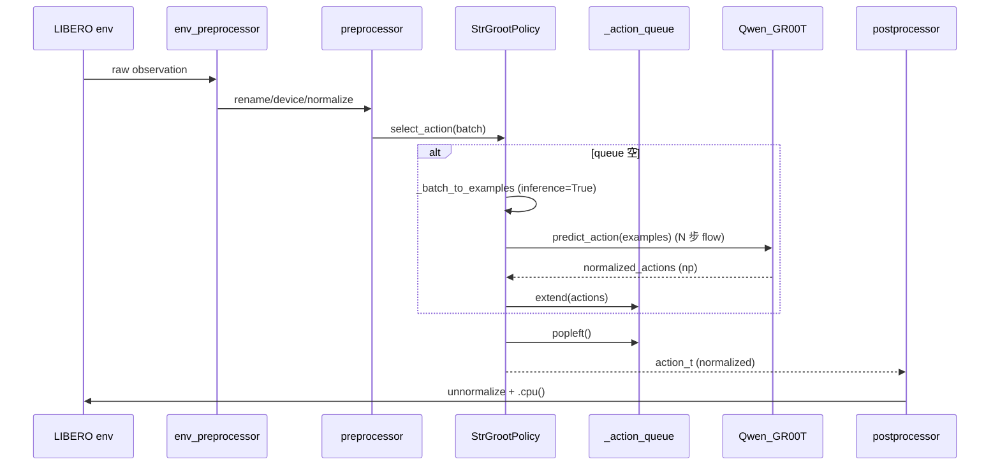
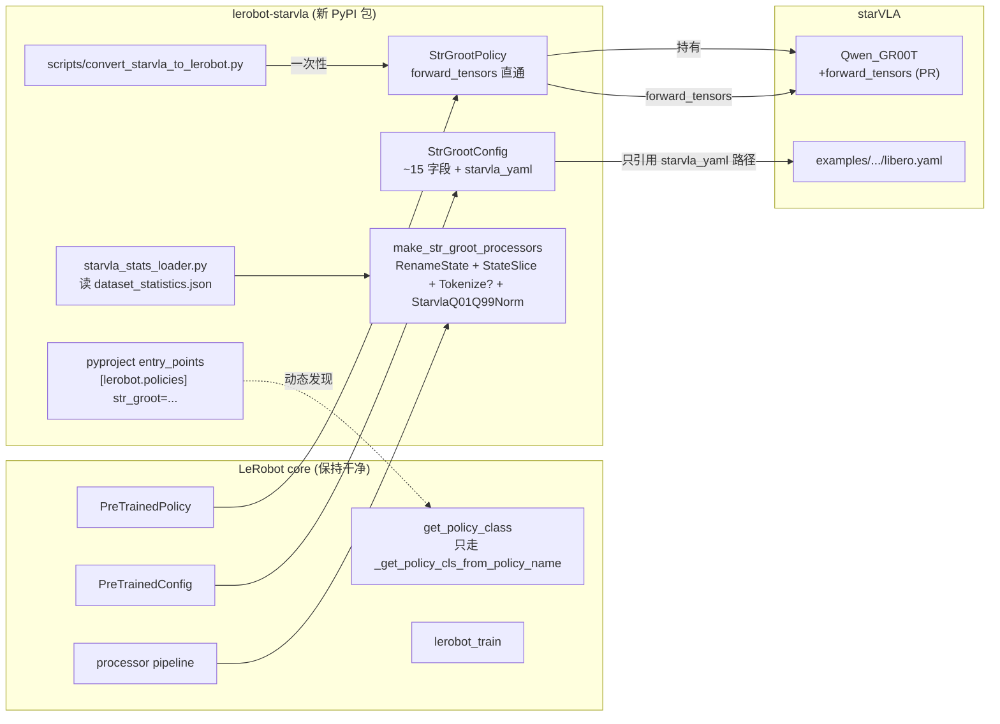
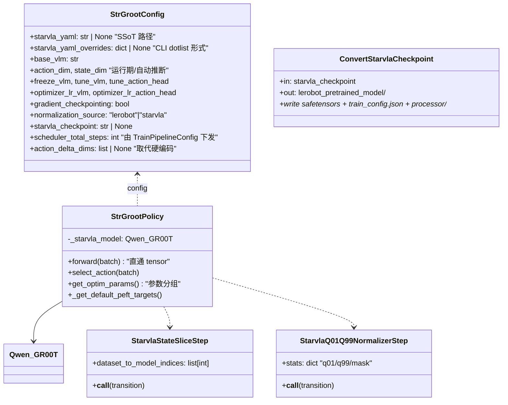
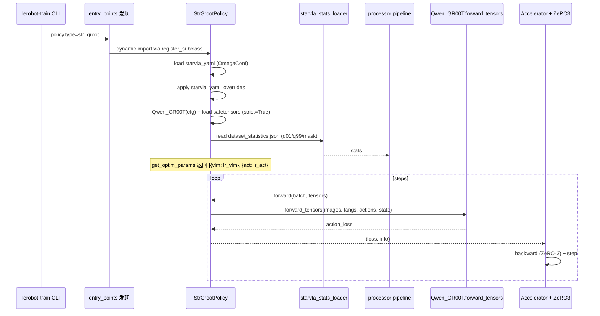

# StarVLA × LeRobot 整合现状分析与改良方案（ivr_slu1）

> 日期: 2026-04-22  
> 对象: [src/lerobot/policies/str_groot/](../../src/lerobot/policies/str_groot) 三个文件 + [bt/str_groot_1/](.) 训练/评测脚本与文档  
> 方法: 源码逐级追溯 + 与原生 StarVLA（Accelerate+DeepSpeed+OmegaConf）对照 + 与 LeRobot 现有 VLA 策略（Pi0 / SmolVLA / Groot）对齐  
> 结论: 当前整合"能跑"，但属于"薄包装"；存在可量化的战术缺陷（见 [refactor1_c.md](refactor1_c.md)）与战略缺陷（本篇提出）。后者通过"**插件化 + 原生契约对齐**"方案修复，分 5 个 Phase 落地

---

## 1. 背景与术语

- **StarVLA**: 开源 VLA 研究代码库，多 framework 注册式（`@FRAMEWORK_REGISTRY.register`）。`Qwen_GR00T` = `Qwen3-VL-4B`（VLM 主干）+ `FlowmatchingActionHead`（DiT-B 动作头）。原生训练入口 [`starVLA/training/train_starvla.py`](../../../starVLA/starVLA/training/train_starvla.py) 用 Accelerate + DeepSpeed + OmegaConf YAML 驱动，模型/数据均走注册表。
- **LeRobot**: 机器人学习通用框架。策略抽象 [`PreTrainedPolicy`](../../src/lerobot/policies/pretrained.py)；训练入口 [`lerobot_train.py`](../../src/lerobot/scripts/lerobot_train.py)；评估入口 [`lerobot_eval.py`](../../src/lerobot/scripts/lerobot_eval.py)；配置基类 [`PreTrainedConfig`](../../src/lerobot/configs/policies.py)；预/后处理管线 [`lerobot/processor/`](../../src/lerobot/processor)。
- **整合产物（已存在）**: `str_groot` 策略 = 位于 [`src/lerobot/policies/str_groot/`](../../src/lerobot/policies/str_groot) 的三件套（`configuration_str_groot.py` / `modeling_str_groot.py` / `processor_str_groot.py`），通过导入并 `self._starvla_model = Qwen_GR00T(cfg)` 将 starVLA 作为黑盒包裹，`factory.py` 对 `"str_groot"` 加了一条显式分支。

本篇讨论"整合方式"本身，不重复 [refactor1_c.md](refactor1_c.md) 列过的 11 条战术级修复。

---

## 2. 现状架构总览

### 2.1 组件关系（Mermaid 组件图）



要点：
- `StrGrootPolicy` 只是"薄壳"，推理/训练实际在 `Qwen_GR00T` 中执行。
- `factory.py` 的 `elif name == "str_groot"` 分支是**硬编码耦合**，见 [src/lerobot/policies/factory.py:131-133](../../src/lerobot/policies/factory.py)：

```131:133:src/lerobot/policies/factory.py
    elif name == "str_groot":
        from lerobot.policies.str_groot.modeling_str_groot import StrGrootPolicy
        return StrGrootPolicy
```

- LeRobot 实际提供了**插件式发现**的回退路径 [`_get_policy_cls_from_policy_name`](../../src/lerobot/policies/factory.py)（通过 `register_subclass` + `configuration_*` → `modeling_*` 命名约定 + `importlib`），因此 `str_groot` 的硬编码**可以去掉**。

### 2.2 类图（现状）



---

## 3. 当前整合是如何工作的

### 3.1 配置映射（LeRobot dataclass → OmegaConf dict）

[`_build_starvla_config`](../../src/lerobot/policies/str_groot/modeling_str_groot.py) 把 `StrGrootConfig` 字段摊平塞进一个 3 层嵌套 dict：

```51:102:src/lerobot/policies/str_groot/modeling_str_groot.py
    def _build_starvla_config(self):
        from omegaconf import OmegaConf

        c = self.config
        cfg_dict = {
            "framework": {
                "name": "QwenGR00T",
                "qwenvl": {
                    "base_vlm": c.base_vlm,
                    "attn_implementation": c.attn_implementation,
                },
                "action_model": {
                    "action_model_type": c.action_model_type,
                    "action_hidden_dim": c.action_hidden_dim,
                    "hidden_size": c.action_hidden_dim,
                    "add_pos_embed": True,
                    "max_seq_len": c.max_seq_len,
                    "action_dim": c.action_dim,
                    "state_dim": c.state_dim,
                    "future_action_window_size": c.future_action_window_size,
                    "action_horizon": c.future_action_window_size + 1,
                    ...
                    "diffusion_model_cfg": {
                        "cross_attention_dim": c.cross_attention_dim,
                        "dropout": c.dit_dropout,
                        "num_layers": c.dit_num_layers,
                        ...
                    },
                },
                "reduce_in_full_precision": True,
            },
            "trainer": {...},
            "datasets": {"vla_data": {"image_size": list(c.image_size)}},
        }
        return OmegaConf.create(cfg_dict)
```

这段代码"固化"了 StarVLA 一个快照版本的 YAML schema，每当 StarVLA 升级（新增字段、改 key）都需要同步修改。

### 3.2 权重加载（绕 LeRobot safetensors 流程）

[`_load_starvla_checkpoint`](../../src/lerobot/policies/str_groot/modeling_str_groot.py) 三段式查找 → 手工加 `_starvla_model.` 前缀 → `strict=False`：

```122:156:src/lerobot/policies/str_groot/modeling_str_groot.py
    def _load_starvla_checkpoint(self, checkpoint_path: str) -> None:
        local_path = None
        if os.path.isfile(checkpoint_path):
            local_path = checkpoint_path
        elif os.path.isdir(checkpoint_path):
            local_path = self._find_ckpt_in_dir(checkpoint_path)
        if local_path is None and "/" in checkpoint_path:
            from huggingface_hub import snapshot_download
            local_dir = snapshot_download(repo_id=checkpoint_path)
            local_path = self._find_ckpt_in_dir(local_dir)
        ...
        if local_path.endswith(".safetensors"):
            from safetensors.torch import load_file
            state_dict = load_file(local_path)
        else:
            state_dict = torch.load(local_path, map_location="cpu", weights_only=False)

        prefixed = {f"_starvla_model.{k}": v for k, v in state_dict.items()}
        missing, unexpected = self.load_state_dict(prefixed, strict=False)
        if missing:
            logger.warning("Missing keys ... %d keys", len(missing))
```

关键观察：
- **仅首次**用这条路径（`cfg.starvla_checkpoint` 指向 HF repo），后续 `--resume` 与 `lerobot-eval --policy.path=...` 走 `PreTrainedPolicy.from_pretrained` → `safetensors` 标准流程。
- `strict=False` + 只打日志等于 **"允许缺失/多余默默通过"**。如果 StarVLA 的 state_dict 某个子模块被重命名（例如 DiT 里某个 Linear key 换名），训练不会报错，**参数随机初始化**，模型性能出现诡异下降。

### 3.3 Batch → Examples（tensor batch 拆成 list[dict]）

```207:245:src/lerobot/policies/str_groot/modeling_str_groot.py
    def _batch_to_examples(self, batch, inference=False) -> list[dict]:
        image_keys = sorted(k for k in batch if k.startswith("observation.images."))
        ...
        B = batch[image_keys[0]].shape[0]
        examples: list[dict] = []
        for i in range(B):
            images = []
            for key in image_keys:
                img_t = batch[key][i]  # (C, H, W)
                if img_t.is_floating_point():
                    img_t = (img_t.clamp(0, 1) * 255).to(torch.uint8)
                images.append(to_pil_image(img_t.cpu()))
            example: dict = {
                "image": images,
                "lang": batch["task"][i] if "task" in batch else "",
            }
            if not inference and "action" in batch:
                example["action"] = batch["action"][i].cpu().float().numpy()
            if "observation.state" in batch:
                state = batch["observation.state"][i].cpu().float().numpy()
                if self.config.state_indices is not None:
                    state = state[..., list(self.config.state_indices)]
                example["state"] = state.reshape(1, -1)
            examples.append(example)
        return examples
```

按 B 维逐张图片 `.cpu()` 产生 O(B·K) 次 GPU↔CPU 同步（K=相机数），PIL 是不可避免的（下游 `qwen_vl_utils.process_vision_info` 要 PIL），但 `.cpu()` 完全可批量化（refactor1_c Phase 2 已提）。更深的问题在于：**既然 LeRobot preprocessor 已经把 tensor 规整好了，为什么要拆回 list[dict] 再由 starVLA 内部 `build_qwenvl_inputs` 重组 batch？**

### 3.4 StarVLA 侧执行

```99:134:../../../starVLA/starVLA/model/framework/QwenGR00T.py
        qwen_inputs = self.qwen_vl_interface.build_qwenvl_inputs(images=batch_images, instructions=instructions)
        with torch.autocast("cuda", dtype=torch.bfloat16):
            qwenvl_outputs = self.qwen_vl_interface(**qwen_inputs, output_hidden_states=True, return_dict=True)
            last_hidden = qwenvl_outputs.hidden_states[-1]

        with torch.autocast("cuda", dtype=torch.float32):
            actions = torch.tensor(np.array(actions), device=last_hidden.device, dtype=last_hidden.dtype)
            actions_target = actions[:, -(self.future_action_window_size+1):, :]
            actions_target_repeated = actions_target.repeat(repeated_diffusion_steps, 1, 1)
            last_hidden_repeated = last_hidden.repeat(repeated_diffusion_steps, 1, 1)
            ...
            action_loss = self.action_model(last_hidden_repeated, actions_target_repeated, state_repeated)

        return {"action_loss": action_loss}
```

- 训练：VLM hidden 重复 `repeated_diffusion_steps` 份做多步 flow-matching 损失（原生 `GR00T` 做法）。
- 推理 [`predict_action`](../../../starVLA/starVLA/model/framework/QwenGR00T.py)：N 步欧拉积分去噪（`num_inference_timesteps=4`）。

### 3.5 训练主循环（LeRobot 侧）

```mermaid
sequenceDiagram
    participant User
    participant TP as lerobot_train.train()
    participant DL as DataLoader
    participant Pre as preprocessor
    participant Pol as StrGrootPolicy
    participant QG as Qwen_GR00T
    participant Opt as AdamW+Scheduler
    participant Acc as accelerator

    User->>TP: lerobot-train --policy.type=str_groot ...
    TP->>Pol: make_policy(cfg, ds_meta)
    Pol->>Pol: _build_starvla_config()
    Pol->>QG: Qwen_GR00T(cfg)
    Pol->>Pol: _load_starvla_checkpoint()  (strict=False)
    TP->>Opt: make_optimizer_and_scheduler(cfg, policy)
    Note over Pol,Opt: 当前 get_optim_params() 返回 self.parameters() 不分组

    loop steps
        DL->>Pre: batch(tensor, normalized)
        Pre->>Pol: forward(batch)
        Pol->>Pol: _batch_to_examples  (B 次 .cpu + PIL)
        Pol->>QG: forward(examples)
        QG->>QG: build_qwenvl_inputs → QwenVL → DiT
        QG-->>Pol: {"action_loss": loss}
        Pol-->>Pre: (loss, info)
        Pre->>Acc: backward + clip_grad + step
    end
```

### 3.6 推理主循环（LIBERO eval）



---

## 4. 如何使用现有整合

### 4.1 三条入口路径

**A. 自写 Python 入口（快速起手）**  
[bt/str_groot_1/train_str_groot_libero.py](train_str_groot_libero.py)：构造 `StrGrootConfig` + `DatasetConfig` + `TrainPipelineConfig` 后调用 `lerobot.scripts.lerobot_train.train(cfg)`。适合脚本化调试。

**B. CLI `lerobot-train`（推荐，用于正式训练）**

```bash
lerobot-train \
  --policy.type=str_groot \
  --policy.push_to_hub=false \
  --policy.starvla_checkpoint=StarVLA/Qwen3VL-GR00T-Bridge-RT-1 \
  --policy.freeze_vlm=true --policy.tune_vlm=false --policy.tune_action_head=true \
  --policy.state_indices=[0,1,2,3,4,5,7] \
  --dataset.repo_id=HuggingFaceVLA/libero \
  --batch_size=8 --steps=30000 --log_freq=50 --save_freq=1000 \
  --output_dir=outputs/bt/str_groot_1/ft_cli \
  --job_name=str_groot_libero_ft
```

- 多卡：前置 `accelerate launch --multi_gpu --num_processes=8 $(which lerobot-train)`
- 续训：`--resume=true --config_path=<run>/checkpoints/<step>/pretrained_model/train_config.json`

**C. CLI `lerobot-eval`（LIBERO 评估）**

```bash
lerobot-eval \
  --env.type=libero --env.task=libero_spatial \
  --env.obs_type=pixels_agent_pos --env.control_mode=relative \
  --policy.path=<run>/checkpoints/030000/pretrained_model \
  --policy.device=cuda --policy.use_amp=false \
  --eval.n_episodes=10 --eval.batch_size=1
```

### 4.2 可用入口对比

- A 路径：代码可控，但与 CLI 有字段/默认值漂移风险（`train_str_groot_libero.py` 里一堆 `# p.add_argument(...)` 注释残留即证据）。
- B 路径：最接近上游，`--resume` 无缝。**推荐作为主入口**。
- 两条入口并存是"维护成本源"之一。

---

## 5. 现状结构性问题

[refactor1_c.md](refactor1_c.md) 已列的 11 条"**战术级**"问题（差异化 LR / `_batch_to_examples` 批量化 / sys.path hack / scheduler 硬编码 / gradient checkpointing / PEFT / `weights_only` / `action_delta_indices` / 训练脚本副作用等）不再重复。本节讨论 **refactor1_c 之外的"战略级"整合问题**。

- **S1 Config 脆弱耦合** — `StrGrootConfig` 暴露了 20+ 个 StarVLA 内部超参（`dit_num_layers`, `cross_attention_dim`, `repeated_diffusion_steps`, `action_model_type`, `num_target_vision_tokens` …）。这些本应来自 StarVLA 自己的 YAML（[examples/LIBERO/train_files/starvla_cotrain_libero.yaml](../../../starVLA/examples/LIBERO/train_files/starvla_cotrain_libero.yaml)），现在却在 LeRobot dataclass 固化了一份。**StarVLA 一升级，LeRobot 这边必破**。
- **S2 Processor 形同虚设** — 现 [processor_str_groot.py](../../src/lerobot/policies/str_groot/processor_str_groot.py) 只串了 Normalize + Device，所有"真实"的 batch 改形（语言取出、图像 PIL 化、state 切片）都在 `_batch_to_examples` 里硬编码。对比 Pi0：

```130:146:src/lerobot/policies/pi0/processor_pi0.py
    input_steps = [
        RenameObservationsProcessorStep(...),
        Pi0NewLineProcessor(),
        TokenizerProcessorStep(tokenizer_name="google/paligemma-3b-pt-224", ...),
        NormalizerProcessorStep(...),
        DeviceProcessorStep(device=config.device),
    ]
```

Pi0 明确把"任务拼接 + tokenize + 归一化 + device"都组合成有序步，便于插拔与序列化；`str_groot` 完全没用上这套基础设施。

- **S3 归一化不同源（train/inference 分布偏移风险）** — 当前 `normalization_mapping` 为 `ACTION → MIN_MAX`，stats 来自 `LeRobotDatasetMetadata.stats`（按 `min/max` 计算）。而 StarVLA 预训练 checkpoint 在训练时用的是 **数据集 `dataset_statistics.json` 中的 `q01/q99/mask`**（见 [base_framework.py 里的 unnormalize_actions](../../../starVLA/starVLA/model/framework/base_framework.py)）。两者**不同分布、不同尺度、不同零点**。  
  影响：加载 `StarVLA/Qwen3VL-GR00T-Bridge-RT-1` 后，若 LIBERO 的 `min/max` 与原始 Bridge/RT-1 的 `q01/q99` 大幅不同，动作预测会被"错放"到非单位区间，需很多步 fine-tune 才能纠回来。**隐式性能税**。
- **S4 LIBERO-only hack 污染 Config** — `state_indices=[0,1,2,3,4,5,7]` 是 LIBERO 为绕过 pad 维 6 的硬编码切片。它不应在 policy config 的运行期字段里，应该在 **数据集 feature rename/select 层**做（LeRobot 的 `RenameObservationsProcessorStep` + feature shape）。一旦扩到 Bridge / RT-X / 多机器人 co-train，这条字段要么废掉要么长大成 per-dataset dict，是典型的 "hack 长大为债务"。
- **S5 Checkpoint IO 不对称** — 见 §3.2。首次用 `snapshot_download + strict=False` 灌权重，续训 / eval 再走 `safetensors`。整合入口**不统一**，且 `strict=False` 静默失败极易酿出"训得动但精度不对"的悬案。
- **S6 factory 硬编码侵入 LeRobot 核心仓库** — 见 [src/lerobot/policies/factory.py:131-133](../../src/lerobot/policies/factory.py)。StarVLA 作为外部重依赖（flash-attn / deepspeed / qwen-vl-utils ...）被写进 LeRobot 工厂，使得 LeRobot 单测、安装闭环都必须容忍一个专用子策略的依赖图。LeRobot 已经实现了 [_get_policy_cls_from_policy_name](../../src/lerobot/policies/factory.py) 作为 3rd-party 插件路径，理应用它。
- **S7 双入口并存** — [train_str_groot_libero.py](train_str_groot_libero.py) 与 `lerobot-train` 两条路径并存，CI 不覆盖任何一条（当前代码里 `# p.add_argument("--base-vlm"...)` 之类注释残留已反映出维护疲劳）。
- **S8 接口绕行** — tensor batch → list[dict] → 内部 `build_qwenvl_inputs` 重打包回 tensor。`Qwen_GR00T` 的 forward 签名 `forward(examples: list[dict])` 源自"单机 dataloader collate_fn 返回 list"的老范式。LeRobot 这侧已经是 batched tensor，**信息在拆包时损失** + **额外开销**。应让 `Qwen_GR00T` 暴露 `forward_tensors(images, lang_strs, actions, state)` 与 LeRobot 对齐。
- **S9 Scheduler 硬编码 10000 步** — [configuration_str_groot.py](../../src/lerobot/policies/str_groot/configuration_str_groot.py) 中 `get_scheduler_preset` 用 `10000` 当 `num_decay_steps`。`TrainPipelineConfig.steps` 完全可注入进来。refactor1_c 提了，但没覆盖 factory 侧的下发链路。

综上，**S1/S2/S3/S5/S6/S8 是系统级耦合/漂移问题**，单靠 refactor1_c 的修补无法根治。

---

## 6. 更优整合方案：`lerobot-starvla` 插件化 + 原生契约对齐

### 6.1 七条设计原则

1. **Single source of truth（SSoT）**：StarVLA 自家 YAML 是模型超参唯一源。LeRobot 端只暴露"运行期"参数（`device`、`freeze_vlm`、`lr_*`、`checkpoint`、`episodes` 等）。
2. **Processor-first**：一切 batch 改形（rename / state slice / PIL 化 / tokenize / normalize）都用 LeRobot processor step 表达，序列化后随 checkpoint 走。
3. **Normalization 对齐**：加载 StarVLA checkpoint 时优先读其 `dataset_statistics.json`（q01/q99/mask），注入 `dataset_stats`，并改用 `Q01_Q99` 归一化 mode（如 LeRobot 已有则复用，没有则新增一个 normalizer step）。
4. **标准 checkpoint IO**：权重以 LeRobot `safetensors` 统一 IO。首次从 StarVLA HF repo 转换由一次性 `scripts/convert_starvla_to_lerobot.py` 做，转换后所有训练/续训/eval 走 `from_pretrained`。
5. **Plugin entry-point**：把 `str_groot` 策略抽成独立可安装包 `lerobot-starvla`，通过 Python entry point `[project.entry-points."lerobot.policies"]` 动态发现；LeRobot 核心仓库仅保留**通用插件发现机制**，不再硬编码 `str_groot` 分支。
6. **Forward on tensors**：向 StarVLA 上游提 PR，给 `Qwen_GR00T` 增加 `forward_tensors(pixel_values, lang_ids, attn_mask, actions, state)` 接口；在 PR 未合并前，lerobot-starvla 内部提供 monkeypatch 版。
7. **CI-ready tests**：把 [test_str_groot_libero37.py](test_str_groot_libero37.py) 的分阶段测试迁为 `tests/policies/test_str_groot.py`（pytest 收集 + GPU-optional 标记），`bt/str_groot_1/` 只留**文档 + 冒烟脚本**。

### 6.2 改良后的组件图



### 6.3 改良后的类图



### 6.4 改良后 processor 管线

```mermaid
flowchart LR
    Batch --> Rename[RenameObservationsProcessorStep<br/>LIBERO: obs.state 8d保留原样]
    Rename --> StateSlice[StarvlaStateSliceStep<br/>dataset_to_model_indices=0,1,2,3,4,5,7]
    StateSlice --> Norm[StarvlaQ01Q99NormalizerStep<br/>stats来自dataset_statistics.json]
    Norm --> Dev[DeviceProcessorStep]
    Dev --> Fwd[Policy.forward]
    Fwd --> Out[PolicyAction]
    Out --> UnNorm[StarvlaQ01Q99UnnormalizerStep]
    UnNorm --> ToCPU[DeviceProcessorStep cpu]
```



关键代码示意（新加一个 step）：

```python
# lerobot_starvla/processor/state_slice.py (示意)
@dataclass
class StarvlaStateSliceStep(ObservationProcessorStep):
    dataset_to_model_indices: tuple[int, ...]
    obs_state_key: str = "observation.state"
    def observation(self, obs: dict) -> dict:
        if self.obs_state_key not in obs:
            return obs
        idx = list(self.dataset_to_model_indices)
        obs = dict(obs)
        obs[self.obs_state_key] = obs[self.obs_state_key][..., idx]
        return obs
    def transform_features(self, features: dict) -> dict:
        if self.obs_state_key in features:
            f = features[self.obs_state_key]
            features[self.obs_state_key] = PolicyFeature(type=f.type, shape=(len(self.dataset_to_model_indices),))
        return features
```

```python
# lerobot_starvla/processor/q01_q99_norm.py (示意, 只展示 action 归一化)
@dataclass
class StarvlaQ01Q99NormalizerStep(ProcessorStep):
    stats: dict  # {action: {q01: Tensor, q99: Tensor, mask: Tensor}}
    def action(self, action: Tensor) -> Tensor:
        q01, q99, mask = self.stats["action"]["q01"], self.stats["action"]["q99"], self.stats["action"]["mask"]
        scale = (q99 - q01).clamp(min=1e-6)
        out = torch.where(mask, 2 * (action - q01) / scale - 1, action)
        return out.clamp(-1, 1)
```

### 6.5 改良后 forward 接口（配合 starVLA 上游 PR）

```python
# starVLA/model/framework/QwenGR00T.py (PR 新增)
def forward_tensors(
    self,
    pixel_values: list[Tensor],   # per-view: (B, C, H, W) float32 [0,1]
    lang_strs: list[str],         # (B,)
    actions: Tensor,              # (B, T_full, action_dim) bf16
    state: Tensor | None = None,  # (B, 1, state_dim) or None
):
    # 1. 直接在 GPU 上把 pixel_values 喂给 image processor 不落 PIL（借助 qwen_vl_utils 的 tensor 分支）
    # 2. 后续与原 forward 相同
    ...
```

lerobot-starvla 侧（未合并前的 monkeypatch）：

```python
# lerobot_starvla/modeling.py (示意)
def _forward_tensors_fallback(self_qg, pixel_values, lang_strs, actions, state=None):
    # fallback: 内部再做一次 PIL 化（仅做接口统一，性能改进留到上游 PR）
    B = pixel_values[0].shape[0]
    examples = []
    imgs_cpu = [pv.cpu() for pv in pixel_values]
    for i in range(B):
        imgs = [to_pil_image((x[i].clamp(0,1)*255).to(torch.uint8)) for x in imgs_cpu]
        ex = {"image": imgs, "lang": lang_strs[i], "action": actions[i].float().cpu().numpy()}
        if state is not None:
            ex["state"] = state[i].float().cpu().numpy().reshape(1, -1)
        examples.append(ex)
    return self_qg.forward(examples)
```

### 6.6 改良后的训练时序



---

## 7. 实施步骤（5 Phase）

每个 Phase 完成后跑 `bash bt/str_groot_1/test_random37_lerobot_train.sh` 作门控。

### Phase A — 基础加固（吸收 refactor1_c，低风险，2-3 天）

合并 [refactor1_c.md](refactor1_c.md) 的全部改动：
- `get_optim_params` 分组（vlm / action_head 各自 lr）
- `_batch_to_examples` 批量 `.cpu()`
- `gradient_checkpointing` 字段 + 启用
- `_get_default_peft_targets`
- `torch.load(..., weights_only=True)`
- `scheduler_total_steps` 字段接替 `10000` 硬编码
- `action_delta_indices` → `action_delta_dims`（默认 None）
- `sys.path hack` 删除、`deployment` mock 删除（refactor1_c Phase 0）
- 训练/评测脚本清理（`ckpt_path.mkdir` bug、logging `force=True`、注释残留）

**交付**：[src/lerobot/policies/str_groot/](../../src/lerobot/policies/str_groot) 三个文件的 patch + `bt/str_groot_1/setup_env.sh`。
**验证**：参数组正确、冒烟训练通过、显存对比 `gradient_checkpointing=True/False`。

### Phase B — Processor 管线化（中风险，3-4 天）

- 新增 [src/lerobot/policies/str_groot/processor_steps/](../../src/lerobot/policies/str_groot) 目录：
  - `StarvlaStateSliceStep`（取代 `config.state_indices` 运行期切片；同步 `transform_features` 以更新 state shape）
  - `StarvlaImagePILStep`（可选：把 PIL 化从 `_batch_to_examples` 移到 processor，便于 Phase E 下沉到 tensor 接口）
  - `StarvlaQ01Q99NormalizerStep` / `StarvlaQ01Q99UnnormalizerStep`（action）
- 修改 [processor_str_groot.py](../../src/lerobot/policies/str_groot/processor_str_groot.py) 组合这些 step；保留 legacy `MIN_MAX` 走 `normalization_source="lerobot"`。
- `_batch_to_examples` 仅保留"tensor → list[dict] 的 thin bridge"，并在 Phase E 与 forward_tensors 对齐后完全删除。

**交付**：processor step 单测 + 端到端冒烟；`make_str_groot_pre_post_processors` 新签名不破坏既有 checkpoint 反序列化（利用 LeRobot `PolicyProcessorPipeline.save_pretrained` 机制存进 `pretrained_model/`）。

### Phase C — Normalization 源对齐（2 天）

- 新增 [src/lerobot/policies/str_groot/starvla_stats_loader.py](../../src/lerobot/policies/str_groot)：从 `starvla_checkpoint`（HF repo 或本地目录）解析 `dataset_statistics.json`，输出与 LeRobot `dataset_stats` 兼容的 dict。
- `StrGrootConfig` 新增 `normalization_source: Literal["lerobot","starvla"]`；`make_str_groot_pre_post_processors` 据此选不同 normalizer。
- 回归基线：同一 checkpoint 在 LIBERO-Spatial 上，`normalization_source="lerobot"` vs `"starvla"` 成功率差 < 2pp 才算对齐；否则进一步对照 StarVLA 原生 eval 定位偏差。

**交付**：loader + 配置字段 + 单测；[bt/str_groot_1/readme.md](readme.md) 加"归一化选择"说明。

### Phase D — 插件化 `lerobot-starvla`（高风险，5-7 天）

**步骤 1**：把 [src/lerobot/policies/str_groot/](../../src/lerobot/policies/str_groot) 整体挪到独立仓库 `lerobot-starvla`，骨架：

```
lerobot-starvla/
├── pyproject.toml            # 声明 entry_points
├── lerobot_starvla/
│   ├── __init__.py
│   ├── configuration.py      # = configuration_str_groot.py
│   ├── modeling.py           # = modeling_str_groot.py
│   ├── processor.py          # = processor_str_groot.py
│   ├── stats_loader.py
│   └── processor_steps/
├── scripts/
│   └── convert_starvla_to_lerobot.py
└── tests/
```

`pyproject.toml` 关键段：

```toml
[project.entry-points."lerobot.policies"]
str_groot = "lerobot_starvla.modeling:StrGrootPolicy"

[project.entry-points."lerobot.policy_configs"]
str_groot = "lerobot_starvla.configuration:StrGrootConfig"
```

**步骤 2**：LeRobot 核心仓库删除硬编码分支：

- [src/lerobot/policies/factory.py:131-133](../../src/lerobot/policies/factory.py) 的 `elif name == "str_groot"` 删掉；让它走回退 `_get_policy_cls_from_policy_name`（前提是包已 `pip install`，`@register_subclass("str_groot")` 已执行）。
- 相应地 `make_policy_config` 的 `elif policy_type == "str_groot"` 也删，走 `PreTrainedConfig.get_choice_class` 回退。
- `make_pre_post_processors` 走 `_make_processors_from_policy_config` 动态发现 `make_str_groot_pre_post_processors`。

**步骤 3**：`bt/str_groot_1/setup_env.sh` 加一步 `pip install lerobot-starvla`（或 `pip install -e ../lerobot-starvla` 开发模式）。

**风险与回滚**：若 entry_points 在某些 CI/用户环境里被 pip 缓存破坏，回落为"保留 elif 分支 + DeprecationWarning"，两个 release 后再彻底移除。

**交付**：新仓库骨架 + LeRobot 核心两处一行改动 + readme 更新。

### Phase E — `forward_tensors` + 测试迁移（3-4 天）

**步骤 1**：在 starVLA 上游提 PR：
- 新增 `Qwen_GR00T.forward_tensors(pixel_values, lang_strs, actions, state)` 与 `predict_action_tensors(pixel_values, lang_strs, state)`。
- 不破坏既有 `forward(examples)`；只是多一条 API。

**步骤 2**：lerobot-starvla 在 PR 合并前提供 monkeypatch fallback（见 §6.5）。

**步骤 3**：把 [test_str_groot_libero37.py](test_str_groot_libero37.py) 拆分为 pytest 用例集 `tests/policies/test_str_groot/`：
- `test_config.py`：`StrGrootConfig` 各字段与 YAML merge 行为
- `test_dataset_bridging.py`：LIBERO 数据集 → processor 管线 → tensor batch shape 正确
- `test_forward_smoke.py`：`@pytest.mark.gpu` 冒烟 2-step forward
- `test_predict.py`：`@pytest.mark.gpu` chunked rollout
- `test_processor_roundtrip.py`：Normalize → Unnormalize idempotent

**交付**：starVLA PR + lerobot-starvla 测试套件 + `bt/str_groot_1/` 仅留 readme 与 2 个冒烟脚本。

---

## 8. 风险与回滚

- **Phase C（归一化切换）**：加载官方 checkpoint 后，LeRobot MIN_MAX vs StarVLA q01/q99 的输出分布会变。回归门槛：固定同一 checkpoint，在 LIBERO-Spatial / Object / Goal / Long 上跑 10 ep/task，两种归一化的 `pc_success` 差值绝对值 < 2pp 视为过关；若超阈则将 `normalization_source` 默认保持为 `"starvla"` 并在 README 警告。
- **Phase D（插件化）**：entry_points 在 `pip install --no-deps` / conda 混装 / editable install 下偶发不触发注册。预案：保留 `elif name == "str_groot"` 分支一个 release 周期，附 `DeprecationWarning`；并在 `bt/str_groot_1/setup_env.sh` 结束时 `python -c "from lerobot.policies.factory import get_policy_class; get_policy_class('str_groot')"` 做自检。
- **Phase E（starVLA 上游 PR）**：上游节奏不可控。预案：`forward_tensors` 在 lerobot-starvla 内先以 monkeypatch 形式落地；PR 合并后切内置实现，performance 差距作为回归指标（PIL 化次数 vs GPU→CPU 同步次数）。

---

## 9. 附录

### 9.1 关键代码引用表

- [src/lerobot/policies/str_groot/configuration_str_groot.py](../../src/lerobot/policies/str_groot/configuration_str_groot.py) — `StrGrootConfig`、`validate_features`、`get_optimizer_preset`、`get_scheduler_preset`
- [src/lerobot/policies/str_groot/modeling_str_groot.py](../../src/lerobot/policies/str_groot/modeling_str_groot.py) — `StrGrootPolicy`、`_build_starvla_config`、`_load_starvla_checkpoint`、`_batch_to_examples`、`forward`、`predict_action_chunk`、`select_action`
- [src/lerobot/policies/str_groot/processor_str_groot.py](../../src/lerobot/policies/str_groot/processor_str_groot.py) — `make_str_groot_pre_post_processors`
- [src/lerobot/policies/factory.py](../../src/lerobot/policies/factory.py) — `get_policy_class`（line 131-133 硬编码分支）、`make_policy_config`（line 189-190）、`make_pre_post_processors`、`make_policy`、`_get_policy_cls_from_policy_name`
- [src/lerobot/policies/pretrained.py](../../src/lerobot/policies/pretrained.py) — `PreTrainedPolicy` 抽象契约、`_save_pretrained` / `from_pretrained`
- [src/lerobot/scripts/lerobot_train.py](../../src/lerobot/scripts/lerobot_train.py) — `update_policy`、`accelerator.prepare`、主循环
- [src/lerobot/scripts/lerobot_eval.py](../../src/lerobot/scripts/lerobot_eval.py) — `rollout` 内 `preprocessor → policy.select_action → postprocessor`
- [src/lerobot/datasets/factory.py](../../src/lerobot/datasets/factory.py) — `resolve_delta_timestamps` 使用 `observation_delta_indices` / `action_delta_indices`
- [starVLA/starVLA/model/framework/QwenGR00T.py](../../../starVLA/starVLA/model/framework/QwenGR00T.py) — `Qwen_GR00T.forward` / `predict_action`
- [starVLA/starVLA/model/framework/base_framework.py](../../../starVLA/starVLA/model/framework/base_framework.py) — `baseframework.from_pretrained` / `unnormalize_actions`
- [starVLA/starVLA/training/train_starvla.py](../../../starVLA/starVLA/training/train_starvla.py) — 原生 Accelerate+DeepSpeed 训练环
- [starVLA/examples/LIBERO/train_files/starvla_cotrain_libero.yaml](../../../starVLA/examples/LIBERO/train_files/starvla_cotrain_libero.yaml) — LIBERO 原生 YAML 示例
- [bt/str_groot_1/train_str_groot_libero.py](train_str_groot_libero.py) — 自写 Python 入口
- [bt/str_groot_1/test_random37_lerobot_train.sh](test_random37_lerobot_train.sh) — CLI 冒烟测试
- [bt/str_groot_1/eval_str_groot_libero.py](eval_str_groot_libero.py) — LIBERO 评估脚本
- [bt/str_groot_1/refactor1_c.md](refactor1_c.md) — 战术级修复计划

### 9.2 StrGrootConfig 字段 → StarVLA YAML 字段映射

下表用于 Phase A 的 `_build_starvla_config` 注释化，以及 Phase D 后用 `starvla_yaml` 引用时的向后兼容检查。

- `base_vlm` → `framework.qwenvl.base_vlm`
- `attn_implementation` → `framework.qwenvl.attn_implementation`
- `action_model_type` → `framework.action_model.action_model_type`
- `action_hidden_dim` → `framework.action_model.action_hidden_dim` 与 `.hidden_size`
- `max_seq_len` → `framework.action_model.max_seq_len`
- `action_dim` → `framework.action_model.action_dim`
- `state_dim` → `framework.action_model.state_dim`
- `future_action_window_size` → `framework.action_model.future_action_window_size` 与 `.action_horizon (=+1)`
- `past_action_window_size` → `framework.action_model.past_action_window_size`
- `repeated_diffusion_steps` → `framework.action_model.repeated_diffusion_steps` 与 `trainer.repeated_diffusion_steps`
- `noise_beta_alpha / noise_beta_beta / noise_s` → `framework.action_model.noise_*`
- `num_timestep_buckets / num_inference_timesteps` → `framework.action_model.num_*`
- `num_target_vision_tokens` → `framework.action_model.num_target_vision_tokens`
- `dit_num_layers / dit_dropout` → `framework.action_model.diffusion_model_cfg.num_layers / .dropout`
- `cross_attention_dim` → `framework.action_model.diffusion_model_cfg.cross_attention_dim`（`Qwen_GR00T.__init__` 里会被 `qwen_vl_interface.model.config.hidden_size` 覆盖）
- `image_size` → `datasets.vla_data.image_size`

改良方案 §6.1 原则 1（SSoT）使这张表"**只在转换脚本里用一次**"，运行期的 `StrGrootConfig` 直接把 `starvla_yaml` 指向 StarVLA 官方 YAML，`starvla_yaml_overrides` 补运行期差异（如 `framework.action_model.num_inference_timesteps=8`）。

### 9.3 Mermaid 图清单

- §2.1 现状组件图
- §2.2 现状类图
- §3.5 现状训练时序图
- §3.6 现状推理时序图
- §6.2 改良后组件图
- §6.3 改良后类图
- §6.4 改良后 processor 管线
- §6.6 改良后训练时序图

### 9.4 设计决策速查

- **为什么保留 `StrGrootPolicy` 作为薄壳而不"下沉"整个 `Qwen_GR00T` 进 LeRobot**：StarVLA 还在快速演进（M0/M1/QwenPI/QwenFast/...），把它当黑盒隔离有利于独立升级。
- **为什么选 entry_points 而不是把 str_groot 拷贝到 LeRobot contrib**：entry_points 是 LeRobot 已有且文档化的插件机制（[factory._get_policy_cls_from_policy_name](../../src/lerobot/policies/factory.py)），符合"LeRobot 核心干净"的社区共识。
- **为什么不直接写 YAML-native 训练器包裹 starVLA 原生 train_starvla.py**：会失去 LeRobot 的 `LeRobotDataset` 对齐、`--resume` 状态恢复、`lerobot-eval` 的 env 生态，是"逆向"集成。
- **为什么不直接用 StarVLA 的 dataloader**：StarVLA 侧依赖 `pytorch3d.transforms`（Python 3.12 无预编译 wheel），且它的 sample schema 是 list[dict]；走 LeRobot dataloader + processor step 既能零依赖，又能复用归一化/特征 rename 基础设施。见 [refactor1_c.md §10](refactor1_c.md) 对 pytorch3d 的讨论。

---

**结论**：`str_groot` 当前整合是"能跑、简洁、但深耦合"。把 refactor1_c 的战术级修复全部落地后，再按 Phase B-E 做"processor-first + 归一化对齐 + 插件化 + forward_tensors + CI pytest"改造，`str_groot` 会变成：LeRobot 核心无侵入、StarVLA 升级只改 YAML、续训/评测/归一化完全对齐 LeRobot 原生契约的一个**标准第三方 VLA 策略插件**。
